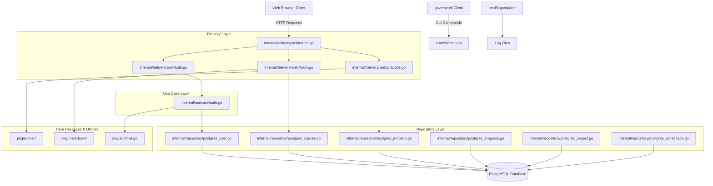

# GoVerse Project Architecture

This document provides a comprehensive overview of the GoVerse platform's architecture, including a detailed file-by-file breakdown of the project structure and their respective use cases.

## Architectural Diagram

## Directory and File Breakdown

### Entry Points (`cmd/`)
The `cmd/` directory contains all entry points for executable binaries in the project.
* **`cmd/cli/main.go`**: The entry point for the `goverse-cli` utility. Used to interact with GoVerse via command-line (e.g., test submissions or platform management).
* **`cmd/loganalyzer/main.go`**: A standalone tool designed to parse and analyze system logs (like `goverse.log` or `production.log`) to identify trends, performance, or errors.
* **`cmd/server/main.go`**: The primary entry point for the GoVerse web server backend. This bootstraps the application by setting up routing, database connections, and starting the HTTP server.
* **`cmd/tools/reset_ws.go`**: A utility script intended to reset or clean up temporary workspace states for the code runner engine.

### Core Application Logic (`internal/`)
The `internal/` directory follows Clean Architecture principles, ensuring strict separation of concerns.

#### Domain Models (`internal/domain/`)
Defines the core entities and data structures used across the entire platform.
* **`course.go`**: Represents curriculum data (Courses, Modules, Lessons).
* **`problem.go`**: Data models for practice problems and algorithm challenges.
* **`progress.go`**: Tracks user progression, completed lessons, and earned XP.
* **`project.go`**: Data models for the user projects and submissions (with gamification attributes).
* **`user.go`**: Core user entity, representing developer profiles and GitHub OAuth data.
* **`workspace.go`**: Models the state of a user's isolated code-execution workspace.

#### Delivery Layer (`internal/delivery/web/`)
Handles incoming HTTP requests, session management, and rendering HTML templates.
* **`router.go`**: Configures all API and frontend routes, attaching relevant middleware.
* **`auth.go`**: Handlers for GitHub OAuth login, registration, and logout flows.
* **`learn.go`**: Handlers for rendering curriculum pages, parsing markdown, and showing lessons.
* **`practice.go`**: Handlers for code practice, algorithm visualizer suites, and code execution endpoints.

#### Use Case Layer (`internal/usecase/`)
Orchestrates business rules.
* **`auth.go`**: Contains business logic for user authentication, validating credentials, or creating new accounts upon OAuth success.

#### Repository Layer (`internal/repository/`)
Handles direct database communication (PostgreSQL).
* **`postgres_course.go`**: Queries for retrieving curriculum content.
* **`postgres_problem.go`**: Queries for fetching coding challenges.
* **`postgres_progress.go`**: Queries for reading/updating a user's learning progression.
* **`postgres_project.go`**: Queries for saving and retrieving project submissions.
* **`postgres_user.go`**: Queries for user authentication, settings, and profile lookups.
* **`postgres_workspace.go`**: Queries for managing user workspaces.
* **`mock_project_repository.go`**: A mock implementation of the project repository, used for unit testing.

#### Database Migrations (`internal/db/migrations/`)
Contains `up.sql` and `down.sql` scripts used for versioning the database schema.
* **`000001_init_schema`**: The initial tables for users, courses, and lessons.
* **`000002_user_settings`**: Tables for storing user preferences (theme, keymap, font size).
* **`000003_projects_table`**: Tables for handling project submissions and platform gamification.

### Packages & Utilities (`pkg/`)
Reusable code meant to provide specific services.
* **`pkg/auth/jwt.go`**: Contains logic for generating, signing, and verifying JSON Web Tokens for user sessions.
* **`pkg/markdown/renderer.go`**: Custom markdown parser that safely converts lesson files into syntax-highlighted HTML.
* **`pkg/runner/engine.go`**: The core execution engine responsible for safely running user-submitted Go code.
* **`pkg/runner/evaluator.go`**: Logic to evaluate user code against test cases.
* **`pkg/runner/pty.go`**: Pseudo-terminal integration to allow interactive or streamed output from running code.

### Frontend (`ui/`)
Contains all visual elements of the GoVerse application.
* **`ui/assets/css/input.css`**: The base CSS file where Tailwind CSS configurations and custom UI overrides are defined.
* **`ui/templates/layouts/base.html`**: The root HTML template containing the `head`, global CSS/JS, and layout structure.
* **`ui/templates/partials/navbar.html`, `footer.html`**: Reusable navigation and footer components.
* **`ui/templates/pages/`**: Contains HTML templates for individual views:
  * **`dashboard.html`**: The main hub for the user after login.
  * **`devops.html`**: High-fidelity interface for the DevOps curriculum portal.
  * **`index.html`**: The platform landing page.
  * **`leaderboard.html`**: Gamification UI showing top users by XP.
  * **`learn_index.html`, `lesson.html`**: Templates for browsing and reading course material.
  * **`login.html`, `register.html`**: Authentication screens.
  * **`practice.html`**: The algorithm visualizer and code sandbox interface.
  * **`projects.html`, `project_detail.html`**: Screens for submitting and viewing user projects.
  * **`roadmap.html`**: The interactive Mermaid.js-powered Developer OS roadmap page.
  * **`settings.html`**: User preference and profile management dashboard.

### Deployment & Configuration
* **`Dockerfile`**: Defines the environment to containerize the app for production.
* **`docker-compose.yml`**: Primarily used for orchestrating the local development environment (spinning up PostgreSQL).
* **`tailwind.config.js`**: Defines the theme, colors, and content paths for Tailwind CSS compilation.
* **`go.mod`, `go.sum`**: Go dependency management files defining all external libraries used.

### Scripts & Misc (`scripts/` and Root)
* **`scripts/*.sql`**: Various SQL scripts used to seed the database with content (e.g., PostgreSQL curriculum, Custom Courses).
* **`scripts/*.go`**: Go scripts designed to populate the database with lessons or projects during development/staging.
* **`generate_logs.go`, `generate_prod_logs.go`**: Generates synthetic log files for testing the log analyzer tool.
