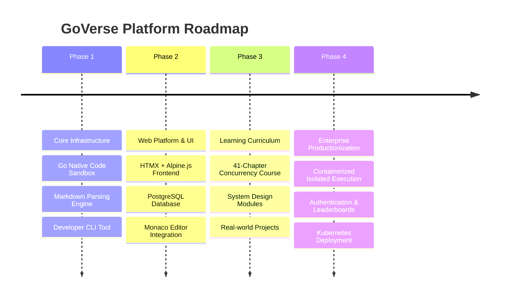

# GoVerse for Gophers 🐹🚀

GoVerse is an enterprise-grade, interactive learning platform and native code execution sandbox built exclusively for mastering the Go programming language.

## 🌟 Features

- **Native Go Sandbox**: A high-performance, browser-based IDE powered by Monaco Editor. Write, compile, and execute Go code instantly using a true native OS-level backend execution engine. No AI mocks—just real `go run` execution.
- **Interactive Learning Engine**: A custom Markdown parsing engine that renders beautiful, dynamic Go lessons directly to the browser.
- **Developer-First CLI**: Includes a standalone `goverse-cli` tool to compile and evaluate your code locally via terminal.
- **User Progress Dashboards**: Fully integrated PostgreSQL database to track learning streaks, profile metrics, and course completions.
- **Glassmorphism UI**: A gorgeous, modern frontend built with Alpine.js, HTMX, and Tailwind CSS.

## 🛠️ Tech Stack

- **Backend:** Go (Golang), Chi Router, standard `os/exec` isolated compilation
- **Database:** PostgreSQL 15, `pgx/v5`
- **Frontend:** HTMX, Alpine.js, Tailwind CSS, Monaco Editor
- **Infrastructure:** Docker Compose

## 🚀 Getting Started

### 1. Start the Database
Make sure you have Docker installed, then spin up the PostgreSQL instance:
```bash
cd deployments
docker compose up -d
```

### 2. Run the Platform
Start the Go backend server:
```bash
go run ./cmd/server/main.go
```
The application will be live at `http://localhost:8080`.

### 3. Quick Links
- **Dashboard**: `http://localhost:8080/dashboard`
- **Practice Sandbox**: `http://localhost:8080/practice`
- **Learn Modules**: `http://localhost:8080/learn`

## 💻 CLI Usage
To execute Go files quickly from your terminal using the GoVerse engine:
```bash
go run ./cmd/cli/main.go -file your_file.go
```

## 🗺️ Roadmap


