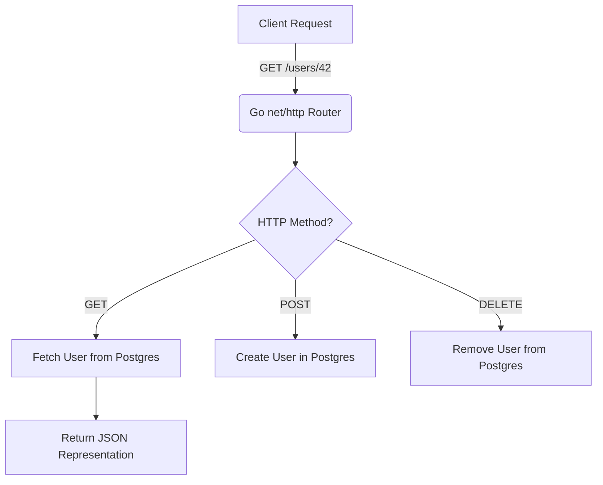

# REST APIs

## 1. Learning Objectives
* **What you'll learn**: Master the core mechanics of REST (Representational State Transfer) APIs.
* **Why it matters**: Crucial for building scalable, decoupled backend systems that interact flawlessly with any frontend client (React, iOS, Android).
* **Where it's used**: Heavily utilized in almost every modern Go backend, API Gateways, and Microservices.

---

## 2. Real-world Story
Instead of a dry technical definition, imagine you're visiting a library. 
If you want a book, you don't care *how* the librarian finds it. You just ask for a specific Resource (a Noun) using a standard request. The librarian returns a Representation of that book to you. 
In REST, your React app is the library patron. The Go server is the librarian. They communicate purely by asking for Resources (`/users`, `/books`) using standard Verbs (`GET`, `POST`), with zero memory of previous conversations (Stateless).

---

## 3. Visual Learning (Execution Flow & Architecture)


---

## 4. Internal Working (Under the Hood)
Deep dive into how Go handles REST requests:
* **The `net/http` package**: Every incoming TCP connection spawns a new, lightweight Goroutine.
* **Request parsing**: The `http.Request` struct parses the HTTP Method, URL, and Headers before invoking your Handler function.

---

## 5. Compiler Behavior
* **Escape Analysis**: When decoding JSON from an HTTP request body into a Go struct, the struct often escapes to the heap because it is passed around between router middlewares.
* **Inlining**: Simple HTTP handler wrappers are often inlined by the Go compiler to reduce function call overhead.

---

## 6. Memory Management
* **Heap vs Stack**: To prevent OOM (Out Of Memory) errors when receiving massive JSON payloads, avoid `io.ReadAll`. 
* **Garbage Collection**: Always use `json.NewDecoder(r.Body).Decode(&target)` to stream the JSON, which significantly reduces Heap allocations and GC latency.

---

## 7. Code Examples

### 🔹 Example 1: Simple
```go
// Basic GET implementation in Go
package main

import (
	"encoding/json"
	"net/http"
)

type User struct {
	ID   int    `json:"id"`
	Name string `json:"name"`
}

func GetUser(w http.ResponseWriter, r *http.Request) {
	if r.Method != http.MethodGet {
		http.Error(w, "Method Not Allowed", http.StatusMethodNotAllowed)
		return
	}
	
	user := User{ID: 42, Name: "Suryavamsi"}
	w.Header().Set("Content-Type", "application/json")
	json.NewEncoder(w).Encode(user)
}
```

### 🔹 Example 2: Intermediate
```go
// Handling POST requests and JSON decoding
func CreateUser(w http.ResponseWriter, r *http.Request) {
	var user User
	if err := json.NewDecoder(r.Body).Decode(&user); err != nil {
		http.Error(w, err.Error(), http.StatusBadRequest)
		return
	}
	w.WriteHeader(http.StatusCreated)
}
```

### 🔹 Example 3: Advanced
```go
// Optimized for zero-allocation routing using chi
import "github.com/go-chi/chi/v5"

func main() {
	r := chi.NewRouter()
	r.Get("/users/{id}", GetUser) // Native RESTful URL parameter parsing!
}
```

### 🔹 Example 4: Production
```go
// Production-grade implementation with metrics, context, and graceful timeouts
func (h *Handler) GetUser(w http.ResponseWriter, r *http.Request) {
    ctx, cancel := context.WithTimeout(r.Context(), 3*time.Second)
    defer cancel()
    
    // ... Database call utilizing ctx ...
}
```

### 🔹 Example 5: Interview
```go
// Tricky edge-case: Remember to always defer r.Body.Close() if you are 
// doing manual processing, though the Go HTTP server does it automatically.
```

---

## 8. Production Examples
How are REST APIs used in real systems?
1. **CRUD Operations**: The backbone of 90% of web applications (Create, Read, Update, Delete).
2. **API Gateways**: Routing public REST traffic to internal gRPC microservices.
3. **Webhooks**: Third-party services (like Stripe or GitHub) send REST `POST` requests to your Go server to notify you of events.

---

## 9. Performance & Benchmarking
* **CPU vs Memory Trade-offs**: JSON serialization (`encoding/json`) is heavily CPU-bound due to reflection. For extreme performance, use `ffjson` or `easyjson`.
* **Latency impacts**: Avoid N+1 database query problems when serving a REST list endpoint (`GET /users`).

---

## 10. Best Practices
* ✅ **Do**: Use plural nouns for resources (`/users`, not `/user`).
* ❌ **Don't**: Put verbs in the URL (e.g., avoid `/getUsers`). Let the HTTP method (`GET`) define the action.
* 🏢 **Google / Uber / Netflix Style**: Always version your APIs (`/api/v1/users`) and return standard HTTP Status Codes (200, 201, 400, 404, 500).

---

## 11. Common Mistakes
1. **Returning 200 OK for Errors**: Wrapping an error inside `{"status": "error"}` but returning a 200 HTTP status code. Always use `400` or `500`.
2. **Missing Pagination**: Returning 10,000 rows for `GET /users` instead of using `?limit=10&offset=0`.
3. **Stateful APIs**: Relying on server-side memory (Sessions) instead of stateless JWTs.

---

## 12. Debugging
How to troubleshoot REST APIs in production:
* **cURL/Postman**: Manually firing requests to verify headers and payloads.
* **Logging**: Injecting a Correlation ID middleware to trace requests across logs.
* **Network Tab**: Inspecting CORS preflight (`OPTIONS`) failures in the browser.

---

## 13. Exercises
1. **Easy**: Write a basic `GET /ping` endpoint that returns `{"message": "pong"}`.
2. **Medium**: Implement a `POST /users` endpoint that validates the incoming JSON.
3. **Hard**: Build a REST API with `chi` that implements cursor-based pagination.
4. **Expert**: Implement HATEOAS (Hypermedia as the Engine of Application State) links in your JSON responses.

---

## 14. Quiz
1. **MCQ**: Which HTTP method is NOT idempotent? 
   * (A) GET (B) PUT (C) POST (D) DELETE. *(Answer: C)*
2. **Output Prediction**: If you `DELETE /users/42` twice, what status code should the second request return? *(Usually 404 Not Found).*
3. **Debugging**: Why is my React app getting a CORS error when calling my Go API? *(Missing Access-Control-Allow-Origin headers).*

---

## 15. FAANG Interview Questions
* **Beginner**: Explain the difference between `PUT` and `PATCH`.
* **Intermediate**: How do you prevent a Cache Stampede on a heavy REST endpoint?
* **Senior (Google/Meta)**: Design an Idempotency-Key system to prevent duplicate credit card charges if a REST `POST` request drops connection mid-flight.
* **System Design Follow-up**: How would you rate-limit your REST API globally using Redis?

---

## 16. Mini Project
**Real-Time Task Manager**
Build a production-ready REST API using Go and PostgreSQL.
* Implement `/tasks` with full CRUD operations.
* Secure it with JWT Middleware.
* Add Pagination and Filtering query parameters.

---

## 17. Enterprise Features & Observability
* **Logging**: Structured JSON logging using `slog` or `zap`.
* **Metrics**: Prometheus middleware to track HTTP latency per route.
* **Security**: Enforcing HTTPS (TLS) and blocking SQL Injection via parameterized queries.
* **CI/CD**: Testing all endpoints via `httptest` before deploying.

---

## 18. Source Code Reading
Walkthrough of the `net/http` source code.
* **The ServeMux**: How the default multiplexer matches URL paths.
* **The ResponseWriter**: How it hijacks the underlying TCP connection to write headers.

---

## 19. Architecture
For production projects integrating REST:
* **Folder Structure**: Handlers in `internal/delivery/http`.
* **Clean Architecture**: Handlers parse JSON, then call the Service layer, completely decoupled from the Database layer.

---

## 20. Summary & Cheat Sheet
* **GET**: Read (Safe, Idempotent)
* **POST**: Create (Not Idempotent)
* **PUT**: Replace (Idempotent)
* **PATCH**: Update fields (Not strictly Idempotent)
* **DELETE**: Remove (Idempotent)
* **2xx**: Success | **4xx**: Client Error | **5xx**: Server Error
