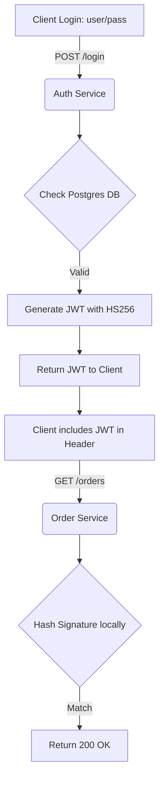

# JWT Authentication

## 1. Learning Objectives
* **What you'll learn**: The cryptographic mechanics of JSON Web Tokens (JWT) and stateless authentication in Go.
* **Why it matters**: It is the industry standard for securing microservices, allowing any service to verify a user without querying a central database.
* **Where it's used**: API Gateways, OAuth2 OIDC flows, and Cross-Origin Resource Sharing (CORS) environments.

---

## 2. Real-world Story
Imagine a VIP club where the bouncer (the Auth Service) checks your ID and hands you a sealed, tamper-proof VIP Wristband with an expiration time stamped on it. 
When you go to the bar (the Order Service), the bartender doesn't need to call the bouncer to verify your identity. The bartender simply checks the VIP Wristband. Because it is mathematically tamper-proof, the bartender instantly knows you are verified. This is **Stateless Authentication**.

---

## 3. Visual Learning (Execution Flow & Architecture)


---

## 4. Internal Working (Under the Hood)
A JWT consists of 3 parts separated by dots: `Header.Payload.Signature`
1. **Header**: Base64 JSON (Algorithm: HS256/RS256).
2. **Payload**: Base64 JSON (Claims: `user_id`, `role`, `exp`).
3. **Signature**: A cryptographic hash of the Header + Payload + Secret Key.

Because the signature is mathematically tied to the payload, if a hacker changes their `role` from `user` to `admin`, the signature becomes instantly invalid!

---

## 5. Compiler Behavior
* **Cryptographic Bounds Checking**: The `crypto/hmac` and `crypto/sha256` libraries in Go are heavily optimized in Assembly for modern CPUs. The compiler avoids heap allocations during hashing by passing slices pointing directly to the TCP buffer.

---

## 6. Memory Management
* **Key Rotation**: When parsing a JWT, you must provide a callback function that returns the Secret Key. Avoid allocating a new byte slice for the Secret Key on every single request. Store the key in memory once at startup and reuse it.

---

## 7. Code Examples

### 🔹 Example 1: Simple
```go
// Generating a Token
import "github.com/golang-jwt/jwt/v5"

func GenerateToken(userID int) (string, error) {
    claims := jwt.MapClaims{
        "user_id": userID,
        "exp":     time.Now().Add(time.Hour * 24).Unix(),
    }
    token := jwt.NewWithClaims(jwt.SigningMethodHS256, claims)
    return token.SignedString([]byte("super-secret-key"))
}
```

### 🔹 Example 2: Intermediate
```go
// Verifying a Token Middleware
func VerifyJWT(tokenString string) (*jwt.Token, error) {
    return jwt.Parse(tokenString, func(token *jwt.Token) (interface{}, error) {
        if _, ok := token.Method.(*jwt.SigningMethodHMAC); !ok {
            return nil, fmt.Errorf("unexpected signing method")
        }
        return []byte("super-secret-key"), nil
    })
}
```

### 🔹 Example 3: Advanced
```go
// Using Asymmetric RS256 (Public/Private Keys)
// Auth Service signs with Private Key. Microservices verify with Public Key!
token := jwt.NewWithClaims(jwt.SigningMethodRS256, claims)
tokenString, err := token.SignedString(rsaPrivateKey)
```

### 🔹 Example 4: Production
```go
// Context Propagation: Inject the parsed User ID into the r.Context() 
// so downstream handlers can access it securely!
```

### 🔹 Example 5: Interview
```go
// Do not store sensitive PII (Social Security Numbers, Passwords) inside the JWT Payload!
// Base64 encoding is NOT encryption. Anyone can decode and read the payload!
```

---

## 8. Production Examples
1. **SSO (Single Sign-On)**: Logging in once across Google, YouTube, and Gmail.
2. **Kubernetes Service Accounts**: Every Pod uses a JWT to authenticate with the K8s API Server.
3. **Password Resets**: Sending a JWT in an email link that expires in 15 minutes.

---

## 9. Performance & Benchmarking
* **CPU Load**: HMAC (Symmetric) hashing is blazing fast (~5 microseconds). RS256 (Asymmetric) verification is heavier (~100 microseconds). 
* **Database IO**: JWT eliminates 100% of Database Read operations for authentication.

---

## 10. Best Practices
* ✅ **Do**: Keep JWT lifespans extremely short (15 minutes) and use long-lived Refresh Tokens to issue new ones.
* ❌ **Don't**: Accept the `alg: none` header. This is a critical security vulnerability that bypasses signature verification!
* 🏢 **Google / Uber / Netflix Style**: Use JWKS (JSON Web Key Sets) to dynamically fetch and rotate Public Keys across the microservice cluster.

---

## 11. Common Mistakes
1. **The Revocation Flaw**: JWTs cannot be easily revoked before their expiration time because they are stateless. If a hacker steals an access token, they have full control until the `exp` time is reached.
2. **Local Storage Storage**: Storing JWTs in frontend `localStorage` makes them vulnerable to XSS attacks. Always store them in `HttpOnly` Cookies.

---

## 12. Debugging
How to troubleshoot JWTs in production:
* **jwt.io**: Paste the token into the official debugger to read the payload and verify the signature.
* **Clock Skew**: If servers are out of sync by 5 seconds, an `exp` claim might instantly fail. Use `jwt.WithLeeway(5 * time.Second)`.

---

## 13. Exercises
1. **Easy**: Write a function that generates an HS256 JWT containing a username.
2. **Medium**: Write an HTTP Middleware that rejects requests without a valid `Bearer` token.
3. **Hard**: Implement a Refresh Token flow with PostgreSQL.
4. **Expert**: Implement an RS256 authentication service that exposes a `/.well-known/jwks.json` endpoint.

---

## 14. Quiz
1. **MCQ**: What part of the JWT is encrypted?
   * (A) Header (B) Payload (C) Signature (D) None of the above. *(Answer: D. A standard JWT is only signed, not encrypted!)*
2. **Debugging**: Why does my `jwt.Parse` return an "invalid signature" error? *(You likely used the wrong Secret Key, or the payload was tampered with).*

---

## 15. FAANG Interview Questions
* **Beginner**: How does stateless authentication reduce latency?
* **Intermediate**: How do you securely revoke a JWT if a user clicks "Logout all devices"?
* **Senior (Google/Meta)**: Architect a system where an API Gateway automatically validates JWTs and strips them, injecting standard HTTP headers for downstream internal Go microservices.

---

## 16. Mini Project
**Secure Microservice Cluster**
* Build an `Auth Service` that issues JWTs using RS256.
* Build a `Resource Service` that downloads the Public Key from the Auth Service on boot, and verifies incoming JWTs entirely in memory.

---

## 17. Enterprise Features & Observability
* **Security**: Rotate Secret Keys automatically every 30 days without dropping active sessions.
* **Metrics**: Track JWT validation failures in Prometheus to detect brute-force attacks.

---

## 18. Source Code Reading
Walkthrough of `github.com/golang-jwt/jwt/v5`.
* **The Parser interface**: How it dynamically routes to the correct cryptographic hashing algorithm based on the `alg` header.

---

## 19. Architecture
* **Middleware Layer**: JWT validation must happen in HTTP Middleware, before the request ever touches your Business Logic layer.

---

## 20. Summary & Cheat Sheet
* **Header**: Algorithm type.
* **Payload**: Public data (user ID, expiration).
* **Signature**: Cryptographic proof of authenticity.
* **Golden Rule**: Never store secrets in the payload, and always use `HttpOnly` cookies for web clients.
