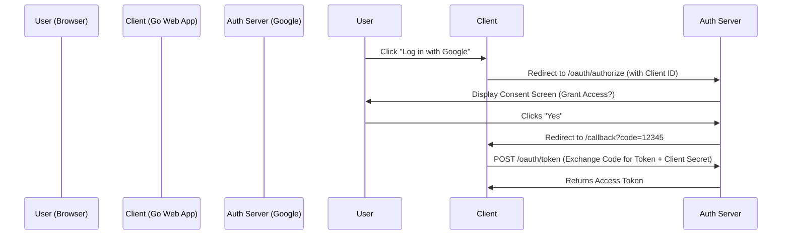

# OAuth2 and OIDC

## 1. Learning Objectives
* **What you'll learn**: The mechanics of delegated authorization (OAuth2) and federated identity (OpenID Connect).
* **Why it matters**: It is the global standard that powers "Log in with Google/GitHub/Apple".
* **Where it's used**: Third-party API integrations, Enterprise SSO (Okta, Auth0), and Microservice identity brokering.

---

## 2. Real-world Story
Imagine you have a Valet Parking Key. It only allows the valet to turn on the engine and drive the car 2 miles. It does *not* allow them to unlock the trunk or the glovebox.
OAuth2 is exactly this. When a user tells an external printing service, "Print my Google Photos", they do not give the printing service their Google Password (the master key). They use OAuth2 to give the printing service a "Valet Key" (an Access Token) that *only* grants permission to read photos, and absolutely nothing else.

---

## 3. Visual Learning (Execution Flow & Architecture)


---

## 4. Internal Working (Under the Hood)
* **OAuth2** is strictly an **Authorization** framework. It grants access to resources.
* **OpenID Connect (OIDC)** is an identity layer built on top of OAuth2. It provides **Authentication**. It introduces the `id_token` (a JWT) which securely communicates the user's identity (Name, Email, Avatar) back to your Go application.

---

## 5. Compiler Behavior
* **Secure Random Generation**: When generating the `state` parameter to prevent CSRF attacks, use `crypto/rand` to interact directly with the OS's entropy pool, ensuring cryptographically secure nonces that the Go compiler cannot predict or optimize away.

---

## 6. Memory Management
* **Token Caching**: OAuth2 Access Tokens should be stored in high-speed caching layers (Redis) or heavily optimized Go memory structures (`sync.Map`) to avoid blocking network I/O during token retrieval in highly concurrent microservices.

---

## 7. Code Examples

### 🔹 Example 1: Simple
```go
// Setting up the OAuth2 Configuration
import "golang.org/x/oauth2/google"

var googleOauthConfig = &oauth2.Config{
	ClientID:     os.Getenv("GOOGLE_CLIENT_ID"),
	ClientSecret: os.Getenv("GOOGLE_CLIENT_SECRET"),
	RedirectURL:  "http://localhost:8080/callback",
	Scopes:       []string{"https://www.googleapis.com/auth/userinfo.email"},
	Endpoint:     google.Endpoint,
}
```

### 🔹 Example 2: Intermediate
```go
// Generating the Login URL (Protecting against CSRF)
func HandleLogin(w http.ResponseWriter, r *http.Request) {
	// In production, 'state' must be a random cryptographically secure string 
	// saved in an HttpOnly cookie!
	url := googleOauthConfig.AuthCodeURL("random-state-string")
	http.Redirect(w, r, url, http.StatusTemporaryRedirect)
}
```

### 🔹 Example 3: Advanced
```go
// The Callback: Exchanging the Code for the Token
func HandleCallback(w http.ResponseWriter, r *http.Request) {
	if r.FormValue("state") != "random-state-string" {
		http.Error(w, "State invalid", http.StatusBadRequest)
		return
	}
	
	token, err := googleOauthConfig.Exchange(r.Context(), r.FormValue("code"))
	if err != nil {
		http.Error(w, "Failed to exchange token", http.StatusInternalServerError)
		return
	}
	// Use token.AccessToken to make API calls!
}
```

### 🔹 Example 4: Production
```go
// Using the Token to fetch the User's Profile from Google
client := googleOauthConfig.Client(r.Context(), token)
resp, _ := client.Get("https://www.googleapis.com/oauth2/v2/userinfo")
```

### 🔹 Example 5: Interview
```go
// Why do we exchange a Code for a Token on the Server, instead of just sending the Token to the Browser?
// Because the Go Server has the Client Secret! It proves to Google that the request is coming from your backend, not a hacker's script.
```

---

## 8. Production Examples
1. **Login with GitHub**: Fetching repositories for CI/CD pipelines.
2. **Enterprise Identity**: Authenticating internal employees via Microsoft Entra ID (Azure AD).
3. **Machine-to-Machine (Client Credentials Flow)**: Two Go microservices securely talking to each other without any human user involved.

---

## 9. Performance & Benchmarking
* **Network Latency**: The OAuth2 flow requires multiple sequential HTTP network hops across the public internet. It is notoriously slow (can take >500ms). Never place an OAuth2 flow in a synchronous hot-path.

---

## 10. Best Practices
* ✅ **Do**: Use the `state` parameter to prevent CSRF attacks.
* ✅ **Do**: Use PKCE (Proof Key for Code Exchange) for mobile apps or SPAs where a Client Secret cannot be securely stored.
* ❌ **Don't**: Hardcode your `ClientSecret` in GitHub!

---

## 11. Common Mistakes
1. **Confusing OAuth2 with Authentication**: Standard OAuth2 doesn't verify identity, it only delegates access. You must use OIDC for identity verification.
2. **Ignoring Token Expiry**: Access Tokens expire quickly (usually 1 hour). You must implement logic to automatically use the Refresh Token to fetch a new Access Token.

---

## 12. Debugging
How to troubleshoot OAuth2 in production:
* **Redirect URI Mismatch**: The #1 most common error. The URL configured in the Google Cloud Console must *exactly* match the `RedirectURL` in your Go code (including trailing slashes).
* **Network Tracing**: Use browser DevTools (Network Tab) to trace the `302 Redirects` and examine query parameters.

---

## 13. Exercises
1. **Easy**: Register a Google OAuth Client ID in the Google Cloud Console.
2. **Medium**: Implement a "Log in with GitHub" button that fetches the user's avatar URL.
3. **Hard**: Build a middleware that intercepts 401 Unauthorized API responses from Google and automatically executes a Refresh Token flow.
4. **Expert**: Implement an OAuth2 server in Go using `go-oauth2/oauth2`.

---

## 14. Quiz
1. **MCQ**: What is the purpose of the `scope` parameter in OAuth2?
   * (A) Security encryption (B) Defining exactly what permissions the app is requesting (C) Identifying the user. *(Answer: B)*
2. **System Design Follow-up**: How would you handle a scenario where 50,000 users click "Login with Apple" at the exact same second?

---

## 15. FAANG Interview Questions
* **Beginner**: Explain the Authorization Code Flow.
* **Intermediate**: What is PKCE and why is it necessary for Mobile Apps?
* **Senior (Google/Meta)**: Design an enterprise SSO architecture that federates identities across AWS IAM, Google Workspace, and Okta using OIDC.

---

## 16. Mini Project
**OIDC Identity Provider integration**
* Build a Go web server that integrates with Auth0.
* Restrict access to `/admin` routes based on OIDC Role claims embedded in the `id_token`.

---

## 17. Enterprise Features & Observability
* **Security Auditing**: Log every OAuth2 token exchange with User Agent and IP address metadata.
* **Secret Management**: Store `ClientSecret` in AWS Secrets Manager or HashiCorp Vault, injecting them into the Go app at runtime.

---

## 18. Source Code Reading
Walkthrough of `golang.org/x/oauth2`.
* **The TokenSource Interface**: How Go automatically manages token refreshes under the hood using an atomic pointer swap!

---

## 19. Architecture
* **State Management**: The `state` string must be generated cryptographically and mapped to a short-lived HTTP Cookie session to validate the callback.

---

## 20. Summary & Cheat Sheet
* **Resource Owner**: The Human User.
* **Client**: Your Go Web App.
* **Authorization Server**: Google/GitHub.
* **Access Token**: The Valet Key used to make API calls.
* **OIDC**: An identity layer providing a JWT `id_token`.
