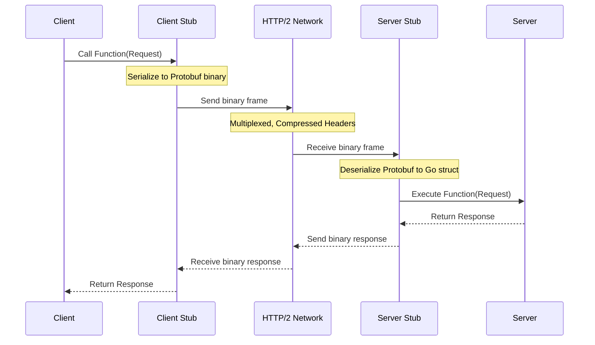

# gRPC (gRPC Remote Procedure Calls)

## 1️⃣ Learning Objectives
* **What you'll learn**: Master the core mechanics of gRPC, Protocol Buffers (protobuf), unary and streaming RPCs, and interceptors.
* **Why it matters**: Crucial for building scalable, high-performance, and strongly-typed microservice architectures.
* **Where it's used**: Heavily utilized in internal microservice communication (Google, Netflix, Uber), distributed systems, and mobile/IoT backends due to its lightweight binary payloads.

---

## 2️⃣ Real-world Story
Imagine two teams needing to communicate. 
**REST (JSON over HTTP/1.1)** is like sending a long, handwritten letter in English. The sender has to write out all the words (serialization), the postman carries a heavy envelope (large payload), and the receiver has to read and interpret the words (deserialization). 

**gRPC (Protobuf over HTTP/2)** is like two expert telegraph operators using a highly compressed, predefined secret code book. They only send short binary beeps. Because they both have the same code book (the `.proto` file), they instantly know exactly what the other means. It’s significantly faster, uses less bandwidth, and there's no confusion about data types!

---

## 3️⃣ Visual Learning (Execution Flow & Architecture)


---

## 4️⃣ Internal Working (Under the Hood)
gRPC relies on two massive pillars: **HTTP/2** and **Protocol Buffers**.

* **Protocol Buffers (Protobuf)**: Google's language-neutral, platform-neutral, extensible mechanism for serializing structured data. Instead of text (like JSON), it serializes data into a dense binary format.
* **HTTP/2**: Unlike HTTP/1.1 which creates a new TCP connection (or reuses one sequentially) per request, HTTP/2 uses **multiplexing**. Multiple gRPC calls can share a single TCP connection concurrently using "streams", eliminating head-of-line blocking.
* **Code Generation**: You define your service in a `.proto` file. The `protoc` compiler then generates the Go client and server interfaces (stubs). You just write the business logic.

---

## 5️⃣ Protocol Buffers & Compiler Behavior
A simple `user.proto` file:
```protobuf
syntax = "proto3";
package user;
option go_package = "./pb";

service UserService {
  rpc GetUser (UserRequest) returns (UserResponse) {}
}

message UserRequest {
  string user_id = 1;
}

message UserResponse {
  string user_id = 1;
  string name = 2;
  int32 age = 3;
}
```
The numbers (`= 1`, `= 2`) are **field tags**. They are used to identify your fields in the binary encoded data, which means you can change field names in the future without breaking backward compatibility, as long as you don't change the tag numbers!

---

## 6️⃣ Performance: gRPC vs REST
* **Payload Size**: Protobuf binary is typically 30-50% smaller than JSON.
* **Serialization Speed**: Protobuf is highly CPU efficient. Parsing JSON requires string manipulation and reflection; Protobuf is just shifting bytes into memory structs.
* **Connection Overhead**: HTTP/2 multiplexing means a single TCP connection is kept alive, dramatically reducing latency on subsequent requests (no TCP/TLS handshakes).

---

## 7️⃣ Code Examples

### 🔹 Example 1: Simple Unary Server
```go
package main

import (
	"context"
	"log"
	"net"
	"google.golang.org/grpc"
	pb "github.com/goverse/myapp/pb" // generated protobuf package
)

type server struct {
	pb.UnimplementedUserServiceServer
}

func (s *server) GetUser(ctx context.Context, req *pb.UserRequest) (*pb.UserResponse, error) {
	// Business logic
	return &pb.UserResponse{
		UserId: req.GetUserId(),
		Name:   "Gopher",
		Age:    10,
	}, nil
}

func main() {
	lis, err := net.Listen("tcp", ":50051")
	if err != nil {
		log.Fatalf("failed to listen: %v", err)
	}
	s := grpc.NewServer()
	pb.RegisterUserServiceServer(s, &server{})
	
	log.Printf("server listening at %v", lis.Addr())
	if err := s.Serve(lis); err != nil {
		log.Fatalf("failed to serve: %v", err)
	}
}
```

### 🔹 Example 2: Client Call
```go
package main

import (
	"context"
	"log"
	"time"
	"google.golang.org/grpc"
	"google.golang.org/grpc/credentials/insecure"
	pb "github.com/goverse/myapp/pb"
)

func main() {
	// Set up a connection to the server.
	conn, err := grpc.Dial("localhost:50051", grpc.WithTransportCredentials(insecure.NewCredentials()))
	if err != nil {
		log.Fatalf("did not connect: %v", err)
	}
	defer conn.Close()
	c := pb.NewUserServiceClient(conn)

	// Contact the server and print out its response.
	ctx, cancel := context.WithTimeout(context.Background(), time.Second)
	defer cancel()
	
	r, err := c.GetUser(ctx, &pb.UserRequest{UserId: "12345"})
	if err != nil {
		log.Fatalf("could not get user: %v", err)
	}
	log.Printf("User: %s, Age: %d", r.GetName(), r.GetAge())
}
```

### 🔹 Example 3: Server Streaming
Streaming is a first-class citizen in gRPC.
```protobuf
// In proto file:
rpc DownloadData (DownloadRequest) returns (stream DataChunk) {}
```
```go
// In Go Server:
func (s *server) DownloadData(req *pb.DownloadRequest, stream pb.DataService_DownloadDataServer) error {
	for i := 0; i < 10; i++ {
		chunk := &pb.DataChunk{Data: []byte("some data")}
		if err := stream.Send(chunk); err != nil {
			return err
		}
	}
	return nil
}
```

---

## 8️⃣ Production Features: Interceptors
Interceptors are middleware for gRPC. They are used for logging, metrics, and authentication.
```go
func unaryInterceptor(
	ctx context.Context,
	req interface{},
	info *grpc.UnaryServerInfo,
	handler grpc.UnaryHandler,
) (interface{}, error) {
	start := time.Now()
	// Call the actual RPC handler
	m, err := handler(ctx, req)
	log.Printf("RPC: %s, Duration: %s, Error: %v", info.FullMethod, time.Since(start), err)
	return m, err
}

// Registering the interceptor
s := grpc.NewServer(grpc.UnaryInterceptor(unaryInterceptor))
```

---

## 9️⃣ Best Practices
* ✅ **Do**: Always pass and respect `context.Context`. Propagate timeouts across microservices to prevent cascading failures!
* ✅ **Do**: Use `buf` (buf.build) instead of raw `protoc` for managing protobuf files—it provides linting and breaking-change detection.
* ❌ **Don't**: Change the type or field tag number of an existing field in a `.proto` file.
* ❌ **Don't**: Use gRPC for external public-facing web APIs directly without a gateway (browsers have limited support for HTTP/2 trailing headers, though `gRPC-Web` is a workaround).

---

## 🔟 Debugging & Tooling
Since gRPC is binary, you can't just `curl` it and read JSON.
* **grpcurl**: The `curl` equivalent for gRPC. It uses Server Reflection to know the schema.
  ```bash
  grpcurl -plaintext localhost:50051 user.UserService/GetUser
  ```
* **Server Reflection**: Always enable reflection in development environments so tools like Postman or grpcurl can auto-discover your endpoints.
  ```go
  import "google.golang.org/grpc/reflection"
  // ...
  reflection.Register(s)
  ```

---

## 11️⃣ Exercises
1. **Easy**: Create a Calculator service `.proto` file with a `Add` RPC. Compile it to Go.
2. **Medium**: Implement a server-side streaming RPC that streams the Fibonacci sequence.
3. **Hard**: Implement a Unary Interceptor that extracts a JWT token from the gRPC metadata (headers) and validates it before allowing the RPC to execute.

---

## 12️⃣ FAANG Interview Questions
* **Beginner**: Explain the difference between gRPC and REST.
* **Intermediate**: How does gRPC handle backward compatibility? What happens if an old client sends a request to a new server with an added field?
* **Senior (Google/Uber)**: Explain how HTTP/2 multiplexing solves the head-of-line blocking problem seen in HTTP/1.1, and how this impacts gRPC performance under high concurrency.
