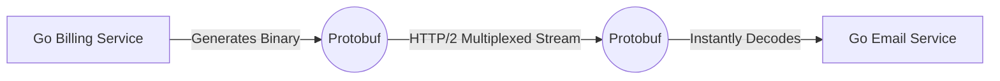

# gRPC (Google Remote Procedure Call)

## 1. Learning Objectives
* **What you'll learn**: Building high-performance, strongly-typed microservice APIs using gRPC and Protocol Buffers.
* **Why it matters**: It is up to 10x faster and mathematically safer than REST/JSON, making it the industry standard for internal backend communication.
* **Where it's used**: Cloud Native architectures, Kubernetes control planes, and distributed systems at Google, Netflix, and Uber.

---

## 2. Real-world Story
Imagine hiring a translator to interpret a conversation between two people. In REST/JSON, the translator listens, writes a massive novel detailing every word (serialization), and hands the novel to the other person, who has to read it completely before understanding (deserialization). It is incredibly slow.
gRPC is like a direct brain-to-brain neural link. Both services agree on an exact binary schema beforehand. When one service speaks, it transmits pure, compressed binary impulses that the other service instantly understands without translation. 

---

## 3. Visual Learning (Execution Flow & Architecture)


---

## 4. Internal Working (Under the Hood)
gRPC relies on two major technology shifts:
1. **Protocol Buffers (Protobuf)**: A binary serialization format. Instead of sending `"name": "Alice"`, it sends `0x01 0x05 Alice`, completely dropping the massive string keys.
2. **HTTP/2**: Unlike REST (HTTP/1.1), gRPC utilizes HTTP/2 to multiplex thousands of concurrent RPC calls over a single, persistent TCP connection, eliminating the TCP Handshake overhead.

---

## 5. Compiler Behavior
* **Code Generation**: gRPC uses a compiler (`protoc`). You write a `.proto` schema file, and the compiler generates thousands of lines of highly optimized, type-safe Go interface code. 
* **Reflection-Free**: Because the Go compiler knows the exact struct shapes at compile-time, it completely bypasses the CPU-heavy `reflect` package used by `encoding/json`.

---

## 6. Memory Management
* **Zero-Allocation Decoding**: Protobuf heavily utilizes Go byte slice manipulations to map raw network buffers directly into struct memory, drastically reducing Heap allocations and Garbage Collection pressure.

---

## 7. Code Examples

### 🔹 Example 1: Simple
```protobuf
// 1. Define the Schema (user.proto)
syntax = "proto3";
package users;

service UserService {
    rpc GetUser (UserRequest) returns (UserResponse);
}

message UserRequest {
    int32 id = 1; // The '1' is the binary field tag!
}
message UserResponse {
    string name = 1;
}
```

### 🔹 Example 2: Intermediate
```go
// 2. The Server Implementation (Go)
type server struct {
	pb.UnimplementedUserServiceServer
}

func (s *server) GetUser(ctx context.Context, req *pb.UserRequest) (*pb.UserResponse, error) {
	// Strongly typed! The compiler guarantees req.Id is an int32!
	if req.GetId() == 42 {
		return &pb.UserResponse{Name: "Alice"}, nil
	}
	return nil, status.Errorf(codes.NotFound, "User not found")
}
```

### 🔹 Example 3: Advanced
```go
// 3. The Client Call
conn, _ := grpc.Dial("localhost:50051", grpc.WithInsecure())
defer conn.Close()

client := pb.NewUserServiceClient(conn)

// This looks like a local function call, but it executes across the network!
resp, err := client.GetUser(context.Background(), &pb.UserRequest{Id: 42})
fmt.Println(resp.GetName())
```

### 🔹 Example 4: Production
```go
// Streaming RPCs (e.g. Uploading a massive file over a persistent connection)
rpc UploadVideo (stream VideoChunk) returns (UploadStatus);
```

### 🔹 Example 5: Interview
```go
// Why use field numbers (id = 1) in Protobuf?
// Because the binary payload DOES NOT send the field names. It only sends the number '1'. 
// This saves massive network bandwidth, but it means you can NEVER change a field number once deployed!
```

---

## 8. Production Examples
1. **Internal Microservices**: The Go API Gateway talks to the Go Analytics service using gRPC.
2. **Bi-Directional Streaming**: A live stock ticker that pushes prices to a client via a persistent gRPC stream.
3. **IoT Devices**: Embedded devices with extremely limited CPU power use Protobuf because it requires almost no CPU to parse.

---

## 9. Performance & Benchmarking
* **Bandwidth**: Protobuf payloads are typically 30-50% smaller than equivalent JSON payloads.
* **Speed**: Serialization is mathematically ~5x to 10x faster than JSON.
* **HTTP/2**: Eliminates Head-of-Line blocking, allowing massive concurrency.

---

## 10. Best Practices
* ✅ **Do**: Treat your `.proto` files as the absolute Source of Truth for your API contracts.
* ❌ **Don't**: Change or reuse field numbers in your `.proto` files. It will break backward compatibility and crash older clients.
* 🏢 **Google / Uber / Netflix Style**: Use Buf (`buf.build`) as a modern linting and breaking-change detection tool for your Protobuf schemas.

---

## 11. Common Mistakes
1. **gRPC for Web Frontends**: Web browsers natively speak HTTP/1.1 and JSON, making native gRPC impossible. You must use `gRPC-Web` or a REST-to-gRPC transcoder (like Envoy) to allow React apps to communicate with a gRPC backend.
2. **Missing Timeouts**: If a gRPC client makes a call without a `context.WithTimeout`, and the server hangs, the client Goroutine will block infinitely and leak memory.

---

## 12. Debugging
How to troubleshoot gRPC in production:
* **gRPCurl**: A command-line tool (similar to cURL) specifically designed to interact with gRPC servers.
* **gRPC Reflection**: Enable reflection on your Go server so tools can dynamically discover your API schemas without needing the raw `.proto` files.

---

## 13. Exercises
1. **Easy**: Write a `.proto` file for a Calculator service (`Add`, `Subtract`).
2. **Medium**: Generate the Go code using `protoc` and implement the Server.
3. **Hard**: Implement a Unary Interceptor (Middleware) that logs the execution time of every RPC call.
4. **Expert**: Implement a Bi-directional streaming RPC for a real-time chat room.

---

## 14. Quiz
1. **MCQ**: What transport protocol does gRPC use?
   * (A) HTTP/1.1 (B) TCP/IP (C) HTTP/2 (D) UDP. *(Answer: C)*
2. **Code Review**: Why is returning `errors.New("not found")` bad in gRPC? *(You must use gRPC status codes like `status.Errorf(codes.NotFound, ...)` so clients can programmatically handle the error).*

---

## 15. FAANG Interview Questions
* **Beginner**: Compare gRPC to REST.
* **Intermediate**: How do you implement load balancing in gRPC given that it uses a single persistent HTTP/2 connection?
* **Senior (Google/Meta)**: Design a distributed tracing system using gRPC metadata interceptors to propagate OpenTelemetry Context across 10 microservices.

---

## 16. Mini Project
**High-Performance Distributed Key-Value Store**
* Write a `.proto` schema defining `Set(Key, Value)` and `Get(Key)`.
* Build the Go gRPC Server backed by a `sync.Map`.
* Build a Go CLI Client to benchmark the throughput.

---

## 17. Enterprise Features & Observability
* **Interceptors**: The gRPC equivalent of HTTP Middleware. Used for Auth, Logging, and Tracing.
* **Metadata**: Passing HTTP-like headers (like Authorization JWTs) via `metadata.NewOutgoingContext`.

---

## 18. Source Code Reading
Walkthrough of `google.golang.org/grpc`.
* **The HTTP/2 Framer**: How gRPC manages flow control, window sizes, and connection multiplexing deep in the network layer.

---

## 19. Architecture
* **Schema Registry**: In large companies, `.proto` files are stored in a dedicated Git repository. CI/CD pipelines compile them and push Go/Java/Python SDKs to private package managers automatically.

---

## 20. Summary & Cheat Sheet
* **Protobuf**: Binary schema, strongly typed, backward compatible.
* **HTTP/2**: Multiplexing, persistent connections.
* **Unary**: One Request, One Response.
* **Streaming**: Sending streams of data over a single connection.
