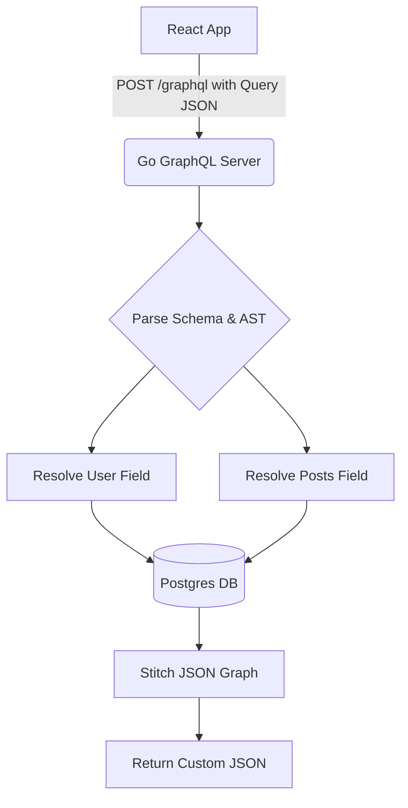

# GraphQL in Go

## 1. Learning Objectives
* **What you'll learn**: The mechanics of GraphQL, solving Over-fetching and Under-fetching.
* **Why it matters**: Allows frontend clients (React/iOS) to query exactly the data they need in a single HTTP request, creating highly flexible and decoupled APIs.
* **Where it's used**: Heavy, data-rich frontend applications at companies like Meta (creators of GraphQL), GitHub, and Shopify.

---

## 2. Real-world Story
Imagine going to a restaurant with a REST API menu. You order "The Breakfast Special". The waiter brings you eggs, bacon, toast, and pancakes (Over-fetching). You only wanted the eggs! If you also want coffee, you have to place a completely separate order (Under-fetching).
With a GraphQL menu, you hand the waiter a specific list: "I want exactly 2 eggs and 1 coffee." The waiter goes to the kitchen and returns with a single plate containing exactly those two items. Nothing more, nothing less.

---

## 3. Visual Learning (Execution Flow & Architecture)


---

## 4. Internal Working (Under the Hood)
Unlike REST (which uses multiple URLs like `/users` and `/posts`), GraphQL operates over a single HTTP endpoint (usually `POST /graphql`).
1. The client sends a string query representing the **Abstract Syntax Tree (AST)**.
2. The Go server parses the query against a strictly typed **GraphQL Schema**.
3. For every field requested, the Go server executes a **Resolver Function** to fetch the data.

---

## 5. Compiler Behavior
* **Code Generation (gqlgen)**: Building GraphQL in Go manually is incredibly tedious (heavy use of reflection). The industry standard is `github.com/99designs/gqlgen`. It acts as a compiler: you write your GraphQL schema (`.graphqls`), and `gqlgen` generates type-safe Go structs and interfaces, catching schema mismatches at compile time!

---

## 6. Memory Management
* **The N+1 Query Problem**: Because GraphQL resolves fields dynamically, querying 50 Users and their Avatars can trigger 1 Database query for the Users, and 50 separate Database queries for the Avatars! This destroys database connection pools and memory.
* **The Solution (Dataloader)**: Go utilizes the Dataloader pattern to batch the 50 Avatar requests into a single SQL `IN` query, drastically reducing latency and memory overhead.

---

## 7. Code Examples

### 🔹 Example 1: Simple
```graphql
# 1. The Schema Definition (schema.graphqls)
type User {
  id: ID!
  name: String!
  email: String!
}

type Query {
  user(id: ID!): User
}
```

### 🔹 Example 2: Intermediate
```go
// 2. The Generated Go Resolver
func (r *queryResolver) User(ctx context.Context, id string) (*model.User, error) {
	// This function is ONLY executed if the client asks for the 'user' query!
	return db.FetchUserByID(id)
}
```

### 🔹 Example 3: Advanced
```json
// 3. The Client Request (React Apollo)
query {
  user(id: "42") {
    name
  }
}

// 4. The Response (Notice 'email' is ignored, saving bandwidth!)
{
  "data": {
    "user": {
      "name": "Suryavamsi"
    }
  }
}
```

### 🔹 Example 4: Production
```go
// Utilizing Dataloaders in Go context to solve the N+1 problem
func (r *userResolver) Posts(ctx context.Context, obj *model.User) ([]*model.Post, error) {
    return dataloader.For(ctx).PostLoader.Load(obj.ID)
}
```

### 🔹 Example 5: Interview
```go
// What happens if a client sends a deeply nested query?
// query { user { posts { author { posts { author } } } } }
// This will recursively execute and DOS your database! 
// You MUST implement Query Complexity Limits in your Go GraphQL server.
```

---

## 8. Production Examples
1. **GitHub API v4**: GitHub migrated to GraphQL because their REST API required developers to make 100+ requests just to fetch issues for a repository.
2. **Mobile Apps (iOS/Android)**: GraphQL minimizes payload sizes (no Over-fetching), heavily saving battery life and data usage on mobile networks.

---

## 9. Performance & Benchmarking
* **Trade-off**: GraphQL pushes query complexity from the Client to the Server. The Go CPU must work harder to parse the AST and dynamically stitch the JSON graph together compared to a hardcoded REST endpoint.
* **Caching**: HTTP caching (ETags, Cache-Control) is completely broken in GraphQL because every request is a `POST` to the exact same URL. You must implement caching at the application layer (e.g., Apollo Client).

---

## 10. Best Practices
* ✅ **Do**: Use `gqlgen` for Schema-First development. It guarantees type safety.
* ❌ **Don't**: Use GraphQL for simple microservice-to-microservice communication. Stick to gRPC.
* 🏢 **Google / Uber / Netflix Style**: Use **Federation** (Apollo Federation). You build 10 separate Go microservices (Auth, Billing, Orders), and a central Gateway stitches their GraphQL schemas into one massive, unified Graph for the frontend!

---

## 11. Common Mistakes
1. **Ignoring N+1 Queries**: Deploying GraphQL to production without Dataloaders will instantly bring down your PostgreSQL database under load.
2. **Lack of Rate Limiting**: You cannot rate limit GraphQL purely by HTTP request count, because a single request can ask for 1,000 complex fields. You must rate limit based on AST Query Complexity Analysis.

---

## 12. Debugging
How to troubleshoot GraphQL in production:
* **GraphiQL / Apollo Studio**: An interactive browser IDE that allows you to write queries, autocompletes fields based on your schema, and reads documentation dynamically.
* **Trace Extensions**: Injecting execution times into the GraphQL response to see exactly which Resolver function is lagging.

---

## 13. Exercises
1. **Easy**: Write a GraphQL Schema defining a `Book` and `Author`.
2. **Medium**: Initialize a Go project using `gqlgen` and implement the resolvers.
3. **Hard**: Implement a Dataloader to batch fetch Authors when querying a list of Books.
4. **Expert**: Implement an Apollo Federation Subgraph in Go.

---

## 14. Quiz
1. **MCQ**: How does GraphQL solve Over-fetching?
   * (A) By compressing the JSON (B) By allowing the client to specify the exact fields it wants (C) By using Protobuf. *(Answer: B)*
2. **Code Review**: Why is an AST parser necessary for GraphQL but not REST? *(Because REST relies on static URLs, whereas GraphQL sends dynamic string algorithms that the server must interpret).*

---

## 15. FAANG Interview Questions
* **Beginner**: Explain the difference between a `Query` and a `Mutation`.
* **Intermediate**: How do you handle Authentication and Authorization at the field level in GraphQL?
* **Senior (Google/Meta)**: Design the caching architecture for a highly trafficked GraphQL API given that standard HTTP caching is ineffective.

---

## 16. Mini Project
**Schema-First Blog API**
* Use `gqlgen` to build an API with `Query` (get posts) and `Mutation` (create post).
* Implement a custom GraphQL Directive `@isAuthenticated` that hooks into your Go context to reject unauthorized queries.

---

## 17. Enterprise Features & Observability
* **Subscriptions**: Using WebSockets to stream real-time events (like chat messages) back to the client natively through GraphQL.
* **Error Formatting**: Returning structured arrays of errors directly in the `errors` JSON block, allowing partial data returns (e.g., the User loaded, but the Posts failed).

---

## 18. Source Code Reading
Walkthrough of the `github.com/99designs/gqlgen` architecture.
* **The AST Parser**: How Go leverages interfaces and recursive descent parsing to traverse the GraphQL query string.

---

## 19. Architecture
* **Resolver Decoupling**: Resolvers should never contain business logic. They should simply parse the GraphQL arguments and instantly hand them off to a Clean Architecture Service Layer.

---

## 20. Summary & Cheat Sheet
* **Schema**: The strict Type Definition.
* **Query**: Reading data (GET equivalent).
* **Mutation**: Modifying data (POST/PUT/DELETE equivalent).
* **Resolver**: The Go function that fetches the data.
* **Dataloader**: The essential tool to prevent N+1 database death.
