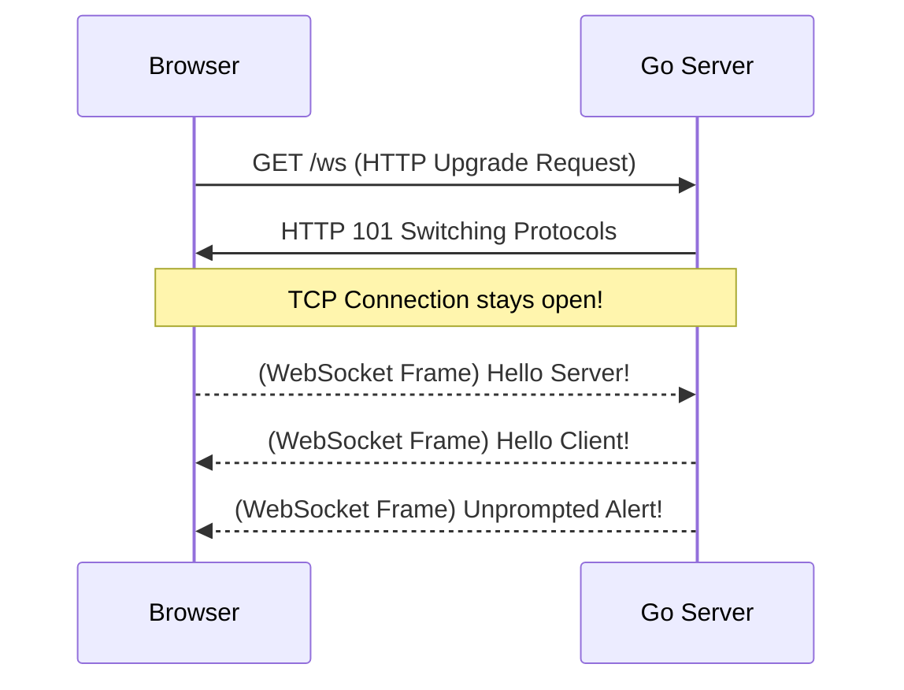

# WebSockets

## 1. Learning Objectives
* **What you'll learn**: The mechanics of full-duplex, bi-directional, real-time communication between a Web Browser and a Go server.
* **Why it matters**: HTTP is strictly request-response (the server cannot initiate a message). WebSockets allow the server to push data instantly.
* **Where it's used**: Real-time Chat Applications (Discord), Multiplayer Web Games, Live Financial Trading Dashboards, and Collaborative Editing (Google Docs).

---

## 2. Real-world Story
Imagine standard HTTP as sending a physical letter in the mail. You ask a question, and 3 days later, you get a reply. If you want updates, you have to keep sending letters asking "Any news yet?" (Polling).
WebSockets are like a phone call. You dial the number once (the Handshake), and once the connection is open, both you and the server can talk at the exact same time, instantly, without having to redial!

---

## 3. Visual Learning (Execution Flow & Architecture)


---

## 4. Internal Working (Under the Hood)
A WebSocket starts its life as a standard HTTP/1.1 `GET` request. 
The browser sends an `Upgrade: websocket` header. The Go server intercepts this, sends a `101 Switching Protocols` response, and physically **hijacks** the underlying TCP socket!
From that moment on, the protocol is no longer HTTP. It is raw WebSocket binary frames flowing over the hijacked TCP connection.

---

## 5. Compiler Behavior
* **Goroutine Leak Prevention**: A WebSocket connection requires at least two Goroutines (one reading from the socket, one writing to it). If the client disconnects ungracefully (e.g., losing Wi-Fi), the read Goroutine will block forever. The Go compiler relies on developers to strictly use `context` cancellation and TCP Ping/Pong deadlines to tear down these Goroutines.

---

## 6. Memory Management
* **The `1M Connections` Challenge**: If you want to hold 1 million simultaneous WebSockets open on a single Go server, you must tune memory. A standard Goroutine takes ~2KB. Two Goroutines per connection = 4GB of RAM just for the execution stack! 
* **Zero-Allocation Upgrades**: Libraries like `github.com/gobwas/ws` are designed to avoid the memory overhead of the standard `net/http` package, allowing extreme density on low-RAM servers.

---

## 7. Code Examples

### 🔹 Example 1: Simple
```go
// Upgrading the HTTP connection using gorilla/websocket
import "github.com/gorilla/websocket"

var upgrader = websocket.Upgrader{
    CheckOrigin: func(r *http.Request) bool { return true }, // Allow all origins for demo
}

func handleConnections(w http.ResponseWriter, r *http.Request) {
    // Hijack the HTTP request and turn it into a WebSocket!
    ws, err := upgrader.Upgrade(w, r, nil)
    if err != nil { log.Fatal(err) }
    defer ws.Close()

    for {
        // Read message from browser
        msgType, msg, err := ws.ReadMessage()
        if err != nil { break }
        
        // Echo the message back!
        ws.WriteMessage(msgType, msg)
    }
}
```

### 🔹 Example 2: Intermediate
```go
// A Central Hub (Chat Room) broadcasting to multiple clients
type Hub struct {
    clients    map[*websocket.Conn]bool
    broadcast  chan []byte
    register   chan *websocket.Conn
    unregister chan *websocket.Conn
}
```

### 🔹 Example 3: Advanced
```javascript
// The Browser Frontend Connection
const socket = new WebSocket("ws://localhost:8080/ws");

socket.onopen = () => console.log("Connected!");
socket.onmessage = (event) => console.log("Received:", event.data);
socket.send("Hello Go!");
```

### 🔹 Example 4: Production
```go
// Ping/Pong Keep-Alives to detect dropped Wi-Fi
ws.SetReadDeadline(time.Now().Add(60 * time.Second))
ws.SetPingHandler(func(string) error {
    ws.SetReadDeadline(time.Now().Add(60 * time.Second))
    return ws.WriteMessage(websocket.PongMessage, []byte{})
})
```

### 🔹 Example 5: Interview
```go
// Why do we need Ping/Pong frames? 
// Because if a mobile user drives through a tunnel, their IP doesn't send a TCP FIN packet. 
// The server thinks the connection is still open, resulting in a "Ghost Connection" memory leak!
```

---

## 8. Production Examples
1. **Discord**: Pushing new chat messages to millions of concurrent clients.
2. **Crypto Exchanges (Binance)**: Streaming order book price updates at 100 frames per second.
3. **Figma**: Multi-cursor collaborative synchronization.

---

## 9. Performance & Benchmarking
* **Throughput vs Latency**: WebSockets are optimized for extreme low-latency (milliseconds), but they are stateful. Load balancing them requires sticky sessions or a central Pub/Sub (Redis) backplane.

---

## 10. Best Practices
* ✅ **Do**: Use a central Pub/Sub system (like Redis or Kafka) if you have multiple Go servers, so Server A can broadcast a message to a WebSocket connected to Server B.
* ❌ **Don't**: Use WebSockets for standard CRUD operations (creating a user, fetching a profile). HTTP is much better suited for Request-Response.
* 🏢 **Google / Uber / Netflix Style**: Use raw WebSockets sparingly. Prefer structured abstractions like gRPC Streams or Server-Sent Events when bi-directional communication isn't strictly necessary.

---

## 11. Common Mistakes
1. **Concurrent Writes**: A WebSocket connection (`*websocket.Conn`) in Go is **NOT** thread-safe for concurrent writes! If two Goroutines call `ws.WriteMessage()` at the same time, the server will panic. You must funnel all writes through a single `chan []byte`.
2. **Missing Ping/Pongs**: Resulting in massive server OOM crashes due to millions of dead "Ghost Connections" lingering in RAM.

---

## 12. Debugging
How to troubleshoot WebSockets in production:
* **Chrome DevTools**: The Network tab has a dedicated "WS" filter. You can click on the connection and see a real-time table of every binary frame sent and received!
* **wscat**: A command-line tool (like cURL for WebSockets) useful for testing backend servers locally.

---

## 13. Exercises
1. **Easy**: Create a basic Echo server in Go.
2. **Medium**: Build a Chat Room where any message sent by Client A is broadcast to Client B and Client C.
3. **Hard**: Integrate Redis Pub/Sub so your Chat Room can scale horizontally across 3 different Go instances.
4. **Expert**: Implement graceful shutdown, ensuring all connected WebSockets receive a polite "Server shutting down" message before the TCP connection is severed.

---

## 14. Quiz
1. **MCQ**: What HTTP status code is used for the WebSocket Upgrade Handshake?
   * (A) 200 OK (B) 302 Found (C) 101 Switching Protocols (D) 400 Bad Request. *(Answer: C)*
2. **Code Review**: Why must you check the `Origin` header in the Upgrader? *(To prevent Cross-Site WebSocket Hijacking (CSWSH), the WebSocket equivalent of CSRF).*

---

## 15. FAANG Interview Questions
* **Beginner**: Compare WebSockets to HTTP Long-Polling.
* **Intermediate**: How do you architect a WebSocket load balancer?
* **Senior (Google/Meta)**: Design the architecture for WhatsApp. How do you guarantee message delivery if the user's WebSocket disconnects for 5 seconds while a message is in flight?

---

## 16. Mini Project
**Real-Time Stock Ticker**
* Build a Go server that generates random stock prices every 100ms.
* Push these prices over a WebSocket to a React frontend.
* Render a live updating D3.js or Chart.js line graph.

---

## 17. Enterprise Features & Observability
* **Metrics**: Track active connection counts and frame drop rates in Prometheus.
* **Security**: Enforce JWT Authentication during the initial HTTP Upgrade Handshake (usually passed as a query parameter `?token=XYZ` because WebSockets do not support custom HTTP headers in the browser API!).

---

## 18. Source Code Reading
Walkthrough of `github.com/gorilla/websocket`.
* **The Buffer Pool**: How the library uses `sync.Pool` to recycle byte arrays for incoming frames, achieving near-zero allocations.

---

## 19. Architecture
* **The Hub Pattern**: Separating the network I/O (Read/Write Goroutines) from the Business Logic (The Central Hub struct that manages the state of the rooms and broadcasting channels).

---

## 20. Summary & Cheat Sheet
* **Handshake**: HTTP `101 Upgrade`.
* **State**: Persistent TCP connection.
* **Duplex**: True Bi-directional (Server can push to Client).
* **Library**: `gorilla/websocket` or `nhooyr/websocket`.
