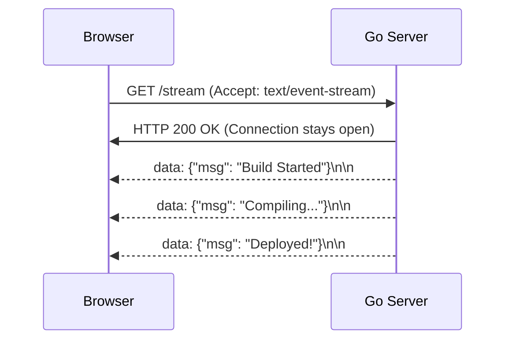

# Server-Sent Events (SSE)

## 1. Learning Objectives
* **What you'll learn**: The mechanics of Server-Sent Events (SSE) for unidirectional real-time data streaming.
* **Why it matters**: 90% of developers jump straight to complex WebSockets when they only need the Server to push updates to the Client. SSE is significantly simpler, natively supported by browsers, and runs over standard HTTP.
* **Where it's used**: Live News Feeds, Social Media Notifications, CI/CD Pipeline status logs, and ChatGPT's word-by-word streaming responses!

---

## 2. Real-world Story
Imagine a radio station (The Server) and a radio receiver (The Client). The receiver tunes in and simply listens. It cannot talk back to the radio station. It just receives a continuous stream of music and news updates.
This is exactly how Server-Sent Events work. The browser establishes a standard HTTP connection, and the server holds it open, pushing text-based events down the pipe whenever something interesting happens.

---

## 3. Visual Learning (Execution Flow & Architecture)


---

## 4. Internal Working (Under the Hood)
SSE uses standard HTTP/1.1 (or HTTP/2).
1. The client sets the Header `Accept: text/event-stream`.
2. The server responds with `Content-Type: text/event-stream`.
3. The server enters a loop, using the `http.Flusher` interface to forcefully flush raw string data down the TCP socket without closing the HTTP Request.
4. The payload MUST follow a strict text format, prefixed with `data: ` and ending with two newlines `\n\n`.

---

## 5. Compiler Behavior
* **HTTP Multiplexing**: If using HTTP/1.1, browsers strictly limit the number of open SSE connections to a single domain (usually max 6). The Go runtime natively upgrades connections to HTTP/2 if TLS is enabled, allowing 100+ multiplexed SSE streams over a single TCP socket!

---

## 6. Memory Management
* **Simplicity over WebSockets**: Because SSE does not require complex binary frame decoding, the memory footprint per connection in Go is drastically smaller than a `gorilla/websocket` implementation. You only need one Goroutine (the HTTP Handler) instead of two!

---

## 7. Code Examples

### 🔹 Example 1: Simple
```go
// A basic SSE Go endpoint
func StreamEvents(w http.ResponseWriter, r *http.Request) {
    // 1. Set the necessary Headers!
    w.Header().Set("Content-Type", "text/event-stream")
    w.Header().Set("Cache-Control", "no-cache")
    w.Header().Set("Connection", "keep-alive")

    // 2. Type assert the ResponseWriter to a Flusher
    flusher, ok := w.(http.Flusher)
    if !ok {
        http.Error(w, "Streaming unsupported", http.StatusInternalServerError)
        return
    }

    // 3. The infinite loop
    for {
        // The exact formatting is critical!
        fmt.Fprintf(w, "data: The time is %v\n\n", time.Now())
        flusher.Flush() // Force the data down the TCP pipe!
        
        time.Sleep(1 * time.Second)
    }
}
```

### 🔹 Example 2: Intermediate
```javascript
// The Browser Frontend Connection (Native HTML5 API)
const eventSource = new EventSource("http://localhost:8080/stream");

eventSource.onmessage = function(event) {
    console.log("New Event from Go:", event.data);
};
```

### 🔹 Example 3: Advanced
```go
// Handling Client Disconnections
func StreamEvents(w http.ResponseWriter, r *http.Request) {
    // ... headers ...
    ctx := r.Context()
    
    for {
        select {
        case <-ctx.Done(): // The user closed the browser tab!
            log.Println("Client disconnected")
            return
        default:
            fmt.Fprintf(w, "data: ping\n\n")
            w.(http.Flusher).Flush()
            time.Sleep(1 * time.Second)
        }
    }
}
```

### 🔹 Example 4: Production
```go
// Sending custom Event Types and IDs for Auto-Reconnect
fmt.Fprintf(w, "event: usermessage\n")
fmt.Fprintf(w, "id: 101\n")
fmt.Fprintf(w, "data: {\"name\": \"Alice\"}\n\n")
```

### 🔹 Example 5: Interview
```go
// Why use SSE instead of WebSockets?
// SSE supports native Auto-Reconnect. If the Wi-Fi drops, the browser's EventSource object 
// automatically tries to reconnect, sending a `Last-Event-ID` header so the Go server 
// can replay missed messages! WebSockets require you to code this entirely from scratch.
```

---

## 8. Production Examples
1. **ChatGPT**: When ChatGPT types its response one word at a time, it is using SSE to stream the text tokens from the Python/Go backend to your browser.
2. **CI/CD Dashboards**: Streaming live terminal output logs to the browser during a GitHub Actions build.
3. **Twitter/X Notifications**: Pushing "You have 1 new Like" badges to the UI.

---

## 9. Performance & Benchmarking
* **Load Balancing**: Because SSE uses standard HTTP, it works flawlessly with traditional Load Balancers (NGINX/HAProxy) and Corporate Firewalls, whereas WebSockets often get blocked or require special configuration.

---

## 10. Best Practices
* ✅ **Do**: Use SSE for one-way (Server to Client) streaming.
* ❌ **Don't**: Use SSE if the Client needs to constantly stream high-frequency data *to* the Server. (Use WebSockets).
* 🏢 **Google / Uber / Netflix Style**: Use the `id: ` tag in SSE. It provides robust, built-in exactly-once message processing and recovery during network blips.

---

## 11. Common Mistakes
1. **Forgetting to Flush**: `bufio` will hold your data in RAM until the 4KB buffer is full. If you forget to call `flusher.Flush()`, the browser will receive absolutely nothing for hours, and then suddenly receive 4KB of data at once!
2. **Missing `\n\n`**: If you only put one newline, the browser protocol parser will silently ignore the payload and wait forever.

---

## 12. Debugging
How to troubleshoot SSE in production:
* **cURL**: You can literally test SSE in your terminal! `curl -N http://localhost:8080/stream` (The `-N` flag disables buffering).
* **Nginx Buffering**: NGINX proxies often buffer HTTP responses by default. You must add `proxy_buffering off;` in your NGINX config, otherwise NGINX will break your real-time stream!

---

## 13. Exercises
1. **Easy**: Write a Go endpoint that streams the current server Time every 2 seconds.
2. **Medium**: Create a React app that consumes this stream using `new EventSource()`.
3. **Hard**: Build a system where a `POST /messages` request triggers an SSE event to all connected listeners.
4. **Expert**: Implement the `Last-Event-ID` recovery mechanism using a Redis cache.

---

## 14. Quiz
1. **MCQ**: What underlying protocol does SSE use?
   * (A) UDP (B) Custom Binary (C) HTTP (D) WebRTC. *(Answer: C)*
2. **Code Review**: Why must you check `r.Context().Done()` in your loop? *(Because the TCP connection is held open infinitely. If the client closes the browser, and you don't break the loop, you leak a Goroutine forever!)*

---

## 15. FAANG Interview Questions
* **Beginner**: WebSockets vs Server-Sent Events. When do you use which?
* **Intermediate**: How do you authenticate an SSE stream given that `EventSource` in JavaScript does not allow setting custom HTTP Headers (like `Authorization: Bearer`)?
* **Senior (Google/Meta)**: Design the backend architecture for a live sports scoring application supporting 5 million concurrent viewers using SSE and Redis Pub/Sub.

---

## 16. Mini Project
**ChatGPT Clone Streaming**
* Build a Go server that takes a string prompt.
* Instead of calling OpenAI, simulate an LLM by splitting the string into words, and stream them back to the client one by one using SSE with a 100ms delay between words.

---

## 17. Enterprise Features & Observability
* **Timeouts**: Corporate firewalls often kill idle HTTP connections after 60 seconds. You should periodically push an empty comment line (`: ping\n\n`) to keep the connection active.

---

## 18. Source Code Reading
Walkthrough of the `net/http` Flusher.
* **The ResponseController**: How Go 1.20 introduced `http.ResponseController` to provide better access to `.Flush()` and `.SetWriteDeadline()` for streaming responses.

---

## 19. Architecture
* **Channel Fan-out**: The standard architecture uses a central `Broadcaster` Goroutine that manages a list of `chan string` (one for each connected SSE client). When an event occurs, it iterates the list and pushes the string into every channel concurrently.

---

## 20. Summary & Cheat Sheet
* **Direction**: Unidirectional (Server -> Client).
* **Protocol**: HTTP/1.1 or HTTP/2.
* **Content-Type**: `text/event-stream`.
* **Format**: `data: {msg}\n\n`.
* **Browser API**: `EventSource`.
