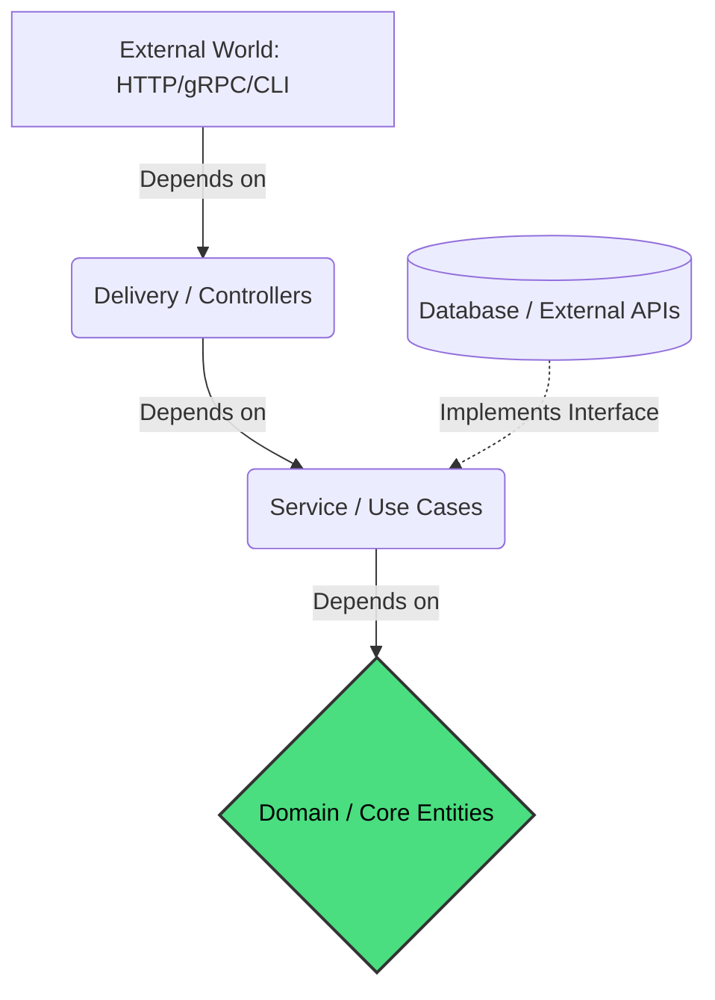

# Layered Architecture

## 1. Learning Objectives
* **What you'll learn**: The fundamental principles of Uncle Bob's Clean Architecture and how to apply the Dependency Rule in Go.
* **Why it matters**: Prevents "Spaghetti Code" by decoupling your business logic from frameworks, databases, and UI, ensuring the application remains testable and maintainable for decades.
* **Where it's used**: Every production-grade enterprise application, including the GoVerse platform itself!

---

## 2. Real-world Story
Imagine building a high-tech bank vault. The vault contains the core assets (Business Rules). Surrounding the vault are security guards, then a lobby, and finally the front door facing the street (Web Framework/HTTP).
If you replace the front door with a revolving door, or swap the security guards for cameras, the core assets in the vault remain completely untouched and unaware of the changes. This is Clean Architecture: the core business logic does not know or care about the outside world.

---

## 3. Visual Learning (Execution Flow & Architecture)


---

## 4. Internal Working (Under the Hood)
Clean Architecture is defined by concentric circles. The overriding rule is the **Dependency Rule**: *Source code dependencies must point only inward, toward higher-level policies.*
1. **Entities (Core)**: Enterprise-wide business rules (Structs with methods).
2. **Use Cases (Services)**: Application-specific business rules.
3. **Interface Adapters (Delivery/Repository)**: Converts data from the format most convenient for the use cases, to the format most convenient for external agencies (SQL, HTTP).
4. **Frameworks & Drivers**: The outermost layer (Gin, Chi, Postgres, MongoDB).

---

## 5. Compiler Behavior
* **Package Cycles**: Go strictly forbids cyclic dependencies. If `package delivery` imports `package service`, and `package service` tries to import `package delivery`, the Go compiler will instantly throw a `import cycle not allowed` error. Clean Architecture natively aligns with Go's strict import rules by forcing one-way dependencies.

---

## 6. Memory Management
* **Struct Composition**: By passing dependencies as pointers down the layers, Go avoids deep copying massive configuration objects, keeping the memory footprint minimal across the layer boundaries.

---

## 7. Code Examples

### 🔹 Example 1: Simple
```go
// The Core Entity (internal/domain/user.go)
// Notice it imports absolutely NO external frameworks!
package domain

import "time"

type User struct {
    ID        string
    Email     string
    CreatedAt time.Time
}

// Enterprise business rule
func (u *User) IsEligibleForDiscount() bool {
    return time.Since(u.CreatedAt) > 365*24*time.Hour
}
```

### 🔹 Example 2: Intermediate
```go
// The Use Case / Service Layer (internal/usecase/user_service.go)
package usecase

import "github.com/myproject/internal/domain"

// Depends INWARD on Domain
type UserService struct {
    repo domain.UserRepository // Interface!
}

func (s *UserService) ApplyDiscount(userID string) error {
    user, _ := s.repo.FindByID(userID)
    if user.IsEligibleForDiscount() {
        // Apply logic
    }
    return nil
}
```

### 🔹 Example 3: Advanced
```go
// The Interface Adapter (internal/delivery/http/handler.go)
// Depends INWARD on Use Case. Translates HTTP to Go structs.
func (h *UserHandler) ApplyDiscountEndpoint(w http.ResponseWriter, r *http.Request) {
    userID := chi.URLParam(r, "id")
    err := h.usecase.ApplyDiscount(userID)
    // Handle HTTP response...
}
```

### 🔹 Example 4: Production
```go
// The Frameworks Layer (cmd/server/main.go)
// This is the ONLY place where everything is wired together!
func main() {
    db := postgres.Connect()
    repo := postgres.NewUserRepository(db)
    service := usecase.NewUserService(repo)
    handler := http.NewUserHandler(service)
    
    // Start server...
}
```

### 🔹 Example 5: Interview
```go
// Why do we use an Interface for the Repository in the Service layer?
// Answer: Dependency Inversion. The Service dictates the contract (Interface). 
// The Database layer implements it. The dependency points INWARD.
```

---

## 8. Production Examples
1. **Changing Databases**: Swapping from MongoDB to PostgreSQL requires zero changes to your Core or Service logic, because the Service only relies on an Interface, not the SQL driver.
2. **Adding a CLI**: If you build a web app, and later need a CLI tool, you simply build a new Delivery layer that calls the exact same Service layer.

---

## 9. Performance & Benchmarking
* **Overhead**: Clean Architecture introduces interface abstraction overhead. A direct SQL call in a controller takes ~1ns of Go CPU time. Passing through a Service layer and an Interface takes ~3ns. The maintainability massively outweighs the 2ns penalty.

---

## 10. Best Practices
* ✅ **Do**: Define your Interfaces where they are *used* (in the Use Case/Service layer), not where they are implemented.
* ❌ **Don't**: Return HTTP status codes (e.g., `404`) from your Service layer. The Service knows nothing about HTTP. Return a domain `errors.New("not found")` and let the Delivery layer translate it to a 404.
* 🏢 **Google / Uber / Netflix Style**: Standardize the folder structure: `cmd/`, `internal/domain`, `internal/usecase`, `internal/repository`, `internal/delivery`.

---

## 11. Common Mistakes
1. **Leaking Tech Stacks**: Putting `*sql.DB` or `*gorm.DB` directly into the Domain entities.
2. **The God Object**: Creating a single `internal/models` package that holds everything, turning into a massive tangled web instead of isolated domain layers.

---

## 12. Debugging
How to troubleshoot layered architectures:
* **Stack Traces**: Because logic flows sequentially through layers, a Go panic stack trace will clearly show `Delivery -> Service -> Repository -> Database`, making it incredibly easy to pinpoint where the state mutated incorrectly.

---

## 13. Exercises
1. **Easy**: Write a simple Go `struct` representing an `Order` domain entity.
2. **Medium**: Write a Service layer that calculates taxes for that order.
3. **Hard**: Build a Repository layer that saves the order to a mock JSON file, implementing a domain interface.
4. **Expert**: Wire it all together in a `main.go` using an HTTP router.

---

## 14. Quiz
1. **MCQ**: According to the Dependency Rule, which layer is allowed to import the `net/http` package?
   * (A) Domain (B) Service (C) Delivery/Controllers (D) Repository. *(Answer: C)*
2. **Code Review**: Why is `import "github.com/lib/pq"` inside `internal/domain/user.go` a critical architectural failure? *(The Domain layer must not know about PostgreSQL).*

---

## 15. FAANG Interview Questions
* **Beginner**: What are the four layers of Clean Architecture?
* **Intermediate**: Explain the Dependency Inversion Principle.
* **Senior (Google/Meta)**: In a high-throughput microservice, how do you handle distributed transaction rollbacks across multiple Service Use Cases without coupling them to a specific SQL engine?

---

## 16. Mini Project
**Clean Architecture Todo App**
* Build a fully decoupled Go application.
* You must be able to switch the storage engine from a raw `[]Todo` slice in memory, to an SQLite database, just by changing one line in `main.go`, without touching any business logic.

---

## 17. Enterprise Features & Observability
* **Mocking**: Because dependencies are injected via interfaces, you can generate Mock implementations (using `gomock`) for your Repositories, allowing 100% unit test coverage on your Service layer without needing a real database.

---

## 18. Source Code Reading
Walkthrough of the Go source code for `io.Reader`.
* **The ultimate abstraction**: Go's `io.Reader` is the purest form of Clean Architecture. A function that takes an `io.Reader` does not know if it's reading from a File, a TCP Network Socket, or an HTTP Body.

---

## 19. Architecture
* **Folder Structure (Standard Go Layout)**: 
  * `/cmd` (Entrypoints)
  * `/internal` (Private application code)
  * `/pkg` (Public utility code)

---

## 20. Summary & Cheat Sheet
* **Domain**: Enterprise rules. No dependencies.
* **Service / Use Case**: Application rules. Depends on Domain.
* **Repository**: Database logic. Depends on Domain (Interface).
* **Delivery**: HTTP/gRPC. Depends on Service.
