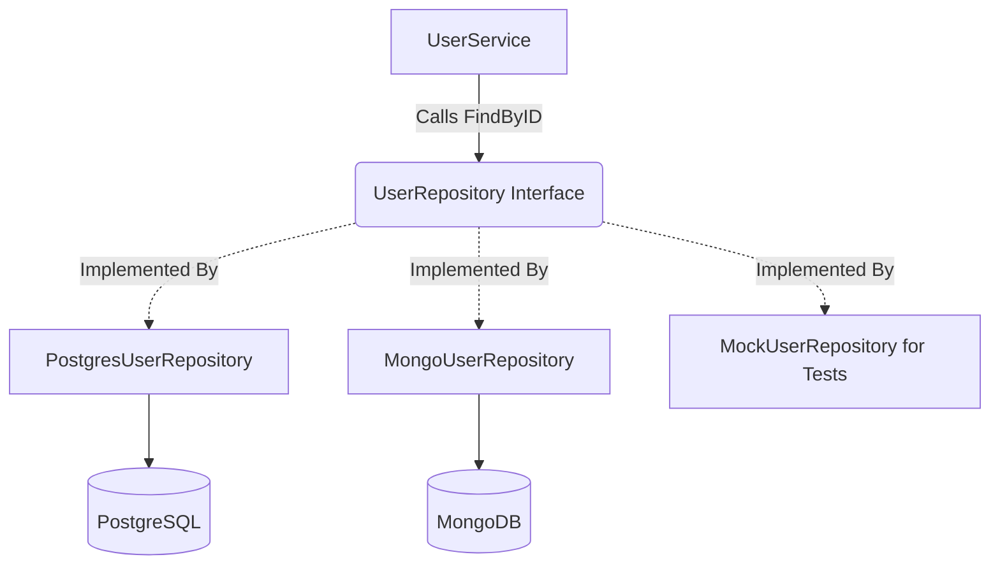

# Repository Pattern

## 1. Learning Objectives
* **What you'll learn**: How to abstract data persistence logic using the Repository Pattern in Go.
* **Why it matters**: It completely isolates your business logic from database-specific syntax (SQL queries, ORMs, NoSQL), making your code infinitely testable and resilient to database migrations.
* **Where it's used**: Any Go application that interacts with a database, external file system, or third-party storage API.

---

## 2. Real-world Story
Imagine a brilliant chef (the Service Layer). The chef needs fresh tomatoes to cook a masterpiece. The chef doesn't care if the tomatoes came from a local farm, a massive supermarket, or an underground bunker. The chef just asks the assistant (the Repository), "Bring me 5 tomatoes."
The assistant handles the logistics of driving to the store, dealing with the cashier (SQL queries), and bringing the tomatoes back. If the supermarket closes and they have to use a farm instead, the chef never notices. The recipe remains perfect.

---

## 3. Visual Learning (Execution Flow & Architecture)


---

## 4. Internal Working (Under the Hood)
The Repository Pattern consists of two critical pieces:
1. **The Interface**: Defined in the `domain` or `usecase` layer. It dictates *what* the application needs to do (e.g., `Save(user *User) error`).
2. **The Implementation**: Defined in the `repository` layer. It contains the actual `database/sql` or `pgx` code that fulfills the interface contract.

---

## 5. Compiler Behavior
* **Duck Typing / Implicit Satisfaction**: Unlike Java where you must write `class PostgresRepo implements RepoInterface`, Go uses implicit satisfaction. If your `PostgresUserRepository` struct has all the methods defined in the interface, the Go compiler automatically allows it to be injected. This removes massive amounts of boilerplate.

---

## 6. Memory Management
* **Connection Pooling**: Repositories should not open and close database connections on every function call. They should be initialized with a long-lived `*sql.DB` or `*pgxpool.Pool` pointer, which natively manages thread-safe connection pooling in the background.

---

## 7. Code Examples

### 🔹 Example 1: Simple
```go
// 1. The Interface (Domain Layer)
type UserRepository interface {
    FindByID(ctx context.Context, id string) (*User, error)
}
```

### 🔹 Example 2: Intermediate
```go
// 2. The Implementation (Repository Layer)
type PostgresUserRepository struct {
    db *sql.DB
}

func NewPostgresUserRepository(db *sql.DB) *PostgresUserRepository {
    return &PostgresUserRepository{db: db}
}

func (r *PostgresUserRepository) FindByID(ctx context.Context, id string) (*domain.User, error) {
    row := r.db.QueryRowContext(ctx, "SELECT id, email FROM users WHERE id = $1", id)
    var u domain.User
    if err := row.Scan(&u.ID, &u.Email); err != nil {
        return nil, err
    }
    return &u, nil
}
```

### 🔹 Example 3: Advanced
```go
// 3. The Service using the Interface
type UserService struct {
    repo domain.UserRepository
}

// At compile time, the Go compiler ensures whatever is passed here satisfies the interface!
func NewUserService(repo domain.UserRepository) *UserService {
    return &UserService{repo: repo}
}
```

### 🔹 Example 4: Production
```go
// Database Transactions across multiple Repositories!
// This is often solved by passing a generic Unit of Work (Tx) interface into the repo methods.
func (r *PostgresRepo) SaveWithTx(ctx context.Context, tx *sql.Tx, u *User) error { ... }
```

### 🔹 Example 5: Interview
```go
// Why do we pass context.Context to every repository method?
// Answer: For Context Cancellation. If the user closes their browser, the HTTP handler cancels the context. 
// The repository passes that context to the SQL driver, which immediately aborts the physical database query, saving CPU!
```

---

## 8. Production Examples
1. **Testing**: Injecting a `MockUserRepository` (backed by a simple `map[string]*User`) into your Service so unit tests run in 0.001 seconds without needing Docker or a real database.
2. **Caching Proxies**: You can create a `RedisUserRepository` that wraps the `PostgresUserRepository`. If Redis has the user, it returns it; if not, it calls Postgres. The Service layer never knows caching is even happening!

---

## 9. Performance & Benchmarking
* **Prepared Statements**: Inside the implementation, leveraging `db.Prepare()` or using `pgx` native statement caching dramatically reduces the CPU overhead of SQL parsing on the database engine.

---

## 10. Best Practices
* ✅ **Do**: Define your interfaces with `context.Context` as the first parameter.
* ✅ **Do**: Keep repository interfaces small (Interface Segregation Principle). Don't create a 50-method `Database` interface. Create focused interfaces like `UserReader` and `UserWriter`.
* ❌ **Don't**: Leak SQL-specific errors into the Service layer (e.g., returning `pq.ErrNoRows`). Wrap them in domain errors like `domain.ErrUserNotFound`.

---

## 11. Common Mistakes
1. **Returning Database Models**: A repository shouldn't return a GORM struct with database tags. It should map the database row into a pure Domain Entity struct before returning it.
2. **Business Logic in the Repo**: Putting logic like "If user is under 18, don't save" inside the Repository. That is a Use Case rule. The repository should be incredibly "dumb"—it only executes storage commands.

---

## 12. Debugging
How to troubleshoot Repository implementations:
* **SQL Logging**: Wrap your `*sql.DB` driver with a logging proxy (like `sqldblogger`) to print exactly which queries are being fired by the repository under the hood.

---

## 13. Exercises
1. **Easy**: Define a `ProductRepository` interface with `Save` and `Find` methods.
2. **Medium**: Implement the interface using an in-memory `[]*Product` slice for testing.
3. **Hard**: Implement the interface using PostgreSQL and standard library `database/sql`.
4. **Expert**: Implement an `Update` method that gracefully handles Optimistic Locking failures.

---

## 14. Quiz
1. **MCQ**: What principle does the Repository Pattern primarily enforce?
   * (A) DRY (B) Dependency Inversion (C) Liskov Substitution. *(Answer: B. It abstracts the low-level database implementation behind a high-level interface).*
2. **Code Review**: Critique this interface: `type Repo interface { Save(u *User) *gorm.DB }`. *(It leaks the ORM (`gorm.DB`) into the return signature, completely destroying the isolation!)*

---

## 15. FAANG Interview Questions
* **Beginner**: Why not just put `db.Query()` inside the HTTP handler?
* **Intermediate**: How do you test a service that relies on a database without actually running a database?
* **Senior (Google/Meta)**: Implement the Unit of Work pattern in Go to manage distributed database transactions across 3 different repository instances.

---

## 16. Mini Project
**The Caching Decorator**
* Build an `InMemoryUserRepository` and a `PostgresUserRepository`.
* Create a wrapper struct that implements the same interface. It checks memory first; if missing, it fetches from Postgres and saves to memory before returning.

---

## 17. Enterprise Features & Observability
* **Tracing**: Inject OpenTelemetry spans into the Repository methods. Because `ctx` is passed in, you can seamlessly trace exactly how long the SQL query took as part of the overall HTTP request.

---

## 18. Source Code Reading
Walkthrough of `database/sql`.
* **The Driver Interface**: Go's entire `database/sql` package is actually just a massive application of the Repository pattern! The `sql` package defines the interfaces, and external drivers (like `lib/pq` or `go-sql-driver/mysql`) implement them.

---

## 19. Architecture
* **Interface Location**: In Clean Architecture, the interface belongs to the Use Case / Domain layer. The implementation belongs in the outermost framework layer. This enforces the Dependency Rule (Dependencies point inward).

---

## 20. Summary & Cheat Sheet
* **Purpose**: Isolate storage mechanics from business logic.
* **Mechanism**: Interfaces defined by the Domain, satisfied by the Infrastructure.
* **Benefit**: 100% Mockable, infinitely testable, easily migratable.
