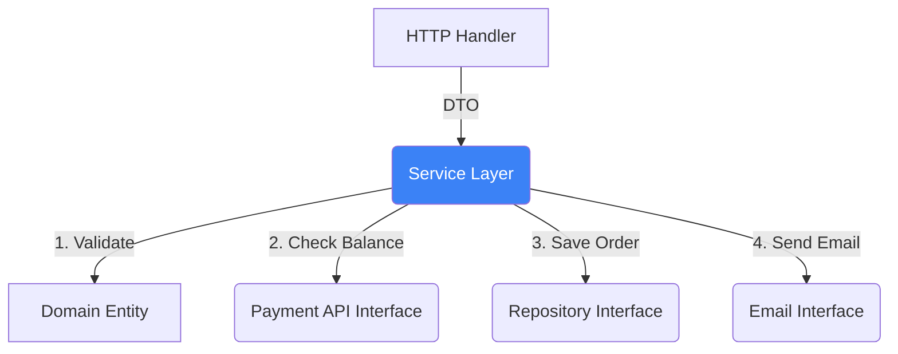

# Service Layer (Use Cases)

## 1. Learning Objectives
* **What you'll learn**: How to orchestrate business rules and domain entities using the Service Layer (Use Case Interactors).
* **Why it matters**: It is the true "Brain" of your application. If a new developer reads your Service Layer, they should instantly understand exactly what your business does, without seeing a single line of SQL or HTTP code.
* **Where it's used**: The core orchestrator in any enterprise Domain-Driven Design (DDD) architecture.

---

## 2. Real-world Story
Think of the Service Layer as the Conductor of an Orchestra. 
The Conductor (Service) doesn't actually play the violin (Database) or build the stage (HTTP Server). The Conductor simply knows the sheet music (Business Rules) and orchestrates the musicians. "Violins, start playing! Now trumpets, go!"
If the song requires fetching a user, validating their payment, and sending an email, the Service Layer orchestrates the Repository, the PaymentGateway, and the EmailService to achieve the Use Case.

---

## 3. Visual Learning (Execution Flow & Architecture)


---

## 4. Internal Working (Under the Hood)
The Service Layer is an implementation of "Application Business Rules". 
It defines the **Use Cases** of the system (e.g., `RegisterUser`, `CheckoutCart`, `CancelSubscription`). 
It does not contain data structures (that's the Domain's job). It contains the procedural logic that pulls entities from the database, asks the entities to modify their state, and saves them back.

---

## 5. Compiler Behavior
* **Strict Type Safety**: Go's strict typing ensures that the Service Layer only accepts pure Domain entities or DTOs (Data Transfer Objects), firmly preventing HTTP `*http.Request` pointers from bleeding into the business logic.

---

## 6. Memory Management
* **Statelessness**: A well-designed Service struct in Go is completely **Stateless**. It should only contain pointers to Interfaces (Repositories, Logger). It should NEVER contain request-specific data like `userID` as a struct field. This allows a single instance of `UserService` to safely serve 10,000 concurrent Goroutines without Mutex locks.

---

## 7. Code Examples

### 🔹 Example 1: Simple
```go
// Defining the Service Struct
type CheckoutService struct {
    repo    domain.OrderRepository
    payment domain.PaymentGateway
}

func NewCheckoutService(r domain.OrderRepository, p domain.PaymentGateway) *CheckoutService {
    return &CheckoutService{repo: r, payment: p}
}
```

### 🔹 Example 2: Intermediate
```go
// Orchestrating a Use Case
func (s *CheckoutService) ProcessOrder(ctx context.Context, orderID string) error {
    // 1. Fetch
    order, err := s.repo.FindByID(ctx, orderID)
    if err != nil { return err }

    // 2. Domain Logic validation
    if !order.IsReadyForCheckout() {
        return domain.ErrOrderNotReady
    }

    // 3. Orchestrate 3rd Party
    if err := s.payment.Charge(order.Total); err != nil {
        return err
    }

    // 4. Save State
    order.MarkAsPaid()
    return s.repo.Save(ctx, order)
}
```

### 🔹 Example 3: Advanced
```go
// Handling Domain Errors vs Infrastructure Errors
// The Service translates low-level errors into Business-level errors.
if errors.Is(err, sql.ErrNoRows) { // BAD: Leaked SQL error!
    return domain.ErrOrderNotFound // GOOD: Pure domain error!
}
```

### 🔹 Example 4: Production
```go
// Utilizing Go Interfaces for the Service itself!
// The Delivery layer consumes an Interface, not the struct, for ultimate decoupling.
type CheckoutUseCase interface {
    ProcessOrder(ctx context.Context, orderID string) error
}
```

### 🔹 Example 5: Interview
```go
// Why must the Service be stateless?
// Because Go HTTP servers spawn a new Goroutine for every request. If the Service held state 
// (e.g., s.CurrentUserID = 42), concurrent requests would overwrite each other's data (Race Condition)!
```

---

## 8. Production Examples
1. **Screaming Architecture**: If you open your Use Case folder, the file names should scream what the application does: `approve_loan.go`, `cancel_flight.go`, `ban_user.go`. It shouldn't just be `user_service.go` containing generic CRUD.
2. **Background Workers**: A Kafka consumer (Delivery Layer) can invoke the exact same Service method as the HTTP API.

---

## 9. Performance & Benchmarking
* **Zero Overhead**: Because Go interfaces are incredibly cheap to dispatch (virtual method tables), the performance penalty of placing a Service Layer between the Controller and Repository is virtually non-existent (measured in nanoseconds).

---

## 10. Best Practices
* ✅ **Do**: Keep your Service functions focused on orchestrating steps. 
* ✅ **Do**: Push rich business rules (calculations, state changes) down into the Domain Entities. The Service should be "thin".
* ❌ **Don't**: Write 1,000-line "Fat Services" where the Service computes taxes, generates PDFs, and connects to the DB directly.

---

## 11. Common Mistakes
1. **Returning DTOs to the Delivery Layer**: Services should ideally return pure Domain Entities, and the Delivery layer (Controller) is responsible for converting the Entity into a JSON DTO.
2. **Context Abuse**: Storing database transactions inside the `context.Context` payload to share them between the Service and Repository. This defeats static typing.

---

## 12. Debugging
How to troubleshoot Services in production:
* **Unit Testing**: This is the greatest benefit of the Service layer! You can write 100s of unit tests using `gomock` without ever spinning up a database or HTTP server. 
```bash
go test -v ./internal/usecase/... -cover
```

---

## 13. Exercises
1. **Easy**: Create a `UserService` that takes a `UserRepository` interface.
2. **Medium**: Implement a `Register` use case that hashes a password before calling the repository.
3. **Hard**: Implement a rollback mechanism if the database save succeeds but the subsequent welcome email fails.
4. **Expert**: Write a 100% coverage Unit Test for the Service using a Mock Repository.

---

## 14. Quiz
1. **MCQ**: What kind of data should a Service Layer struct contain?
   * (A) User specific data like Session ID (B) Pointers to Infrastructure Interfaces (C) HTTP Request Pointers. *(Answer: B)*
2. **Code Review**: Why is `func (s *Service) Execute(req *http.Request)` an architectural violation? *(The Service layer is completely polluted with HTTP framework details).*

---

## 15. FAANG Interview Questions
* **Beginner**: What is the difference between a Domain Entity and a Use Case?
* **Intermediate**: How do you avoid "Anemic Domain Models" where the Service layer contains all the logic and the Domain entities are just dumb structs?
* **Senior (Google/Meta)**: Architect the Use Case layer for an Uber-like ride matching algorithm. How do you orchestrate the geolocation service, driver repository, and notification gateway while handling timeouts?

---

## 16. Mini Project
**The Orchestrator**
* Build an `OrderService`.
* It must validate inventory via an `InventoryService` interface.
* It must process payment via a `StripeService` interface.
* It must save via an `OrderRepository` interface.
* Write a test suite that proves if Stripe fails, the Order is not saved.

---

## 17. Enterprise Features & Observability
* **Logging**: The Service Layer is the optimal place to log business-level events (e.g., `logger.Info("User upgraded to premium", zap.String("userID", id))`), rather than low-level HTTP logs.

---

## 18. Source Code Reading
* **Clean Architecture by Robert C. Martin**: While not Go code, Uncle Bob's "Use Case Interactors" chapter perfectly describes the exact responsibilities of the Go Service struct.

---

## 19. Architecture
* **The Interactor Pattern**: Some teams prefer creating a single struct for each use case (e.g., `type RegisterUserUseCase struct`) instead of grouping them into a monolithic `UserService`. This adheres perfectly to the Single Responsibility Principle.

---

## 20. Summary & Cheat Sheet
* **Role**: The conductor of the application.
* **State**: Strictly stateless.
* **Dependencies**: Inward on Domain, Outward on Interfaces.
* **Testing**: Highly testable via Mock injection.
