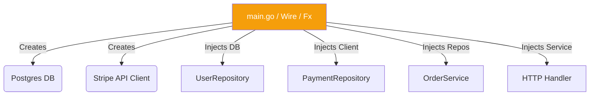

# Dependency Injection

## 1. Learning Objectives
* **What you'll learn**: The mechanics of Dependency Injection (DI) and Dependency Inversion in Go.
* **Why it matters**: It is the mechanical glue that makes Clean Architecture possible, eliminating global state and hardcoded dependencies.
* **Where it's used**: Passing database connections, loggers, and services seamlessly throughout a Go application.

---

## 2. Real-world Story
Imagine a racing video game. If the "Car" object internally hardcodes the creation of a "V8 Engine" object, that car is permanently stuck as a V8. 
But what if the Car's constructor allows you to *pass in* an Engine? Now, you can inject a V8, an Electric Motor, or even a fake "Test Engine" that just prints "Vroom" to the console. 
By *injecting* the dependency from the outside, the Car becomes infinitely flexible and testable.

---

## 3. Visual Learning (Execution Flow & Architecture)


---

## 4. Internal Working (Under the Hood)
Dependency Injection is simply the act of passing structs and interfaces via function arguments or constructors, rather than initializing them globally or internally.
In Go, we don't need massive reflection-based DI frameworks like Spring (Java). We simply use **Constructor Injection**: passing dependencies as arguments to a `New...()` factory function.

---

## 5. Compiler Behavior
* **Static Resolution**: Because standard Go DI is manual (wiring in `main.go`), the Go compiler mathematically verifies at compile-time that every required dependency is satisfied, preventing runtime crashes (Null Pointer Dereferences) caused by missing injections.

---

## 6. Memory Management
* **Pointer Sharing**: DI allows you to instantiate a single `*sql.DB` connection pool in `main.go` and inject that exact same pointer into 50 different Repositories. They all share the same underlying memory and connection pool!

---

## 7. Code Examples

### 🔹 Example 1: Simple (The Wrong Way)
```go
// BAD: Hardcoded Dependency (Tight Coupling)
type UserService struct {}

func (s *UserService) GetUser() {
    // Highly coupled! Cannot test without a real database!
    db := postgres.Connect("localhost") 
    db.Query("...")
}
```

### 🔹 Example 2: Intermediate (The Right Way)
```go
// GOOD: Constructor Injection
type UserService struct {
    db *sql.DB // The Dependency
}

// The Factory Function demands the dependency from the outside world!
func NewUserService(db *sql.DB) *UserService {
    return &UserService{db: db}
}
```

### 🔹 Example 3: Advanced (Dependency Inversion)
```go
// EXCELLENT: Injecting an Interface, not a concrete struct!
type UserRepository interface {
    Find(id string) error
}

type UserService struct {
    repo UserRepository // Injected Interface!
}

func NewUserService(r UserRepository) *UserService {
    return &UserService{repo: r}
}
```

### 🔹 Example 4: Production
```go
// main.go (The Composition Root)
// This is the ONLY place where concrete instances are created and wired together.
func main() {
    db := ConnectDB()
    repo := NewPostgresRepo(db)
    
    // Inject the concrete PostgresRepo into the Service, 
    // satisfying the UserRepository interface!
    service := NewUserService(repo) 
    
    httpHandler := NewHandler(service)
    http.ListenAndServe(":8080", httpHandler)
}
```

### 🔹 Example 5: Interview
```go
// Q: Can you use Global Variables instead of DI? (e.g. var DB *sql.DB)
// A: Global variables destroy testability. If you run tests in parallel using t.Parallel(), 
// they will overwrite the global DB variable, causing race conditions and test pollution. 
// DI isolates state per instance!
```

---

## 8. Production Examples
1. **Testing**: Injecting a mock EmailService during unit testing so you don't accidentally spam real users with emails when running `go test`.
2. **Configuration**: Injecting different environment configurations (`AppConfig`) into services based on whether the app is running in Staging or Production.

---

## 9. Performance & Benchmarking
* **Compile-Time vs Runtime**: Frameworks like `google/wire` use code generation to write the `main.go` DI wiring for you. It runs at compile time, meaning zero reflection overhead and maximum performance at runtime.

---

## 10. Best Practices
* ✅ **Do**: Use Constructor Injection (passing via `New()` functions).
* ❌ **Don't**: Use global singletons (like `var DB *sql.DB`).
* 🏢 **Google / Uber / Netflix Style**: For massive codebases with hundreds of dependencies, use DI frameworks like `uber-go/fx` (Runtime reflection) or `google/wire` (Compile-time code generation) to automate the wiring in `main.go`.

---

## 11. Common Mistakes
1. **The `init()` Function Anti-pattern**: Using Go's `init()` function to implicitly set up global database connections. This hides dependencies and causes unpredictable startup behaviors.
2. **God Struct Injection**: Injecting a massive `AppContainer` struct containing 50 dependencies into every service, violating the Interface Segregation Principle. Only inject exactly what the service needs!

---

## 12. Debugging
How to troubleshoot DI in production:
* **Missing Injections**: If you forget to inject a dependency (e.g., passing `nil`), the application will immediately `panic: runtime error: invalid memory address or nil pointer dereference` when the service tries to call it. Always validate inputs in your constructors!

---

## 13. Exercises
1. **Easy**: Write a struct `Logger` and inject it into a `Worker` struct using a constructor.
2. **Medium**: Refactor the injection to use an interface `LogWriter` instead of the concrete struct.
3. **Hard**: Write a `main.go` that wires together a Logger, Database, Repository, and Service.
4. **Expert**: Rewrite the `main.go` wiring using the `google/wire` compile-time DI tool.

---

## 14. Quiz
1. **MCQ**: Where is the optimal place to wire all dependencies together?
   * (A) Inside the Service Layer (B) In an `init()` function (C) The Composition Root (e.g. `main.go`). *(Answer: C)*
2. **Code Review**: Why is `func NewService() *Service { return &Service{db: config.GetGlobalDB()} }` bad? *(It relies on hidden global state instead of explicitly asking for the DB via function arguments).*

---

## 15. FAANG Interview Questions
* **Beginner**: Explain Dependency Injection vs Dependency Inversion (The 'D' in SOLID).
* **Intermediate**: How does DI solve the issue of cyclic dependencies?
* **Senior (Google/Meta)**: Architect a plugin system in Go where third-party modules can inject custom implementations into the core engine at runtime without recompiling the core engine.

---

## 16. Mini Project
**The Google Wire Automator**
* Build a project with 10 interdependent structs (Config, Logger, DB, 3 Repos, 3 Services, 1 Handler).
* Write the `wire.go` provider sets.
* Run `wire` to auto-generate the massive `wire_gen.go` dependency graph injection file!

---

## 17. Enterprise Features & Observability
* **Lifecycle Hooks**: Advanced DI frameworks (like `uber/fx`) provide `OnStart` and `OnStop` hooks. When a dependency (like a gRPC connection) is injected, you can register a hook to cleanly close the connection during a graceful shutdown.

---

## 18. Source Code Reading
Walkthrough of `github.com/google/wire`.
* **AST Parsing**: How Google Wire parses your Go Abstract Syntax Tree to figure out exactly which Provider functions generate which Interfaces, and automatically writes the Go code to connect them.

---

## 19. Architecture
* **The Composition Root**: This is a core Clean Architecture concept. The `main.go` file (or `cmd/server`) is the absolute dirtiest file in the codebase. It knows about every database, every framework, and every interface. It connects them all together and then starts the isolated core.

---

## 20. Summary & Cheat Sheet
* **Concept**: Pass dependencies in, don't build them inside.
* **Go Idiom**: Constructor injection (`NewService(repo)`).
* **SOLID**: Enables Dependency Inversion.
* **Tools**: `google/wire` (Compile-time), `uber/fx` (Run-time).
