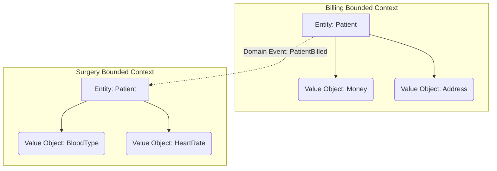

# Domain-Driven Design (DDD) Basics

## 1. Learning Objectives
* **What you'll learn**: The core concepts of Domain-Driven Design (DDD) like Ubiquitous Language, Bounded Contexts, Aggregates, and Value Objects.
* **Why it matters**: Clean Architecture gives you the folder structure and dependencies, but DDD tells you how to actually model the business logic *inside* those folders.
* **Where it's used**: Complex microservice architectures where business rules are extremely complicated (Fintech, Healthcare, Logistics).

---

## 2. Real-world Story
Imagine a hospital. The word "Patient" means something entirely different depending on who you ask. 
To the Billing Department, a "Patient" is an invoice, a credit card, and an insurance policy. To the Surgery Department, a "Patient" is blood type, allergies, and medical history. 
If you try to build one giant `Patient` struct in Go that holds all 500 of these fields, your code becomes an unmaintainable nightmare. DDD solves this by splitting the software into "Bounded Contexts" (Billing vs Surgery), allowing the word "Patient" to mean different things in different contexts!

---

## 3. Visual Learning (Execution Flow & Architecture)


---

## 4. Internal Working (Under the Hood)
DDD is built on 4 tactical pillars:
1. **Entities**: Objects with a distinct identity that persists over time (e.g., `User` with an ID).
2. **Value Objects**: Immutable objects with no identity. Two Value Objects are equal if their fields match exactly (e.g., `Money{Amount: 100, Currency: USD}`).
3. **Aggregates**: A cluster of domain objects treated as a single unit. You only save or load the whole Aggregate via its "Aggregate Root".
4. **Domain Events**: Something that happened in the past that other parts of the system care about (e.g., `OrderPlacedEvent`).

---

## 5. Compiler Behavior
* **Immutability via Value Semantics**: In Go, you enforce Value Objects by passing them by value (`Money`), not by pointer (`*Money`). This guarantees immutability because the compiler creates a fresh copy on every function call, physically preventing side-effect mutations!

---

## 6. Memory Management
* **Aggregate Size**: In DDD, you must keep Aggregates small. If a `Blog` Aggregate contains a slice of 10,000 `Comment` structs, loading the Blog will OOM (Out Of Memory) the Go server. You must reference related Aggregates by ID, not by embedding massive slices.

---

## 7. Code Examples

### 🔹 Example 1: Simple (Value Objects)
```go
// A Value Object is immutable and has no ID.
type Money struct {
    amount   int // unexported, prevents external mutation!
    currency string
}

func NewMoney(amount int, currency string) Money {
    return Money{amount: amount, currency: currency}
}

// Any operation returns a NEW Value Object.
func (m Money) Add(other Money) (Money, error) {
    if m.currency != other.currency { return Money{}, errors.New("currency mismatch") }
    return NewMoney(m.amount + other.amount, m.currency), nil
}
```

### 🔹 Example 2: Intermediate (Entities)
```go
// An Entity has a unique ID and is mutable.
type Order struct {
    id     string
    total  Money // Uses the Value Object!
    status string
}

// Business Logic is encapsulated inside the Entity!
func (o *Order) Cancel() error {
    if o.status == "shipped" {
        return errors.New("cannot cancel shipped order")
    }
    o.status = "cancelled"
    return nil
}
```

### 🔹 Example 3: Advanced (The Aggregate Root)
```go
// The Aggregate Root controls access to its children.
type Cart struct { // Aggregate Root
    id    string
    items []CartItem // Internal Entity
}

// You never add a CartItem directly to the database. 
// You must go through the Cart root!
func (c *Cart) AddItem(productID string, price Money) {
    c.items = append(c.items, CartItem{productID: productID, price: price})
}
```

### 🔹 Example 4: Production
```go
// Domain Events (Usually dispatched via Kafka or an internal Event Bus)
type UserRegisteredEvent struct {
    UserID    string
    Timestamp time.Time
}
```

### 🔹 Example 5: Interview
```go
// Why use Value Objects instead of primitive strings?
// Using type Email struct { value string } ensures that once created, 
// the email is mathematically guaranteed to be valid! A primitive `string` could be "invalid_email_format".
```

---

## 8. Production Examples
1. **Microservices**: Each Bounded Context (Billing, Shipping, Inventory) perfectly maps to a deployable Go Microservice!
2. **Event Sourcing**: Storing Domain Events (e.g., `MoneyDeposited`, `MoneyWithdrawn`) in the database instead of the current balance. The current balance is derived by folding the events.

---

## 9. Performance & Benchmarking
* **Value Object Copies**: Passing `Money` by value creates a tiny CPU overhead to copy the memory. However, because structs like `Money` only contain a few bytes, this copy takes under 1 nanosecond, making it heavily preferred over garbage collection overhead on pointers.

---

## 10. Best Practices
* ✅ **Do**: Use "Ubiquitous Language". If the business team calls it a "Client", your Go struct must be named `Client`, not `Customer` or `User`.
* ❌ **Don't**: Create "Anemic Domain Models" where your structs only have getters/setters and all the logic is dumped into the Service layer.
* 🏢 **Google / Uber / Netflix Style**: Use UUIDs/ULIDs for Entity IDs to allow decoupled, offline ID generation across distributed microservices.

---

## 11. Common Mistakes
1. **Massive Aggregates**: Designing an `ECommerceSite` aggregate that contains a list of every `User`, `Order`, and `Product` in existence.
2. **Database-Driven Design**: Designing your PostgreSQL tables first, and then generating your Go structs to match the tables. DDD dictates you design your Go Domain models purely based on business rules first, and figure out how to map them to tables later (Repository pattern).

---

## 12. Debugging
How to troubleshoot DDD in production:
* **Event Storming Logs**: If you log every Domain Event (e.g. `OrderPlaced`, `PaymentFailed`), debugging complex distributed bugs becomes trivial because you have a perfect chronological audit trail of what happened in the domain.

---

## 13. Exercises
1. **Easy**: Create an `Address` Value Object that validates Zip Codes.
2. **Medium**: Create a `User` Entity that contains an `Address`.
3. **Hard**: Build an Aggregate Root for `BankAccount` that prevents overdrafts natively inside its methods.
4. **Expert**: Implement an in-memory Domain Event dispatcher that triggers a welcome email when a user is created.

---

## 14. Quiz
1. **MCQ**: What is the defining characteristic of a Value Object?
   * (A) It has a UUID (B) It is connected to the DB (C) It is immutable and lacks identity. *(Answer: C)*
2. **System Design Follow-up**: Why should transactions NEVER span multiple Aggregates? *(Because Aggregates are transaction boundaries. Modifying two aggregates in one transaction implies they should probably be one single aggregate).*

---

## 15. FAANG Interview Questions
* **Beginner**: Explain the Ubiquitous Language.
* **Intermediate**: What is an Anemic Domain Model and why is it an anti-pattern?
* **Senior (Google/Meta)**: How do you handle Data Consistency across multiple Bounded Contexts? (e.g., Using Saga Patterns and Eventual Consistency via Kafka).

---

## 16. Mini Project
**The Fintech Wallet**
* Build a `Wallet` Aggregate Root.
* Use a `Money` Value Object.
* Expose `Deposit()` and `Withdraw()` methods.
* Return custom Domain Errors (`ErrInsufficientFunds`).
* Ensure 100% unit test coverage on the Domain logic without ANY database mocks, proving the Domain is pure Go.

---

## 17. Enterprise Features & Observability
* **Event Sourcing & CQRS**: Advanced DDD applications separate the Write models (Command) from the Read models (Query). Go excels at CQRS due to easy concurrency and decoupled channels.

---

## 18. Source Code Reading
Walkthrough of the `time` package in Go.
* **The ultimate Value Object**: `time.Time` is a perfect example of a DDD Value Object. It is passed by value, and calling `t.Add(duration)` does not modify `t`; it returns a brand new `time.Time` object!

---

## 19. Architecture
* **The Domain Layer**: In Clean Architecture, all DDD tactical patterns (Entities, Value Objects, Domain Events) live exclusively in the innermost layer (`internal/domain`), completely ignorant of the outside world.

---

## 20. Summary & Cheat Sheet
* **Ubiquitous Language**: Code speaks the business language.
* **Bounded Context**: Explicit boundaries separating models.
* **Entity**: Identity matters (Mutable).
* **Value Object**: Attributes matter (Immutable).
* **Aggregate Root**: The gatekeeper of consistency.
