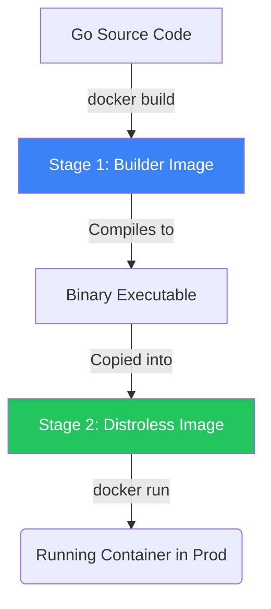

# Docker & Containerization for Go

## 1. Learning Objectives
* **What you'll learn**: How to package a Go application into a highly optimized, extremely secure Docker container using Multi-Stage Builds and distroless images.
* **Why it matters**: Containerization guarantees that if your Go code runs on your laptop, it will run exactly the same way on the AWS production servers. It eliminates the "It works on my machine!" excuse forever.
* **Where it's used**: Literally everywhere. Docker is the absolute foundation of modern cloud-native software engineering.

---

## 2. Real-world Story
Imagine shipping cargo across the ocean in 1950. You had bags of flour, boxes of TVs, and barrels of oil. Loading the ship was a nightmare because everything was a different shape.
Then, the **Shipping Container** was invented. A standard steel box. The crane doesn't care if the box holds TVs or flour; it just moves the box.
Docker is the shipping container for software. The cloud server doesn't care if your app is written in Go, Python, or Java. It just runs the standard Docker container.

---

## 3. Visual Learning (Execution Flow & Architecture)


---

## 4. Internal Working (Under the Hood)
A Docker container is NOT a Virtual Machine. 
A VM simulates an entire physical computer (CPU, RAM, hard drive) and runs a full Guest OS (like Windows). It takes gigabytes of RAM.
A Docker container shares the host's Linux Kernel. It uses Linux `cgroups` (Control Groups) and `namespaces` to create an isolated illusion of an OS. Because there is no Guest OS, a Go Docker container boots in 0.1 seconds and uses exactly the amount of RAM the Go binary uses (often < 20MB).

---

## 5. Compiler Behavior
* **Static Linking**: Go is unique because the compiler natively spits out a single, statically-linked binary. A Node.js app requires the 50MB Node runtime to be installed in the Docker image. A Go app requires *absolutely nothing*. You can put a Go binary inside a completely empty Docker image (`FROM scratch`) and it will run perfectly!

---

## 6. Memory Management
* **Image Size Bloat**: If you use `FROM golang:1.21` for your final image, your Docker image will be 800MB because it includes the entire Go compiler, Linux build tools, and package managers. By using a **Multi-Stage Build**, you compile in the 800MB image, but copy ONLY the 15MB binary into the final production image.

---

## 7. Code Examples

### 🔹 Example 1: Simple (The Bad Way)
```dockerfile
# BAD: Single stage build. The image will be 800MB+!
FROM golang:1.21
WORKDIR /app
COPY . .
RUN go build -o myapp main.go
CMD ["./myapp"]
```

### 🔹 Example 2: Intermediate (Multi-Stage Build)
```dockerfile
# GOOD: Multi-stage build. Final image is ~20MB!

# Stage 1: Build the binary
FROM golang:1.21-alpine AS builder
WORKDIR /app
COPY go.mod go.sum ./
RUN go mod download
COPY . .
# CGO_ENABLED=0 is critical for running in 'scratch' or 'alpine'
RUN CGO_ENABLED=0 GOOS=linux go build -o myapp main.go

# Stage 2: The production image
FROM alpine:latest
WORKDIR /root/
COPY --from=builder /app/myapp .
EXPOSE 8080
CMD ["./myapp"]
```

### 🔹 Example 3: Advanced (Distroless for Security)
```dockerfile
# EXCELLENT: Distroless images contain NO shell (no /bin/sh, no ls).
# If a hacker breaches your Go app, they literally cannot run any terminal commands!
FROM gcr.io/distroless/static-debian11
COPY --from=builder /app/myapp /
CMD ["/myapp"]
```

### 🔹 Example 4: Production (Makefile Integration)
```makefile
# Always automate your docker commands!
build:
	docker build -t goverse/api:latest .
run:
	docker run -p 8080:8080 -e DB_URL="postgres://..." goverse/api:latest
```

### 🔹 Example 5: Interview
```dockerfile
# Q: Why do we COPY go.mod/go.sum and run `go mod download` BEFORE copying the rest of the code?
# A: Docker Layer Caching! If you only change a line in main.go, Docker caches the downloaded modules. 
# It skips downloading the internet again, making your build 10x faster!
```

---

## 8. Production Examples
1. **Microservices**: A Go backend team builds 15 different microservices. Each is packaged identically into a Docker image and pushed to AWS ECR (Elastic Container Registry).
2. **Local Testing**: Spinning up a complex graph database (like Neo4j) locally using `docker run neo4j` to test your Go code against it, then destroying it cleanly.

---

## 9. Performance & Benchmarking
* **Boot Time**: A Go binary in a Distroless container boots in a fraction of a millisecond. This makes Go the absolute king of "Serverless" and "Scale-to-Zero" architectures (like Google Cloud Run), where the container only boots when an HTTP request arrives.

---

## 10. Best Practices
* ✅ **Do**: Use `.dockerignore` to prevent copying `.git/` or `vendor/` folders into your image, saving massive build time.
* ✅ **Do**: Run your Go app as a non-root user inside the container for maximum security.
* ❌ **Don't**: Store secrets (API Keys, Passwords) inside the Dockerfile via `ENV`. Anyone who downloads the image can read them! Inject them at runtime via `docker run -e`.

---

## 11. Common Mistakes
1. **CGO Issues**: If your Go app uses C-bindings (like `go-sqlite3`), you cannot use `CGO_ENABLED=0`. You must use a Debian/Alpine base image that contains the required C libraries (libc/musl).
2. **Missing CA Certificates**: If you use `FROM scratch`, your Go app will instantly crash when trying to make an HTTPS request (e.g., calling Stripe) because the container lacks the OS root CA certificates! You must manually copy `/etc/ssl/certs/ca-certificates.crt` into the scratch image.

---

## 12. Debugging
How to troubleshoot Docker containers:
* **Interactive Shell**: If your app crashes on boot, you can jump inside the container to debug the filesystem: `docker run -it myapp:latest /bin/sh` (Note: This does not work on Distroless images!).
* **Logs**: `docker logs -f <container_id>` streams the `fmt.Println` output of your Go app in real-time.

---

## 13. Exercises
1. **Easy**: Write a simple Go `Hello World` HTTP server.
2. **Medium**: Write a Multi-Stage Dockerfile to compile it into an Alpine Linux image.
3. **Hard**: Build the image and run it locally, exposing port 8080 to your host machine.
4. **Expert**: Modify the Dockerfile to use a non-root user and base it on `gcr.io/distroless/static`.

---

## 14. Quiz
1. **MCQ**: What is the primary purpose of a Multi-Stage Docker build?
   * (A) To run multiple Go apps in one container (B) To separate the heavy build tools from the lightweight production binary (C) To bypass firewalls. *(Answer: B)*
2. **System Design Follow-up**: Why is Docker natively much slower on macOS and Windows compared to Linux? *(Because Docker requires Linux cgroups! On Mac/Windows, Docker Desktop secretly boots up a hidden Linux Virtual Machine in the background to run the containers).*

---

## 15. FAANG Interview Questions
* **Beginner**: Explain the difference between a Docker Image and a Docker Container.
* **Intermediate**: What are Linux Namespaces and cgroups?
* **Senior (Google/Meta)**: Explain how a container breakout attack works. If an attacker gains Remote Code Execution in your Go app, how do you mathematically guarantee they cannot access the Host OS kernel?

---

## 16. Mini Project
**The Distroless Microservice**
* Build a Go API that fetches the current Bitcoin price via HTTPS.
* Write a Multi-Stage Dockerfile using `FROM scratch`.
* You will encounter the "Missing CA Certs" bug!
* Fix the bug by installing `ca-certificates` in the builder stage and copying them to the scratch stage.

---

## 17. Enterprise Features & Observability
* **Image Scanning**: Enterprise pipelines (using tools like Trivy or Snyk) scan the Docker image layers for known CVE vulnerabilities in the base OS before allowing it to deploy to Kubernetes.

---

## 18. Source Code Reading
Walkthrough of `github.com/moby/moby` (The Docker Engine core).
* **Written in Go**: Docker itself is written entirely in Go! Reading the core Moby repository shows how Go interacts directly with the Linux kernel syscalls to isolate processes.

---

## 19. Architecture
* **12-Factor App**: Docker perfectly enforces the "12-Factor App" methodology. The image is immutable (Stateless), and configuration is strictly injected via the environment.

---

## 20. Summary & Cheat Sheet
* **Build**: `docker build -t myapp .`
* **Run**: `docker run -p 8080:8080 myapp`
* **Size Matters**: Use Multi-Stage builds.
* **Security Matters**: Use Distroless/Scratch bases.
