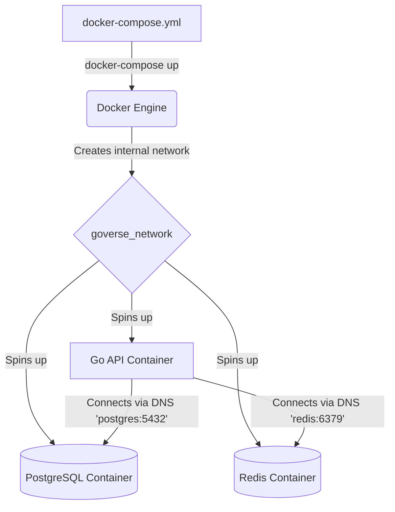

# Docker Compose for Go Environments

## 1. Learning Objectives
* **What you'll learn**: How to orchestrate multiple interconnected Docker containers (Go API, PostgreSQL, Redis, Kafka) on a single machine using Docker Compose.
* **Why it matters**: Complex Go applications require databases, message brokers, and caches to run. Manually spinning up 5 separate containers with complex networking commands is tedious and error-prone. Docker Compose automates it in a single command.
* **Where it's used**: Local development environments and continuous integration (CI) test runners.

---

## 2. Real-world Story
Imagine directing a theater play. You need the Actors (Go Microservices), the Lighting Crew (PostgreSQL), and the Sound Team (Redis) to all show up at the exact same time and know how to talk to each other.
If you use pure `docker run`, you are personally calling each person one by one, giving them instructions, and connecting their headsets. 
**Docker Compose** is the Script. You hand the script to the theater manager, and instantly, everyone walks on stage, plugs in their headsets, and perfectly executes the play together.

---

## 3. Visual Learning (Execution Flow & Architecture)


---

## 4. Internal Working (Under the Hood)
When you run `docker-compose up`, Compose does three critical things:
1. **Custom Networking**: It creates an isolated, bridged virtual network. 
2. **Internal DNS**: It automatically maps the name of the service (e.g., `db`) to its internal IP address. Your Go app just connects to `postgres://user:pass@db:5432` and Docker resolves `db` magically!
3. **Dependency Ordering**: It ensures the database boots up *before* your Go application tries to connect to it.

---

## 5. Compiler Behavior
* **Live Reloading (Hot Reload)**: Because compiling a Go binary inside a Docker image takes time, developers often use tools like `Air` (`github.com/cosmtrek/air`) inside their `docker-compose.yml`. When you save a `.go` file on your host machine, Compose syncs the file into the container, Air detects it, instantly recompiles the Go binary, and restarts the server in 0.5 seconds!

---

## 6. Memory Management
* **Volume Mounts**: By default, data inside a container is ephemeral (destroyed when the container stops). To ensure your PostgreSQL data persists across reboots, Compose uses Volumes to map the container's hard drive directory to a safe, persistent folder on your host machine's RAM/Disk.

---

## 7. Code Examples

### 🔹 Example 1: Simple (The YAML File)
```yaml
# docker-compose.yml
version: '3.8'

services:
  api:
    build: .                 # Uses the Dockerfile in the current directory
    ports:
      - "8080:8080"          # Map host port 8080 to container port 8080
    environment:
      - DB_URL=postgres://goverse:pass@db:5432/mydb?sslmode=disable
    depends_on:
      - db                   # Wait for 'db' to start

  db:
    image: postgres:15-alpine
    environment:
      POSTGRES_USER: goverse
      POSTGRES_PASSWORD: pass
      POSTGRES_DB: mydb
    volumes:
      - pgdata:/var/lib/postgresql/data # Persist data!

volumes:
  pgdata:
```

### 🔹 Example 2: Intermediate (Live Reloading with Air)
```yaml
  api_dev:
    image: cosmtrek/air
    volumes:
      - ./:/app              # Mount your local code into the container!
    working_dir: /app
    ports:
      - "8080:8080"
    command: air             # Run the hot-reloader instead of a built binary
```

### 🔹 Example 3: Advanced (Healthchecks)
```yaml
# `depends_on` only checks if the container booted, not if Postgres is ready!
# Use healthchecks to ensure the Go app waits until Postgres can actually accept connections.
  db:
    image: postgres:15
    healthcheck:
      test: ["CMD-SHELL", "pg_isready -U goverse"]
      interval: 5s
      timeout: 5s
      retries: 5

  api:
    build: .
    depends_on:
      db:
        condition: service_healthy # Wait for pg_isready!
```

### 🔹 Example 4: Production (Environment Files)
```yaml
# NEVER hardcode passwords in the YAML file. Use a .env file!
  db:
    image: postgres:15
    env_file:
      - .env.production
```

### 🔹 Example 5: Interview
```yaml
# Q: How does the Go container talk to the Postgres container?
# A: Via Docker's internal DNS resolver. The service name 'db' acts as the hostname. 
# The Go app connects to 'db:5432' instead of 'localhost:5432'.
```

---

## 8. Production Examples
1. **End-to-End Testing**: In GitHub Actions, you can run `docker-compose up -d` to instantly boot an entire mock cluster (Go API, Redis, Postgres), run your integration tests against it, and then run `docker-compose down` to cleanly wipe it all out.
2. **Seeding Databases**: You can mount a `/init.sql` script into the Postgres container. Compose will automatically execute it on boot, seeding your local environment with mock data!

---

## 9. Performance & Benchmarking
* **Resource Limits**: A rogue Go container with a memory leak can freeze your entire laptop. Compose allows you to strictly limit CPU and RAM usage.
```yaml
  api:
    deploy:
      resources:
        limits:
          cpus: '0.50'
          memory: 512M
```

---

## 10. Best Practices
* ✅ **Do**: Use `docker-compose up -d` (Detached mode) so it runs in the background. You can view logs later via `docker-compose logs -f api`.
* ❌ **Don't**: Use Docker Compose for Production orchestration. It is meant for local dev and single-server deployments. For multi-server production, use Kubernetes!
* 🏢 **Google / Uber / Netflix Style**: Provide a `docker-compose.yml` in the root of every Go repository so a brand new engineer can clone the repo, run `docker-compose up`, and have the entire app running locally in under 3 minutes.

---

## 11. Common Mistakes
1. **Using 'localhost'**: Inside the Go container, `localhost` refers to the container itself, NOT your laptop! If you try to connect to a database using `localhost:5432`, the Go app will fail, because Postgres is in a different container on the Docker network.
2. **Orphaned Volumes**: Running `docker-compose down` does NOT delete your persistent data volumes. If your database gets corrupted locally, you must run `docker-compose down -v` to aggressively destroy the volumes and start fresh.

---

## 12. Debugging
How to troubleshoot Compose networks:
* **Network Inspection**: Run `docker network inspect <project>_default`. It will output a JSON array showing the exact internal IP addresses assigned to your Go API and your Database.

---

## 13. Exercises
1. **Easy**: Create a `docker-compose.yml` that boots a single Redis container on port 6379.
2. **Medium**: Add a Go API service to the file that connects to the Redis container using the service name.
3. **Hard**: Implement a volume mount so that your Go source code changes reflect instantly inside the container without rebuilding the image.
4. **Expert**: Add a Postgres container with a `healthcheck` and force the Go API to wait until Postgres is healthy before booting.

---

## 14. Quiz
1. **MCQ**: What is the primary function of Docker Compose?
   * (A) To compile Go code faster (B) To orchestrate multi-container environments declaratively (C) To scale across 1,000 servers. *(Answer: B)*
2. **Code Review**: `volumes: - ./data:/var/lib/postgresql/data`. Why is mounting a database to a local host directory `./data` (Bind Mount) often much slower on Mac/Windows than using a Named Volume? *(Because the file I/O has to constantly cross the translation boundary between the Mac OS and the hidden Linux VM! Named Volumes live purely inside Linux, making them 10x faster).*

---

## 15. FAANG Interview Questions
* **Beginner**: Explain the difference between `docker build`, `docker run`, and `docker-compose`.
* **Intermediate**: How do two containers on a custom bridge network communicate securely?
* **Senior (Google/Meta)**: Architect a local development environment for a 50-microservice architecture. Running all 50 in Compose will melt the laptop. How do you allow a developer to run 1 service locally but route its dependencies to a shared cloud cluster? (Hint: Telepresence).

---

## 16. Mini Project
**The Full-Stack Sandbox**
* Write a `docker-compose.yml`.
* Service 1: `postgres:15`
* Service 2: `redis:7`
* Service 3: Your Go API.
* Write a Go endpoint `/stats` that increments a counter in Redis, saves an audit log in Postgres, and returns JSON.
* Ensure you can boot the entire stack from scratch with one command.

---

## 17. Enterprise Features & Observability
* **Profiles**: Compose supports "Profiles". You can tag services as `profile: ["debug"]`. Running `docker-compose up` boots the core app. Running `docker-compose --profile debug up` boots the app PLUS heavy monitoring tools like Prometheus and Grafana locally!

---

## 18. Source Code Reading
Walkthrough of `docker-compose` internals.
* **The YAML Parser**: Compose is written in Go! It parses the YAML into Go structs and translates them directly into Docker Engine API calls via the Docker Go SDK.

---

## 19. Architecture
* **The Compose Spec**: The structure of `docker-compose.yml` is now an open standard (The Compose Specification). It is no longer just for Docker—tools like Amazon ECS can read your Compose file and instantly deploy it to AWS!

---

## 20. Summary & Cheat Sheet
* **Up**: `docker-compose up -d`
* **Down**: `docker-compose down -v`
* **Logs**: `docker-compose logs -f`
* **Network**: Services communicate via internal DNS (Service Name).
