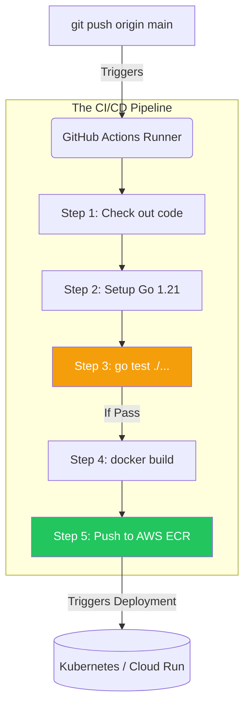

# GitHub Actions (CI/CD)

## 1. Learning Objectives
* **What you'll learn**: How to automate the testing, building, and deployment of Go applications using GitHub Actions CI/CD pipelines.
* **Why it matters**: Humans make mistakes. If a human manually compiles a Go binary and uploads it to a server, they might compile it for macOS instead of Linux, or forget to run the unit tests. CI/CD mathematically guarantees that only perfectly tested, identically built code reaches production.
* **Where it's used**: Every modern software repository. CI/CD is the heartbeat of DevOps.

---

## 2. Real-world Story
Imagine a car manufacturing plant. 
Without CI/CD, an engineer builds a car by hand. They might forget to install the seatbelts, and the car ships to the customer broken.
With CI/CD (The Assembly Line), when the engineer submits a blueprint (Git Push), a robot automatically builds the car, crashes it into a wall to test the seatbelts (Unit Tests), paints it perfectly (Docker Build), and ships it to the dealership (Deploy). If the seatbelt fails, the robot stops the assembly line and rejects the blueprint!

---

## 3. Visual Learning (Execution Flow & Architecture)


---

## 4. Internal Working (Under the Hood)
When you push code, GitHub provisions a temporary Virtual Machine (The Runner) in the cloud (usually Ubuntu Linux). 
The Runner downloads your `.github/workflows/main.yml` file and executes the terminal commands exactly as you wrote them. 
Because the Runner is a completely fresh, sterile VM every time, it eliminates all local caching bugs. It proves definitively: "If this code builds here, it will build anywhere."

---

## 5. Compiler Behavior
* **Caching the Go Modules**: Compiling Go code in a fresh VM every time means downloading `go.mod` dependencies from scratch, which takes 30 seconds. You must utilize the `actions/cache` step to persist the `GOPATH/pkg/mod` folder between workflow runs, reducing build times to 2 seconds!

---

## 6. Memory Management
* **Parallel Matrices**: If you need to test your Go code against Go 1.20, 1.21, and 1.22, you don't run them sequentially (taking 15 minutes). GitHub Actions uses a Matrix Strategy to provision 3 separate VMs simultaneously, testing all versions in parallel (taking 5 minutes total!).

---

## 7. Code Examples

### 🔹 Example 1: Simple (The CI Pipeline)
```yaml
# .github/workflows/ci.yml
name: Go CI

on:
  push:
    branches: [ "main" ]
  pull_request:
    branches: [ "main" ]

jobs:
  test:
    runs-on: ubuntu-latest
    steps:
    - uses: actions/checkout@v3

    - name: Set up Go
      uses: actions/setup-go@v4
      with:
        go-version: '1.21'
        cache: true # Automatically caches go modules!

    - name: Run Tests
      run: go test -v -race -cover ./...
```

### 🔹 Example 2: Intermediate (Docker Build & Push)
```yaml
    - name: Log in to Docker Hub
      uses: docker/login-action@v2
      with:
        username: ${{ secrets.DOCKER_USERNAME }}
        password: ${{ secrets.DOCKER_PASSWORD }}

    - name: Build and push Docker image
      uses: docker/build-push-action@v4
      with:
        context: .
        push: true
        tags: myuser/goverse-api:${{ github.sha }}
```

### 🔹 Example 3: Advanced (Conditionals)
```yaml
    # ONLY run the deployment step if the tests pass AND we are on the main branch!
    - name: Deploy to Staging
      if: github.ref == 'refs/heads/main'
      run: ./scripts/deploy.sh
```

### 🔹 Example 4: Production (OIDC Authentication)
```yaml
# Never store AWS long-lived Access Keys in GitHub Secrets!
# Use OpenID Connect (OIDC). GitHub Actions dynamically assumes an AWS IAM Role 
# for 1 hour, making credential theft impossible!
permissions:
  id-token: write # Required for OIDC!
  contents: read

steps:
  - name: Configure AWS Credentials
    uses: aws-actions/configure-aws-credentials@v2
    with:
      role-to-assume: arn:aws:iam::1234567890:role/GitHubActionRole
      aws-region: us-east-1
```

### 🔹 Example 5: Interview
```yaml
# Q: How do you prevent a bad Pull Request from being merged into main?
# A: Branch Protections! In GitHub settings, you require the 'Go CI / test' workflow 
# to pass successfully. If `go test` exits with code 1, the "Merge" button physically turns grey and locks.
```

---

## 8. Production Examples
1. **Linting**: Before running tests, run `golangci-lint`. It acts as an automated Senior Engineer, rejecting the Pull Request if it detects unused variables, shadow variables, or poor formatting.
2. **Security Scanning**: Run `govulncheck` to automatically scan your `go.mod` dependencies against the official Go Vulnerability Database. Reject the build if a Critical CVE is found in a third-party package!

---

## 9. Performance & Benchmarking
* **The Race Detector**: ALWAYS run `go test -race` in your CI pipeline! The Go Race Detector catches concurrent memory mutations. It slows down the tests by 3x, but CI is the perfect place to pay this performance penalty to mathematically guarantee thread safety before production.

---

## 10. Best Practices
* ✅ **Do**: Use `${{ github.sha }}` (The unique git commit hash) as your Docker Image tag! Never use `latest`. If you use the hash, you always know exactly which line of code is running in production.
* ❌ **Don't**: Store production database passwords in plain text in the YAML file! Use GitHub Secrets (`${{ secrets.DB_PASS }}`).
* 🏢 **Google / Uber / Netflix Style**: Use **Reusable Workflows**. Instead of copy-pasting the `go test` YAML into 50 different microservice repositories, create one central `.github/workflows/shared-go.yml` and have all 50 repos reference it dynamically.

---

## 11. Common Mistakes
1. **Flaky Tests**: If a test fails 10% of the time (usually due to a bad `time.Sleep` in a concurrent test), developers will learn to ignore it and just click "Re-run Job". This destroys trust in the CI pipeline. Fix flaky tests instantly or delete them.
2. **Missing `actions/checkout`**: Forgetting Step 1! If you don't use the checkout action, the Ubuntu VM will be completely empty. `go test` will fail because your source code isn't actually on the machine!

---

## 12. Debugging
How to troubleshoot GitHub Actions:
* **Tmate SSH**: If a complex bash script keeps failing in CI but works locally, you can use the `mxschmitt/action-tmate` step. It pauses the CI pipeline and generates an SSH key, allowing you to literally SSH into the GitHub Actions Ubuntu VM and debug it live in your terminal!

---

## 13. Exercises
1. **Easy**: Create a `.github/workflows/main.yml` file that prints "Hello GoVerse" using the `run: echo` command.
2. **Medium**: Add steps to setup Go 1.21 and run `go build main.go`.
3. **Hard**: Add a step that uses the official Docker action to build the Dockerfile.
4. **Expert**: Configure a Matrix strategy to run your tests across Go 1.20, 1.21, and 1.22 on both `ubuntu-latest` and `windows-latest` simultaneously!

---

## 14. Quiz
1. **MCQ**: What happens if a command in a step exits with a non-zero status code (e.g., `exit 1`)?
   * (A) It ignores it (B) It runs the next step (C) The entire Workflow instantly fails and halts. *(Answer: C)*
2. **System Design Follow-up**: Why is it highly recommended to use `go mod download` instead of `go get` in a CI/CD pipeline? *(Because `go get` can modify `go.mod` and upgrade packages. CI must be strictly reproducible and only test exactly what is in the lockfile (`go.sum`). Use `go mod download` or `go test -mod=readonly`).*

---

## 15. FAANG Interview Questions
* **Beginner**: Explain what CI and CD stand for.
* **Intermediate**: How do you securely inject a Database Password into a CI/CD pipeline?
* **Senior (Google/Meta)**: Explain a Blue/Green deployment pipeline. How does the CD pipeline switch live traffic between the old version and the new version without a single dropped packet?

---

## 16. Mini Project
**The Bulletproof Pipeline**
* Write a Go function and a Unit Test.
* Create a GitHub Action that runs `golangci-lint`.
* If it passes, run `go test -race -cover`.
* If coverage is below 80%, use a bash script to fail the pipeline (`exit 1`).
* Intentionally break the code, push to Git, and watch the red X appear on GitHub!

---

## 17. Enterprise Features & Observability
* **Self-Hosted Runners**: GitHub provides shared Ubuntu VMs. For enterprise compliance, companies install the GitHub Runner agent on their own private AWS EC2 instances, allowing the CI pipeline to securely access private internal databases without exposing them to the internet!

---

## 18. Source Code Reading
Walkthrough of `actions/checkout`.
* **TypeScript / Node.js**: Believe it or not, almost all custom GitHub Actions (the `uses:` steps) are written in TypeScript! Read the source code of `actions/setup-go` to see how it dynamically downloads the Go tarball from Google's servers and manipulates the `$PATH`.

---

## 19. Architecture
* **GitOps vs Push CD**: Modern CD (Continuous Deployment) is shifting. Instead of GitHub Actions pushing to K8s (`kubectl apply`), GitHub Actions just updates the Docker Image tag in Git. A tool inside K8s (ArgoCD) pulls the change automatically. This is called GitOps.

---

## 20. Summary & Cheat Sheet
* **CI**: Continuous Integration (Testing/Building).
* **CD**: Continuous Deployment (Shipping to Prod).
* **Runner**: The ephemeral VM executing the steps.
* **Golden Rule**: If the pipeline is red, nobody merges!
