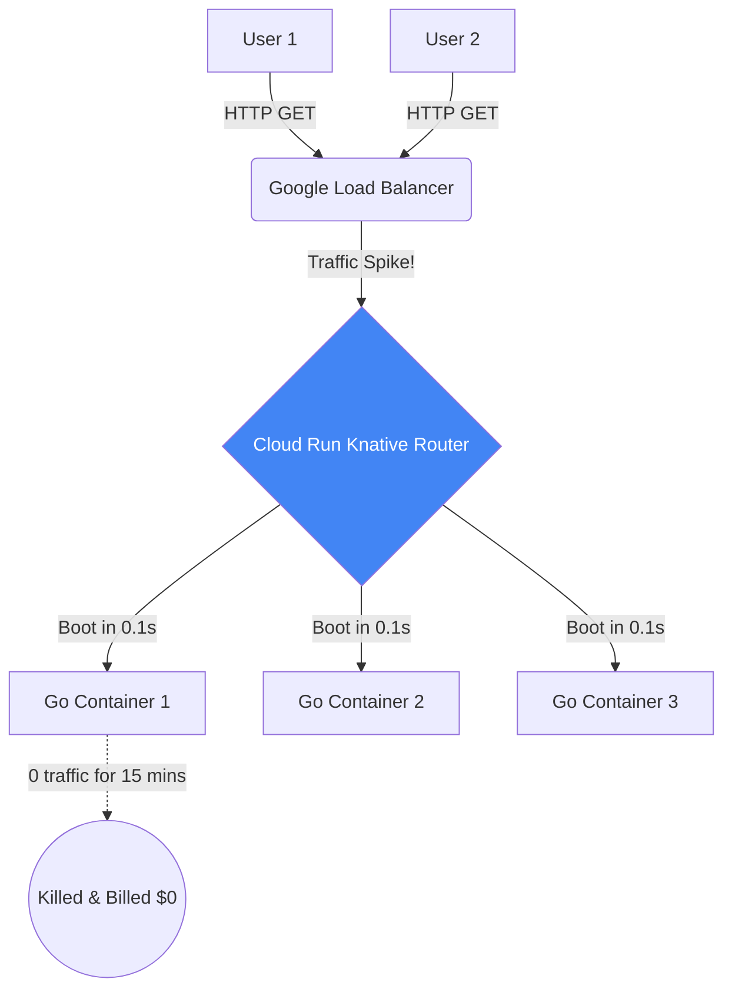

# Serverless Go (Google Cloud Run)

## 1. Learning Objectives
* **What you'll learn**: How to deploy Go containers to Serverless platforms like Google Cloud Run, allowing infinite scalability and scale-to-zero billing.
* **Why it matters**: Kubernetes is incredibly powerful, but it requires managing servers, upgrades, and complex YAML. Cloud Run handles all infrastructure for you. You just provide a Docker image, and Google gives you an HTTPS URL.
* **Where it's used**: Startups, API microservices, background task processing, and any workload with highly unpredictable burst traffic.

---

## 2. Real-world Story
Imagine owning a bakery. 
With Kubernetes (Traditional Server), you pay the baker $20/hour to stand there. If no customers show up, you lose money. If 1,000 customers show up, the baker is overwhelmed, and you have to hire 10 more bakers (Autoscaling), which takes 5 minutes.
With Cloud Run (Serverless), bakers are magical. You pay them $0. When a customer walks in, a baker instantly materializes from thin air, hands them a cupcake, charges you $0.001, and vanishes. If 1,000 customers walk in, 1,000 bakers instantly materialize!

---

## 3. Visual Learning (Execution Flow & Architecture)


---

## 4. Internal Working (Under the Hood)
Cloud Run is built on an open-source Kubernetes extension called **Knative**.
1. You push a Docker container to Google Container Registry (GCR).
2. You deploy it to Cloud Run.
3. Google provisions an inactive networking route. 
4. When an HTTP request hits the route, Google's proprietary Sandbox (gVisor) boots your Docker container securely in milliseconds, proxies the request, and shuts it down when traffic drops to zero.

---

## 5. Compiler Behavior
* **The "Cold Start" Advantage**: This is why Go is the King of Serverless. A Java Spring Boot application takes 10 seconds to start. If a user hits a cold Cloud Run instance, they stare at a blank screen for 10 seconds. A compiled Go binary boots in ~20 milliseconds. The user never even notices they hit a cold start!

---

## 6. Memory Management
* **Statelessness is Mandatory**: Because Google can instantly kill your container at any moment to scale down, you CANNOT store user sessions or uploaded images on the local disk or in RAM! Every Go HTTP request must read/write to an external database (Postgres) or cache (Redis/Memcached).

---

## 7. Code Examples

### 🔹 Example 1: Simple (The Go App)
```go
// Cloud Run requires your Go app to listen on a specific port provided by the OS.
func main() {
    port := os.Getenv("PORT")
    if port == "" {
        port = "8080" // Default for local dev
    }

    http.HandleFunc("/", func(w http.ResponseWriter, r *http.Request) {
        fmt.Fprint(w, "Hello from Serverless Go!")
    })

    log.Printf("Listening on port %s", port)
    log.Fatal(http.ListenAndServe(":"+port, nil))
}
```

### 🔹 Example 2: Intermediate (The Deployment)
```bash
# 1. Build and push the Docker image via Google Cloud Build
gcloud builds submit --tag gcr.io/my-project/goverse-api

# 2. Deploy to Cloud Run instantly!
gcloud run deploy goverse-api \
  --image gcr.io/my-project/goverse-api \
  --platform managed \
  --region us-central1 \
  --allow-unauthenticated
```

### 🔹 Example 3: Advanced (Concurrency Tuning)
```bash
# Unlike AWS Lambda (which only allows 1 request per container), 
# Cloud Run allows 1 Go container to handle 80 concurrent requests by default!
# Since Go handles concurrency perfectly via Goroutines, you can maximize this to save money!
gcloud run deploy goverse-api \
  --concurrency 250 \
  --cpu 1 \
  --memory 512Mi
```

### 🔹 Example 4: Production (Cloud SQL Connection)
```go
// Connecting to a managed database in Cloud Run requires connecting via 
// Google's internal Unix Socket, not a standard TCP port!
dbURI := fmt.Sprintf("host=/cloudsql/%s user=%s password=%s dbname=%s",
    os.Getenv("INSTANCE_CONNECTION_NAME"),
    os.Getenv("DB_USER"),
    os.Getenv("DB_PASS"),
    os.Getenv("DB_NAME"),
)
db, err := sql.Open("pgx", dbURI)
```

### 🔹 Example 5: Interview
```go
// Q: Can you run a background Goroutine in Cloud Run after returning the HTTP response?
// A: NO! The millisecond you call `w.Write()` and return the HTTP response, 
// Google severely throttles the CPU to exactly 0%. Your background Goroutine will freeze 
// and only resume when the NEXT HTTP request wakes the container up! (Use Cloud Tasks instead).
```

---

## 8. Production Examples
1. **Webhooks**: Stripe sends you a webhook. You get 0 webhooks at 3 AM, and 10,000 at 9 AM. Cloud Run scales to 0 at 3 AM (Cost = $0), and scales to 500 containers at 9 AM effortlessly.
2. **PDF Generation**: A heavy CPU task. Instead of blocking your main API, you offload the job to a dedicated Cloud Run service that spins up exactly when needed and dies after generating the PDF.

---

## 9. Performance & Benchmarking
* **CPU Allocation**: Cloud Run only bills you for CPU time while an HTTP request is actively being processed (rounded to the nearest 100 milliseconds). If your Go app takes 50ms to return JSON, you are billed an incredibly microscopic amount of money.

---

## 10. Best Practices
* ✅ **Do**: Optimize your `main()` initialization. Initialize database connection pools and parse templates *before* calling `http.ListenAndServe`. Go will execute this during the Cold Start boot phase.
* ❌ **Don't**: Rely on background `time.Ticker` loops. As mentioned, the CPU is paused between HTTP requests.
* 🏢 **Google / Uber / Netflix Style**: Use **Google Cloud Tasks**. If an HTTP request needs to send an email, put the task in Cloud Tasks and instantly return 200 OK. Cloud Tasks will make a separate HTTP call to your Cloud Run worker securely in the background.

---

## 11. Common Mistakes
1. **Fat Docker Images**: Pushing a 1GB Docker image to Cloud Run. When a cold start happens, Google has to download that 1GB image across the network before booting it. Use Distroless Go images (~20MB) to achieve sub-second cold starts.
2. **Connection Pool Exhaustion**: If Cloud Run suddenly scales to 1,000 containers due to a viral tweet, and each container has a Go pool of `MaxOpenConns=10`, they will hit Postgres with 10,000 connections instantly, crashing the database. Always use PgBouncer or Cloud SQL Auth Proxy when pairing Serverless with relational DBs.

---

## 12. Debugging
How to troubleshoot Cloud Run in production:
* **Cloud Logging**: All `fmt.Println` and `log.Fatal` output from your Go app is automatically ingested into Google Cloud Logging. You can search across 10,000 ephemeral containers simultaneously using structured JSON queries.

---

## 13. Exercises
1. **Easy**: Write a Go HTTP server that reads the `PORT` environment variable.
2. **Medium**: Dockerize it using a Multi-stage build to ensure it's under 20MB.
3. **Hard**: Install the `gcloud` CLI locally and deploy it to a free Cloud Run project.
4. **Expert**: Implement an endpoint that sleeps for 5 seconds. Hit it with `hey` or `wrk` with 100 concurrent connections. Watch the Google Cloud Console dynamically spin up multiple container revisions!

---

## 14. Quiz
1. **MCQ**: What happens to your Go container's CPU immediately after sending an HTTP response?
   * (A) It runs at 10% (B) It is instantly throttled to near 0% (C) It continues running background Goroutines normally. *(Answer: B. This is why Serverless is cheap, but it kills background tasks!)*
2. **System Design Follow-up**: Why does Cloud Run strictly require your Go server to listen on `0.0.0.0` and not `localhost`? *(Because the Google Load Balancer lives outside the container on the network, it must route traffic into the container's external network interface (`0.0.0.0`). Listening on localhost isolates the app to the container's internal loopback, making it unreachable).*

---

## 15. FAANG Interview Questions
* **Beginner**: What is the "Cold Start" problem?
* **Intermediate**: Contrast Google Cloud Run (Container-based) with AWS Lambda (Function-based). Why does Cloud Run's concurrency model make it vastly cheaper for Go applications?
* **Senior (Google/Meta)**: Architect a highly resilient, globally distributed backend using Serverless. How do you handle regional outages and database replication latency when using stateless containers?

---

## 16. Mini Project
**The Serverless Image Resizer**
* Write a Go app that accepts an image via `POST`, resizes it using standard library `image`, and returns the bytes.
* Deploy to Cloud Run.
* Send an image. Wait 20 minutes (force a scale-to-zero).
* Send another image. Measure the complete round-trip latency to prove that the Go Cold Start is nearly imperceptible.

---

## 17. Enterprise Features & Observability
* **Traffic Splitting**: Cloud Run natively supports A/B testing. You can deploy version 2 of your Go app and tell the router: "Send 90% of traffic to V1, and 10% to V2." If V2 error rates spike in Google Cloud Monitoring, you revert to 100% V1 instantly.

---

## 18. Source Code Reading
Walkthrough of `Knative Serving`.
* **The Autoscaler**: While Google keeps gVisor proprietary, the Knative Autoscaler (KPA) is open source (and written in Go!). Study how it monitors incoming HTTP request rates and mathematically calculates exactly how many Pods need to be booted.

---

## 19. Architecture
* **Eventarc Integration**: Cloud Run isn't just for HTTP. You can wire it to Google Pub/Sub. When a file is uploaded to Cloud Storage, it fires a Pub/Sub event, which instantly boots your Go Cloud Run container via an internal HTTP `POST` to process the file!

---

## 20. Summary & Cheat Sheet
* **Paradigm**: Serverless, scale-to-zero HTTP containers.
* **Go Advantage**: Millisecond cold starts.
* **Rule 1**: Absolute statelessness.
* **Rule 2**: No background processing after HTTP return.
