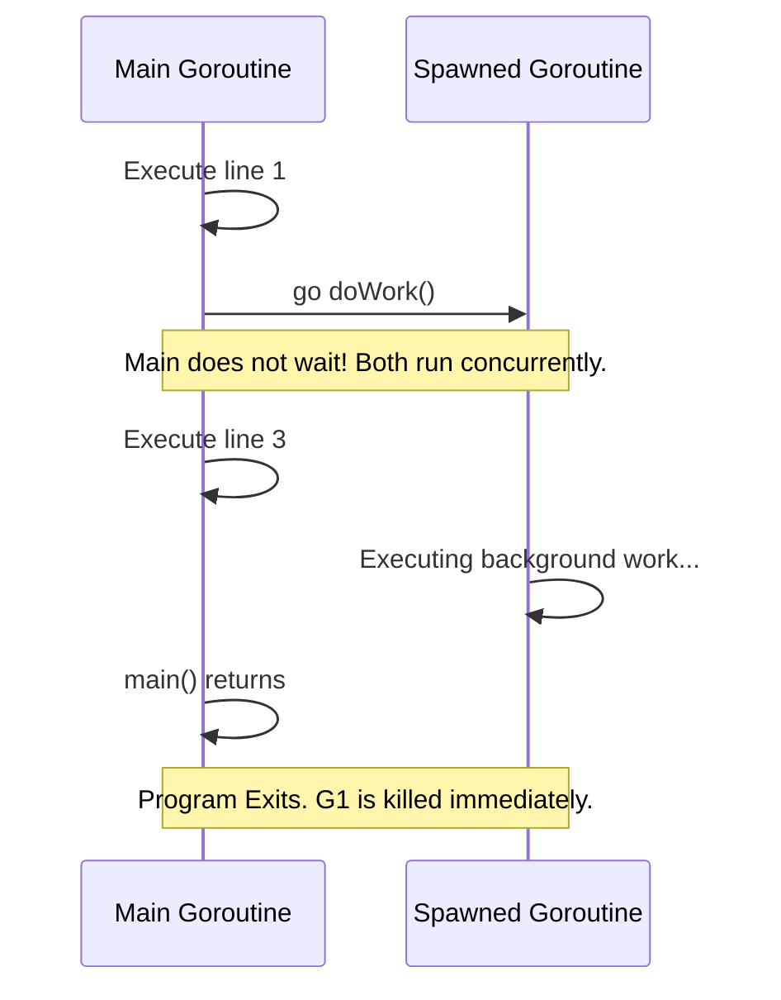

# 01 - Introduction to Concurrency in Go

## 🎯 Learning Objectives
* Understand what a Goroutine is.
* Learn how to launch a concurrent task using the `go` keyword.
* Grasp the concept of non-blocking execution.

## 🚦 Prerequisites
* Basic understanding of Go functions.
* Familiarity with the `fmt` and `time` packages.

---

## ☕ Real-World Analogy: The Coffee Shop

Imagine you run a small coffee shop.
* **Sequential (No Concurrency)**: You take an order, grind the beans, brew the espresso, steam the milk, serve the customer, and *only then* turn to the next customer in line. The line gets incredibly long.
* **Concurrent (Go)**: You take an order and hand the ticket to a barista (a Goroutine). You immediately turn back to the register to take the next customer's order. Multiple coffees are being made simultaneously in the background.

---

## 🧠 Concept Overview

In Go, concurrency is a first-class citizen. Instead of explicitly creating heavyweight OS threads (like in Java or C++), you create **Goroutines**. 

A Goroutine is a function that runs independently and concurrently with other functions. It is managed by the Go runtime, not the operating system, making it incredibly lightweight (starting at just ~2KB of memory).

---

## ⚙️ Internal Working

When a Go program starts, the `main()` function itself runs in a Goroutine, known as the **Main Goroutine**.
When you use the `go` keyword in front of a function call, Go immediately schedules that function to run on a new Goroutine, and the current Goroutine instantly moves to the next line of code without waiting for the new one to finish.

### ⚠️ The Catch
If the Main Goroutine finishes its execution and exits, **all other Goroutines are immediately terminated**, even if they haven't finished!

---

## 📊 Visual Diagram: Execution Flow



---

## 💻 Code Examples

### 1. Beginner Example: The `go` keyword
```go
package main

import (
	"fmt"
	"time"
)

func sayHello() {
	fmt.Println("Hello from the Goroutine!")
}

func main() {
	// Start a new Goroutine
	go sayHello()

	// Wait briefly so the Main Goroutine doesn't exit before sayHello finishes
	time.Sleep(100 * time.Millisecond)
	fmt.Println("Hello from main!")
}
```

### 2. Intermediate Example: Anonymous Goroutines
You don't need to define a named function to use a Goroutine. You can use anonymous functions (closures).

```go
package main

import (
	"fmt"
	"time"
)

func main() {
	msg := "Processing data..."
	
	// Launching an anonymous Goroutine
	go func(m string) {
		fmt.Println("Background Task:", m)
	}(msg) // Pass the variable explicitly to avoid closure scoping bugs

	time.Sleep(50 * time.Millisecond)
}
```

### 3. Production Example: Fire and Forget Logging
In production, you might want to log analytics data without slowing down an HTTP response to a user.

```go
package main

import (
	"fmt"
	"time"
)

// A mocked production function
func handleUserLogin(userID string) {
	fmt.Println("User logged in successfully!")
	
	// Fire and forget: send analytics concurrently so the user isn't kept waiting
	go trackAnalyticsEvent("USER_LOGIN", userID)
}

func trackAnalyticsEvent(event string, userID string) {
	// Simulating a slow network request to an analytics server
	time.Sleep(2 * time.Second)
	fmt.Printf("Analytics: Recorded %s for %s\n", event, userID)
}

func main() {
	handleUserLogin("user_123")
	
	// Simulating the server staying alive
	time.Sleep(3 * time.Second)
}
```

---

## 🚨 Common Mistakes

1. **Not waiting for Goroutines to finish**: The most common mistake for beginners is removing the `time.Sleep()` in `main()`, which causes the program to exit before the Goroutine prints anything. *(Note: We will learn a better way to wait using `sync.WaitGroup` in Chapter 9).*
2. **Loop Variable Capture**: Launching Goroutines inside a `for` loop and referencing the loop index directly. The index might change before the Goroutine executes. Always pass the variable as an argument to the Goroutine.

---

## ⚡ Performance Notes
Because Goroutines are so cheap (2KB), it is common and safe for a Go application to have tens or hundreds of thousands of Goroutines running concurrently. You cannot do this with OS threads without crashing your system.

---

## 🎤 Interview Questions

**Q: What happens to running Goroutines when the `main()` function returns?**
*Answer*: They are abruptly terminated. The Go runtime shuts down the program as soon as the main Goroutine completes, regardless of the state of any other Goroutines.

**Q: How much memory does a Goroutine take when initialized?**
*Answer*: Typically around 2KB, dynamically growing and shrinking as needed. This is much smaller than an OS thread, which typically starts around 1MB-2MB.

---

## 📝 Practice Exercises

**Exercise 1**: Write a program that launches 3 separate Goroutines, printing "Task 1", "Task 2", and "Task 3". Use `time.Sleep` to ensure they all print before the program exits. Notice the order they print in. Is it always the same?

**Exercise 2**: Fix the bug in this code so it prints 1, 2, 3 instead of 3, 3, 3:
```go
for i := 1; i <= 3; i++ {
    go func() {
        fmt.Println(i)
    }()
}
time.Sleep(1 * time.Second)
```

---

## 🔑 Key Takeaways
- Use the `go` keyword to run functions concurrently.
- Goroutines are lightweight, user-space threads.
- The program exits when the `main` Goroutine exits.
