# 02 - Why Concurrency?

## 🎯 Learning Objectives
* Understand the limitations of sequential execution.
* Distinguish between CPU-Bound and I/O-Bound tasks.
* Learn why modern software development heavily relies on concurrency.

## 🚦 Prerequisites
* Completion of `01-Introduction.md`.

---

## 🍔 Real-World Analogy: The Fast Food Kitchen

Imagine a fast-food restaurant with exactly one employee.
* **Sequential Processing**: The employee takes an order, cooks the burger, fries the potatoes, pours the drink, hands it to the customer, and only then speaks to the next customer. This is slow, and resources (like the deep fryer) sit idle while the employee is taking an order.
* **Concurrent Processing**: The restaurant hires a cashier, a grill cook, and a fry cook. While the cashier is taking an order, the grill cook is flipping burgers, and the fry cook is managing the fryer. Everything happens concurrently, drastically increasing throughput.

In software, your CPU cores are the employees, and functions/network requests are the tasks.

---

## 🧠 Concept Overview

In the early days of computing, processors got faster every year by increasing their clock speed (Moore's Law). Eventually, physics intervened (heat and power limits), and CPUs stopped getting significantly faster per core. Instead, manufacturers started putting *more cores* on a single chip.

To utilize modern multi-core processors, software must be written to do multiple things simultaneously.

### The Two Types of Tasks

1. **CPU-Bound Tasks**: Tasks that require heavy computation (e.g., video rendering, machine learning, cryptography, sorting large lists). The speed is limited by how fast the CPU can calculate.
2. **I/O-Bound Tasks**: Tasks that wait for input/output (e.g., waiting for a database query to return, downloading a file over the network, reading a file from a hard drive). The CPU is mostly sitting idle, just *waiting*.

**Concurrency shines incredibly bright in I/O-Bound tasks.** While one Goroutine is waiting for a database response, the Go runtime instantly swaps it out and lets another Goroutine process an incoming HTTP request.

---

## ⚙️ Internal Working

If you have a sequential program making three network requests that each take 1 second, the total time will be 3 seconds. The CPU is asleep for almost all of those 3 seconds.

By making those requests concurrently, they all wait on the network at the same time. The total execution time becomes slightly over 1 second, effectively utilizing the idle waiting time.

---

## 📊 Visual Diagram: Sequential vs Concurrent I/O

```mermaid
gantt
    title Sequential vs Concurrent I/O (Network Requests)
    dateFormat  s
    axisFormat %S
    
    section Sequential
    Req 1 (Wait) : 0, 1s
    Req 2 (Wait) : 1, 1s
    Req 3 (Wait) : 2, 1s
    
    section Concurrent
    Req A (Wait) : 0, 1s
    Req B (Wait) : 0, 1s
    Req C (Wait) : 0, 1s
```



*Notice how Concurrent execution overlaps the waiting periods, saving massive amounts of time.*

---

## 💻 Code Examples

### 1. Beginner Example: The Problem with Sequential Execution
Let's simulate downloading 3 files sequentially.

```go
package main

import (
	"fmt"
	"time"
)

func downloadFile(filename string) {
	fmt.Println("Downloading", filename)
	time.Sleep(1 * time.Second) // Simulate network delay
	fmt.Println("Finished", filename)
}

func main() {
	start := time.Now()
	
	downloadFile("file1.csv")
	downloadFile("file2.csv")
	downloadFile("file3.csv")
	
	fmt.Printf("Sequential took %v\n", time.Since(start)) 
	// Output: Sequential took ~3 seconds
}
```

### 2. Intermediate Example: The Power of Concurrency
Let's apply Goroutines to the same problem.

```go
package main

import (
	"fmt"
	"time"
)

func downloadFile(filename string) {
	fmt.Println("Downloading", filename)
	time.Sleep(1 * time.Second)
	fmt.Println("Finished", filename)
}

func main() {
	start := time.Now()
	
	go downloadFile("file1.csv")
	go downloadFile("file2.csv")
	go downloadFile("file3.csv")
	
	// Wait so the program doesn't exit prematurely
	time.Sleep(1200 * time.Millisecond)
	
	fmt.Printf("Concurrent took %v\n", time.Since(start))
	// Output: Concurrent took ~1.2 seconds!
}
```

### 3. Production Example: High-Throughput APIs
In a real-world backend, your service might need to fetch a user profile from a database AND fetch their recent orders from a microservice. Doing this sequentially slows down the API response time.

```go
// Psuedo-code for a real-world API handler
func GetUserDashboard(w http.ResponseWriter, r *http.Request) {
    // Start fetching data concurrently
    go fetchUserProfileFromDB()
    go fetchUserOrdersFromMicroservice()
    
    // (In later chapters, we will learn how to wait for these specific
    // tasks to finish and collect their results before returning the HTTP response)
}
```

---

## 🚨 Common Mistakes

1. **Using concurrency for EVERYTHING**: Concurrency has a slight overhead (creating the Goroutine, scheduling it). If you are just doing simple math (`2 + 2`), running it in a Goroutine will actually be *slower* than running it sequentially. Use concurrency for I/O bounds or heavy, parallelizable CPU workloads.

---

## 🎤 Interview Questions

**Q: Explain the difference between an I/O-bound task and a CPU-bound task.**
*Answer*: A CPU-bound task's speed is limited by the processor's calculation speed (e.g., encrypting a file). An I/O-bound task's speed is limited by waiting for input/output operations to complete (e.g., waiting for an HTTP response).

**Q: Why is concurrency particularly effective for I/O-bound tasks in Go?**
*Answer*: Because when a Goroutine makes an I/O request (like a network call), it blocks. The Go scheduler detects this block, safely parks the Goroutine, and immediately assigns a different, runnable Goroutine to the CPU. The CPU is never kept waiting.

---

## 📝 Practice Exercises

**Exercise 1**: Take a list of 5 URLs (you can use dummy strings). Write a program that iterates through the list and "fetches" them (using `time.Sleep(2 * time.Second)`). Measure the time it takes sequentially versus using the `go` keyword. 

---

## 🔑 Key Takeaways
- Multi-core processors require concurrent software to achieve maximum performance.
- Concurrency overlaps "waiting time," drastically speeding up I/O-bound applications.
- Not every task needs concurrency; very fast, simple tasks should remain sequential.
