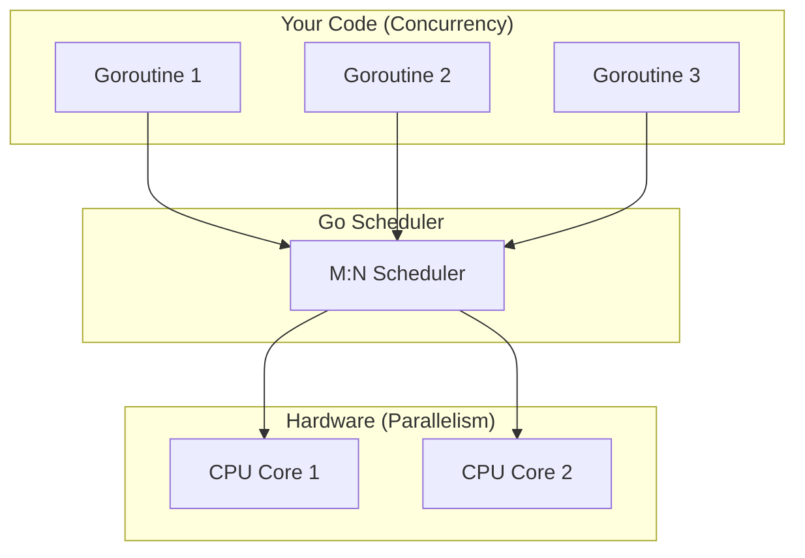

# Concurrency vs Parallelism

---

# Table of Contents

* Introduction
* Learning Objectives
* Prerequisites
* Why This Topic Exists
* Real-World Analogy
* Core Concepts
* Internal Runtime Explanation
* Memory Layout
* Architecture Diagram
* Step-by-Step Execution
* Syntax
* Beginner Example
* Intermediate Example
* Advanced Example
* Production Use Cases
* Performance Analysis
* Best Practices
* Common Mistakes
* Debugging Guide
* Exercises
* Quiz
* Interview Questions
* Mini Project
* Cheat Sheet
* Summary
* Key Takeaways
* Further Reading
* Next Chapter

---

# Introduction

Concurrency and parallelism are often used interchangeably, but they are fundamentally different concepts in computer science. 

**Concurrency** is about *dealing* with a lot of things at once. It's a way to structure a program by breaking it into independent pieces that can execute out of order without affecting the final outcome.
**Parallelism** is about *doing* a lot of things at once. It requires multiple physical CPU cores to execute tasks simultaneously at the exact same millisecond.

Go provides excellent concurrency out of the box, which *enables* parallelism when run on a multi-core machine.

---

# Learning Objectives

After completing this chapter you will be able to:

* Explain the difference between concurrency and parallelism confidently.
* Understand how the Go runtime maps concurrent Goroutines to parallel CPU cores.
* Build production-ready applications that utilize multiple cores.
* Debug common issues related to core exhaustion.
* Optimize performance using `runtime.GOMAXPROCS`.
* Answer interview questions distinguishing the two concepts.

---

# Prerequisites

Before reading this chapter you should know:

* Basic Go syntax
* The `go` keyword
* CPU vs I/O Bound tasks (from Chapter 02)

---

# Why This Topic Exists

Historically, developers struggled to write programs that could utilize multiple cores safely. Threading models in Java and C++ are heavily tied to parallelism, which requires manual locking, causing deadlocks and race conditions. 

Go introduced a paradigm shift: "Write concurrent code, and the runtime will automatically run it in parallel if hardware permits." This topic exists to clarify that you don't write "parallel code" in Go; you write concurrent code, and the Go scheduler handles the parallelism.

---

# Real-World Analogy

### The DJ at a Party

* **Sequential**: A DJ plays one song, waits for it to end, and then starts the next song.
* **Concurrency**: A DJ mixes two tracks. They load track B while track A is playing, adjust the EQ, and crossfade. The DJ is only doing one physical action at a microsecond level, but they are *managing* multiple tracks. (1 DJ = 1 CPU core).
* **Parallelism**: Two DJs on two separate turntables playing two completely different songs at the exact same time. (2 DJs = 2 CPU cores).

---

# Core Concepts

* **Concurrency**: A program structure. It's about composition.
* **Parallelism**: A program execution. It's about hardware.
* **Context Switching**: The process of the CPU pausing one task, saving its state, and resuming another. Concurrency relies on fast context switching.
* `GOMAXPROCS`: A Go runtime environment variable that dictates how many operating system threads (and thus, how many CPU cores) can execute Go code simultaneously.

---

# Internal Runtime Explanation

When you launch 1000 Goroutines on a machine with 1 CPU core, they run **concurrently**, not in parallel. The Go Scheduler gives Goroutine 1 a few milliseconds to run, then pauses it, and lets Goroutine 2 run. This happens so fast it *looks* parallel, but it's just rapid context switching.

When you launch 1000 Goroutines on a machine with 4 CPU cores, the Go Scheduler divides them. Now, 4 Goroutines are actually executing at the exact same physical millisecond. This is **parallelism enabled by concurrency**.

---

# Memory Layout

```text
+-------------------------------------------------------+
| Single Core Machine (Concurrency Only)                |
| CPU 1: [G1] -> [G2] -> [G1] -> [G3] -> [G2]           |
+-------------------------------------------------------+

+-------------------------------------------------------+
| Multi-Core Machine (Concurrency + Parallelism)        |
| CPU 1: [G1] -> [G3] -> [G1]                           |
| CPU 2: [G2] -> [G4] -> [G2]                           |
+-------------------------------------------------------+
```

---

# Architecture Diagram



---

# Step-by-Step Execution

Let's look at how the runtime executes a Go program:
1. `main()` starts. The runtime checks `runtime.NumCPU()` and sets `GOMAXPROCS` to that number.
2. The user code spawns 10 Goroutines using `go func()`.
3. The Scheduler places these 10 Goroutines into a Run Queue.
4. If `GOMAXPROCS` is 1, a single OS thread pulls Goroutines from the queue one by one.
5. If `GOMAXPROCS` is 4, four OS threads pull from the queue simultaneously.

---

# Syntax

To control hardware parallelism in Go, you use the `runtime` package:

```go
import "runtime"

// Get the number of logical CPUs
numCores := runtime.NumCPU()

// Limit Go to only use 1 Core (Disable Parallelism)
runtime.GOMAXPROCS(1) 
```

---

# Beginner Example

Demonstrating execution without parallelism (forcing 1 core).

```go
package main

import (
	"fmt"
	"runtime"
	"sync"
	"time"
)

func count(name string, wg *sync.WaitGroup) {
	defer wg.Done()
	for i := 1; i <= 3; i++ {
		fmt.Printf("%s: %d\n", name, i)
		time.Sleep(10 * time.Millisecond)
	}
}

func main() {
	// Force the program to run on ONLY 1 CPU core
	runtime.GOMAXPROCS(1)

	var wg sync.WaitGroup
	wg.Add(2)

	// These run concurrently, but NEVER in parallel
	go count("A", &wg)
	go count("B", &wg)

	wg.Wait()
}
```
**Output:** You will see A and B taking turns interleaving, handled by a single core.

---

# Intermediate Example

Demonstrating true parallelism.

```go
package main

import (
	"fmt"
	"runtime"
	"sync"
)

// A heavy CPU task
func calculatePrimes(name string, wg *sync.WaitGroup) {
	defer wg.Done()
	count := 0
	for i := 2; i < 50000; i++ {
		isPrime := true
		for j := 2; j*j <= i; j++ {
			if i%j == 0 {
				isPrime = false
				break
			}
		}
		if isPrime {
			count++
		}
	}
	fmt.Printf("%s found %d primes\n", name, count)
}

func main() {
	// Use all available cores (this is the default in modern Go)
	runtime.GOMAXPROCS(runtime.NumCPU())

	var wg sync.WaitGroup
	wg.Add(2)

	// Because these are CPU-bound and we have multiple cores,
	// they will execute in parallel at the exact same time.
	go calculatePrimes("Worker 1", &wg)
	go calculatePrimes("Worker 2", &wg)

	wg.Wait()
}
```

---

# Advanced Example

Detecting physical cores versus logical cores in cloud environments (Docker/Kubernetes). 
When running in Kubernetes, `runtime.NumCPU()` might return the Node's physical CPUs, not the container's quota. This is a massive production gotcha.

```go
package main

import (
	"fmt"
	"runtime"
	
	// Third-party package used heavily in production 
	// to respect container CPU limits
	// _ "go.uber.org/automaxprocs" 
)

func main() {
	// In production (Kubernetes), you shouldn't blindly trust runtime.NumCPU()
	// because it reports the HOST machine's CPU count, not the container limit.
	// We use automaxprocs to automatically set GOMAXPROCS to match Linux cgroups.
	
	fmt.Printf("Default CPU Cores seen by Go: %d\n", runtime.NumCPU())
	fmt.Printf("GOMAXPROCS set to: %d\n", runtime.GOMAXPROCS(0))
}
```

---

# Production Use Cases

### 1. Image Processing Pipeline
* **Architecture**: A web server receives image upload requests. Resizing images is heavily CPU-bound.
* **Benefits**: By allowing parallelism, a 16-core server can resize 16 different user profile pictures at the exact same time.

### 2. High-Frequency Trading Systems
* **Architecture**: Processing stock market ticks.
* **Benefits**: True parallelism ensures that multiple market feeds can be parsed simultaneously without one feed delaying another.

---

# Performance Analysis

* **CPU Usage**: Concurrency on a single core maxes out at 100% of 1 CPU. Parallelism on 4 cores can hit 400% CPU usage.
* **Context Switching Overhead**: If you launch 10,000 CPU-bound Goroutines on a 4-core machine, the Scheduler will waste massive amounts of time just context-switching between them. For CPU-bound tasks, you only want exactly as many Goroutines as you have cores.
* **Scalability**: I/O bound concurrency scales infinitely. CPU-bound parallelism scales linearly with hardware.

---

# Best Practices

* **Leave `GOMAXPROCS` alone**: By default, Go sets this to `runtime.NumCPU()`. Unless you are containerized, don't change it.
* **Container Awareness**: If deploying to Kubernetes/Docker, use Uber's `automaxprocs` to prevent CPU throttling.
* **Know your Bounds**: If your task is network-heavy, spawn 1000 Goroutines. If it's math-heavy, spawn Goroutines == Number of Cores.

---

# Common Mistakes

### 1. Assuming Concurrency = Speed for Math
```go
// BAD: Spawning 1000 Goroutines to do basic addition on a 4-core machine.
// The overhead of creating Goroutines is slower than just doing it sequentially.
for i := 0; i < 1000; i++ {
    go func(n int) {
        result := n * 2
    }(i)
}
```

---

# Debugging Guide

* **Trace**: Use `go tool trace` to visualize how your Goroutines are scheduled across multiple logical processors (P).
* **htop**: Use the Linux `htop` command to see if your Go binary is actually lighting up all available CPU cores.

---

# Exercises

## Beginner
Write a program that prints "Hello" and "World" using two Goroutines. Use `runtime.GOMAXPROCS(1)` to force them onto a single core.

## Intermediate
Write a script that calculates the factorial of numbers 1 to 500. Run it sequentially, and then run it using a Goroutine for each calculation. Measure the time difference.

## Advanced
Deploy a Go application inside a Docker container with `--cpus="2.0"`. Print `runtime.NumCPU()` inside the container. Observe the mismatch.

---

# Quiz

## Multiple Choice Questions
**1. What happens if you run 10 Goroutines on a machine with 1 CPU core?**
A) They run in parallel
B) They run concurrently via context switching
C) The program crashes
*Answer*: B

## True or False
**Parallelism is required to have Concurrency.**
*Answer*: False. You can have concurrency on a single-core machine.

---

# Interview Questions

## Beginner
**Q**: What is the difference between Concurrency and Parallelism?
*Answer*: Concurrency is about dealing with multiple things at once (structure). Parallelism is about doing multiple things at once (hardware execution).

## Intermediate
**Q**: What does `runtime.GOMAXPROCS` do?
*Answer*: It limits the number of operating system threads that can execute user-level Go code simultaneously.

## Google-Level Questions
**Q**: If you deploy a Go service to a Kubernetes pod with a CPU limit of `500m` (half a core), but the underlying EC2 node has 32 cores, what is the default `GOMAXPROCS`, and what production incident will this cause?
*Answer*: `GOMAXPROCS` will default to 32 (reading the host). The Go runtime will spawn 32 OS threads, fiercely fighting for CPU time. Kubernetes will mercilessly throttle the container because it exceeds the `500m` limit, causing massive latency spikes and potentially crashing the service. Fix this by using `automaxprocs`.

---

# Mini Project

**Requirement**: Build a multi-core Hash Cracker.
1. Create a target MD5 hash.
2. Spin up exactly `runtime.NumCPU()` Goroutines.
3. Divide a dictionary of passwords among the Goroutines.
4. Have them run in parallel to find the matching hash.

---

# Cheat Sheet

* **Concurrency**: Managing multiple tasks (Software).
* **Parallelism**: Executing multiple tasks simultaneously (Hardware).
* `runtime.NumCPU()`: Returns logical cores.
* `runtime.GOMAXPROCS(n)`: Sets the max number of parallel threads.

---

# Summary

Go's biggest strength is that it abstracts away the hardware. You structure your program concurrently using Goroutines, and the Go runtime automatically upgrades your program to run in parallel if the user's hardware has multiple CPU cores. 

---

# Key Takeaways

* ✔ Concurrency is design; Parallelism is execution.
* ✔ Goroutines run concurrently by default.
* ✔ `GOMAXPROCS` dictates hardware parallelism.
* ✔ CPU-bound tasks need multiple cores to be faster.
* ✔ Containerized Go apps need careful CPU limit management.

---

# Further Reading

* [Concurrency is not Parallelism by Rob Pike (Video)](https://www.youtube.com/watch?v=cN_DpYBzKso)
* Uber's automaxprocs documentation

---

# Next Chapter

➡️ **Next:** `04-Process-vs-Thread-vs-Goroutine.md`
