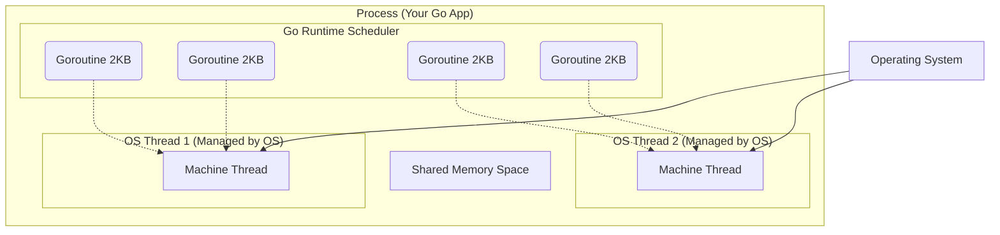

# Process vs Thread vs Goroutine

---

# Table of Contents

* Introduction
* Learning Objectives
* Prerequisites
* Why This Topic Exists
* Real-World Analogy
* Core Concepts
* Internal Runtime Explanation
* Memory Layout
* Architecture Diagram
* Step-by-Step Execution
* Syntax
* Beginner Example
* Intermediate Example
* Advanced Example
* Production Use Cases
* Performance Analysis
* Best Practices
* Common Mistakes
* Debugging Guide
* Exercises
* Quiz
* Interview Questions
* Mini Project
* Cheat Sheet
* Summary
* Key Takeaways
* Further Reading
* Next Chapter

---

# Introduction

To truly understand why Go is considered the king of modern backend concurrency, you must understand what it replaced. Before Go, concurrent systems were built using Operating System (OS) Processes or Threads. 

This chapter breaks down the evolution of execution models: from heavy **Processes**, to lighter **Threads**, and finally to Go's ultra-lightweight **Goroutines**.

---

# Learning Objectives

After completing this chapter you will be able to:

* Explain the difference between an OS Process, an OS Thread, and a Goroutine.
* Understand the memory and CPU costs associated with each model.
* Explain why Node.js, Java, and Go scale differently based on these models.
* Answer deep architectural interview questions.

---

# Prerequisites

Before reading this chapter you should know:

* Basic computer architecture (RAM, CPU).
* The difference between Concurrency and Parallelism (Chapter 03).

---

# Why This Topic Exists

Historically, languages mapped concurrency 1-to-1 with OS Threads (e.g., Java, C++). If a Java server received 10,000 concurrent HTTP requests, it had to spawn 10,000 OS Threads. This would immediately crash the server due to Memory Out-Of-Memory (OOM) errors and CPU Context-Switching overhead. 

Go invented Goroutines (user-space threads) to solve the C10K problem (handling 10,000 concurrent connections gracefully), allowing Go servers to handle millions of connections effortlessly.

---

# Real-World Analogy

### The Corporate Office

* **Process**: An entire corporate building. It has its own address, its own security, and its own plumbing. (Heavy, completely isolated).
* **OS Thread**: A department inside the building (e.g., HR, Engineering). They share the building's plumbing and electricity, but switching between departments requires walking down the hall and swiping a badge. (Medium weight, shares memory).
* **Goroutine**: Individual employees sitting at desks next to each other. They share the same coffee machine, pass notes instantly, and can switch tasks without leaving their chairs. (Ultra-lightweight, extremely fast communication).

---

# Core Concepts

### 1. Process
* An independent instance of a running program.
* Has its own isolated memory space.
* Very expensive to create and destroy.
* Communication between processes (IPC) is slow and complex.

### 2. OS Thread
* The smallest unit of processing scheduled by the Operating System.
* Exists *inside* a process. Threads share the process's memory.
* Fixed stack size (usually 1MB - 2MB).
* Creating 1,000 threads takes ~1-2 GB of RAM.

### 3. Goroutine
* A user-space thread managed entirely by the Go Runtime, not the OS.
* Dynamic stack size (starts at ~2KB and grows/shrinks as needed).
* Creating 1,000,000 Goroutines takes ~2 GB of RAM.

---

# Internal Runtime Explanation

When you launch a Goroutine, the Operating System has no idea it exists. The OS only sees the Go Binary (Process) and a small handful of OS Threads (usually equal to `runtime.NumCPU()`). 

The **Go Scheduler** lives inside your binary and multiplexes (maps) thousands of Goroutines onto those few OS Threads. If a Goroutine blocks (e.g., waiting for a database), the Go Scheduler instantly swaps it out for another Goroutine on the *same* OS Thread, preventing the OS from ever having to do an expensive context switch.

---

# Memory Layout

```text
+-----------------------------------------------------------+
| OS RAM                                                    |
|                                                           |
|  +--------------------+      +-------------------------+  |
|  | Process A (Chrome) |      | Process B (Go App)      |  |
|  | Isolated Memory    |      | Shared Memory           |  |
|  +--------------------+      |                         |  |
|                              | +--------+ +--------+   |  |
|                              | |Thread 1| |Thread 2|   |  |
|                              | | 1-2 MB | | 1-2 MB |   |  |
|                              | |        | |        |   |  |
|                              | | [G1]   | | [G4]   |   |  |
|                              | | [G2]   | | [G5]   |   |  |
|                              | | [G3]   | | [G6]   |   |  |
|                              | +--------+ +--------+   |  |
|                              +-------------------------+  |
+-----------------------------------------------------------+
* Note how multiple 2KB Goroutines [G1, G2] pack tightly inside an OS Thread.
```

---

# Architecture Diagram



---

# Step-by-Step Execution

1. You start your compiled Go app: The OS creates a **Process**.
2. The Go Runtime initializes: It asks the OS for `N` **OS Threads** (based on CPU cores).
3. You call `go doWork()`: The Runtime creates a 2KB **Goroutine**.
4. The Go Scheduler places the Goroutine on one of the available OS Threads.
5. The Goroutine executes natively on the CPU.

---

# Syntax

There is no syntax to manually create an OS Thread in Go. You can only create Goroutines.

```go
// Creates a Goroutine (2KB, User-space)
go calculate()
```

---

# Beginner Example

Demonstrating that you can spawn massive amounts of Goroutines without crashing your computer. (Do NOT try this with Java Threads).

```go
package main

import (
	"fmt"
	"time"
)

func main() {
	// Spawning 100,000 Goroutines
	for i := 0; i < 100000; i++ {
		go func(id int) {
			time.Sleep(1 * time.Second)
		}(i)
	}

	fmt.Println("Successfully launched 100,000 Goroutines!")
	time.Sleep(2 * time.Second)
}
```

---

# Intermediate Example

Understanding stack growth. A Goroutine starts at 2KB, but if you call deep recursive functions, the Go Runtime will automatically grow the stack.

```go
package main

import (
	"fmt"
)

// A deeply recursive function
func recursiveCall(depth int) {
	if depth == 0 {
		return
	}
	// The Go runtime will dynamically allocate more memory for this Goroutine
	// as the call stack gets deeper, preventing Stack Overflow errors!
	recursiveCall(depth - 1)
}

func main() {
	go recursiveCall(10000)
	fmt.Println("Deep recursion handled safely.")
}
```

---

# Advanced Example

If a Goroutine makes a CGO call (calling C code from Go), the Go Scheduler loses control of it. It becomes a blocking OS Thread operation.

```go
package main

/*
#include <unistd.h>
void blockingCFunction() {
    sleep(2); // Simulating a blocking C call
}
*/
import "C"
import "fmt"

func main() {
	fmt.Println("Calling C Code...")
	
	// When this Goroutine enters C code, the Go scheduler cannot pre-empt it.
	// It essentially locks up an OS Thread until the C code returns.
	go func() {
		C.blockingCFunction()
	}()
	
	fmt.Println("Done")
}
```

---

# Production Use Cases

### 1. Web Servers (HTTP/gRPC)
In Go, every incoming HTTP request automatically spawns a Goroutine. Because they are 2KB, a standard $5/month cloud server can handle tens of thousands of concurrent users easily.

### 2. IoT Data Ingestion
An IoT backend receiving MQTT messages from 500,000 sensors. Go can spawn a Goroutine for each sensor to maintain long-lived WebSocket/TCP connections.

---

# Performance Analysis

| Feature | OS Process | OS Thread | Goroutine |
| :--- | :--- | :--- | :--- |
| **Creation Cost** | Microseconds | Microseconds | Nanoseconds |
| **Memory Footprint** | Gigabytes/Megabytes | 1 MB - 2 MB | 2 KB |
| **Context Switch** | Heavy (OS Level) | Medium (OS Level) | Ultra-light (Go Runtime) |
| **Scaling Limit** | Dozens | Thousands | Millions |

---

# Best Practices

* **Don't fear spawning Goroutines**: If you need to make 5 independent database queries, spawn 5 Goroutines. 
* **Avoid CGO if possible**: Calling C code breaks the lightweight nature of the Go Scheduler and locks OS threads.
* **Don't leak Goroutines**: Even though they are small (2KB), an infinite loop Goroutine that never closes will eventually cause a memory leak.

---

# Common Mistakes

### Memory Leaking via Infinite Goroutines
```go
func handleConnection() {
    go func() {
        // MISTAKE: If this channel is never sent data, 
        // this 2KB Goroutine will hang in memory FOREVER.
        <-someChannel 
    }()
}
```
*Solution*: Always use Context timeouts or ensure channels are closed.

---

# Debugging Guide

* **pprof**: Use `go tool pprof` and look at the `goroutine` profile to see exactly how many Goroutines are currently running.
* **Trace**: `go tool trace` allows you to visually see Goroutines being multiplexed onto OS Threads.

---

# Exercises

## Beginner
Write a script that attempts to spawn 1,000,000 Goroutines that just do `time.Sleep(5 * time.Second)`. Monitor your computer's RAM usage (using Task Manager or Activity Monitor). 

## Intermediate
Write a script that prints the memory address of a variable inside a Goroutine, proving they share the same memory space.

---

# Quiz

## Multiple Choice Questions
**1. How much memory does a newly initialized Goroutine consume?**
A) 1 MB
B) 2 MB
C) 2 KB
D) 2 Bytes
*Answer*: C

## True or False
**The Operating System schedules Goroutines across CPU cores.**
*Answer*: False. The OS schedules Threads. The Go Runtime schedules Goroutines onto those Threads.

---

# Interview Questions

## Beginner
**Q**: Why are Goroutines better than OS Threads?
*Answer*: They consume significantly less memory (2KB vs 2MB), and context switching between them is handled entirely in user-space by the Go runtime, making it incredibly fast.

## Intermediate
**Q**: How does a Goroutine stack differ from an OS Thread stack?
*Answer*: An OS Thread has a fixed-size stack (typically 2MB). A Goroutine has a dynamic, growable stack that starts at 2KB and grows as needed.

## Google-Level Questions
**Q**: What happens to the OS Thread if a Goroutine executes a blocking Syscall (like reading a file from disk)?
*Answer*: The OS Thread is blocked by the Operating System. The Go Scheduler detects this, detaches the remaining runnable Goroutines from that blocked Thread, and moves them to a different, available OS Thread so execution isn't halted.

---

# Mini Project

**Requirement**: Goroutine Load Tester
Write a CLI tool that takes a number `N`. It spawns `N` Goroutines. Each Goroutine should increment a shared counter using `atomic.AddInt64`. Print the time it takes to spawn and execute 1 million Goroutines.

---

# Cheat Sheet

* **Process**: Heavy, Isolated memory.
* **Thread**: Medium, Shared memory, OS Scheduled.
* **Goroutine**: Light (2KB), Shared memory, Go Runtime Scheduled.

---

# Summary

Goroutines are the secret sauce of Go's performance. By decoupling concurrency from the Operating System's thread management, Go allows developers to write highly concurrent code using a synchronous, easy-to-read style without worrying about thread exhaustion.

---

# Key Takeaways

* ✔ Goroutines start at just 2KB of memory.
* ✔ The Go Scheduler maps Goroutines to OS Threads.
* ✔ You can safely spawn hundreds of thousands of Goroutines.
* ✔ Blocking I/O in a Goroutine doesn't block other Goroutines.

---

# Further Reading

* [Go's work-stealing scheduler (Code Review)](https://rakyll.org/scheduler/)

---

# Next Chapter

➡️ **Next:** `05-Go-Runtime.md`
