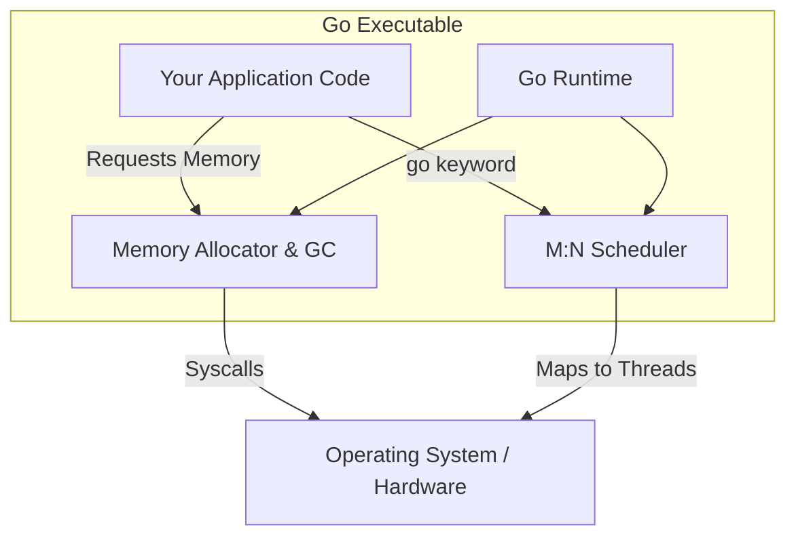

# The Go Runtime

---

# Table of Contents

* Introduction
* Learning Objectives
* Prerequisites
* Why This Topic Exists
* Real-World Analogy
* Core Concepts
* Internal Runtime Explanation
* Memory Layout
* Architecture Diagram
* Step-by-Step Execution
* Syntax
* Beginner Example
* Intermediate Example
* Advanced Example
* Production Use Cases
* Performance Analysis
* Best Practices
* Common Mistakes
* Debugging Guide
* Exercises
* Quiz
* Interview Questions
* Mini Project
* Cheat Sheet
* Summary
* Key Takeaways
* Further Reading
* Next Chapter

---

# Introduction

When you compile a program in C or C++, the resulting binary contains only your code and some linked system libraries. When you compile a Go program, the resulting binary contains your code **plus** a hidden, powerful engine called the **Go Runtime**.

The Go Runtime is an overarching supervisor embedded inside every Go application. It handles memory allocation, garbage collection, and most importantly for this course, **concurrency scheduling**.

---

# Learning Objectives

After completing this chapter you will be able to:

* Explain what the Go Runtime is and what it is responsible for.
* Understand the difference between the Go Runtime and the JVM (Java Virtual Machine).
* Describe how the Runtime interacts with the Operating System.
* Debug Runtime panics and out-of-memory errors.
* Answer interview questions about Go's internal execution model.

---

# Prerequisites

Before reading this chapter you should know:

* What an OS Thread is (from Chapter 04).
* Basic understanding of Memory (Heap vs Stack).

---

# Why This Topic Exists

Many developers transitioning from languages like Python, Node.js, or Java misunderstand how Go executes code. Java uses a Virtual Machine (JVM) that interprets bytecode. Go does not. Go compiles directly to machine code, but it packages a mini-operating-system (the Runtime) inside the binary.

Understanding the Runtime is crucial because backend engineers need to know *who* is pausing their code during Garbage Collection, and *who* is moving their Goroutines between CPU cores.

---

# Real-World Analogy

### The Restaurant Manager

Imagine your code is the kitchen staff cooking the food. 
* **C/C++**: The cooks work completely unsupervised. If they run out of plates (memory), they crash the kitchen. If a cook gets stuck (blocked thread), no one helps him.
* **Java (JVM)**: The kitchen is located inside a massive virtual restaurant building. The JVM translates every recipe before it can be cooked.
* **Go**: The cooks work natively in the kitchen (compiled machine code), but there is a **General Manager (The Runtime)** standing in the corner. The manager watches the plates (Garbage Collection), assigns cooks to different stations (Goroutine Scheduler), and handles emergencies (Panic recovery). 

---

# Core Concepts

The Go Runtime is responsible for three massive subsystems:
1. **The Scheduler**: Multiplexes Goroutines onto OS Threads.
2. **The Memory Allocator**: Manages Heap and Stack memory.
3. **The Garbage Collector (GC)**: Scans memory for unused variables and frees them.

*Note: The Go Runtime is NOT a Virtual Machine. It does not interpret code. It is a library compiled directly into your executable.*

---

# Internal Runtime Explanation

When you execute a Go binary (e.g., `./myapp`), the `main()` function you wrote does **not** run first.

Instead, the Go Runtime boots up. It initializes the memory allocator, configures the Garbage Collector, creates a background system thread (sysmon), and sets up the Scheduler. Once the environment is perfectly prepared, the Runtime creates the very first Goroutine, wraps your `main()` function inside it, and starts execution.

---

# Memory Layout

```text
+-----------------------------------------------------------+
| Your Compiled Go Binary (Native Machine Code)             |
|                                                           |
|  +-----------------------------------------------------+  |
|  | The Go Runtime (Embedded)                           |  |
|  |                                                     |  |
|  |  [ Scheduler ]   [ Garbage Collector ]  [ Sysmon ]  |  |
|  +-----------------------------------------------------+  |
|                                                           |
|  +-----------------------------------------------------+  |
|  | Your Code                                           |  |
|  |                                                     |  |
|  |  func main() { ... }                                |  |
|  |  func doWork() { ... }                              |  |
|  +-----------------------------------------------------+  |
+-----------------------------------------------------------+
```

---

# Architecture Diagram



---

# Step-by-Step Execution

1. `./binary` is executed by the OS.
2. The OS loads the binary into memory and jumps to the entry point (which is in the `runtime` package, not your `main.go`).
3. `runtime.args()` and `runtime.osinit()` parse command-line arguments and detect the number of CPU cores.
4. `runtime.schedinit()` configures the Scheduler.
5. The `main` Goroutine is created and queued.
6. `runtime.mstart()` begins the scheduler loop, executing your code.

---

# Syntax

You can interact with the Runtime programmatically using the `runtime` standard library package.

```go
import "runtime"

// Ask the runtime to run the Garbage Collector immediately
runtime.GC()
```

---

# Beginner Example

Interacting with the Runtime to see environmental information.

```go
package main

import (
	"fmt"
	"runtime"
)

func main() {
	fmt.Println("Go Version:", runtime.Version())
	fmt.Println("OS:", runtime.GOOS)
	fmt.Println("Architecture:", runtime.GOARCH)
	fmt.Println("Logical CPUs:", runtime.NumCPU())
	fmt.Println("Active Goroutines:", runtime.NumGoroutine())
}
```

---

# Intermediate Example

Catching a panic. When a Goroutine crashes, the Runtime intercepts it. We can use `defer` and `recover` to ask the Runtime to stop the crash.

```go
package main

import (
	"fmt"
)

func riskyFunction() {
	defer func() {
		if r := recover(); r != nil {
			fmt.Println("Runtime intercepted a panic:", r)
		}
	}()
	
	// This will cause a panic (Runtime crash)
	var slice []int
	slice[0] = 100 
}

func main() {
	riskyFunction()
	fmt.Println("Program continues safely because we recovered.")
}
```

---

# Advanced Example

Reading Runtime Memory Statistics. In production, you often need to monitor how hard the Garbage Collector is working.

```go
package main

import (
	"fmt"
	"runtime"
)

func main() {
	var m runtime.MemStats
	
	// Read current memory statistics from the Runtime
	runtime.ReadMemStats(&m)
	
	fmt.Printf("Allocated Heap Memory: %v MB\n", m.Alloc / 1024 / 1024)
	fmt.Printf("Total Memory Allocated (Cumulative): %v MB\n", m.TotalAlloc / 1024 / 1024)
	fmt.Printf("System Memory Obtained: %v MB\n", m.Sys / 1024 / 1024)
	fmt.Printf("Number of Garbage Collections: %v\n", m.NumGC)
}
```

---

# Production Use Cases

### 1. Application Performance Monitoring (APM)
Companies like DataDog or NewRelic use `runtime.ReadMemStats` and `runtime.NumGoroutine()` to stream metrics out of your Go application. If the number of Goroutines spikes unexpectedly, an alert is triggered.

### 2. Tuning Garbage Collection
In extremely high-throughput, low-latency trading systems, engineers might use `GOGC=off` to disable the Garbage Collector temporarily during a high-speed market event, letting the Runtime eat memory until the event is over.

---

# Performance Analysis

* **Binary Size**: Because the Go Runtime is bundled into every executable, the smallest Go "Hello World" binary is usually around ~2MB.
* **GC Pauses**: The Go Garbage Collector is famous for being ultra-low-latency (sub-millisecond pauses).
* **CPU Overhead**: The Runtime uses a tiny percentage of CPU to run the Scheduler and the `sysmon` background thread.

---

# Best Practices

* **Do NOT call `runtime.GC()`**: Let the Runtime handle garbage collection automatically. Forcing it manually stops the world and hurts performance.
* **Monitor `runtime.NumGoroutine()`**: Always export this metric to your dashboards. A steadily increasing number indicates a Goroutine Leak.

---

# Common Mistakes

### 1. Thinking Go is Interpreted
*Mistake*: Assuming Go is slow because it has a "Runtime" like Java or Python.
*Reality*: Go compiles to direct assembly/machine code. The Runtime is just a statically linked library acting as a manager.

---

# Debugging Guide

* **GODEBUG=schedtrace=1000**: Run your app with this environment variable. The Runtime will print out exactly what the Scheduler is doing every 1000 milliseconds.
* **GODEBUG=gctrace=1**: Run your app with this to see exactly when the Garbage Collector runs and how much memory it frees.

---

# Exercises

## Beginner
Write a script that creates 5 Goroutines. Inside `main`, print out `runtime.NumGoroutine()`. Does the output match what you expect? 

## Intermediate
Write an infinite loop that constantly allocates memory (e.g., creating large slices). Use `runtime.ReadMemStats` to observe the `NumGC` counter increasing as the Garbage Collector kicks in.

---

# Quiz

## Multiple Choice Questions
**1. Which of the following is TRUE about the Go Runtime?**
A) It is a Virtual Machine that interprets bytecode.
B) It runs as a separate process on the Operating System.
C) It is compiled and bundled directly inside your executable binary.
*Answer*: C

## True or False
**The `main()` function is the very first thing executed when a Go binary starts.**
*Answer*: False. The Go Runtime initializes first, then spawns a Goroutine to run `main()`.

---

# Interview Questions

## Beginner
**Q**: Does Go have a Virtual Machine (VM)?
*Answer*: No. Go compiles to native machine code. It has a Runtime, which is a library bundled into the binary to handle scheduling and GC.

## Intermediate
**Q**: What happens before `main()` executes in a Go program?
*Answer*: The OS loads the binary. The Runtime starts up, initializes the Memory Allocator, configures the Garbage Collector, starts the background `sysmon` thread, and prepares the Goroutine Scheduler. Finally, it creates the main Goroutine.

## Google-Level Questions
**Q**: Explain the role of `sysmon` in the Go Runtime.
*Answer*: `sysmon` (system monitor) is a special background C-thread created by the Runtime. It runs without a Goroutine (it bypasses the Go Scheduler). Its job is to check for deadlocks, force garbage collection if it hasn't run in 2 minutes, and preempt long-running Goroutines that are hogging the CPU so other Goroutines get a fair chance to run.

---

# Mini Project

**Requirement**: Runtime Dashboard
Create an HTTP server using `net/http`. Create a single endpoint `/metrics`. When hit, it should return a JSON response containing `runtime.NumGoroutine()`, the current Heap allocation, and the total number of GC cycles. Hit this endpoint with a load tester and watch the numbers change.

---

# Cheat Sheet

* **Go Runtime**: The embedded manager handling GC, Memory, and Goroutines.
* **Not a VM**: Direct machine code execution.
* `runtime.NumGoroutine()`: Current active Goroutines.
* `runtime.ReadMemStats()`: Access GC and Heap data.
* `sysmon`: Background thread watching for issues.

---

# Summary

The Go Runtime is the silent hero of your application. It abstracts away the complexity of operating system threads and manual memory management (like `malloc` and `free` in C), giving you the performance of a compiled language with the ease-of-use of an interpreted language.

---

# Key Takeaways

* ✔ The Runtime is bundled into your binary.
* ✔ It manages the Scheduler and Garbage Collector.
* ✔ It initializes itself before `main()` is called.
* ✔ You can monitor it using the `runtime` package.

---

# Further Reading

* [The Go Runtime Source Code (GitHub)](https://github.com/golang/go/tree/master/src/runtime)
* [A journey with Go: sysmon](https://medium.com/a-journey-with-go/go-sysmon-background-sweeping-monitoring-and-preemption-e0996c9c64e6)

---

# Next Chapter

➡️ **Next:** `06-Go-Scheduler.md`
