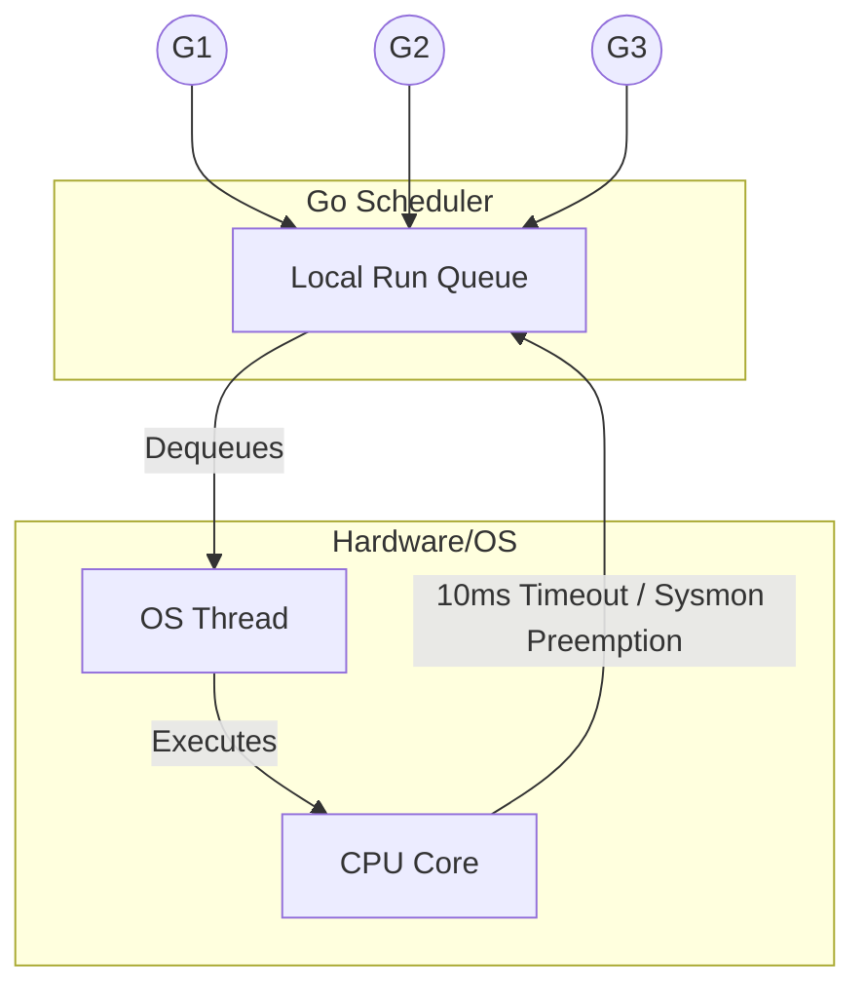

# The Go Scheduler

---

# Table of Contents

* Introduction
* Learning Objectives
* Prerequisites
* Why This Topic Exists
* Real-World Analogy
* Core Concepts
* Internal Runtime Explanation
* Memory Layout
* Architecture Diagram
* Step-by-Step Execution
* Syntax
* Beginner Example
* Intermediate Example
* Advanced Example
* Production Use Cases
* Performance Analysis
* Best Practices
* Common Mistakes
* Debugging Guide
* Exercises
* Quiz
* Interview Questions
* Mini Project
* Cheat Sheet
* Summary
* Key Takeaways
* Further Reading
* Next Chapter

---

# Introduction

At the heart of Go's concurrency model beats the **Go Scheduler**. It is the maestro conducting the execution of thousands, or even millions, of Goroutines across your machine's physical CPU cores.

While the Operating System schedules OS Threads, the Go Scheduler lives inside the Go Runtime and schedules Goroutines onto those OS Threads. Understanding how it makes decisions is the key to writing extremely fast, non-blocking Go applications.

---

# Learning Objectives

After completing this chapter you will be able to:

* Explain the difference between cooperative and preemptive scheduling.
* Understand the M:N scheduling model.
* Describe how the Scheduler handles blocking system calls.
* Predict how CPU-bound vs I/O-bound tasks affect scheduling.
* Answer deep architectural interview questions regarding Go's internal scheduler.

---

# Prerequisites

Before reading this chapter you should know:

* Concurrency vs Parallelism (`03-Concurrency-vs-Parallelism.md`)
* The difference between OS Threads and Goroutines (`04-Process-vs-Thread-vs-Goroutine.md`)
* The Go Runtime (`05-Go-Runtime.md`)

---

# Why This Topic Exists

If you write a simple web server in Node.js or Python, blocking the main thread (e.g., executing an infinite `for` loop) will completely freeze the entire server. No other HTTP requests can be served.

In Go, if one Goroutine executes an infinite `for` loop, the rest of the server continues to function perfectly. Why? Because the Go Scheduler is **Preemptive**. It exists to ensure fairness, preventing any single Goroutine from hogging the CPU and starving the rest of the application.

---

# Real-World Analogy

### The Call Center Supervisor

Imagine a call center with 4 physical telephones (CPU Cores).
* **The Callers**: Goroutines (Tasks to be done).
* **The Operators**: OS Threads (Entities answering the phones).
* **The Supervisor**: The Go Scheduler.

If a Caller gets placed on hold by a client (Blocking I/O), the Supervisor immediately unplugs that Caller's headset, parks them in a waiting room, and plugs a *new* Caller into the Operator's phone. 
If a Caller has been talking for too long (CPU Hogging), the Supervisor taps them on the shoulder, forces them to yield the phone, and puts them at the back of the queue (Preemption) so others get a turn.

---

# Core Concepts

* **M:N Scheduling**: The concept of mapping **M** user-space Goroutines onto **N** OS Threads.
* **Preemption**: The ability of the Scheduler to forcefully pause a running Goroutine to let another one run. (Introduced asynchronously in Go 1.14).
* **Work Stealing**: A load-balancing algorithm where an idle OS Thread will "steal" Goroutines from the queue of a busy OS Thread.
* **Global vs Local Run Queues**: Where Goroutines wait their turn to be executed.

---

# Internal Runtime Explanation

The Go Scheduler is not driven by hardware interrupts like an OS Scheduler. Instead, it is invoked during natural execution points in your code:
1. When you use the `go` keyword.
2. During Garbage Collection.
3. During channel operations (send/receive).
4. During blocking system calls (reading files, network I/O).

Since Go 1.14, the background `sysmon` thread also sends UNIX signals to OS Threads running Goroutines that have been executing for more than **10 milliseconds**, forcing them to yield the CPU.

---

# Memory Layout

```text
+-----------------------------------------------------------+
| OS Thread (M1)                                            |
|                                                           |
| +-----------------+  +---------------------------------+  |
| | Currently       |  | Local Run Queue                 |  |
| | Executing: [G1] |  | [G2] [G3] [G4] [G5]             |  |
| +-----------------+  +---------------------------------+  |
+-----------------------------------------------------------+
| Global Run Queue (Checked occasionally)                   |
| [G6] [G7] [G8]                                            |
+-----------------------------------------------------------+
```
*(We will formalize this further in the next chapter: The G-P-M Model)*

---

# Architecture Diagram



---

# Step-by-Step Execution

1. You call `go myFunc()`. 
2. The runtime creates a new Goroutine (G) and pushes it to a Local Run Queue.
3. An OS Thread (M) pulls the Goroutine from the queue and executes it.
4. `myFunc()` makes an HTTP GET request (Network I/O). 
5. The Scheduler detaches the Goroutine from the OS Thread, placing it in a waiting state (netpoller).
6. The OS Thread immediately pulls the next Goroutine from the Local Run Queue and executes it.

---

# Syntax

You cannot interact with the Scheduler directly to say "run this Goroutine next." However, you can manually ask the Scheduler to pause the current Goroutine and yield the CPU using `runtime.Gosched()`.

```go
import "runtime"

// Yield the processor, allowing other goroutines to run.
runtime.Gosched()
```

---

# Beginner Example

Demonstrating cooperative yielding.

```go
package main

import (
	"fmt"
	"runtime"
	"time"
)

func say(s string) {
	for i := 0; i < 3; i++ {
		// Politely give up the CPU so other Goroutines can run
		runtime.Gosched() 
		fmt.Println(s)
	}
}

func main() {
	// Restrict to 1 core to force them to take turns
	runtime.GOMAXPROCS(1) 
	
	go say("world")
	say("hello")
	
	time.Sleep(1 * time.Second)
}
```

---

# Intermediate Example

Demonstrating Preemption. In older versions of Go (pre-1.14), an empty infinite loop would freeze the scheduler because there were no function calls to yield the CPU. Modern Go forcefully preempts it.

```go
package main

import (
	"fmt"
	"runtime"
	"time"
)

func infiniteLoop() {
	// A pure math infinite loop (no I/O, no function calls)
	for {
		_ = 1 + 1
	}
}

func main() {
	runtime.GOMAXPROCS(1)

	// Launch a CPU hog
	go infiniteLoop()

	// Wait a moment
	time.Sleep(100 * time.Millisecond)

	// In Go 1.14+, this WILL print, because the sysmon thread
	// will forcefully preempt the infiniteLoop Goroutine after 10ms.
	fmt.Println("Main Goroutine survived the CPU hog!")
}
```

---

# Advanced Example

Using the scheduler trace to debug performance issues.

```go
package main

import (
	"sync"
	"time"
)

func main() {
	var wg sync.WaitGroup
	
	for i := 0; i < 10; i++ {
		wg.Add(1)
		go func() {
			defer wg.Done()
			time.Sleep(1 * time.Second)
		}()
	}
	wg.Wait()
}
// Run this with: GODEBUG=schedtrace=1000 go run main.go
```

---

# Production Use Cases

### 1. High-Concurrency Network Proxies (e.g., Traefik, Caddy)
Because the Go Scheduler integrates directly with the OS's network poller (epoll on Linux, kqueue on macOS), Goroutines blocked on network reads consume almost zero CPU. This allows reverse proxies to handle 100,000+ open websockets simultaneously on a single machine.

### 2. Batch Data Processing
If you have a pipeline processing massive CSV files, the Scheduler uses **Work Stealing**. If Core 1 finishes processing its chunk of data early, it will automatically "steal" Goroutines from Core 2's queue, perfectly balancing the load across your server.

---

# Performance Analysis

* **Context Switch Speed**: Switching between two OS Threads takes ~1000 to ~1500 nanoseconds. Switching between two Goroutines takes ~200 nanoseconds. This is a 5x to 7x performance increase.
* **CPU Cache Utilization**: Because Goroutines are scheduled onto the same OS Thread when possible, they keep the CPU L1/L2 cache warm, leading to fewer cache misses.

---

# Best Practices

* **Do not use `runtime.Gosched()` in production**: The Scheduler is smarter than you. Let it do its job. Manual yielding is a code smell indicating a bad architectural design.
* **Keep Goroutines short-lived if possible**: While preemption exists, designing Goroutines to complete quick chunks of work keeps the system incredibly responsive.

---

# Common Mistakes

### Using `time.Sleep` to force scheduling
```go
// BAD: Relying on sleep to let other Goroutines run
go func() {
    doWork()
}()
time.Sleep(1 * time.Millisecond) // Hoping doWork runs
```
*Fix*: Use `sync.WaitGroup` or Channels for actual synchronization. The Scheduler makes no guarantees about execution order.

---

# Debugging Guide

* **GODEBUG=schedtrace=1000**: Prints a summary of the Scheduler's state every 1000ms.
  * Outputs: `SCHED 1000ms: gomaxprocs=4 idleprocs=2 threads=5 spinningthreads=0 idlethreads=1 runqueue=0 [0 0 0 0]`
* **go tool trace**: Generates a visual timeline of exactly when and where your Goroutines were scheduled.

---

# Exercises

## Beginner
Write a program that launches two Goroutines printing numbers 1 to 5. Run it multiple times. Observe how the output order changes on every run because the Scheduler is non-deterministic.

## Intermediate
Write a script containing an infinite `for {}` loop inside a Goroutine. Ensure you have `runtime.GOMAXPROCS(1)`. Attempt to print a message in `main()`. Prove to yourself that modern Go preempts the infinite loop.

---

# Quiz

## Multiple Choice Questions
**1. How does the modern Go Scheduler handle a Goroutine that executes an infinite CPU-bound loop?**
A) The program crashes.
B) The OS Thread gets permanently blocked.
C) `sysmon` preempts the Goroutine after 10ms.
*Answer*: C

## True or False
**You can configure the Go Scheduler to guarantee the order in which Goroutines execute.**
*Answer*: False. Execution order is non-deterministic.

---

# Interview Questions

## Beginner
**Q**: What is the difference between a cooperative scheduler and a preemptive scheduler?
*Answer*: A cooperative scheduler requires the task to explicitly yield the CPU (e.g., yielding in JavaScript). A preemptive scheduler can forcefully pause a running task to let others run. Go uses preemptive scheduling.

## Intermediate
**Q**: What is "Work Stealing" in the context of the Go Scheduler?
*Answer*: If an OS Thread runs out of Goroutines in its local run queue, it will look at the global run queue, and if that is empty, it will "steal" half of the Goroutines from another OS Thread's local run queue to balance the workload.

## Google-Level Questions
**Q**: Explain how the Go Scheduler handles a blocking CGO call vs a blocking Network call.
*Answer*: When a Network call happens, the Goroutine is detached and parked in the Netpoller, keeping the OS Thread free to execute other Goroutines. When a CGO call happens, the OS Thread itself is blocked. The Scheduler detects this, detaches the Local Run Queue from that blocked Thread, and hands the queue to a newly awakened OS Thread to ensure other Goroutines don't starve.

---

# Mini Project

**Requirement**: Scheduler Tracer
Write a small CLI tool that executes a heavy mathematical workload using 10 Goroutines. Run the program with `GODEBUG=schedtrace=500`. Parse the output text in your terminal to explain exactly how many idle threads (`idleprocs`) vs active threads existed during the run.

---

# Cheat Sheet

* **Preemption**: Forced yielding after 10ms.
* **Work Stealing**: Idle threads stealing work from busy threads.
* **Netpoller**: Where Goroutines wait during Network I/O.
* `runtime.Gosched()`: Manually yield the CPU (avoid in production).

---

# Summary

The Go Scheduler is an engineering marvel. By handling context switching in user-space, preempting greedy Goroutines, and integrating tightly with the OS network poller, it allows developers to write simple, synchronous-looking code that scales to millions of concurrent operations seamlessly.

---

# Key Takeaways

* ✔ The Scheduler maps M Goroutines to N OS Threads.
* ✔ It uses Work Stealing to balance load across CPU cores.
* ✔ It is asynchronously Preemptive (since Go 1.14).
* ✔ Network I/O does not block OS Threads.

---

# Further Reading

* [Go Preemptive Scheduler Design Doc](https://github.com/golang/proposal/blob/master/design/24543-non-cooperative-preemption.md)

---

# Next Chapter

➡️ **Next:** `07-GPM-Model.md`
