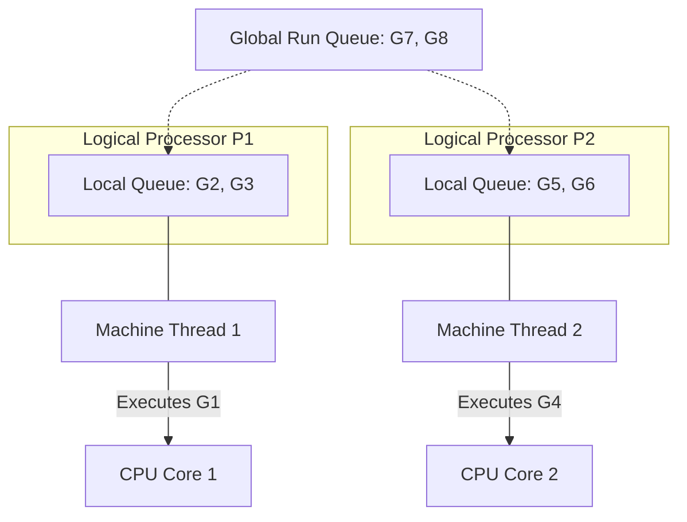

# The G-P-M Model

---

# Table of Contents

* Introduction
* Learning Objectives
* Prerequisites
* Why This Topic Exists
* Real-World Analogy
* Core Concepts
* Internal Runtime Explanation
* Memory Layout
* Architecture Diagram
* Step-by-Step Execution
* Syntax
* Beginner Example
* Intermediate Example
* Advanced Example
* Production Use Cases
* Performance Analysis
* Best Practices
* Common Mistakes
* Debugging Guide
* Exercises
* Quiz
* Interview Questions
* Mini Project
* Cheat Sheet
* Summary
* Key Takeaways
* Further Reading
* Next Chapter

---

# Introduction

In the previous chapter, we explored *why* the Go Scheduler exists. Now, we will look at *how* it is mathematically structured. The Go Scheduler operates on a triad of core entities known as the **G-P-M Model**.

Understanding the G, the P, and the M is a rite of passage for advanced Go engineers. It explains exactly how Go maps code to hardware.

---

# Learning Objectives

After completing this chapter you will be able to:

* Define what G, P, and M stand for in the Go source code.
* Understand the role of the Logical Processor (P).
* Explain how the Global Run Queue and Local Run Queues interact with P.
* Diagram the lifecycle of a Goroutine transitioning through the G-P-M system.
* Answer Google-level interview questions about Go's internal architecture.

---

# Prerequisites

Before reading this chapter you should know:

* The Go Scheduler (`06-Go-Scheduler.md`)
* `runtime.GOMAXPROCS` (`03-Concurrency-vs-Parallelism.md`)

---

# Why This Topic Exists

When the Go runtime encounters a blocking system call (like reading a massive file), why doesn't the entire application freeze? How does Go know how to keep other Goroutines running? 

The answer lies in the **P (Logical Processor)**. Before Go 1.1, the scheduler only had Gs and Ms, which led to a massive global lock bottleneck. The introduction of P revolutionized Go's scalability, and understanding this triad is required for debugging complex performance bottlenecks.

---

# Real-World Analogy

### The Post Office

* **G (Goroutine)**: A letter that needs to be delivered.
* **M (Machine/Thread)**: The mail carrier (the person physically doing the work).
* **P (Processor/Context)**: The mail cart and the route assigned to the mail carrier. 

A mail carrier (**M**) cannot deliver letters (**G**) unless they have a mail cart (**P**). 
If the mail carrier gets stuck in traffic (blocking Syscall), they leave their cart (**P**) on the sidewalk. Another mail carrier (**M**) can grab that cart and continue delivering the letters (**G**) inside it.

---

# Core Concepts

### 1. G (Goroutine)
Represents a single Goroutine. It contains the executable code, the stack memory, and the status (Runnable, Running, Waiting).

### 2. M (Machine)
Represents an Operating System Thread. The OS schedules Ms onto physical CPU cores. An M needs a P to execute Gs.

### 3. P (Processor)
Represents a Logical Processor. It acts as a context holding a **Local Run Queue** of Gs. There are exactly `GOMAXPROCS` number of Ps in your application. 

---

# Internal Runtime Explanation

When a Go program starts, the runtime creates exactly `GOMAXPROCS` number of **Ps**. 

Each **P** is given a Local Run Queue (which can hold up to 256 **Gs**).
The runtime creates **Ms** (OS Threads) and attaches them to the **Ps**. 

The execution loop is simple:
1. **M** gets a **G** from its attached **P**'s Local Run Queue.
2. **M** executes **G**.
3. If **M** blocks (e.g., CGO call), it detaches from **P**. 
4. The runtime spins up a new **M** and attaches it to the orphaned **P**, so the remaining **Gs** can continue to run.

---

# Memory Layout

```text
+-----------------------------------------------------------+
| OS Thread (M1) Attached to Logical Processor (P1)         |
|                                                           |
| +----+      +------------------------------------------+  |
| |    |      | P1's Local Run Queue                     |  |
| | M1 | <--> | [G2] [G3] [G4]                           |  |
| |    |      +------------------------------------------+  |
| +----+                                                    |
|  |                                                        |
|  v                                                        |
| Executing: [G1]                                           |
+-----------------------------------------------------------+
```

---

# Architecture Diagram



---

# Step-by-Step Execution

Let's walk through **Work Stealing**:
1. `M1` finishes executing all `G`s in `P1`'s local queue.
2. `M1` asks `P1` for more work. `P1`'s queue is empty.
3. `P1` checks the Global Run Queue. If empty...
4. `P1` randomly selects another Processor, say `P2`.
5. `P1` steals *half* of the `G`s from `P2`'s local queue.
6. `M1` resumes executing the stolen `G`s.

---

# Syntax

You cannot interact with Gs, Ps, or Ms directly in your code. They are internal runtime structs (`runtime.g`, `runtime.p`, `runtime.m`). However, you can control the number of Ps using `GOMAXPROCS`.

```go
import "runtime"

// Sets the number of 'P's (Logical Processors) to 4
runtime.GOMAXPROCS(4)
```

---

# Beginner Example

Seeing the number of Ps in action.

```go
package main

import (
	"fmt"
	"runtime"
)

func main() {
	// The number of 'P's defaults to the number of physical CPU cores.
	fmt.Printf("Number of Logical Processors (P): %d\n", runtime.GOMAXPROCS(0))
	fmt.Printf("Number of OS Threads (M) limits: 10000 (Default)\n")
}
```

---

# Intermediate Example

Visualizing how Gs pile up when Ms are blocked.

```go
package main

import (
	"fmt"
	"runtime"
	"sync"
	"time"
)

func main() {
	// Force only ONE Logical Processor (P1)
	runtime.GOMAXPROCS(1)

	var wg sync.WaitGroup
	
	// Create 3 Gs
	for i := 1; i <= 3; i++ {
		wg.Add(1)
		go func(id int) {
			defer wg.Done()
			fmt.Printf("G%d is executing\n", id)
			time.Sleep(100 * time.Millisecond) // Simulated work
		}(i)
	}

	wg.Wait()
}
// Because there is only 1 P, these 3 Gs will queue up in P1's Local Run Queue
// and execute sequentially on the single M attached to P1.
```

---

# Advanced Example

If you want to write ultra-high-performance network code, you must avoid blocking the M. Go's standard library does this for you via the `netpoller`.

```go
package main

import (
	"fmt"
	"net/http"
	"time"
)

func main() {
	// When this Goroutine (G1) makes an HTTP request, 
	// it does NOT block the underlying OS Thread (M1).
	// The Go Runtime detaches G1 and parks it in the Netpoller.
	// M1 immediately grabs G2 from the Local Run Queue and executes it.
	
	go func() {
		http.Get("https://example.com") // G1
	}()
	
	go func() {
		fmt.Println("I am G2, running while G1 is waiting on the network!")
	}()
	
	time.Sleep(2 * time.Second)
}
```

---

# Production Use Cases

### 1. CGO Integration
When a company relies heavily on legacy C/C++ libraries (e.g., using OpenCV for image processing in a Go API), every call to C code blocks the OS Thread (**M**). Understanding the G-P-M model allows architects to realize that they might run out of **Ms** if they spawn too many CGO Goroutines simultaneously, leading to Thread Exhaustion.

---

# Performance Analysis

* **M Limit**: The Go runtime has a hard limit of 10,000 Ms (OS Threads) by default. If you block 10,000 Ms, your program crashes.
* **P Limit**: Dictated by `GOMAXPROCS`. Usually equal to your CPU cores.
* **G Limit**: Limited only by available RAM.

---

# Best Practices

* **Keep CGO Calls Minimal**: Calling C code traps the M. If you must do it, ensure you don't launch thousands of CGO Goroutines at once.
* **Trust the Netpoller**: Standard library network/file operations are optimized to never block the M. Use them natively.

---

# Common Mistakes

### Crashing via Thread Exhaustion
```go
// BAD: If calling C code or a raw blocking syscall
for i := 0; i < 20000; i++ {
    go func() {
        // Blocks the M completely. 
        // If 10,000 Ms are blocked, the Go Runtime panics and crashes.
        C.HeavyBlockingOperation() 
    }()
}
```
*Solution*: Use a Worker Pool (Chapter 32) to limit the number of simultaneous blocking Goroutines.

---

# Debugging Guide

* Use `go tool trace`. It generates a UI that visually shows every **P** as a row on a timeline, and you can see exactly which **G** was executing on which **P** at any given microsecond.

---

# Exercises

## Beginner
Write out the definitions for G, P, and M on a piece of paper. Explain how they interact out loud as if explaining it to a junior developer.

## Intermediate
Run `GODEBUG=schedtrace=1000 go run main.go` on a script with an infinite loop. Look at the output. Can you identify the `gomaxprocs` (P), `threads` (M), and `runqueue` (Global Run Queue) metrics in the console?

---

# Quiz

## Multiple Choice Questions
**1. What happens to a 'P' if its attached 'M' executes a blocking C syscall?**
A) The P gets blocked as well.
B) The P detaches from the M and attaches to a new M.
C) The P crashes the program.
*Answer*: B

## True or False
**There can be more Ms than Ps at any given time.**
*Answer*: True. If many Ms are blocked in syscalls, the runtime will spawn new Ms to attach to the limited number of Ps.

---

# Interview Questions

## Beginner
**Q**: What does the M and the P stand for in the Go Scheduler?
*Answer*: M stands for Machine (an OS Thread). P stands for Logical Processor (a context holding a local queue of Goroutines).

## Intermediate
**Q**: Why did Go introduce the 'P' instead of just mapping 'G's directly to 'M's?
*Answer*: Without the 'P', every 'M' had to lock a massive Global Run Queue to pull a 'G'. This caused severe lock contention on multi-core systems. Introducing 'P' gave each thread a lock-free Local Run Queue, drastically increasing performance.

## Google-Level Questions
**Q**: Explain what happens to the G-P-M triad during a Garbage Collection "Stop The World" phase.
*Answer*: The runtime sets a flag requesting preemption. As each M reaches a safe point (like a function call) in its currently running G, it parks the G, detaches the P, and halts the M. Once all Ps are stopped, the GC performs its critical phase, and then wakes the Ms back up to resume the Ps and Gs.

---

# Mini Project

No code project for this chapter, as this is purely architectural theory. Your mini-project is to download the Go source code (`git clone https://github.com/golang/go`), open `src/runtime/runtime2.go`, and read the actual structs defined for `g`, `m`, and `p`. Look at the fields they contain!

---

# Cheat Sheet

* **G**: Goroutine (Your code + stack).
* **M**: Machine (OS Thread, does the actual execution).
* **P**: Processor (Context, holds the local run queue).
* **M needs a P**: To execute Go code.
* **M does not need a P**: To execute blocking C/Syscall code.

---

# Summary

The G-P-M model is the secret sauce behind Go's unrivaled concurrency performance. By introducing the Logical Processor (P) to act as a buffer between OS Threads (M) and Goroutines (G), Go eliminated global lock contention and paved the way for massive, multi-core scalability.

---

# Key Takeaways

* ✔ G = Goroutine, P = Processor, M = OS Thread.
* ✔ `GOMAXPROCS` controls the number of Ps.
* ✔ Ps have Local Run Queues (LRQ) to avoid locking.
* ✔ Work Stealing happens between Ps.

---

# Further Reading

* [Scalable Go Scheduler Design Doc (Dmitry Vyukov, 2012)](https://docs.google.com/document/d/1TTj4T2JO42uD5ID9e89oa0sLKhJYD0Y_kqxDv3I3TMI/edit)

---

# Next Chapter

➡️ **Next:** `08-Goroutines.md`
