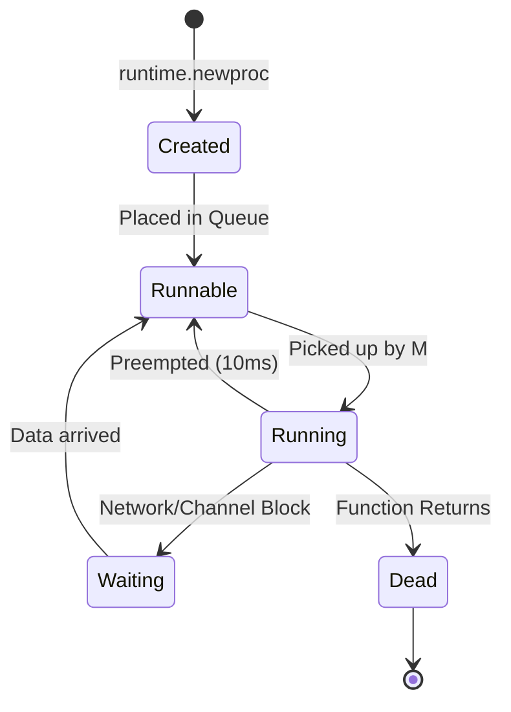

# Goroutines Deep Dive

---

# Table of Contents

* Introduction
* Learning Objectives
* Prerequisites
* Why This Topic Exists
* Real-World Analogy
* Core Concepts
* Internal Runtime Explanation
* Memory Layout
* Architecture Diagram
* Step-by-Step Execution
* Syntax
* Beginner Example
* Intermediate Example
* Advanced Example
* Production Use Cases
* Performance Analysis
* Best Practices
* Common Mistakes
* Debugging Guide
* Exercises
* Quiz
* Interview Questions
* Mini Project
* Cheat Sheet
* Summary
* Key Takeaways
* Further Reading
* Next Chapter

---

# Introduction

We've discussed the theory of the Go Scheduler and the G-P-M model. Now, we zoom in on the star of the show: the **Goroutine**.

A Goroutine is a lightweight thread of execution managed by the Go runtime. In this chapter, we will look at how they are created, how their memory (stack) grows, how they exit, and why they are so fundamental to Go's success.

---

# Learning Objectives

After completing this chapter you will be able to:

* Understand the complete lifecycle of a Goroutine.
* Explain how the Goroutine stack grows and shrinks dynamically.
* Prevent Goroutine leaks in production code.
* Pass data into Goroutines safely avoiding closure bugs.
* Answer deep questions about Goroutine memory allocation.

---

# Prerequisites

Before reading this chapter you should know:

* Basic `go func()` syntax (`01-Introduction.md`)
* Process vs Thread vs Goroutine (`04-Process-vs-Thread-vs-Goroutine.md`)

---

# Why This Topic Exists

It is trivial to type `go doWork()`. It is incredibly difficult to manage 100,000 `doWork()` calls in a production server without running out of memory or creating race conditions.

By understanding the exact lifecycle and memory behavior of a single Goroutine, you can write systems that process millions of background jobs gracefully without crashing.

---

# Real-World Analogy

### The Magic Notepad

Think of a Goroutine's stack memory like a magic notepad.
* **Standard OS Thread**: You are given a massive 1000-page notebook (1MB). Even if you only need to write down a grocery list, you have to carry the massive notebook. This wastes space.
* **Goroutine**: You are given a tiny post-it note (2KB). If you run out of space on the post-it note, the Go Runtime magically replaces it with a slightly larger piece of paper, copying over your previous notes. It grows exactly to the size you need, and no more.

---

# Core Concepts

* **Stack Size**: Starts at 2KB. Grows dynamically up to 1GB (on 64-bit systems).
* **Closure Capture**: Goroutines launched as anonymous functions capture the variables in their surrounding lexical scope by reference, not by value.
* **Lifecycle**: Created -> Runnable -> Running -> Waiting -> Dead.
* **Main Goroutine**: The parent Goroutine that executes `main()`. If it dies, the program dies.

---

# Internal Runtime Explanation

When you call `go myFunc()`, the compiler translates this into a call to `runtime.newproc`. 
1. The runtime allocates a new `g` struct (the Goroutine).
2. It allocates a 2KB stack from the heap.
3. It sets the program counter to the start of `myFunc`.
4. It places the new `g` into the `P`'s local run queue.

When the Goroutine function returns, the runtime executes `runtime.goexit`, which cleans up the stack, releases the `g` struct back to a free list, and schedules the next Goroutine.

---

# Memory Layout

```text
+-----------------------------------------------------------+
| Goroutine Stack Growth                                    |
|                                                           |
|  [2KB Stack]                                              |
|  Func A calls Func B... Out of space!                     |
|                                                           |
|  (Runtime allocates new 4KB Stack, copies data over)      |
|  [4KB Stack]                                              |
|  Func B calls Func C...                                   |
+-----------------------------------------------------------+
```

---

# Architecture Diagram



---

# Step-by-Step Execution

1. **Initialization**: `go func()` is invoked.
2. **Scheduling**: It enters the `Runnable` state in the queue.
3. **Execution**: It enters `Running` state on the CPU.
4. **Stack Check**: Before executing a deep function, the Goroutine inserts a preamble checking if it has enough stack space. If not, it triggers a stack copy/growth operation.
5. **Completion**: Function ends, it transitions to `Dead`.

---

# Syntax

Launching Goroutines with anonymous functions and arguments.

```go
// Passing an argument by value (SAFE)
go func(msg string) {
    fmt.Println(msg)
}("Hello")
```

---

# Beginner Example

The Classic Closure Bug.

```go
package main

import (
	"fmt"
	"time"
)

func main() {
	// MISTAKE: The Goroutines capture 'i' by reference.
	// By the time the Goroutine starts, the loop has already finished,
	// and 'i' is equal to 3 for ALL Goroutines!
	for i := 0; i < 3; i++ {
		go func() {
			fmt.Println("BAD:", i)
		}()
	}

	time.Sleep(100 * time.Millisecond)
}
```

---

# Intermediate Example

Fixing the closure bug by passing arguments.

```go
package main

import (
	"fmt"
	"time"
)

func main() {
	// CORRECT: We pass 'i' as an argument to the function.
	// This creates a copy of the value at the exact moment the 
	// Goroutine is initialized.
	for i := 0; i < 3; i++ {
		go func(val int) {
			fmt.Println("GOOD:", val)
		}(i)
	}

	time.Sleep(100 * time.Millisecond)
}
```
*(Note: As of Go 1.22, the semantics of `for` loops have changed so that `i` is scoped per-iteration, fixing the beginner bug automatically! However, this is heavily tested in interviews, so you must know it).*

---

# Advanced Example

Detecting a Goroutine Leak. A leak occurs when a Goroutine is stuck in the `Waiting` state forever.

```go
package main

import (
	"fmt"
	"runtime"
	"time"
)

func leakingGoroutine() {
	ch := make(chan int)
	// This Goroutine will wait for data on the channel FOREVER.
	// It will never transition to the Dead state. Memory Leak!
	go func() {
		<-ch 
	}()
}

func main() {
	fmt.Println("Start Goroutines:", runtime.NumGoroutine())
	
	for i := 0; i < 50; i++ {
		leakingGoroutine()
	}
	
	time.Sleep(100 * time.Millisecond)
	fmt.Println("End Goroutines:", runtime.NumGoroutine())
	// Output will show 51 active Goroutines! We leaked 50.
}
```

---

# Production Use Cases

### 1. HTTP Request Handlers
In `net/http`, the server calls `go c.serve(ctx)` for every single incoming TCP connection. Because the stack starts at 2KB, 100,000 active connections only use about 200MB of RAM for their stacks.

### 2. Background Polling
In microservices, you often have a Goroutine that wakes up every 60 seconds (using a Ticker) to refresh a cache or pull configuration from AWS Secrets Manager.

---

# Performance Analysis

* **Stack Copy Cost**: Growing a stack requires allocating a new memory block and copying all variables over. If you have deep recursive functions, this copy operation incurs a slight CPU penalty.
* **Memory Limits**: While theoretically you can spawn millions of Goroutines, if your Goroutines allocate heavy variables on the Heap, you will trigger the Garbage Collector aggressively, slowing down the application.

---

# Best Practices

* **Never start a Goroutine without knowing how it stops**: The golden rule of Go concurrency. Always have a cancellation mechanism (like `context.Context` or closing a channel).
* **Pass loop variables explicitly**: Even with Go 1.22's loop scoping fix, explicitly passing variables to anonymous Goroutines is cleaner and safer.

---

# Common Mistakes

### Forgetting that main() does not wait
```go
func main() {
    go fmt.Println("I will probably never print!")
}
```
*Fix*: We must synchronize using a `sync.WaitGroup` (which we will learn in the very next chapter!).

---

# Debugging Guide

* **pprof**: Use `go tool pprof http://localhost:8080/debug/pprof/goroutine` to download a profile of all currently running Goroutines.
* **Stack Traces**: If a Goroutine panics, the runtime prints the stack trace of *that specific Goroutine*, making debugging isolated errors very easy.

---

# Exercises

## Beginner
Write a script that launches 10 Goroutines. Each Goroutine should print its ID (1 to 10). Ensure the IDs print correctly (not all 10s).

## Intermediate
Write a script that intentionally creates a Goroutine leak by having a Goroutine wait on an empty, unclosed channel. Print `runtime.NumGoroutine()` before and after to prove the leak exists.

---

# Quiz

## Multiple Choice Questions
**1. What is the starting stack size of a Goroutine?**
A) 1 MB
B) 8 KB
C) 2 KB
D) 4 KB
*Answer*: C

## True or False
**If a Goroutine runs out of stack space, the application will crash with a StackOverflow error.**
*Answer*: False. The Go Runtime will automatically pause the Goroutine, allocate a larger stack, copy the data, and resume execution.

---

# Interview Questions

## Beginner
**Q**: What is a Goroutine Leak?
*Answer*: A Goroutine leak happens when a Goroutine is launched but gets permanently blocked (e.g., waiting on a channel that will never receive data). Because it never finishes, its 2KB stack and any referenced memory are never garbage collected.

## Intermediate
**Q**: Explain how Goroutines capture variables in a closure.
*Answer*: Anonymous functions capture variables by reference from their surrounding scope. If the surrounding scope changes the variable (like a loop index) before the Goroutine executes, the Goroutine will see the final mutated value. This is solved by passing the variable as a function argument.

## Google-Level Questions
**Q**: How does the Go Runtime handle stack growth for Goroutines, and what are the performance implications?
*Answer*: Go uses contiguous stacks. When a stack limit is reached, the runtime allocates a new, larger memory block (usually double the size), copies the entire old stack into the new one, and updates all pointers that referenced the old stack. The implication is a small latency spike during the copy operation, but it ensures memory locality and prevents fragmentation compared to older "split stack" implementations.

---

# Mini Project

**Requirement**: The Leaky Server Detector
Write a Go program with an infinite loop simulating a web server. Every 1 second, it launches a "handler" Goroutine that sleeps for 5 seconds and then finishes. 
In a separate monitoring Goroutine, print out `runtime.NumGoroutine()` every second. You should see the number of Goroutines rise to around 5, and then stabilize, proving your handlers are properly dying and not leaking!

---

# Cheat Sheet

* **Creation**: `go myFunc()`
* **Stack**: 2KB (Dynamic)
* **Closure Bug Fix**: `go func(val int) { ... }(i)`
* **Golden Rule**: Never start a Goroutine without knowing how it ends.

---

# Summary

Goroutines are the building blocks of Go applications. Their ultra-low memory footprint and dynamic stack growth make them incredibly powerful, but with great power comes the responsibility of managing their lifecycles to prevent memory leaks in production.

---

# Key Takeaways

* ✔ Goroutines start at 2KB.
* ✔ Stacks grow dynamically via contiguous copying.
* ✔ Always pass loop variables explicitly to anonymous Goroutines.
* ✔ Unfinished Goroutines cause permanent memory leaks.

---

# Further Reading

* [Contiguous Stacks Design Document](https://docs.google.com/document/d/1wAaf1rYoM4S4gtnPh0zOlGzWtrZsCMDqsusPTcgxSmk/edit)

---

# Next Chapter

➡️ **Next:** `09-WaitGroup.md`
