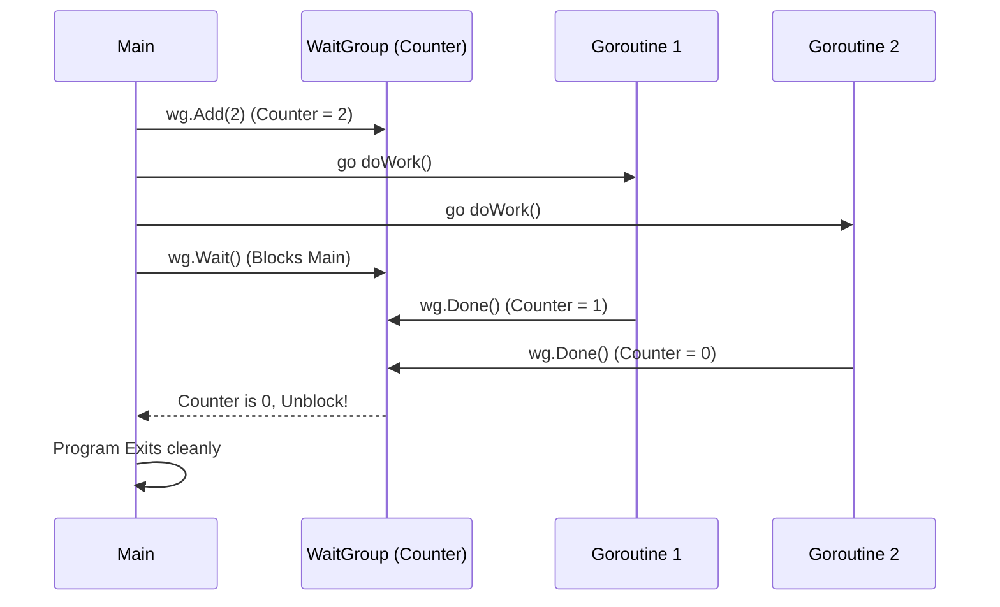

# WaitGroup

---

# Table of Contents

* Introduction
* Learning Objectives
* Prerequisites
* Why This Topic Exists
* Real-World Analogy
* Core Concepts
* Internal Runtime Explanation
* Memory Layout
* Architecture Diagram
* Step-by-Step Execution
* Syntax
* Beginner Example
* Intermediate Example
* Advanced Example
* Production Use Cases
* Performance Analysis
* Best Practices
* Common Mistakes
* Debugging Guide
* Exercises
* Quiz
* Interview Questions
* Mini Project
* Cheat Sheet
* Summary
* Key Takeaways
* Further Reading
* Next Chapter

---

# Introduction

When working with Goroutines, the biggest challenge beginners face is that the `main` Goroutine exits before the background Goroutines finish their work. 

`sync.WaitGroup` is the simplest and most robust way to solve this. It is a synchronization primitive provided by the standard library that allows a Goroutine to wait for a collection of other Goroutines to finish executing before proceeding.

---

# Learning Objectives

After completing this chapter you will be able to:

* Explain how a WaitGroup synchronizes concurrent execution.
* Understand the internal counter mechanism (`Add`, `Done`, `Wait`).
* Pass WaitGroups safely between functions (by pointer).
* Debug `sync: WaitGroup is reused before previous Wait has returned` panics.
* Implement the Fan-Out pattern using WaitGroups.

---

# Prerequisites

Before reading this chapter you should know:

* Pointers in Go
* Goroutine Lifecycles (`08-Goroutines.md`)

---

# Why This Topic Exists

Without a WaitGroup, developers resort to terrible hacks like `time.Sleep(1 * time.Second)` to guess how long background tasks will take. This leads to flaky code that either exits too early or wastes CPU time waiting longer than necessary. 

Go introduced `sync.WaitGroup` to provide a deterministic, mathematically precise way to block execution until a dynamic number of concurrent tasks report they are complete.

---

# Real-World Analogy

### The Tour Guide

Imagine a tour guide taking a group of 5 tourists to a museum.
* The guide tells the tourists: "Go explore. We leave when everyone is back."
* The guide **adds** 5 to their mental counter (`wg.Add(5)`).
* The guide sits on a bench and **waits** (`wg.Wait()`).
* As each tourist finishes, they report to the guide, who subtracts 1 from the counter (`wg.Done()`).
* When the counter reaches 0, the guide knows it is safe to leave the museum.

---

# Core Concepts

* **Counter**: A thread-safe integer hidden inside the WaitGroup struct.
* `Add(int)`: Increases the counter. Must be called *before* the Goroutine starts.
* `Done()`: Decreases the counter by 1. Usually called via `defer` inside the Goroutine.
* `Wait()`: Blocks the calling Goroutine until the counter reaches exactly 0.

---

# Internal Runtime Explanation

Internally, `sync.WaitGroup` contains a 64-bit integer representing two values: a 32-bit counter (number of Goroutines running) and a 32-bit waiter count (number of Goroutines calling `Wait()`), plus a Semaphore.

When `Wait()` is called, if the counter > 0, the Goroutine is put to sleep using the runtime Semaphore. When `Done()` drops the counter to 0, the runtime wakes up all Goroutines that were sleeping on the Semaphore.

---

# Memory Layout

```text
+-----------------------------------------------------------+
| Heap Memory (sync.WaitGroup)                              |
|                                                           |
| [ Counter: 3 ]                                            |
| [ Waiters: 1 ]                                            |
| [ Semaphore  ]                                            |
|                                                           |
| Stack (Main)           Stack (G1)          Stack (G2)     |
| [ wg.Wait() ]          [ wg.Done() ]       [ wg.Done() ]  |
+-----------------------------------------------------------+
```

---

# Architecture Diagram



---

# Step-by-Step Execution

1. Declare `var wg sync.WaitGroup`.
2. Call `wg.Add(1)` on the main thread.
3. Launch `go myFunc(&wg)`.
4. Call `wg.Wait()` on the main thread. The main thread goes to sleep.
5. Inside `myFunc`, the task completes and calls `wg.Done()`.
6. The WaitGroup counter hits 0. The runtime wakes the main thread.

---

# Syntax

```go
import "sync"

var wg sync.WaitGroup

wg.Add(1)       // Increase counter
defer wg.Done() // Decrease counter by 1
wg.Wait()       // Block until counter is 0
```

---

# Beginner Example

The standard pattern for waiting on a single Goroutine.

```go
package main

import (
	"fmt"
	"sync"
	"time"
)

func main() {
	var wg sync.WaitGroup

	fmt.Println("Main: Starting Goroutine")
	
	// 1. Add to the counter BEFORE launching
	wg.Add(1)
	
	go func() {
		// 2. Ensure Done() is called even if this function panics
		defer wg.Done()
		
		fmt.Println("Goroutine: Working...")
		time.Sleep(1 * time.Second)
		fmt.Println("Goroutine: Finished")
	}()

	fmt.Println("Main: Waiting...")
	// 3. Block until counter is 0
	wg.Wait() 
	fmt.Println("Main: Program finished gracefully")
}
```

---

# Intermediate Example

Waiting for a dynamic slice of items to be processed concurrently (Fan-Out). Notice how we pass the WaitGroup by pointer!

```go
package main

import (
	"fmt"
	"sync"
	"time"
)

func processItem(id int, wg *sync.WaitGroup) {
	defer wg.Done()
	fmt.Printf("Processing item %d\n", id)
	time.Sleep(500 * time.Millisecond)
}

func main() {
	items := []int{1, 2, 3, 4, 5}
	var wg sync.WaitGroup

	for _, item := range items {
		wg.Add(1) // Add inside the loop, before the Goroutine
		go processItem(item, &wg) // Pass by pointer!
	}

	wg.Wait()
	fmt.Println("All items processed!")
}
```

---

# Advanced Example

Handling errors while using a WaitGroup. (Note: In production, `golang.org/x/sync/errgroup` is preferred for this, but building it manually teaches the concept).

```go
package main

import (
	"fmt"
	"sync"
)

func main() {
	var wg sync.WaitGroup
	var mu sync.Mutex
	var errs []error

	urls := []string{"http://ok.com", "http://bad.com"}

	for _, url := range urls {
		wg.Add(1)
		go func(u string) {
			defer wg.Done()
			
			// Simulating an error
			if u == "http://bad.com" {
				// We must use a Mutex to safely append to a shared slice
				mu.Lock()
				errs = append(errs, fmt.Errorf("failed to fetch %s", u))
				mu.Unlock()
			}
		}(url)
	}

	wg.Wait()

	if len(errs) > 0 {
		fmt.Printf("Finished with %d errors\n", len(errs))
	} else {
		fmt.Println("Success")
	}
}
```

---

# Production Use Cases

### 1. API Aggregation
A GraphQL endpoint needs to fetch User Data, Billing Data, and Recent Orders. It launches 3 Goroutines, uses a WaitGroup to wait for all 3 to finish, combines the JSON, and sends the HTTP response.

### 2. Cron Jobs / Background Processors
A nightly cron job pulls 10,000 rows from a database, chunks them into 10 groups of 1,000, and spawns 10 Goroutines to process them. The main cron function uses `wg.Wait()` to ensure it doesn't log "Cron Finished" until all rows are actually processed.

---

# Performance Analysis

* **CPU Usage**: `Wait()` does not burn CPU cycles (it is not a spin-lock). It parks the Goroutine efficiently using OS semaphores.
* **Memory Usage**: A `sync.WaitGroup` struct is incredibly small (16 bytes).
* **Allocation Cost**: Near zero if allocated on the stack.

---

# Best Practices

* **Always use `defer wg.Done()`**: If your Goroutine panics or has an early `return` statement, `defer` ensures the counter is decremented. If you forget, `wg.Wait()` will block forever (Deadlock).
* **Call `wg.Add()` in the parent thread**: Do not call `wg.Add(1)` *inside* the Goroutine. The parent thread might reach `wg.Wait()` before the Goroutine even starts, causing it to instantly exit.

---

# Common Mistakes

### 1. Passing WaitGroup by Value
```go
// BAD: wg is passed by value (a copy is made).
// The wg.Done() in this function modifies the COPY, not the original.
// The main thread will deadlock at wg.Wait().
func worker(wg sync.WaitGroup) {
    defer wg.Done() 
}
```
*Solution*: Always pass `wg *sync.WaitGroup` (by pointer).

### 2. Calling wg.Add inside the Goroutine
```go
var wg sync.WaitGroup
go func() {
    wg.Add(1) // MISTAKE!
    defer wg.Done()
}()
wg.Wait() // Will probably unblock immediately!
```
*Solution*: Call `wg.Add(1)` before the `go` keyword.

---

# Debugging Guide

* **Deadlock Panics**: If the runtime detects that all Goroutines are asleep (usually because `Done()` was missed), it will instantly crash the app with `fatal error: all goroutines are asleep - deadlock!`.
* **Negative Counter Panics**: If you call `Done()` too many times, the app will panic with `sync: negative WaitGroup counter`.

---

# Exercises

## Beginner
Write a script that creates a slice of 3 strings. Iterate over the slice, launch a Goroutine for each string that prints it, and use a WaitGroup to ensure the program waits for all 3 to print.

## Intermediate
Intentionally recreate the "passing by value" bug. Observe the deadlock panic. Then fix it by passing a pointer.

## Advanced
Write a script where a Goroutine throws a panic, but is recovered using `recover()`. Ensure `wg.Done()` is still called so the main thread doesn't deadlock. (Hint: `defer` is your friend).

---

# Quiz

## Multiple Choice Questions
**1. Where should `wg.Add(1)` be called?**
A) Inside the Goroutine, at the top.
B) In the parent Goroutine, before the `go` keyword.
C) Immediately after `wg.Wait()`.
*Answer*: B

## True or False
**`wg.Wait()` burns high CPU usage while waiting.**
*Answer*: False. It uses a semaphore to sleep efficiently.

---

# Interview Questions

## Beginner
**Q**: What is the purpose of `sync.WaitGroup`?
*Answer*: It is used to block a Goroutine until a specific number of other Goroutines have finished executing.

## Intermediate
**Q**: Why must a WaitGroup be passed by pointer to a function?
*Answer*: If passed by value, Go creates a copy of the struct. Calling `Done()` on the copy will not decrement the counter of the original WaitGroup being waited on in `main`, resulting in a deadlock.

## Google-Level Questions
**Q**: Can you reuse a WaitGroup? If so, what is the risk?
*Answer*: Yes, a WaitGroup can be reused once its counter hits 0. However, if you call `wg.Add()` while another Goroutine is currently unblocking from a previous `wg.Wait()`, it causes a race condition and panics with `sync: WaitGroup is reused before previous Wait has returned`. To reuse safely, you must ensure all previous `Wait()` calls have completely returned.

---

# Mini Project

**Requirement**: Concurrent Port Scanner
Write a script that takes an IP address and a range of ports (e.g., 1 to 100). Use a `for` loop to launch a Goroutine for every single port. In the Goroutine, use `net.DialTimeout` to see if the port is open. Use a `sync.WaitGroup` to wait for all 100 ports to be scanned before printing "Scan Complete".

---

# Cheat Sheet

* `var wg sync.WaitGroup`
* `wg.Add(1)` (Before launching)
* `defer wg.Done()` (Inside Goroutine)
* `wg.Wait()` (To block)
* **Rule**: Pass `&wg` (by pointer).

---

# Summary

`sync.WaitGroup` is the workhorse of Go concurrency. It is the most standard, idiomatic way to wait for a collection of Goroutines to finish. Mastering it early prevents 90% of the premature-exit bugs beginners face.

---

# Key Takeaways

* ✔ Add to the counter before launching.
* ✔ Always use defer for `Done()`.
* ✔ Pass WaitGroups by pointer.
* ✔ WaitGroups sleep efficiently.

---

# Further Reading

* [sync.WaitGroup Source Code](https://cs.opensource.google/go/go/+/refs/tags/go1.21.1:src/sync/waitgroup.go)

---

# Next Chapter

➡️ **Next:** `10-Channels.md`
