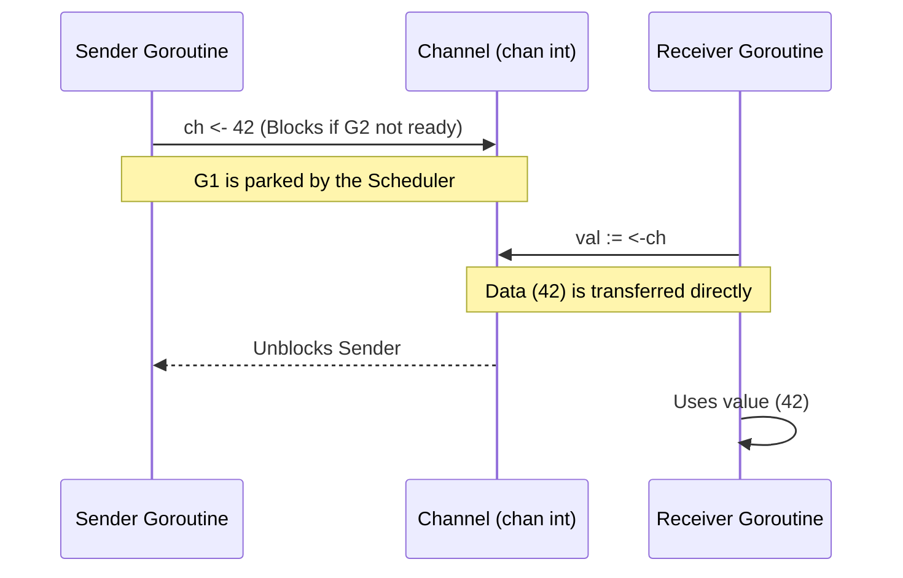

# Introduction to Channels

---

# Table of Contents

* Introduction
* Learning Objectives
* Prerequisites
* Why This Topic Exists
* Real-World Analogy
* Core Concepts
* Internal Runtime Explanation
* Memory Layout
* Architecture Diagram
* Step-by-Step Execution
* Syntax
* Beginner Example
* Intermediate Example
* Advanced Example
* Production Use Cases
* Performance Analysis
* Best Practices
* Common Mistakes
* Debugging Guide
* Exercises
* Quiz
* Interview Questions
* Mini Project
* Cheat Sheet
* Summary
* Key Takeaways
* Further Reading
* Next Chapter

---

# Introduction

We know how to launch Goroutines (`go doWork()`) and how to wait for them to finish (`sync.WaitGroup`). But what if these Goroutines need to talk to each other? What if Goroutine A needs to send an image to Goroutine B for processing?

This is where **Channels** come in. Channels are Go's mechanism for communicating data safely between Goroutines. They act as pipes connecting concurrent functions, allowing them to send and receive values synchronously or asynchronously without race conditions.

---

# Learning Objectives

After completing this chapter you will be able to:

* Explain the famous Go proverb: "Don't communicate by sharing memory, share memory by communicating."
* Understand the syntax for creating, sending, and receiving on channels.
* Visualize how a channel acts as a typed conduit in memory.
* Identify the difference between a blocking send and a blocking receive.
* Prevent the most common channel deadlock scenarios.

---

# Prerequisites

Before reading this chapter you should know:

* Goroutine lifecycles (`08-Goroutines.md`)
* The concept of Race Conditions (at a high level).

---

# Why This Topic Exists

In languages like Java or C++, if two threads need to modify the same list of users, they must use Shared Memory protected by Mutexes (Locks). This is notoriously difficult to get right. If you forget to lock the memory, you get a Race Condition. If you lock it incorrectly, you get a Deadlock.

Go introduced Channels based on the mathematical theory of **CSP** (Communicating Sequential Processes). Instead of locking a shared variable, Goroutine A simply packages the data and sends it down a pipe (the Channel) to Goroutine B. Data is handed off cleanly, eliminating the need for complex locks in most scenarios.

---

# Real-World Analogy

### The Factory Conveyor Belt

* **Goroutines**: Two workers in a factory. One worker assembles toy cars, the other paints them.
* **Shared Memory (The Bad Way)**: Both workers try to grab the same toy car from a table at the exact same time. They bump heads, the car breaks.
* **Channels (The Go Way)**: A conveyor belt runs between the workers. The assembler finishes a car, places it on the belt (Sends to channel), and goes back to building. The painter takes the car off the belt (Receives from channel) and paints it. Safe, orderly, and highly concurrent.

---

# Core Concepts

* **Typed**: A channel can only transport data of one specific type (e.g., `chan int`, `chan string`, `chan User`).
* **Send (`<-`)**: Pushing data into the channel.
* **Receive (`<-`)**: Pulling data out of the channel.
* **Blocking**: By default, channels in Go are *unbuffered*. This means sending blocks until another Goroutine is ready to receive, and receiving blocks until a Goroutine is ready to send.

---

# Internal Runtime Explanation

Internally, a channel is a struct in the Go runtime (`hchan`). It contains a mutex lock, a queue of waiting senders, and a queue of waiting receivers. 

When Goroutine A sends to an unbuffered channel, the runtime checks if Goroutine B is already waiting to receive. If B is waiting, the data is copied directly from Goroutine A's stack to Goroutine B's stack, bypassing the heap entirely! If B is not ready, the runtime parks Goroutine A, puts it in a sleeping state, and saves a pointer to its data in the channel's wait queue.

---

# Memory Layout

```text
+-----------------------------------------------------------+
| Stack (Goroutine 1)                 Stack (Goroutine 2)   |
|                                                           |
| msg := "Hello"                      var received string   |
| [ ch <- msg ]                       [ received = <-ch ]   |
|       |                                     ^             |
|       |                                     |             |
+-------|-------------------------------------|-------------+
        |        Heap (runtime.hchan)         |
        |       +-------------------+         |
        +-----> | WaitQ: [G1]       | --------+
                | Lock:  Mutex      |
                +-------------------+
```

---

# Architecture Diagram



---

# Step-by-Step Execution

1. Declare channel: `ch := make(chan string)`
2. Launch Goroutine B: `go receiveData(ch)`
3. Goroutine B hits `<-ch` and goes to sleep (Waiting for data).
4. Main Goroutine hits `ch <- "Hello"`.
5. The runtime wakes up B, transfers "Hello", and both Goroutines continue executing.

---

# Syntax

```go
// 1. Creation
ch := make(chan string) // Unbuffered channel of strings

// 2. Sending (Arrow points INTO the channel)
ch <- "Hello Go"

// 3. Receiving (Arrow points OUT OF the channel)
msg := <-ch
```

---

# Beginner Example

The absolute simplest ping-pong between the main thread and a Goroutine.

```go
package main

import (
	"fmt"
)

func main() {
	// Create a channel
	messages := make(chan string)

	// Launch a Goroutine
	go func() {
		fmt.Println("Goroutine: Sending message...")
		messages <- "ping" // Send value into channel
		fmt.Println("Goroutine: Message sent!")
	}()

	fmt.Println("Main: Waiting for message...")
	// Receive value from channel (Blocks until data arrives)
	msg := <-messages 
	fmt.Println("Main: Received:", msg)
}
```

---

# Intermediate Example

Using a channel to safely aggregate the result of a concurrent math calculation. Notice we don't even need a WaitGroup here, because the `<-resultCh` inherently blocks the main thread until the answer arrives!

```go
package main

import (
	"fmt"
	"time"
)

func calculateHeavyMath(a int, b int, resultCh chan int) {
	time.Sleep(1 * time.Second) // Simulate heavy work
	resultCh <- (a + b)
}

func main() {
	ch := make(chan int)

	go calculateHeavyMath(100, 200, ch)
	
	fmt.Println("Main: Calculating in background...")
	
	// Blocks here until the calculation is done
	answer := <-ch 
	fmt.Printf("Main: The answer is %d\n", answer)
}
```

---

# Advanced Example

If you want to send *multiple* values, you can range over a channel. (We will cover closing channels deeply in Chapter 14, but here is a sneak peek).

```go
package main

import (
	"fmt"
	"time"
)

func generateNumbers(ch chan int) {
	for i := 1; i <= 3; i++ {
		ch <- i
		time.Sleep(500 * time.Millisecond)
	}
	// We MUST close the channel so the range loop knows when to stop
	close(ch) 
}

func main() {
	ch := make(chan int)

	go generateNumbers(ch)

	// The range loop will automatically pull values out of the channel
	// and block/wait when the channel is empty, exiting when it is closed.
	for num := range ch {
		fmt.Println("Received:", num)
	}
	fmt.Println("Done")
}
```

---

# Production Use Cases

### 1. Job Queues
In a video processing application, a web server receives an HTTP request with an MP4 file. It pushes the filepath to a `chan string`. Somewhere else in the application, 5 "Worker" Goroutines are reading from that channel, taking files off the belt, and compressing them.

### 2. Event Sourcing
In game servers, when a player moves, a `PlayerMovedEvent` struct is pushed into an `EventChannel`. A background loop constantly reads from this channel and broadcasts the movement to all other connected players.

---

# Performance Analysis

* **Zero-Copy Transfers**: Go is heavily optimized for unbuffered channels. When a sender and receiver are both ready, the runtime copies the data directly from the sender's stack to the receiver's stack, skipping the heap.
* **Context Switching**: Because channels use locks internally, sending 1,000,000 tiny integers per second over a channel can actually be slower than using a Mutex (Chapter 21). Channels are best for orchestrating control flow, not raw data processing speed.

---

# Best Practices

* **Share Memory by Communicating**: This is the Go mantra. Instead of protecting a shared `map` with a lock, pass the map updates over a channel to a single Goroutine that "owns" the map.
* **Keep Channels Typed**: Avoid `chan interface{}` unless absolutely necessary. Type safety prevents runtime panics.

---

# Common Mistakes

### 1. The Fatal Deadlock
```go
package main

func main() {
    ch := make(chan int)
    
    // MISTAKE: Sending to an unbuffered channel blocks FOREVER 
    // unless another Goroutine is actively receiving. 
    // Since we do this in main() with no other Goroutines, the app crashes!
    ch <- 42 
    
    // We will never reach this line
    <-ch
}
// OUTPUT: fatal error: all goroutines are asleep - deadlock!
```
*Solution*: Always run the sender or the receiver in a separate Goroutine!

---

# Debugging Guide

* **Deadlocks**: The Go runtime is very smart. If it detects that a channel send/receive is permanently blocked and no other Goroutines are active, it will crash the app and print the exact line number where the deadlock occurred.
* **Data Races**: If you send a pointer over a channel (`chan *User`), and both the sender and receiver modify the struct simultaneously, you have a data race. Always send *copies* (values) or agree to never touch the pointer after sending it.

---

# Exercises

## Beginner
Create a channel of strings. In a Goroutine, send the word "Gopher". In `main`, receive and print it.

## Intermediate
Write a script that launches two Goroutines. G1 generates a random number and sends it to G2 over a channel. G2 receives it, multiplies it by 10, and prints it. Use a WaitGroup in `main` to wait for G2 to finish.

---

# Quiz

## Multiple Choice Questions
**1. What happens if you execute `ch <- 10` in the main thread with no other Goroutines running?**
A) The value is stored for later.
B) The program panics with a Deadlock.
C) The compiler throws an error.
*Answer*: B

## True or False
**By default, sending a value into a channel instantly returns and moves to the next line of code.**
*Answer*: False. By default, channels are unbuffered. Sending blocks the Goroutine until another Goroutine is ready to receive.

---

# Interview Questions

## Beginner
**Q**: What is the syntax to send data into a channel?
*Answer*: `ch <- data`

## Intermediate
**Q**: Explain what "Share memory by communicating" means.
*Answer*: Instead of having multiple threads lock and modify a single piece of shared memory (which causes race conditions), you should package the data and send it between Goroutines over channels.

## Google-Level Questions
**Q**: Explain how the Go runtime optimizes a channel send when the receiver is already waiting.
*Answer*: If a receiver is parked in the channel's wait queue, the runtime bypasses pushing the data into the channel's internal buffer (if it had one). Instead, the sender copies the data directly from its own stack memory straight into the receiver's stack memory. This direct copy avoids heap allocation and reduces locking overhead.

---

# Mini Project

**Requirement**: The Temperature Sensor
Write a program with a `chan float64`. Create a Goroutine that acts as a sensor, reading a random temperature (e.g., 72.5) every 1 second, and sending it to the channel. In `main`, loop 5 times, reading from the channel and printing the temperature.

---

# Cheat Sheet

* **Create**: `ch := make(chan int)`
* **Send**: `ch <- value`
* **Receive**: `value := <-ch`
* **Deadlock Risk**: Unbuffered channels block the sender until a receiver arrives.

---

# Summary

Channels are the defining feature of Go. They provide an elegant, type-safe, and highly concurrent way to pass data between Goroutines. By avoiding traditional memory locks, developers can build massively complex pipelines that are remarkably easy to read.

---

# Key Takeaways

* ✔ Channels are pipes connecting Goroutines.
* ✔ Unbuffered channels block on send and receive.
* ✔ They prevent the need for complex Mutex locking.
* ✔ A Deadlock occurs if nobody is on the other side of the pipe.

---

# Further Reading

* [Share Memory By Communicating (Go Blog)](https://go.dev/blog/codelab-share)

---

# Next Chapter

➡️ **Next:** `11-Buffered-Channels.md`
