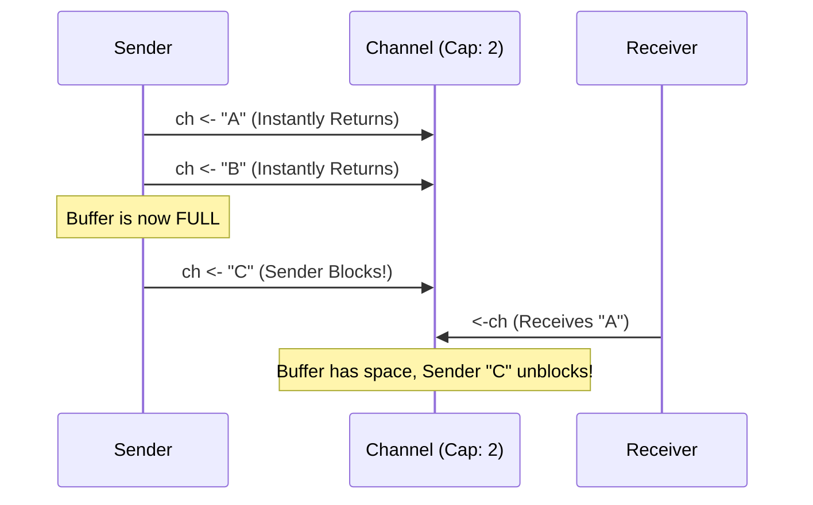

# Buffered Channels

---

# Table of Contents

* Introduction
* Learning Objectives
* Prerequisites
* Why This Topic Exists
* Real-World Analogy
* Core Concepts
* Internal Runtime Explanation
* Memory Layout
* Architecture Diagram
* Step-by-Step Execution
* Syntax
* Beginner Example
* Intermediate Example
* Advanced Example
* Production Use Cases
* Performance Analysis
* Best Practices
* Common Mistakes
* Debugging Guide
* Exercises
* Quiz
* Interview Questions
* Mini Project
* Cheat Sheet
* Summary
* Key Takeaways
* Further Reading
* Next Chapter

---

# Introduction

In the previous chapter, we learned that a standard channel is unbuffered—meaning a sender is blocked until a receiver takes the data. But what if the sender is much faster than the receiver? What if we want to send 5 messages immediately without waiting?

This is where **Buffered Channels** come in. A buffered channel has an internal queue (a buffer) with a fixed capacity. Senders can push data into this queue instantly without blocking, as long as the queue isn't full.

---

# Learning Objectives

After completing this chapter you will be able to:

* Explain the difference between buffered and unbuffered channels.
* Create channels with a specific capacity.
* Understand when a buffered channel blocks on send vs receive.
* Prevent Deadlocks related to full buffers.
* Use buffered channels for rate-limiting and worker pools.

---

# Prerequisites

Before reading this chapter you should know:

* Unbuffered Channels (`10-Channels.md`)
* The `make` keyword.

---

# Why This Topic Exists

Strictly synchronous (unbuffered) communication forces the sender and receiver to operate at the exact same speed. If a web server receives an HTTP request, processes it, and wants to send an analytics log to a background Goroutine, it doesn't want to wait for the background Goroutine to finish before responding to the user.

Buffered channels exist to provide **asynchronous handoffs**. They decouple the execution speed of the sender from the receiver.

---

# Real-World Analogy

### The Post Office Drop Box

* **Unbuffered Channel (Hand-to-Hand)**: You walk into the post office. You must wait in line until a clerk is available. You hand the letter directly to the clerk. (Blocking).
* **Buffered Channel (Drop Box)**: There is a blue drop box outside with a capacity of 100 letters. You can drive by and drop your letter in instantly, without waiting for the postal worker. (Non-blocking).
* **Blocking on Full**: If the drop box is completely full (100 letters), you *must* wait until a postal worker comes to empty it before you can push your letter in.
* **Blocking on Empty**: When the postal worker comes to collect letters, if the box is empty, they must wait until someone drops a letter in.

---

# Core Concepts

* **Capacity**: The total number of items the channel can hold. Defined during creation.
* **Length**: The current number of items sitting in the buffer.
* **Asynchronous Send**: Sending (`ch <- val`) does not block *unless* the buffer is full.
* **Asynchronous Receive**: Receiving (`val := <-ch`) does not block *unless* the buffer is empty.

---

# Internal Runtime Explanation

Internally, an `hchan` (channel struct) with a buffer allocates a circular array (ring buffer) on the heap.
It maintains two indices: `sendx` (where to put the next item) and `recvx` (where to read the next item).

When you send to a buffered channel, the runtime acquires a Mutex lock, copies your data into the array at `sendx`, increments `sendx`, and unlocks. If the array is full, the Goroutine is parked in the channel's `sendq` (send queue) until a receiver pops an item off.

---

# Memory Layout

```text
+-----------------------------------------------------------+
| Heap (runtime.hchan)                                      |
|                                                           |
| Capacity: 3                                               |
| Length: 2                                                 |
|                                                           |
| Buffer (Circular Array):                                  |
| [ "Task 1" ] [ "Task 2" ] [ <empty> ]                     |
|    ^ recvx                   ^ sendx                      |
|                                                           |
| Wait Queues:                                              |
| Senders: []                                               |
| Receivers: []                                             |
+-----------------------------------------------------------+
```

---

# Architecture Diagram



---

# Step-by-Step Execution

1. `ch := make(chan int, 2)`: Allocates a queue of size 2.
2. `ch <- 1`: Queue has [1]. Sender moves on.
3. `ch <- 2`: Queue has [1, 2]. Sender moves on.
4. `ch <- 3`: Queue is full. Sender is parked (Blocked).
5. Receiver hits `<-ch`. Queue shifts to [2].
6. Sender is woken up. `3` is placed in the queue: [2, 3].

---

# Syntax

```go
// make(chan Type, Capacity)
ch := make(chan string, 3) // Capacity of 3

// Checking length and capacity (rarely used in production, but good for debugging)
fmt.Println(len(ch)) 
fmt.Println(cap(ch))
```

---

# Beginner Example

Sending without a receiving Goroutine. This works *only* because of the buffer!

```go
package main

import "fmt"

func main() {
	// Create a buffered channel with capacity 2
	ch := make(chan string, 2)

	// Because it's buffered, these do NOT block!
	ch <- "Hello"
	ch <- "World"
	
	// If we added a 3rd send here, it would deadlock.

	// Receive from the buffer
	fmt.Println(<-ch)
	fmt.Println(<-ch)
}
```

---

# Intermediate Example

Preventing the main thread from waiting too long.

```go
package main

import (
	"fmt"
	"time"
)

func slowWorker(ch chan int) {
	time.Sleep(2 * time.Second)
	ch <- 42
	fmt.Println("Worker: Placed 42 in the buffer and exited!")
}

func main() {
	// Buffer of 1
	ch := make(chan int, 1)

	go slowWorker(ch)

	fmt.Println("Main: Doing other things...")
	time.Sleep(3 * time.Second) // Main is busy

	// Even though Main was busy, the Worker finished and placed 42 
	// in the buffer instantly without blocking, because the buffer had space.
	result := <-ch
	fmt.Println("Main: Read result:", result)
}
```

---

# Advanced Example

Using a buffered channel as a Semaphore to limit concurrency (Rate Limiting).

```go
package main

import (
	"fmt"
	"sync"
	"time"
)

func processRequest(id int, limitCh chan struct{}, wg *sync.WaitGroup) {
	defer wg.Done()
	
	// Try to push a token into the channel. 
	// If 3 tokens are already in, this blocks!
	limitCh <- struct{}{}
	
	fmt.Printf("Processing %d\n", id)
	time.Sleep(1 * time.Second)
	
	// Work is done, pull the token out to make room for another Goroutine
	<-limitCh
}

func main() {
	// A buffered channel with capacity 3.
	// Only 3 Goroutines can process at the exact same time!
	limitCh := make(chan struct{}, 3)
	var wg sync.WaitGroup

	// Launch 10 Goroutines instantly
	for i := 1; i <= 10; i++ {
		wg.Add(1)
		go processRequest(i, limitCh, &wg)
	}

	wg.Wait()
	fmt.Println("All done.")
}
```

---

# Production Use Cases

### 1. In-Memory Job Queue
A web server receives 1,000 analytics events per second. It pushes them into a buffered channel `make(chan Event, 5000)`. A batch-processor Goroutine reads from this channel, aggregates 100 events, and writes them to a database. The buffer absorbs spikes in web traffic.

### 2. Concurrency Limiting
As shown in the advanced example, inserting an empty struct `struct{}{}` into a buffered channel is a zero-memory way to implement a Semaphore, strictly limiting how many Goroutines can access a database simultaneously.

---

# Performance Analysis

* **Memory Allocation**: Unlike unbuffered channels, buffered channels allocate a contiguous array on the heap. A `make(chan []byte, 10000)` will consume a significant amount of memory just for the pointers.
* **Latency**: Buffered channels reduce latency for the sender, allowing them to return HTTP responses faster without waiting for background tasks to process data.

---

# Best Practices

* **Don't use buffers to "fix" deadlocks**: Beginners often add a buffer size of 100 just to make a deadlock disappear. This is a design flaw. Buffers should be used for performance and decoupling, not as a band-aid for broken logic.
* **Size matters**: If your producer is constantly faster than your consumer, an infinite buffer will OOM (crash) your server. A fixed buffer will eventually fill up and block the producer anyway. Buffers are only useful for smoothing out *spikes* in traffic, not sustained overloads.

---

# Common Mistakes

### Overfilling the Buffer in Main
```go
func main() {
    ch := make(chan int, 1) // Capacity 1
    
    ch <- 10 // OK
    ch <- 20 // FATAL: Deadlock! Buffer is full and no one is reading.
}
```

---

# Debugging Guide

* **Print Length**: If you suspect a worker is too slow, you can print `len(ch)` periodically. If `len(ch)` is consistently equal to `cap(ch)`, your consumer is too slow, and your producers are constantly blocking.

---

# Exercises

## Beginner
Create a buffered channel of capacity 5. Write a `for` loop that pushes the numbers 1 through 5 into it. Then write a second `for` loop that reads all 5 out and prints them. All within `main()` (no Goroutines needed!).

## Intermediate
Implement the Semaphore pattern from the Advanced Example. Set the limit to 2. Launch 5 Goroutines. Observe the console output to verify that they execute perfectly in batches of 2.

---

# Quiz

## Multiple Choice Questions
**1. What happens if you read from an empty buffered channel?**
A) It returns nil.
B) It blocks until a sender puts something in.
C) It panics.
*Answer*: B

## True or False
**Buffered channels eliminate the need for Goroutines.**
*Answer*: False. While you can use them safely in a single thread (if you don't overfill them), their primary purpose is still inter-Goroutine communication.

---

# Interview Questions

## Beginner
**Q**: What is the difference between `make(chan int)` and `make(chan int, 1)`?
*Answer*: The first is unbuffered (blocks instantly on send). The second has a capacity of 1, allowing one send to complete instantly without a waiting receiver.

## Intermediate
**Q**: Why is `struct{}{}` often used as the type for a Semaphore channel?
*Answer*: An empty struct `struct{}{}` consumes exactly 0 bytes of memory in Go. Using `make(chan struct{}, 100)` creates a highly memory-efficient token bucket.

## Google-Level Questions
**Q**: If a buffered channel is full, and 10 Goroutines are blocked trying to send to it, how does the runtime decide which Goroutine gets to send next when a slot opens up?
*Answer*: The Go runtime channel wait queue (`sendq`) operates as a FIFO (First-In, First-Out) doubly-linked list. The Goroutine that was parked and waiting the longest is unparked and allowed to send its value next.

---

# Mini Project

**Requirement**: Event Burst Handler
Write an HTTP server with a single endpoint `/event`. When hit, it pushes a simple timestamp string into a buffered channel of size 10. If the channel is full (meaning the background workers are overwhelmed), the HTTP endpoint should *immediately* return a 503 Service Unavailable instead of blocking. (Hint: Look up `select` with a `default` case for non-blocking sends, which we cover fully in Chapter 16!).

---

# Cheat Sheet

* **Create**: `ch := make(chan int, capacity)`
* **Buffer Full**: Send blocks.
* **Buffer Empty**: Receive blocks.
* **Length**: `len(ch)` (current items).
* **Capacity**: `cap(ch)` (max items).

---

# Summary

Buffered channels introduce elasticity into concurrent designs. By providing an internal queue, they allow producers to quickly hand off work and move on, smoothing out unpredictable spikes in throughput without blocking the entire application.

---

# Key Takeaways

* ✔ Buffers decouple sender and receiver speeds.
* ✔ Sends only block when the buffer is full.
* ✔ Receives only block when the buffer is empty.
* ✔ Empty structs make perfect Semaphores.

---

# Further Reading

* [Visualizing Channels in Go](https://divan.dev/posts/go_concurrency_visualize/)

---

# Next Chapter

➡️ **Next:** `12-Unbuffered-Channels.md`
