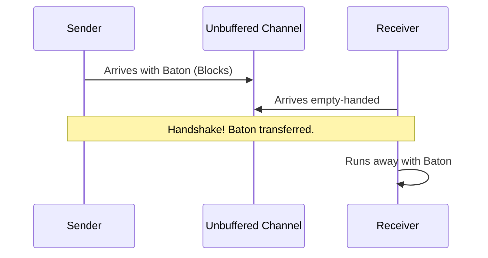

# 12. Unbuffered Channels

> **Difficulty:** Beginner → Intermediate
> **Estimated Reading Time:** 90–120 Minutes
> **Prerequisites:** Goroutines, WaitGroup, Basic Functions
> **Last Updated:** 2026-06-28

---

# Table of Contents

1. Introduction
2. Learning Objectives
3. Prerequisites
4. What are Unbuffered Channels?
5. Why Unbuffered Channels Exist
6. Go Philosophy: Share Memory by Communicating
7. Real-World Analogy
8. Synchronous Communication
9. Sender and Receiver Relationship
10. Internal Runtime Architecture
11. Memory Layout
12. Creating an Unbuffered Channel
13. Sending Data
14. Receiving Data
15. Blocking Behavior
16. Step-by-Step Execution
17. Scheduler Interaction
18. Goroutine Parking & Wake-up
19. Synchronization
20. Handshake Mechanism
21. Happens-Before Relationship
22. Channel Closing
23. Reading from Closed Channels
24. Nil Channels
25. Select with Unbuffered Channels
26. Timeout Pattern
27. Cancellation Pattern
28. Context Integration
29. Beginner Examples
30. Intermediate Examples
31. Advanced Examples
32. Request-Response Pattern
33. Pipeline Pattern
34. Worker Synchronization
35. Graceful Shutdown
36. Common Mistakes
37. Deadlocks
38. Race Conditions
39. Debugging Techniques
40. Performance Characteristics
41. Best Practices
42. Production Case Studies
43. Hands-on Labs
44. Mini Project
45. Exercises
46. Quiz
47. Interview Questions
48. Cheat Sheet
49. Summary
50. Further Reading
51. Next Chapter

---

# 1. Introduction

An **unbuffered channel** is the default channel type in Go. It is a conduit that connects two concurrent Goroutines, allowing them to pass data. What makes it unique is that it has zero capacity for storage. 

It acts as a strict synchronization point. The sender must wait for the receiver, and the receiver must wait for the sender. Because of this absolute synchronization, they are one of the safest mechanisms for preventing race conditions in backend engineering.

---

# 2. Learning Objectives

After completing this chapter you will be able to:

* Explain synchronous communication confidently.
* Predict exactly when and where a Goroutine will block.
* Prevent accidental deadlocks.
* Build synchronized pipelines.
* Answer Go interview questions regarding unbuffered channel behavior.

---

# 3. Prerequisites

You should already understand:

* Functions
* Goroutines
* WaitGroup
* Basic Go syntax

---

# 4. What are Unbuffered Channels?

By definition, an unbuffered channel is created without a capacity argument: `make(chan int)`. It has zero storage. It provides direct, instantaneous communication between two Goroutines. 

Because it cannot store data, a handoff *must* occur instantly. 

---

# 5. Why Unbuffered Channels Exist

They exist to provide **guaranteed synchronization**. When you send a value into an unbuffered channel and the line of code completes, you have absolute mathematical certainty that the receiver has received the data. There is no intermediate queue where data can sit stale.

---

# 6. Go Philosophy

> **Don't communicate by sharing memory. Share memory by communicating.**

This is Go's CSP (Communicating Sequential Processes) mantra. Instead of multiple threads locking a shared struct in memory (which is error-prone), one Goroutine holds the struct, and other Goroutines send requests via unbuffered channels. 

---

# 7. Real-World Analogy

### The Relay Race Baton

Imagine a track-and-field relay race.
* The first runner (Sender) reaches the exchange zone holding the baton (Data).
* If the second runner (Receiver) isn't there yet, the first runner **must stop and wait**. They cannot drop the baton on the floor (no buffer).
* Once both runners are side-by-side, the baton is passed directly from hand to hand. 
* Only then can the first runner stop, and the second runner continue.



---

# 8. Synchronous Communication

Synchronous communication means that the send and the receive happen at the exact same moment in time. The two Goroutines are locked together for a split second to exchange data.

---

# 9. Sender and Receiver Relationship

* **Sender Blocks**: If `ch <- data` executes first, the sender goes to sleep until a receiver executes `<-ch`.
* **Receiver Blocks**: If `<-ch` executes first, the receiver goes to sleep until a sender executes `ch <- data`.

---

# 10. Internal Runtime Architecture

Internally, an unbuffered `hchan` (channel struct) has an empty circular array. Instead, it relies on its wait queues: `sendq` and `recvq`. When a sender arrives, it is placed in the `sendq`. When the receiver arrives, the Go runtime executes a `memmove` to copy the data directly from the sender's stack to the receiver's stack.

---

# 11. Memory Layout

```text
Sender Stack                      Receiver Stack
[ Data: "Hello" ] --------------> [ Var: x ("Hello") ]
                   Direct Copy
```
There is no buffer allocation on the heap for the data itself!

---

# 12. Creating an Unbuffered Channel

```go
ch := make(chan int) // Notice: No second argument!
```
This allocates the channel control struct on the heap, ready to orchestrate handoffs for integers.

---

# 13. Sending Data

```go
ch <- 10
```
When a Goroutine hits this line, the Scheduler checks if anyone is waiting. If not, the Scheduler parks this Goroutine, changing its state to `Waiting`, and moves on to execute other Goroutines.

---

# 14. Receiving Data

```go
value := <-ch
```
When this line hits, if a sender is already parked, the receiver pulls the data, and the Scheduler instantly wakes up the sender.

---

# 15. Blocking Behavior

* **Main Goroutine Exit**: If the main Goroutine blocks on a channel and no other Goroutines are alive to wake it up, the runtime panics with a deadlock.

---

# 16. Step-by-Step Execution

1. `main` creates `ch`.
2. `main` launches `go worker(ch)`.
3. `main` hits `<-ch` and sleeps.
4. `worker` does math, hits `ch <- 42`.
5. The runtime moves `42` directly to `main`.
6. `worker` unblocks. `main` unblocks.

---

# 17. Scheduler Interaction

The Go Scheduler uses channel operations as natural preemption points. When a channel blocks, it is highly efficient because the OS Thread is freed immediately to run a different Goroutine.

---

# 18. Goroutine Parking & Wake-up

Blocked Goroutines are added to a `waitq` linked list on the channel. They consume absolutely zero CPU while parked.

---

# 19. Synchronization

Because they block until handoff, unbuffered channels can be used to synchronize execution without even sending useful data.

---

# 20. Handshake Mechanism

Sending an empty struct `struct{}{}` over an unbuffered channel is the standard way to say "I am done" or "You may proceed."

---

# 21. Happens-Before Relationship

The Go Memory Model states: *A send on a channel happens before the corresponding receive from that channel completes.* This guarantees memory visibility across CPU cores.

---

# 22. Channel Closing

```go
close(ch)
```
Closing indicates no more values will be sent. The sender should ALWAYS be the one to close the channel. 

---

# 23. Reading from Closed Channels

```go
value, ok := <-ch
```
If `ch` is closed, `ok` will be `false`, and `value` will be the zero value (e.g., `0` for int, `""` for string). This read will NOT block.

---

# 24. Nil Channels

A nil channel (`var ch chan int`) blocks forever on BOTH send and receive. This is incredibly useful in `select` statements to dynamically disable a case.

---

# 25. Select with Unbuffered Channels

`select` allows a Goroutine to wait on multiple channel operations simultaneously.
```go
select {
case val := <-ch1:
    fmt.Println(val)
case ch2 <- 10:
    fmt.Println("Sent 10")
default:
    fmt.Println("Neither ready, moving on")
}
```

---

# 26. Timeout Pattern

Using `time.After()` to prevent blocking forever.
```go
select {
case val := <-ch:
    fmt.Println(val)
case <-time.After(2 * time.Second):
    fmt.Println("Timeout!")
}
```

---

# 27. Cancellation Pattern

Closing a specific `cancelCh` channel can instantly wake up thousands of waiting Goroutines, broadcasting a cancellation signal.

---

# 28. Context Integration

`context.Context` wraps the cancellation pattern. It provides a `ctx.Done()` unbuffered channel that closes when a timeout or manual cancellation occurs.

---

# 29. Beginner Examples

```go
package main
import "fmt"

func main() {
    ch := make(chan string)
    
    go func() {
        ch <- "Ping"
    }()
    
    fmt.Println(<-ch) // Prints: Ping
}
```

---

# 30. Intermediate Examples

Ping-Pong synchronization.
```go
package main
import ("fmt"; "time")

func ping(pings chan<- string, pongs <-chan string) {
    for i := 0; i < 3; i++ {
        pings <- "ping"
        fmt.Println(<-pongs)
        time.Sleep(500 * time.Millisecond)
    }
}
```

---

# 31. Advanced Examples

A classic Request-Response service.

---

# 32. Request-Response Pattern

You can send a channel *inside* a struct over another channel!
```go
type Request struct {
    Data int
    Resp chan int // The worker sends the answer back here!
}
```

---

# 33. Pipeline Pattern

Stage A (Generates numbers) -> `chan int` -> Stage B (Squares numbers) -> `chan int` -> Stage C (Prints).

---

# 34. Worker Synchronization

Using `<-done` to wait for a worker to finish without using a WaitGroup.

---

# 35. Graceful Shutdown

Sending a stop signal over an unbuffered channel to a background task when the server receives a SIGTERM.

---

# 36. Common Mistakes

* **No Receiver**: Sending to an unbuffered channel in `main()` with no Goroutine to receive it.
* **Closing twice**: Calling `close(ch)` multiple times panics.

---

# 37. Deadlocks

If Goroutine A waits for Goroutine B, and Goroutine B waits for Goroutine A on two different unbuffered channels, a circular deadlock occurs.

---

# 38. Race Conditions

Channels prevent race conditions on the *data sent over the channel*. However, if you send a pointer, and both Goroutines access the pointer concurrently, a race condition still exists!

---

# 39. Debugging Techniques

Run `go test -race` to ensure no pointers are being manipulated concurrently after channel handoffs.

---

# 40. Performance Characteristics

Unbuffered channels incur locking and scheduling overhead. They take ~50-100 nanoseconds per operation. 

---

# 41. Best Practices

* Pass copies, not pointers, over channels.
* The sender closes the channel.
* Keep channels as restricted as possible using directions (Chapter 13).

---

# 42. Production Case Studies

Used heavily in API rate limiters and sequential database transaction orchestrators.

---

# 43. Hands-on Labs
(See Exercises)

---

# 44. Mini Project
Write a Ping-Pong game. Two Goroutines pass the string "ball" back and forth over a channel 10 times.

---

# 45. Exercises
Try implementing a timeout on the Ping-Pong game.

---

# 46. Quiz
(See Interview Questions)

---

# 47. Interview Questions

**Q**: Why do unbuffered channels guarantee synchronization?
*Answer*: Because the `<-` operation does not complete for the sender until the receiver has actively taken the value, ensuring both sides have reached the exact same point in time.

---

# 48. Cheat Sheet
* `make(chan Type)` (No capacity)
* Sending blocks until received.
* Receiving blocks until sent.

---

# 49. Summary
Unbuffered channels are the safest and most deterministic way to communicate in Go.

---

# 50. Further Reading
* Go Memory Model

---

# 51. Next Chapter
➡️ **13. Channel Directions**
