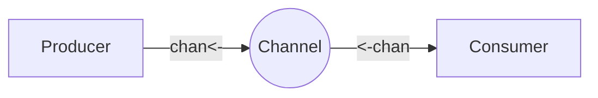

# 13. Channel Directions

> **Difficulty:** Beginner → Intermediate
> **Estimated Reading Time:** 75–100 Minutes
> **Prerequisites:** Goroutines, Channels, Buffered Channels, Unbuffered Channels
> **Last Updated:** 2026-06-28

---

# Table of Contents

1. Introduction
2. Learning Objectives
3. Prerequisites
4. Why Channel Directions Exist
5. Understanding Directional Channels
6. Go Type System and Channel Safety
7. Real-World Analogy
8. Bidirectional Channels
9. Send-Only Channels (`chan<-`)
10. Receive-Only Channels (`<-chan`)
11. Channel Direction Conversion
12. Function Parameters
13. Returning Directional Channels
14. Compiler Type Safety
15. Internal Runtime Behavior
16. Memory Layout
17. Scheduler Interaction
18. Execution Flow
19. Beginner Examples
20. Intermediate Examples
21. Advanced Examples
22. Pipeline Pattern
23. Producer-Consumer Pattern
24. Worker Pool Pattern
25. Fan-Out Pattern
26. Fan-In Pattern
27. API Design Best Practices
28. Common Mistakes
29. Deadlocks
30. Debugging
31. Performance Considerations
32. Best Practices
33. Production Case Studies
34. Hands-on Labs
35. Mini Project
36. Exercises
37. Quiz
38. Interview Questions
39. Cheat Sheet
40. Summary
41. Further Reading
42. Next Chapter

---

# 1. Introduction

By default, channels in Go are bidirectional. You can both push data into them and pull data out of them. 

However, in large codebases, giving every function full read/write access to a channel is dangerous. It becomes incredibly difficult to trace who is sending data and who is receiving it. **Channel Directions** allow you to restrict a channel to be *send-only* or *receive-only* at the function boundary, enforcing strict architectural rules.

---

# 2. Learning Objectives

After completing this chapter you will be able to:

* Restrict channels to Send-Only or Receive-Only.
* Use the compiler to catch accidental channel misuse.
* Design robust, self-documenting APIs.
* Master the Producer-Consumer pattern using directional parameters.

---

# 3. Prerequisites

You should already know:

* Buffered and Unbuffered Channels (`11-Buffered-Channels.md`, `12-Unbuffered-Channels.md`)
* Passing pointers vs values to functions.

---

# 4. Why Channel Directions Exist

If a function is only supposed to process data coming *from* a channel (a Consumer), it shouldn't accidentally have the ability to *send* data into that channel. Channel directions exist to leverage the Go Compiler to enforce API safety and prevent logic bugs.

---

# 5. Understanding Directional Channels

* **Bidirectional**: `chan int` (Can Send & Receive)
* **Send-Only**: `chan<- int` (Can only Send)
* **Receive-Only**: `<-chan int` (Can only Receive)

The arrow `<-` always points in the direction the data is moving relative to the `chan` keyword.

---

# 6. Go Type System and Channel Safety

Directional channels are baked directly into Go's static type system. If you try to send data into a `<-chan`, the Go compiler will fail the build immediately. This means bugs are caught at compile-time instead of crashing your app at runtime.

---

# 7. Real-World Analogy

* **Bidirectional (`chan`)**: A two-way street where cars can go both directions.
* **Send-Only (`chan<-`)**: A garbage chute. You can drop things into it from your apartment, but you cannot pull things out of it.
* **Receive-Only (`<-chan`)**: A water faucet. Water flows out to you, but you cannot push water back up into it.



---

# 8. Bidirectional Channels

```go
ch := make(chan int)
```
When you create a channel using `make`, it is always Bidirectional. It can both send and receive.

---

# 9. Send-Only Channels (`chan<-`)

```go
func producer(ch chan<- int) {
    ch <- 42 // OK
    // val := <-ch // COMPILER ERROR!
}
```
The arrow points *into* the `chan` keyword. The `producer` function is stating: "I will only ever put things into this pipe."

---

# 10. Receive-Only Channels (`<-chan`)

```go
func consumer(ch <-chan int) {
    val := <-ch // OK
    // ch <- 42 // COMPILER ERROR!
}
```
The arrow points *out* of the `chan` keyword. The `consumer` is stating: "I will only ever read from this pipe."

---

# 11. Channel Direction Conversion

* **Implicit Conversion**: You can pass a bidirectional channel into a function that asks for a directional channel. Go automatically restricts it for the scope of that function.
* **Impossible Conversion**: You cannot convert a receive-only channel back into a bidirectional channel.

---

# 12. Function Parameters

Using directional channels in function signatures makes your code self-documenting. A fellow developer instantly knows the data flow just by reading the function signature.

---

# 13. Returning Directional Channels

You can also return directional channels from Factory functions.
```go
func startWorker() <-chan string {
    ch := make(chan string)
    go func() { ch <- "Done!" }()
    return ch // Returns a receive-only version to the caller
}
```

---

# 14. Compiler Type Safety

```go
func reader(ch <-chan int) {
    ch <- 5 // Error: invalid operation: cannot send to receive-only channel ch
}
```

---

# 15. Internal Runtime Behavior

Directional channels exist *only* in the Go Compiler. At runtime, the Go Scheduler just sees a standard `hchan` struct. There is zero performance penalty for using directional channels.

---

# 16. Memory Layout

```text
Main (chan int) ---> [ Heap: hchan ] <--- Consumer (<-chan int)
                            ^
Producer (chan<- int) ------+
```
All functions reference the exact same memory object, just with different compiler privileges.

---

# 17. Scheduler Interaction

The Scheduler doesn't care about channel directions. It parks and unparks Goroutines exactly as it does for bidirectional channels.

---

# 18. Execution Flow

1. `main` creates `ch := make(chan int)`
2. `main` calls `go producer(ch)` and `go consumer(ch)`
3. `producer` sees `ch` as `chan<-`. It sends data.
4. `consumer` sees `ch` as `<-chan`. It receives data.

---

# 19. Beginner Examples

```go
package main
import "fmt"

func sendData(ch chan<- string) {
    ch <- "Secure Payload"
}

func readData(ch <-chan string) {
    fmt.Println(<-ch)
}

func main() {
    ch := make(chan string)
    go sendData(ch)
    readData(ch)
}
```

---

# 20. Intermediate Examples

A Background Logger service.
```go
func StartLogger() chan<- string {
    logs := make(chan string, 100)
    go func() {
        for msg := range logs {
            fmt.Println("[LOG]:", msg)
        }
    }()
    return logs
}
```

---

# 21. Advanced Examples

Building a full streaming pipeline where every stage is strictly typed.

---

# 22. Pipeline Pattern

```go
func generate() <-chan int { ... }
func square(in <-chan int) <-chan int { ... }
func printOut(in <-chan int) { ... }

// main:
// ch1 := generate()
// ch2 := square(ch1)
// printOut(ch2)
```

---

# 23. Producer-Consumer Pattern

This pattern is the bedrock of backend engineering. Producers generate work (e.g., parsing an API request), and Consumers process it (e.g., saving to a DB). Strict directional channels prevent them from interfering with each other.

---

# 24. Worker Pool Pattern

A pool of 10 Goroutines taking jobs from a `<-chan Job` and pushing results to a `chan<- Result`.

---

# 25. Fan-Out Pattern

One Producer (`chan<-`) sending data to multiple Consumers (`<-chan`).

---

# 26. Fan-In Pattern

Multiple Producers (`chan<-`) sending data to a single channel, read by one Consumer (`<-chan`).

---

# 27. API Design Best Practices

Never expose bidirectional channels in a public API/Package unless absolutely necessary. If you export a `chan`, external packages might close it or send garbage data into it. Export `<-chan` instead.

---

# 28. Common Mistakes

* Returning a bidirectional channel from a library function.
* Trying to `close()` a receive-only channel. (Only senders should close!).

---

# 29. Deadlocks

Directional channels don't prevent deadlocks, they just prevent bad data flow. A blocked `chan<-` will still cause a deadlock if the `<-chan` receiver is not running.

---

# 30. Debugging

If you see `invalid operation: <-ch (receive from send-only type chan<- int)`, you have a logic error in your code where a Producer is trying to act as a Consumer.

---

# 31. Performance Considerations

None! Compile-time type checking costs nothing at runtime.

---

# 32. Best Practices

* **Always** use `<-chan` and `chan<-` in function parameters. 
* It makes testing easier (you know exactly what mock data to provide).

---

# 33. Production Case Studies

The Go standard library `time` package. `time.After(duration)` returns a `<-chan time.Time`. It is impossible for you to send data *into* the time channel to trick the timer!

---

# 34. Hands-on Labs
(See Exercises)

---

# 35. Mini Project

**Concurrent Log Aggregator**
Create a `chan<- string` that 5 different "User" Goroutines can push log messages to. Create a Consumer that reads from `<-chan string` and writes the logs to a mock file.

---

# 36. Exercises

Write a function `func multiply(ch chan int)`. Update the signature so the compiler prevents it from sending data.

---

# 37. Quiz
(See Interview Questions)

---

# 38. Interview Questions

**Q**: Can you cast a `<-chan` back to a bidirectional `chan`?
*Answer*: No. That would defeat the type safety mechanism.

**Q**: Why does `time.Tick` return a `<-chan time.Time`?
*Answer*: Because the time package is the producer of time ticks. If it returned a bidirectional channel, user code could maliciously push fake ticks into the channel, breaking the application's timing logic.

---

# 39. Cheat Sheet

* `chan int`: Read and Write
* `chan<- int`: Write Only (Send)
* `<-chan int`: Read Only (Receive)

---

# 40. Summary

Channel directions are a zero-cost abstraction that utilize the Go compiler to enforce clean, safe, and readable concurrent architectural boundaries.

---

# 41. Further Reading
* Effective Go: Channels

---

# 42. Next Chapter
➡️ **14. Closing Channels**
