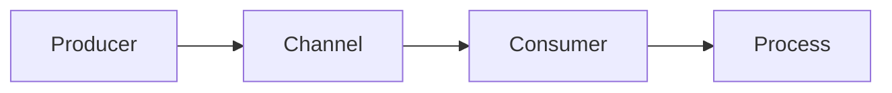

# 15. Range Over Channels

> **Difficulty:** Beginner → Intermediate → Advanced
> **Estimated Reading Time:** 90–120 Minutes
> **Prerequisites:** Goroutines, Channels, Buffered Channels, Unbuffered Channels, Channel Directions, Closing Channels
> **Last Updated:** YYYY-MM-DD

---

# Table of Contents

1. Introduction
2. Learning Objectives
3. Prerequisites
4. Why Range Over Channels?
5. Understanding `range`
6. How `range` Works Internally
7. Real-World Analogy
8. Channel Lifecycle with `range`
9. Execution Flow
10. Internal Runtime Behavior
11. Memory Layout
12. Syntax
13. Basic Example
14. Multiple Values Example
15. Buffered Channel Example
16. Unbuffered Channel Example
17. Worker Pool Example
18. Pipeline Example
19. Fan-In Example
20. Fan-Out Example
21. Producer–Consumer Pattern
22. Infinite Streams
23. Graceful Shutdown
24. Handling Closed Channels
25. Comparing `range` vs Manual Receive
26. Scheduler Interaction
27. Performance Characteristics
28. Common Mistakes
29. Deadlocks
30. Debugging Techniques
31. Best Practices
32. Production Case Studies
33. Hands-on Labs
34. Mini Project
35. Exercises
36. Quiz
37. Interview Questions
38. Cheat Sheet
39. Summary
40. Further Reading
41. Next Chapter

---

# 1. Introduction

Explain:

* What `range` does with channels.
* Why it is one of the most common Go concurrency patterns.
* Why almost every worker pool and pipeline uses it.

---

# 2. Learning Objectives

After completing this chapter you will be able to:

* Use `range` confidently with channels.
* Understand when loops terminate.
* Design clean worker pools.
* Build streaming pipelines.
* Avoid common mistakes.
* Handle graceful shutdown correctly.
* Write idiomatic Go code.

---

# 3. Prerequisites

You should understand:

* Goroutines
* Channel creation
* Buffered channels
* Unbuffered channels
* Channel closing

---

# 4. Why Range Over Channels?

Discuss:

* Cleaner code
* Automatic termination
* Idiomatic Go
* Reduced boilerplate

---

# 5. Understanding `range`

Explain:

```go
for value := range jobs {
    process(value)
}
```

How it differs from:

```go
for {
    value, ok := <-jobs
    if !ok {
        break
    }
    process(value)
}
```

---

# 6. How `range` Works Internally

Explain that the compiler expands the loop into repeated receive operations checking the `ok` value until the channel is closed.

---

# 7. Real-World Analogy

Examples:

* Conveyor belt
* Restaurant order queue
* Factory assembly line
* Airport baggage belt

Mermaid diagram:



---

# 8. Channel Lifecycle with `range`

Show:

```text
Create
   ↓
Send Values
   ↓
Close Channel
   ↓
Drain Remaining Values
   ↓
Loop Ends
```

---

# 9. Execution Flow

Illustrate:

1. Sender writes values.
2. Receiver iterates.
3. Channel closes.
4. Remaining values are processed.
5. Loop exits automatically.

---

# 10. Internal Runtime Behavior

Explain:

* Receive operation
* `ok` flag
* Scheduler wake-up
* Blocking behavior

---

# 11. Memory Layout

Visualize:

* Channel buffer
* Reader position
* Writer position
* Queue draining

---

# 12. Syntax

```go
for value := range ch {
    fmt.Println(value)
}
```

Explain every part.

---

# 13. Basic Example

Single producer → single consumer.

Line-by-line explanation.

---

# 14. Multiple Values Example

Send several values before closing.

Explain iteration order.

---

# 15. Buffered Channel Example

Show how buffered values continue to be processed after closing.

---

# 16. Unbuffered Channel Example

Explain synchronization while iterating.

---

# 17. Worker Pool Example

Jobs channel.

Workers consume:

```go
for job := range jobs {
    process(job)
}
```

Explain graceful termination.

---

# 18. Pipeline Example

Reader

↓

Parser

↓

Validator

↓

Writer

Each stage ranges over its input channel.

---

# 19. Fan-In Example

Merge multiple input channels into one output stream.

---

# 20. Fan-Out Example

Multiple workers consume from a shared jobs channel.

---

# 21. Producer–Consumer Pattern

Illustrate producer closing the channel and consumers exiting naturally.

---

# 22. Infinite Streams

Discuss:

* Why `range` never exits without channel closure.
* Long-running services.
* Streaming systems.

---

# 23. Graceful Shutdown

Demonstrate stopping workers by closing the jobs channel.

---

# 24. Handling Closed Channels

Explain:

* Remaining buffered values
* Loop termination
* No panic on receive

---

# 25. Comparing `range` vs Manual Receive

Comparison table:

* Readability
* Control
* Error handling
* Performance
* Use cases

---

# 26. Scheduler Interaction

Explain how goroutines block and wake while waiting for channel values.

---

# 27. Performance Characteristics

Discuss:

* Minimal overhead
* Blocking behavior
* Throughput considerations

---

# 28. Common Mistakes

Examples:

* Forgetting to close the channel.
* Closing from the receiver.
* Expecting `range` to stop automatically.
* Leaking goroutines.

Provide corrected implementations.

---

# 29. Deadlocks

Show common deadlock scenarios caused by channels never being closed.

---

# 30. Debugging Techniques

Use:

* Logging
* `runtime.NumGoroutine()`
* `go test -race`
* `runtime/trace`
* `pprof`

---

# 31. Best Practices

Checklist:

* Close channels from the sender.
* Prefer `range` for consumers.
* Document ownership.
* Avoid unnecessary manual receive loops.

---

# 32. Production Case Studies

Examples:

* Kafka consumer loop
* Email processing service
* Image processing pipeline
* Background task queue
* Metrics collector
* Log aggregation service

---

# 33. Hands-on Labs

Build:

* Worker pool
* Pipeline
* Concurrent file processor
* Event consumer

---

# 34. Mini Project

**Concurrent CSV Processing Service**

Requirements:

* Producer reads CSV rows.
* Workers process records.
* Results channel.
* Graceful shutdown.
* Logging.
* Unit tests.

---

# 35. Exercises

Beginner → Expert coding challenges.

---

# 36. Quiz

* Multiple Choice
* Code Prediction
* Debugging
* True/False

---

# 37. Interview Questions

### Beginner

* What does `range` do on a channel?

### Intermediate

* When does a `range` loop terminate?
* Why must the sender close the channel?

### Advanced

* Compare `range` with manual receives.
* Explain buffered channel behavior after closure.
* Design a worker pool using `range`.

---

# 38. Cheat Sheet

```go
// Iterate until channel closes
for value := range ch {
    fmt.Println(value)
}

// Equivalent manual version
for {
    value, ok := <-ch
    if !ok {
        break
    }
    fmt.Println(value)
}
```

Rules:

* ✅ `range` ends only when the channel is closed.
* ✅ Buffered values are processed before termination.
* ❌ Never expect `range` to stop automatically.

---

# 39. Summary

Review:

* How `range` works
* Automatic termination
* Worker pool pattern
* Pipeline processing
* Best practices

---

# 40. Further Reading

* Effective Go
* Go Blog: Pipelines and Cancellation
* Go Memory Model
* Go Runtime Source Code

---

# 41. Next Chapter

➡️ **16. Select Statement**
