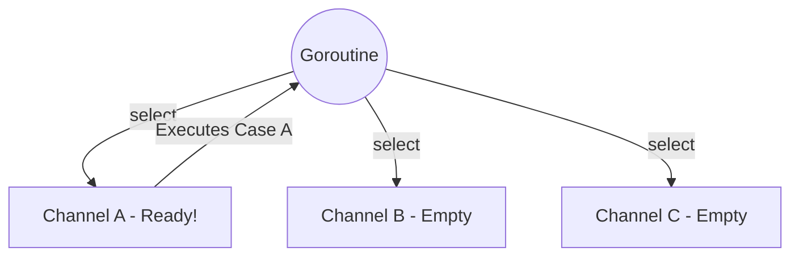

# The Select Statement

---

# Table of Contents

* Introduction
* Learning Objectives
* Prerequisites
* Why This Topic Exists
* Real-World Analogy
* Core Concepts
* Internal Runtime Explanation
* Memory Layout
* Architecture Diagram
* Step-by-Step Execution
* Syntax
* Beginner Example
* Intermediate Example
* Advanced Example
* Production Use Cases
* Performance Analysis
* Best Practices
* Common Mistakes
* Debugging Guide
* Exercises
* Quiz
* Interview Questions
* Mini Project
* Cheat Sheet
* Summary
* Key Takeaways
* Further Reading
* Next Chapter

---

# Introduction

In previous chapters, we learned how to send and receive from a single channel. But what if a Goroutine needs to listen to *three different channels* at the same time? If it blocks waiting on Channel A, it will miss messages arriving on Channel B.

The `select` statement is Go's solution. It acts like a `switch` statement, but specifically designed for Channels. It allows a single Goroutine to wait on multiple channel operations concurrently, executing whichever one is ready first.

---

# Learning Objectives

After completing this chapter you will be able to:

* Multiplex multiple channels into a single Goroutine.
* Implement non-blocking sends and receives using the `default` case.
* Use `select` to implement timeouts and cancellation signals.
* Understand the pseudo-random execution order of `select`.

---

# Prerequisites

Before reading this chapter you should know:

* Buffered & Unbuffered Channels
* Channel Blocking Behavior
* Basic `switch` statements

---

# Why This Topic Exists

Without `select`, it is impossible for one Goroutine to orchestrate multiple independent streams of data cleanly. You would be forced to spawn dozens of micro-Goroutines just to wait on individual channels, leading to spaghetti code and massive complexity.

`select` is the engine that drives complex concurrent patterns like Fan-In, Worker Pools, and Context Cancellation.

---

# Real-World Analogy

### The Receptionist

Imagine a receptionist sitting at a desk with three different colored telephones (Channels).
* **Without `select`**: The receptionist stares directly at the Red phone waiting for it to ring. The Blue phone rings, but they ignore it completely because they are blocked on the Red phone.
* **With `select`**: The receptionist waits for *any* phone to ring. If the Blue phone rings, they answer it. If the Green phone rings, they answer it. If both ring at the exact same time, they flip a coin and pick one. If *no* phone is ringing (and they have a `default` case), they read a book instead of waiting.

---

# Core Concepts

* **Multiplexing**: Waiting on multiple channel operations simultaneously.
* **Non-Blocking (`default`)**: If a `select` has a `default` case, it evaluates instantly. If no channels are ready, it executes `default` instead of sleeping.
* **Random Selection**: If multiple channels are ready at the same time, Go picks one at pseudo-random to prevent starvation.
* **Nil Channels**: A `nil` channel blocks forever. In a `select`, reading/writing to a `nil` channel is simply ignored, which is a powerful feature for disabling cases dynamically.

---

# Internal Runtime Explanation

When the Go runtime hits a `select` statement, it takes a lock on *all* channels involved in the cases. It evaluates them in a random order. 
1. If any channel is ready (data available to read, or space available to write), it unlocks the channels and executes that case.
2. If no channel is ready and a `default` case exists, it executes `default`.
3. If no channel is ready and there is NO `default`, the runtime puts the Goroutine to sleep and adds it to the wait queues of *every single channel* in the `select`. When any one of those channels receives activity, the Goroutine is woken up, removed from the other queues, and executes.

---

# Memory Layout

```text
Goroutine Stack:
[ select statement ]

Waiting on:
+----------------+       +----------------+
| Channel A      |       | Channel B      |
| WaitQ: [G1]    |       | WaitQ: [G1]    |
+----------------+       +----------------+
```
*Note: `G1` is parked in both queues simultaneously!*

---

# Architecture Diagram



---

# Step-by-Step Execution

1. Code reaches `select { ... }`.
2. Runtime evaluates `case msg1 := <-ch1`. (Empty).
3. Runtime evaluates `case msg2 := <-ch2`. (Ready!).
4. Data is popped from `ch2` into `msg2`.
5. The block inside `case msg2` executes.
6. The `select` statement finishes (it does NOT loop automatically).

---

# Syntax

```go
select {
case msg1 := <-ch1:
    fmt.Println("Received from ch1:", msg1)
case ch2 <- "ping":
    fmt.Println("Sent ping to ch2")
default:
    fmt.Println("No communication ready")
}
```

---

# Beginner Example

Listening to two channels.

```go
package main

import (
	"fmt"
	"time"
)

func main() {
	ch1 := make(chan string)
	ch2 := make(chan string)

	go func() {
		time.Sleep(2 * time.Second)
		ch1 <- "Message from 1"
	}()

	go func() {
		time.Sleep(1 * time.Second)
		ch2 <- "Message from 2"
	}()

	// The select will block until ONE of the channels is ready.
	// Since ch2 sleeps for 1 sec, it will be ready first!
	select {
	case msg1 := <-ch1:
		fmt.Println("Received:", msg1)
	case msg2 := <-ch2:
		fmt.Println("Received:", msg2)
	}
	
	// Output: Received: Message from 2
}
```

---

# Intermediate Example

The Non-Blocking Send. A highly crucial pattern in production servers to prevent hanging when traffic spikes.

```go
package main

import (
	"fmt"
)

func main() {
	ch := make(chan string, 1) // Buffer of 1
	ch <- "Hello"              // Fills the buffer

	// We want to send "World", but the buffer is full.
	// A normal send `ch <- "World"` would deadlock.
	// Instead, we use select with default!
	select {
	case ch <- "World":
		fmt.Println("Message sent!")
	default:
		fmt.Println("Warning: Channel full! Dropping message.")
	}
}
```

---

# Advanced Example

The `for-select` Loop. Usually, you want to continuously listen to channels, not just once. We wrap `select` in a `for` loop. We also use a `done` channel to gracefully break out of the infinite loop.

```go
package main

import (
	"fmt"
	"time"
)

func main() {
	ticker := time.NewTicker(500 * time.Millisecond)
	done := make(chan struct{})

	go func() {
		time.Sleep(2 * time.Second)
		close(done) // Signal to stop
	}()

	fmt.Println("Starting background worker...")
	
loop:
	for {
		select {
		case t := <-ticker.C:
			fmt.Println("Tick at", t)
		case <-done:
			fmt.Println("Shutdown signal received!")
			// We MUST use a labeled break, because a normal 'break' 
			// would only break out of the 'select', not the 'for' loop!
			break loop 
		}
	}
	
	fmt.Println("Exited cleanly")
}
```

---

# Production Use Cases

### 1. HTTP Request Timeouts
When your API makes a request to a 3rd party database, you cannot wait forever. You launch the DB query in a Goroutine that returns data on `dbChan`. You use a `select` to race `dbChan` against `time.After(3 * time.Second)`. If the timer wins, you return a 504 Gateway Timeout.

### 2. Fan-In Multiplexing
If you have 5 different Kafka consumers all generating events, you can create a single master Goroutine that uses a `for-select` loop to listen to all 5 consumer channels, aggregating the data into a single stream.

---

# Performance Analysis

* **Locking Cost**: A `select` statement must briefly lock every channel it references to evaluate them safely. A `select` with 50 cases is slower than a `select` with 2 cases.
* **Randomization Overhead**: Go uses a fast pseudo-random number generator to shuffle the evaluation order to prevent starvation. This adds a tiny microsecond overhead.

---

# Best Practices

* **Always use labeled breaks**: When breaking out of a `for-select` loop based on a channel close, a standard `break` statement just exits the `select`. You must label your `for` loop (e.g. `loop:`) and call `break loop`.
* **Beware the busy loop**: A `for { select { default: } }` loop will execute millions of times per second, maxing out an entire CPU core at 100%. Only use `default` inside a `for` loop if you are intentionally rate-limiting or doing other CPU-intensive work.

---

# Common Mistakes

### Ignoring Nil Channels
```go
var ch chan int // ch is nil!
select {
case <-ch: // This case is permanently disabled because ch is nil.
    fmt.Println("Never prints")
}
// If this is the only case, it causes a Deadlock panic!
```
*Note: This behavior is actually a feature! You can purposefully set a channel to `nil` inside a loop to turn off a specific case once that channel is exhausted.*

---

# Debugging Guide

* **Deadlocks**: If a `select` has no `default`, and none of its channels are ever written/read to, the runtime will panic with a deadlock.

---

# Exercises

## Beginner
Write a script with two channels. In a Goroutine, send a value to Channel A after 2 seconds. Send a value to Channel B after 4 seconds. Use `select` to print whichever one finishes first.

## Intermediate
Write a script that attempts to push 5 values into a buffered channel of capacity 2. Use a `select` with a `default` case inside a loop. Count how many values were successfully pushed and how many were "dropped" because the buffer was full.

---

# Quiz

## Multiple Choice Questions
**1. What happens if multiple cases in a `select` are ready at the exact same time?**
A) It executes them in top-to-bottom code order.
B) It executes all of them concurrently.
C) It picks one at pseudo-random.
D) It panics.
*Answer*: C

## True or False
**A `select` statement automatically loops until a case is matched.**
*Answer*: False. A `select` without a `default` blocks once, executes one case, and finishes. If there is a `default`, it executes instantly and finishes. To loop, you must explicitly wrap it in a `for` loop.

---

# Interview Questions

## Beginner
**Q**: What is the purpose of the `default` case in a `select` statement?
*Answer*: It prevents the `select` from blocking. If no channel operations are ready immediately, the `default` case executes, allowing the Goroutine to move on.

## Intermediate
**Q**: Why does Go evaluate `select` cases randomly when multiple are ready?
*Answer*: To prevent starvation. If it always evaluated top-to-bottom, a highly active channel at the top would permanently monopolize the Goroutine, starving the channels at the bottom.

## Google-Level Questions
**Q**: You have a `for-select` loop processing jobs from `jobChan`, but you also need to listen for a cancellation signal on `doneChan`. If `jobChan` is constantly full of millions of jobs, is it possible for the cancellation signal to be ignored for a while?
*Answer*: Yes. Because `select` uses pseudo-random selection when multiple channels are ready, if `jobChan` is *always* ready and `doneChan` becomes ready, there is a statistical probability that `jobChan` could be picked several times in a row before `doneChan` is picked. In highly constrained real-time systems, this is a known caveat.

---

# Mini Project

**Requirement**: The Fast Responder
Write a function `FetchData()` that launches three HTTP GET requests to 3 different mock URLs concurrently. Each request puts its result into a shared `chan string`. Use a `select` statement to grab the very first response that comes back, and ignore the other two (the "Fastest Wins" pattern).

---

# Cheat Sheet

* **Block on Multiple**: `select { case <-ch1: case <-ch2: }`
* **Non-Blocking**: Add `default:`
* **Break Loop**: Use `break loopLabel`
* **Random**: If both are ready, Go flips a coin.

---

# Summary

The `select` statement transforms channels from simple pipes into complex orchestration tools. By allowing a Goroutine to juggle multiple inputs and outputs simultaneously, it enables the timeouts, cancellations, and fan-in architectures that power modern Go microservices.

---

# Key Takeaways

* ✔ `select` waits on multiple channels.
* ✔ `default` makes channel operations non-blocking.
* ✔ Multiple ready cases are chosen randomly.
* ✔ `nil` channels are ignored by `select`.

---

# Further Reading
* [Go Concurrency Patterns: Timing out, moving on](https://go.dev/blog/concurrency-timeouts)

---

# Next Chapter
➡️ **Next:** `17-Timers.md`
