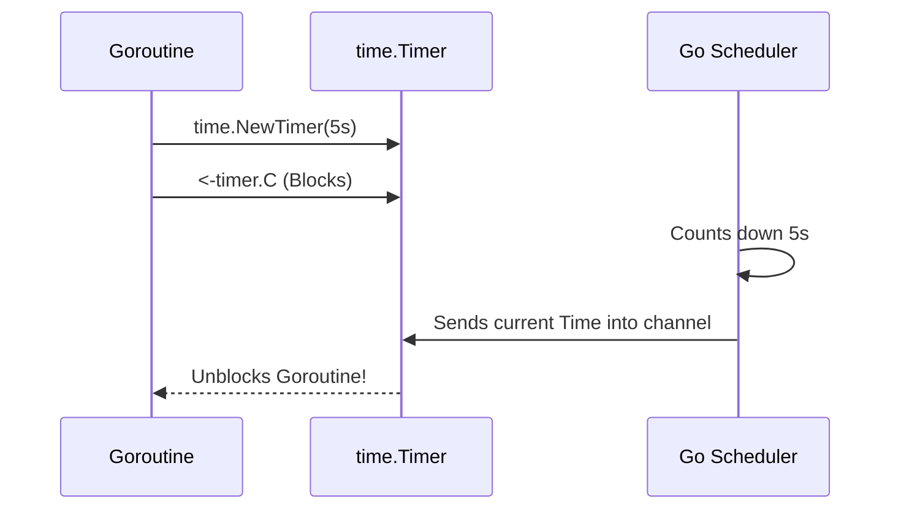

# Timers

---

# Table of Contents

* Introduction
* Learning Objectives
* Prerequisites
* Why This Topic Exists
* Real-World Analogy
* Core Concepts
* Internal Runtime Explanation
* Memory Layout
* Architecture Diagram
* Step-by-Step Execution
* Syntax
* Beginner Example
* Intermediate Example
* Advanced Example
* Production Use Cases
* Performance Analysis
* Best Practices
* Common Mistakes
* Debugging Guide
* Exercises
* Quiz
* Interview Questions
* Mini Project
* Cheat Sheet
* Summary
* Key Takeaways
* Further Reading
* Next Chapter

---

# Introduction

In concurrent programming, managing exactly *when* something happens is just as important as *what* happens. 
Go provides a robust, channel-based approach to time management through the `time.Timer` object and the `time.After()` function. Timers allow you to execute code after a specific duration, perfectly integrated with the `select` statement.

---

# Learning Objectives

After completing this chapter you will be able to:

* Delay execution safely using `time.After`.
* Create and manually stop `time.Timer` objects.
* Implement API request timeouts.
* Prevent Goroutine leaks caused by abandoned timers.

---

# Prerequisites

Before reading this chapter you should know:

* `select` statements (`16-Select.md`)
* Goroutine Leaks (`08-Goroutines.md`)

---

# Why This Topic Exists

The most common way beginners delay code is by using `time.Sleep()`. However, `time.Sleep()` is a sledgehammer: it halts the Goroutine completely, and there is no way to cancel it midway.

If you are waiting for a network request to finish, but you want to give up after 5 seconds, `time.Sleep()` cannot help you. Timers exist to provide **interruptible**, channel-based delays.

---

# Real-World Analogy

### The Kitchen Oven Alarm

* **time.Sleep**: You put a cake in the oven, sit on a chair, cover your eyes and ears, and count to 3000 seconds. If the kitchen catches fire, you won't notice until you finish counting.
* **time.Timer**: You put a cake in the oven, set a kitchen timer, and go read a book (or do other work in a `select` loop). When the timer reaches 0, it rings an alarm (sends a message on a channel). If the kitchen catches fire before it goes off, you can simply reach over, turn the timer off (`timer.Stop()`), and evacuate immediately.

---

# Core Concepts

* **`time.Timer`**: An object that fires a single event in the future.
* **`timer.C`**: The `<-chan time.Time` inside the Timer object. The timer sends the current time down this channel when it expires.
* **`timer.Stop()`**: Safely cancels a timer before it fires, preventing it from executing.
* **`time.After()`**: A convenience wrapper around `time.Timer` that just returns the channel.

---

# Internal Runtime Explanation

Historically (before Go 1.14), Go maintained a single global background thread (a min-heap of timers) that monitored all timers in the application. This caused massive lock contention.

In modern Go (1.14+), every Logical Processor (**P**) manages its own local heap of timers. When the Scheduler looks for work for a Goroutine, it also checks the P's local timer heap. If a timer has expired, the Scheduler takes the associated Goroutine and puts it in the Run Queue. This makes Go timers incredibly highly performant and scalable.

---

# Memory Layout

```text
Heap Memory
+---------------------------------------------------+
| time.Timer Struct                                 |
|                                                   |
| - Duration: 5 Seconds                             |
| - C: (Pointer to hchan) --------------------+     |
+---------------------------------------------|-----+
                                              |
Stack (Main Goroutine)                        v
[ select ]                             +-------------+
[ case <-timer.C ] <------------------ | chan Time   |
                                       +-------------+
```

---

# Architecture Diagram



---

# Step-by-Step Execution

1. `timer := time.NewTimer(2 * time.Second)` creates the object.
2. The runtime adds this timer to the Processor's (P) min-heap.
3. The Goroutine hits `<-timer.C` and goes to sleep.
4. After 2 seconds, the runtime scheduler notices the expiration.
5. The runtime sends the timestamp into the channel `C`.
6. The Goroutine wakes up and continues.

---

# Syntax

```go
// Method 1: The explicit Timer object (can be stopped)
timer := time.NewTimer(2 * time.Second)
<-timer.C 

// Method 2: The shorthand (cannot be stopped)
<-time.After(2 * time.Second)
```

---

# Beginner Example

A simple block using `time.After`.

```go
package main

import (
	"fmt"
	"time"
)

func main() {
	fmt.Println("Timer started...")

	// Blocks for 2 seconds
	<-time.After(2 * time.Second)

	fmt.Println("Timer fired!")
}
```

---

# Intermediate Example

The Timeout Pattern. This is how you prevent Goroutines from waiting forever.

```go
package main

import (
	"fmt"
	"time"
)

func fetchFromDatabase(ch chan string) {
	time.Sleep(3 * time.Second) // Simulated slow database
	ch <- "Data Payload"
}

func main() {
	ch := make(chan string)
	go fetchFromDatabase(ch)

	fmt.Println("Fetching data...")

	select {
	case data := <-ch:
		fmt.Println("Success:", data)
	case <-time.After(2 * time.Second): // The Timeout!
		fmt.Println("Error: Database took too long! Aborting.")
	}
}
// Output: Error: Database took too long! Aborting.
```

---

# Advanced Example

Using `time.NewTimer` to allow cancellation. `time.After` is bad in `for` loops because the timers are not garbage collected until they expire. If you use a real `time.Timer`, you can `Stop()` it to free memory instantly.

```go
package main

import (
	"fmt"
	"time"
)

func main() {
	timer := time.NewTimer(5 * time.Second)
	
	// Create a channel to simulate an early interruption
	interrupt := make(chan bool)
	
	go func() {
		time.Sleep(2 * time.Second)
		interrupt <- true
	}()

	select {
	case <-timer.C:
		fmt.Println("Timer naturally expired.")
	case <-interrupt:
		fmt.Println("Interrupted early! Stopping timer.")
		// Stop the timer so the Go runtime can garbage collect it immediately
		if !timer.Stop() {
			// Drain the channel if it already fired while we were stopping it
			<-timer.C
		}
	}
}
```

---

# Production Use Cases

### 1. HTTP Client Timeouts
If you are building a custom HTTP Client wrapper, you will launch the HTTP request in a Goroutine and use `select` with `time.After` to enforce a strict SLA (Service Level Agreement) on the response time.

### 2. Exponential Backoff
When retrying a failed connection to a database, you use timers to wait 1 second, then 2 seconds, then 4 seconds, etc., before retrying.

---

# Performance Analysis

* **`time.After` Leaks**: Every call to `time.After()` allocates a timer on the heap. If you put `time.After(1 * time.Hour)` inside a `for-select` loop that iterates 1,000 times a second, you will allocate 1,000 timers per second that sit in RAM for a full hour! This will OOM crash your server.
* **`time.NewTimer` Reuse**: For tight loops, allocate a single `time.NewTimer` *outside* the loop, and use `timer.Reset(duration)` inside the loop.

---

# Best Practices

* **Always use `timer.Stop()`**: If a `select` statement finishes via a different case, manually stop the timer so the runtime can free it.
* **Avoid `time.After` in loops**: As mentioned above, it is a massive memory leak vector. Use `time.NewTimer` and `Reset()`.

---

# Common Mistakes

### The `time.After` Memory Leak
```go
func listener(ch chan int) {
    for {
        select {
        case <-ch:
            fmt.Println("Got data")
        // MISTAKE: This creates a NEW 1-hour timer on every loop iteration!
        case <-time.After(1 * time.Hour):
            return
        }
    }
}
```
*Fix*:
```go
timer := time.NewTimer(1 * time.Hour)
for {
    select {
    case <-ch:
        // Reset the single timer!
        if !timer.Stop() { <-timer.C }
        timer.Reset(1 * time.Hour)
    case <-timer.C:
        return
    }
}
```

---

# Debugging Guide

* **pprof**: If your Go application is steadily consuming more memory over several hours but the Goroutine count is stable, take a heap profile. You will likely see millions of `time.Timer` structs trapped in memory from abusing `time.After`.

---

# Exercises

## Beginner
Write a script that uses `select`. Have one case wait for `time.After(3 * time.Second)` and another wait for `time.After(1 * time.Second)`. Which one prints?

## Intermediate
Refactor the "Beginner" exercise to use `time.NewTimer` instead. When the 1-second timer wins the race, safely `Stop()` the 3-second timer.

---

# Quiz

## Multiple Choice Questions
**1. Why is `time.Sleep` worse than `time.After` for concurrency?**
A) Sleep uses more CPU.
B) Sleep cannot be used in a `select` statement.
C) Sleep is less accurate.
*Answer*: B

## True or False
**Timers in Go require a dedicated OS thread to count the seconds.**
*Answer*: False. They are managed internally by the Scheduler's Logical Processors (P) using highly efficient min-heaps.

---

# Interview Questions

## Beginner
**Q**: What does `time.After(duration)` return?
*Answer*: It returns a receive-only channel (`<-chan time.Time`) that will receive the current time once the duration has elapsed.

## Intermediate
**Q**: When should you use `time.NewTimer` instead of `time.After`?
*Answer*: You should use `time.NewTimer` whenever you might need to cancel the timer before it expires, particularly inside long-running `for` loops, to prevent memory leaks.

## Google-Level Questions
**Q**: Explain how to safely `Reset()` a `time.Timer` that has already fired or might have fired.
*Answer*: You must ensure the channel `C` is drained. You call `if !timer.Stop() { <-timer.C }` before calling `timer.Reset()`. If you don't drain the channel, the next time you `select` on it, it will immediately fire using the old value left in the channel buffer!

---

# Mini Project

**Requirement**: The Bomb Defusal Game
Write a CLI script. A bomb is set to explode in 5 seconds (using a Timer). A Goroutine listens to `os.Stdin` for the user to type "defuse" and press enter. If the user types it in time, `Stop()` the timer and print "You survived!". If 5 seconds pass, print "BOOM!". Use a `select` statement to race them.

---

# Cheat Sheet

* **Shorthand**: `<-time.After(d)`
* **Object**: `t := time.NewTimer(d)`
* **Cancel**: `t.Stop()`
* **Reset**: `t.Reset(d)`

---

# Summary

Timers are the backbone of resilient concurrent architecture. By integrating delays directly into the channel ecosystem, Go allows developers to write robust timeout logic that prevents servers from hanging indefinitely on slow databases or network calls.

---

# Key Takeaways

* ✔ `time.After` returns a channel.
* ✔ Timers enable the Timeout pattern via `select`.
* ✔ Avoid `time.After` inside infinite loops.
* ✔ Use `Stop()` to clean up memory instantly.

---

# Further Reading
* [Go 1.14 Release Notes: Scalable Timers](https://golang.org/doc/go1.14#runtime)

---

# Next Chapter
➡️ **Next:** `18-Tickers.md`
