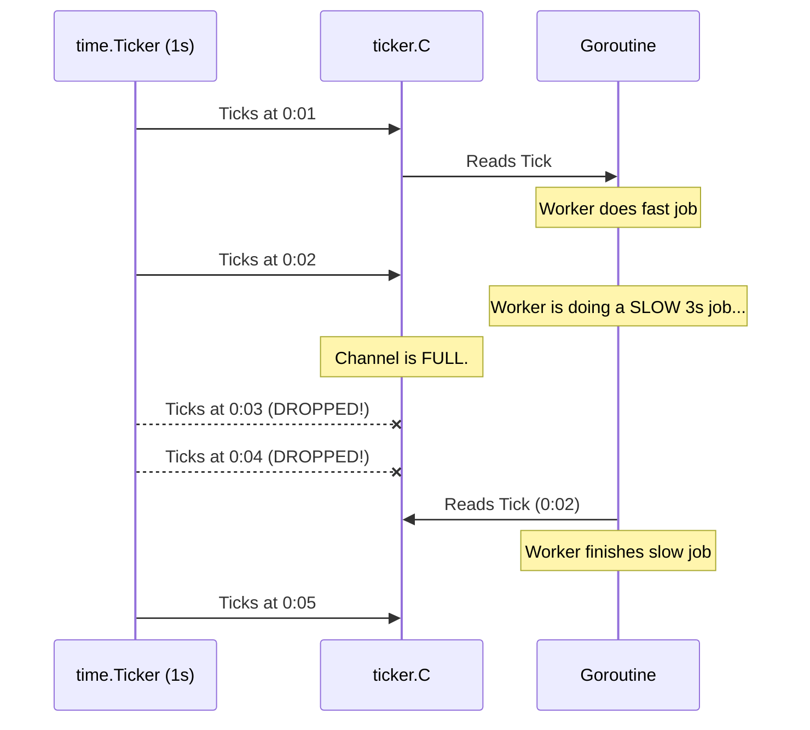

# Tickers

---

# Table of Contents

* Introduction
* Learning Objectives
* Prerequisites
* Why This Topic Exists
* Real-World Analogy
* Core Concepts
* Internal Runtime Explanation
* Memory Layout
* Architecture Diagram
* Step-by-Step Execution
* Syntax
* Beginner Example
* Intermediate Example
* Advanced Example
* Production Use Cases
* Performance Analysis
* Best Practices
* Common Mistakes
* Debugging Guide
* Exercises
* Quiz
* Interview Questions
* Mini Project
* Cheat Sheet
* Summary
* Key Takeaways
* Further Reading
* Next Chapter

---

# Introduction

In the previous chapter, we learned how to use `time.Timer` to delay an action or enforce a timeout once. But what if you need an action to happen repeatedly, exactly every 5 seconds, forever?

This is where `time.Ticker` comes in. A Ticker acts like a metronome, sending the current time down a channel at a regular, repeating interval until you explicitly tell it to stop.

---

# Learning Objectives

After completing this chapter you will be able to:

* Run background jobs at fixed intervals.
* Safely stop tickers to prevent memory and CPU leaks.
* Use `time.Tick` vs `time.NewTicker` correctly.
* Handle delayed or blocked ticker events.

---

# Prerequisites

Before reading this chapter you should know:

* `select` statements (`16-Select.md`)
* `time.Timer` (`17-Timers.md`)

---

# Why This Topic Exists

Backend systems constantly require recurring background tasks. Examples include:
* Polling a database table for new "pending" emails every 10 seconds.
* Refreshing an OAuth token every 45 minutes.
* Flushing an in-memory cache to disk every 5 minutes.

Without Tickers, developers would use a loop with `time.Sleep()`. However, `time.Sleep()` drifts over time and cannot be cleanly interrupted by a cancellation signal. Tickers integrate perfectly with channels and `select`, providing rock-solid, interruptible cron-like functionality.

---

# Real-World Analogy

### The Dripping Faucet

* **Timer**: A water balloon. It fills up, explodes once, and is done.
* **Ticker**: A dripping faucet. Exactly one drop of water falls every 2 seconds into a bucket. 
* **The Buffer**: If you don't empty the bucket (read from the channel), the bucket doesn't overflow infinitely. Go's Ticker has a buffer of exactly 1. If you miss a drop, the Ticker simply drops the new water on the floor (skips sending the tick) until you empty the bucket.

---

# Core Concepts

* **`time.Ticker`**: An object that fires an event repeatedly at a specified interval.
* **`ticker.C`**: The `<-chan time.Time` that receives the ticks.
* **`ticker.Stop()`**: Stops the ticker from firing any future events.
* **Dropping Ticks**: If the receiver is too slow and the channel is full, the Ticker does *not* block. It simply drops the missed ticks to prevent memory exhaustion.

---

# Internal Runtime Explanation

Under the hood, a Ticker uses the exact same highly-optimized min-heap mechanism as a Timer, managed by the Logical Processor (P). 

When a Timer fires, it is removed from the heap. When a Ticker fires, the Go runtime calculates the *next* time it should fire, updates the Ticker's timestamp, and automatically pushes it back onto the min-heap. This happens seamlessly in C-level runtime code.

---

# Memory Layout

```text
Heap Memory
+---------------------------------------------------+
| time.Ticker Struct                                |
|                                                   |
| - Interval: 10 Seconds                            |
| - Next Fire: 12:00:10                             |
| - C: (Pointer to hchan, capacity = 1) ------+     |
+---------------------------------------------|-----+
                                              |
Stack (Background Goroutine)                  v
[ for { select } ]                     +-------------+
[ case <-ticker.C ] <----------------- | chan Time   |
                                       +-------------+
```

---

# Architecture Diagram



---

# Step-by-Step Execution

1. `ticker := time.NewTicker(1 * time.Second)` is called.
2. Goroutine enters a `for-select` loop and blocks on `<-ticker.C`.
3. After 1 second, the runtime sends the time into `C`.
4. Goroutine wakes up, processes the job, and loops back to block on `C`.
5. If the Goroutine takes 5 seconds to process the job, it will miss 4 ticks. They are safely discarded.

---

# Syntax

```go
// Method 1: The explicit Ticker object (SAFE, can be stopped)
ticker := time.NewTicker(1 * time.Second)
defer ticker.Stop()

// Method 2: The shorthand (DANGEROUS, leaks memory!)
<-time.Tick(1 * time.Second)
```

---

# Beginner Example

A simple repeating background job.

```go
package main

import (
	"fmt"
	"time"
)

func main() {
	ticker := time.NewTicker(500 * time.Millisecond)
	
	// We use a counter just to end the program for this example
	counter := 0
	
	fmt.Println("Starting metronome...")

	for t := range ticker.C {
		fmt.Println("Tick at", t.Format("05.000"))
		counter++
		if counter >= 5 {
			ticker.Stop() // Always stop your tickers!
			break
		}
	}
	
	fmt.Println("Finished")
}
```

---

# Intermediate Example

The standard background worker pattern using `select` and a `done` channel.

```go
package main

import (
	"fmt"
	"time"
)

func backgroundWorker(done chan bool) {
	ticker := time.NewTicker(1 * time.Second)
	// ALWAYS defer Stop() to prevent memory leaks if the Goroutine exits early!
	defer ticker.Stop() 

	for {
		select {
		case <-ticker.C:
			fmt.Println("Worker: Polling database...")
		case <-done:
			fmt.Println("Worker: Shutting down gracefully")
			return
		}
	}
}

func main() {
	done := make(chan bool)
	go backgroundWorker(done)

	time.Sleep(3 * time.Second)
	done <- true // Send shutdown signal
	time.Sleep(100 * time.Millisecond) // Give it time to print
}
```

---

# Advanced Example

Handling long-running jobs that take *longer* than the tick interval. Notice how the Ticker automatically drops the missed ticks, preventing a backlog of events.

```go
package main

import (
	"fmt"
	"time"
)

func main() {
	// Tick every 1 second
	ticker := time.NewTicker(1 * time.Second)
	defer ticker.Stop()

	fmt.Println("Start:", time.Now().Format("05.000"))

	// We only loop 3 times
	for i := 0; i < 3; i++ {
		t := <-ticker.C
		fmt.Println("Received Tick:", t.Format("05.000"))
		
		// Simulate a job that takes 2.5 seconds (longer than the 1s interval!)
		time.Sleep(2500 * time.Millisecond) 
	}
}
// OUTPUT:
// Start: 00.000
// Received Tick: 01.000
// Received Tick: 03.500  (Notice 02.000 was dropped!)
// Received Tick: 06.000  (Notice 04.000 and 05.000 were dropped!)
```

---

# Production Use Cases

### 1. In-Memory Cache Expiry
A microservice holds a map of User session tokens in memory. Every 60 seconds, a Goroutine running a Ticker iterates through the map and deletes any tokens that have expired, freeing up RAM.

### 2. Batch Writing
Writing to a database row-by-row is slow. Instead, incoming HTTP requests push data to a slice (protected by a Mutex). A background Goroutine runs a Ticker every 5 seconds. When the Ticker fires, the Goroutine grabs the slice, writes all rows to PostgreSQL in a single bulk transaction, and clears the slice.

---

# Performance Analysis

* **Dropped Ticks vs Queueing**: Because a Ticker drops ticks if the receiver is busy, it guarantees that your Goroutine will never drown in a backlog of old, useless ticks. It will simply get the freshest tick when it is ready.
* **Stop Overhead**: `ticker.Stop()` does not close the channel. It just removes the ticker from the runtime heap. This is an O(log N) operation and is extremely fast.

---

# Best Practices

* **Always use `defer ticker.Stop()`**: If your Goroutine exits (due to a panic, a return, or a break), the Ticker will continue to fire in the background forever, causing a memory leak.
* **Never use `time.Tick()`**: The official documentation explicitly warns that `time.Tick()` cannot be stopped. It is a guaranteed memory leak unless you plan to run it for the entire lifetime of the application.

---

# Common Mistakes

### The `time.Tick` Leak
```go
func badWorker() {
    // MISTAKE: time.Tick returns a channel but no Ticker object.
    // There is no way to Stop() it. When this function returns, 
    // the timer heap will continue firing this tick forever in the background!
    for t := range time.Tick(1 * time.Second) {
        fmt.Println(t)
        return // LEAK!
    }
}
```

---

# Debugging Guide

* **Profiling**: Just like Timers, if you abuse `time.Tick` or forget `ticker.Stop()`, your heap profile (`pprof`) will show a massive buildup of internal runtime timer structs.

---

# Exercises

## Beginner
Create a Ticker that ticks every 200ms. Print "Beep". After 1 second (use `time.After`), stop the ticker and exit.

## Intermediate
Write a script that ticks every 1 second. Inside the loop, generate a random number between 1 and 10. If the number is 7, print "Jackpot!", stop the ticker, and break the loop.

---

# Quiz

## Multiple Choice Questions
**1. What happens if a Ticker fires, but the receiver is currently busy doing a 5-minute task?**
A) The Ticker blocks until the receiver is ready.
B) The Ticker buffers all the missed ticks in a large queue.
C) The Ticker drops the missed ticks.
D) The program panics.
*Answer*: C

## True or False
**Calling `ticker.Stop()` closes the `ticker.C` channel.**
*Answer*: False. It only stops the timer from sending future values. It does *not* close the channel. (If it did, concurrent readers might panic).

---

# Interview Questions

## Beginner
**Q**: What is the difference between `time.Timer` and `time.Ticker`?
*Answer*: A Timer fires exactly once after a duration. A Ticker fires repeatedly at regular intervals.

## Intermediate
**Q**: Why does the official Go documentation advise against using `time.Tick()`?
*Answer*: Because `time.Tick()` does not return the underlying Ticker object, meaning you cannot call `Stop()` on it. This causes a permanent memory leak in the Go runtime timer heap if used inside short-lived functions.

## Google-Level Questions
**Q**: A background Goroutine uses a `time.Ticker(1 * time.Second)` to poll a database. Due to a network outage, the database query takes 10 seconds to timeout. When the query finally times out and the loop continues, will the Goroutine receive 10 queued ticks instantly?
*Answer*: No. The `time.Ticker` channel has a capacity of 1. While the Goroutine was blocked on the database query for 10 seconds, the Ticker successfully sent 1 tick into the channel, but dropped the remaining 9. When the loop continues, the Goroutine will process that 1 buffered tick instantly, and then wait for the next fresh tick.

---

# Mini Project

**Requirement**: The Heartbeat Monitor
Write a program with a `time.Ticker` ticking every 2 seconds. This is the "Heartbeat". 
Create a second Goroutine that occasionally sends a `true` value down a `simulateCrash` channel at a random interval (e.g., after 7 seconds). 
In your `for-select` loop, if you receive the crash signal, break the loop and print "System Down!". Ensure you `Stop()` the ticker cleanly before exiting.

---

# Cheat Sheet

* **Create**: `t := time.NewTicker(duration)`
* **Cleanup**: `defer t.Stop()`
* **Wait**: `<-t.C`
* **Warning**: Avoid `time.Tick()`

---

# Summary

Tickers provide a robust, channel-native way to execute recurring background tasks. Because they integrate seamlessly with `select` and automatically drop missed ticks, they are far superior to `time.Sleep` loops for production services.

---

# Key Takeaways

* ✔ Tickers fire repeatedly at fixed intervals.
* ✔ Always `defer ticker.Stop()`.
* ✔ Missed ticks are dropped, not queued indefinitely.
* ✔ `time.Tick()` causes memory leaks.

---

# Further Reading
* [Go time package source code](https://golang.org/src/time/tick.go)

---

# Next Chapter
➡️ **Next:** `19-Context.md`
