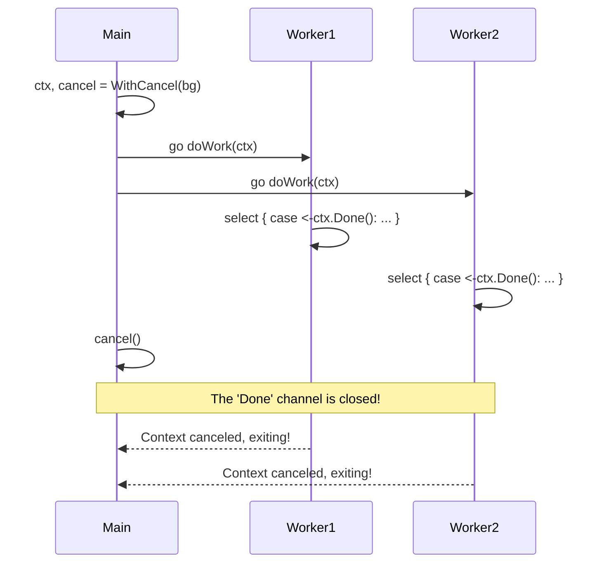

# Context Cancellation

---

# Table of Contents

* Introduction
* Learning Objectives
* Prerequisites
* Why This Topic Exists
* Real-World Analogy
* Core Concepts
* Internal Runtime Explanation
* Memory Layout
* Architecture Diagram
* Step-by-Step Execution
* Syntax
* Beginner Example
* Intermediate Example
* Advanced Example
* Production Use Cases
* Performance Analysis
* Best Practices
* Common Mistakes
* Debugging Guide
* Exercises
* Quiz
* Interview Questions
* Mini Project
* Cheat Sheet
* Summary
* Key Takeaways
* Further Reading
* Next Chapter

---

# Introduction

In Chapter 19, we learned how to use `context.Context` to pass values down a call stack. Now, we unlock its true superpower: **Cancellation**.

When you spin up dozens of Goroutines to handle a task, you need a way to stop them all instantly if the task is no longer needed (e.g., the user disconnected, or a timeout was reached). `context.WithCancel` provides an elegant, standardized mechanism to broadcast a stop signal to an entire tree of Goroutines.

---

# Learning Objectives

After completing this chapter you will be able to:

* Understand how `ctx.Done()` works under the hood.
* Use `context.WithCancel`, `WithTimeout`, and `WithDeadline`.
* Implement the cascading cancellation pattern.
* Prevent Goroutine leaks in complex backend systems.

---

# Prerequisites

Before reading this chapter you should know:

* `context.Context` basics (`19-Context.md`)
* Channel Closing as a broadcast signal (`14-Channel-Closing.md`)
* `select` statements (`16-Select.md`)

---

# Why This Topic Exists

Imagine a user loads a massive reporting dashboard on your website. Your Go backend fires off 5 SQL queries concurrently. 
Suddenly, the user gets impatient, closes the browser tab, and leaves.

If your backend doesn't handle cancellation, those 5 SQL queries will continue to run, consuming CPU, RAM, and database connections for absolutely no reason. By passing a cancelable Context down to your database driver, the moment the user closes the tab, Go instantly aborts all 5 queries, freeing up server resources.

---

# Real-World Analogy

### The General and the Troops

* **The Hierarchy**: A General gives orders to 3 Captains. Each Captain gives orders to 10 Soldiers.
* **The Context**: The General establishes a secure radio channel (the Context).
* **The Cancellation**: The General realizes the mission is a trap and presses the "Abort" button (`cancel()`).
* **The Cascade**: The radio channel emits a loud beep to the Captains. The Captains instantly pass the beep down to their Soldiers. Every single person in the hierarchy instantly drops what they are doing and retreats.

---

# Core Concepts

* **`ctx.Done()`**: Returns a receive-only channel (`<-chan struct{}`). This channel is closed when the context is canceled.
* **`context.WithCancel(parent)`**: Wraps a parent context and returns a new context plus a `cancel()` function.
* **`context.WithTimeout(parent, duration)`**: Automatically calls `cancel()` after a specific amount of time.
* **Cascading**: Canceling a parent context automatically cancels *all* child contexts derived from it.

---

# Internal Runtime Explanation

When you call `context.WithCancel(ctx)`, the `context` package creates a new `cancelCtx` struct. This struct holds a `done` channel. 

When you call the `cancel()` function, the runtime executes `close(c.done)`. As we learned in Chapter 14, closing a channel instantly wakes up *every single Goroutine* waiting on it. 

Furthermore, `cancelCtx` maintains a map of all its children. When it is canceled, it recursively loops through its children and calls their `cancel()` functions, creating the cascading effect.

---

# Memory Layout

```text
Heap Memory (Context Tree)

      [ Background Context ]
                 ^
                 |
      [ cancelCtx (Root) ] <-- Holds 'done' channel A
           /          \
          /            \
[ cancelCtx (Child 1)]   [ valueCtx (Child 2) ]
 (Holds 'done' B)         (Points to Root's 'done' A)

* If Root is canceled, 'done' A is closed.
* Root then tells Child 1 to cancel, closing 'done' B.
```

---

# Architecture Diagram



---

# Step-by-Step Execution

1. `ctx, cancel := context.WithCancel(context.Background())`
2. Pass `ctx` into a Goroutine.
3. The Goroutine runs a `for-select` loop checking `case <-ctx.Done():`.
4. Main thread decides to stop and calls `cancel()`.
5. The context package calls `close(done)`.
6. The `select` in the Goroutine immediately fires. The Goroutine returns and exits safely.

---

# Syntax

```go
// 1. Manual Cancellation
ctx, cancel := context.WithCancel(context.Background())
defer cancel() // ALWAYS defer cancel to prevent leaks!

// 2. Timeout Cancellation
ctx, cancel := context.WithTimeout(context.Background(), 5 * time.Second)
defer cancel() // MUST still defer cancel!
```

---

# Beginner Example

The standard cancellation pattern inside a background worker.

```go
package main

import (
	"context"
	"fmt"
	"time"
)

func worker(ctx context.Context) {
	for {
		select {
		case <-ctx.Done(): // Will fire when cancel() is called
			// ctx.Err() tells us WHY it was canceled
			fmt.Println("Worker stopped! Reason:", ctx.Err())
			return
		default:
			fmt.Println("Working...")
			time.Sleep(500 * time.Millisecond)
		}
	}
}

func main() {
	ctx, cancel := context.WithCancel(context.Background())

	go worker(ctx)

	// Let it work for 2 seconds
	time.Sleep(2 * time.Second)
	
	fmt.Println("Main: Sending cancel signal!")
	cancel() // Broadcasts the stop signal
	
	time.Sleep(100 * time.Millisecond)
}
```

---

# Intermediate Example

Using `WithTimeout` to prevent an HTTP request or DB query from hanging forever.

```go
package main

import (
	"context"
	"fmt"
	"time"
)

func slowDatabaseQuery(ctx context.Context) {
	// Simulate a query that takes 5 seconds
	select {
	case <-time.After(5 * time.Second):
		fmt.Println("Database: Query finished successfully")
	case <-ctx.Done():
		fmt.Println("Database: Aborting query! Reason:", ctx.Err())
	}
}

func main() {
	// Set a strict deadline of 2 seconds
	ctx, cancel := context.WithTimeout(context.Background(), 2 * time.Second)
	// Even if it times out naturally, you MUST call cancel to free the timer resources!
	defer cancel() 

	fmt.Println("Main: Starting query...")
	slowDatabaseQuery(ctx)
	fmt.Println("Main: Done")
}
// OUTPUT: 
// Main: Starting query...
// Database: Aborting query! Reason: context deadline exceeded
// Main: Done
```

---

# Advanced Example

The Cascading effect. Canceling a parent automatically cancels its children.

```go
package main

import (
	"context"
	"fmt"
	"time"
)

func childWorker(ctx context.Context, name string) {
	<-ctx.Done()
	fmt.Printf("%s detected cancellation!\n", name)
}

func main() {
	// Root (Parent)
	parentCtx, cancelParent := context.WithCancel(context.Background())
	defer cancelParent()

	// Child (Derived from Parent)
	childCtx, cancelChild := context.WithCancel(parentCtx)
	defer cancelChild()

	go childWorker(parentCtx, "Parent-Worker")
	go childWorker(childCtx, "Child-Worker")

	time.Sleep(1 * time.Second)
	
	// If we cancel the PARENT, both workers stop!
	// If we canceled the CHILD, only the Child-Worker would stop.
	fmt.Println("Canceling Parent...")
	cancelParent()

	time.Sleep(100 * time.Millisecond)
}
```

---

# Production Use Cases

### 1. HTTP Server Graceful Shutdown
When `http.Server.Shutdown(ctx)` is called, the standard library uses the provided context's deadline to decide exactly how long to wait for existing active HTTP connections to finish before brutally severing them.

### 2. Client Disconnections
Every `http.Request` has a context (`r.Context()`). If a client closes their browser tab, the Go HTTP server detects the broken TCP connection and automatically calls `cancel()` on that request's context. If you pass `r.Context()` to your SQL driver, the driver will catch the `<-ctx.Done()` and send a `KILL` command to Postgres, aborting the query mid-flight!

---

# Performance Analysis

* **`defer cancel()` requirement**: `context.WithTimeout` creates a `time.Timer` under the hood. If you do not call `cancel()`, that timer will sit in RAM until the timeout expires naturally. In a high-traffic API, this will leak millions of timers and crash your server. **Always defer cancel!**
* **Context Creation Cost**: Creating a `cancelCtx` involves a minor heap allocation and a Mutex lock to register it with its parent. It is very fast, but not free.

---

# Best Practices

* **Always check `<-ctx.Done()`**: If you are writing a loop or a long-running function that takes a context, you have a moral obligation to periodically check `<-ctx.Done()` and exit if it is closed. Passing context without checking it is useless.
* **Pass context down to external libraries**: If you are using AWS SDK, GCP, Redis, or Postgres, they all accept `context.Context`. Pass it to them! They have built-in logic to abort network calls when the context is canceled.

---

# Common Mistakes

### Forgetting `defer cancel()`
```go
func handleRequest() {
    // MISTAKE: We didn't defer cancel().
    // The context will leak memory until the 10 seconds is up, 
    // even if the function finishes in 1 second!
    ctx, _ := context.WithTimeout(context.Background(), 10 * time.Second)
    
    doWork(ctx)
}
```

---

# Debugging Guide

* **Context Deadline Exceeded**: If you see this error, your timeout was too short, or your external dependency (like a database) is lagging.
* **Context Canceled**: If you see this error from a database driver, it usually means the client disconnected (closed the browser) before the query could finish.

---

# Exercises

## Beginner
Create a context with a timeout of 1 second. Write a `for` loop that prints "Working" and sleeps for 300ms. Check `ctx.Done()` inside the loop to break out when the timeout hits.

## Intermediate
Create a parent context. Derive a child context from it using `WithCancel`. Launch a Goroutine using the *child* context. Call `cancel()` on the *parent*. Verify that the child Goroutine still stops.

---

# Quiz

## Multiple Choice Questions
**1. How does `ctx.Done()` notify Goroutines that it is canceled?**
A) It sends a boolean `true` down the channel.
B) It triggers a `panic`.
C) The internal channel is closed, instantly unblocking all receivers.
*Answer*: C

## True or False
**If a function finishes normally before the Context timeout is reached, you do not need to call the `cancel()` function.**
*Answer*: False. You MUST call `cancel()` (usually via `defer`) to clean up the internal timers and parent references, otherwise you will cause a memory leak.

---

# Interview Questions

## Beginner
**Q**: What is the difference between `WithCancel` and `WithTimeout`?
*Answer*: `WithCancel` provides a context that only cancels when you manually invoke the `cancel()` function. `WithTimeout` provides a context that cancels manually *or* automatically when the specified time duration elapses.

## Intermediate
**Q**: Why is `ctx.Done()` a receive-only channel (`<-chan struct{}`) instead of just returning a boolean?
*Answer*: Because a channel allows Goroutines to use the `select` statement. This means a Goroutine can wait on network I/O and wait for a cancellation signal *at the exact same time* concurrently.

## Google-Level Questions
**Q**: Explain how Context avoids Data Races when canceling a massive tree of children.
*Answer*: The internal `cancelCtx` struct contains a `sync.Mutex`. When a parent context is canceled, it locks the mutex, loops through its internal map of children, calls their `cancel()` functions, sets an internal `err` variable, and then closes the `done` channel. This mutex ensures that even if multiple Goroutines try to cancel the context simultaneously, the closure happens safely exactly once.

---

# Mini Project

**Requirement**: The Patient Downloader
Write a function `DownloadFile(ctx context.Context, url string)`. Inside, simulate a download that takes 4 seconds. 
In `main`, call this function, but give it a `context.WithTimeout` of 3 seconds. 
Ensure the `DownloadFile` function correctly detects the timeout and prints "Download Aborted". 
Change the timeout to 5 seconds and verify it prints "Download Complete".

---

# Cheat Sheet

* **Cancel**: `ctx, cancel := context.WithCancel(parent)`
* **Timeout**: `ctx, cancel := context.WithTimeout(parent, duration)`
* **Check if Done**: `<-ctx.Done()`
* **Get Reason**: `ctx.Err()` (returns `context.Canceled` or `context.DeadlineExceeded`)

---

# Summary

Context Cancellation is the crown jewel of Go concurrency. It elegantly ties together Channels, Select, and Timers into a unified API. By adopting it, you ensure your backend systems are resilient, efficient, and completely leak-free under heavy load.

---

# Key Takeaways

* ✔ `ctx.Done()` closes a channel to broadcast cancellation.
* ✔ Always `defer cancel()` to prevent leaks.
* ✔ Canceling a parent cancels all children.
* ✔ Check `ctx.Done()` in all long-running tasks.

---

# Further Reading
* [Go Concurrency Patterns: Context](https://go.dev/blog/context)

---

# Next Chapter
➡️ **Next:** `21-Mutex.md`
