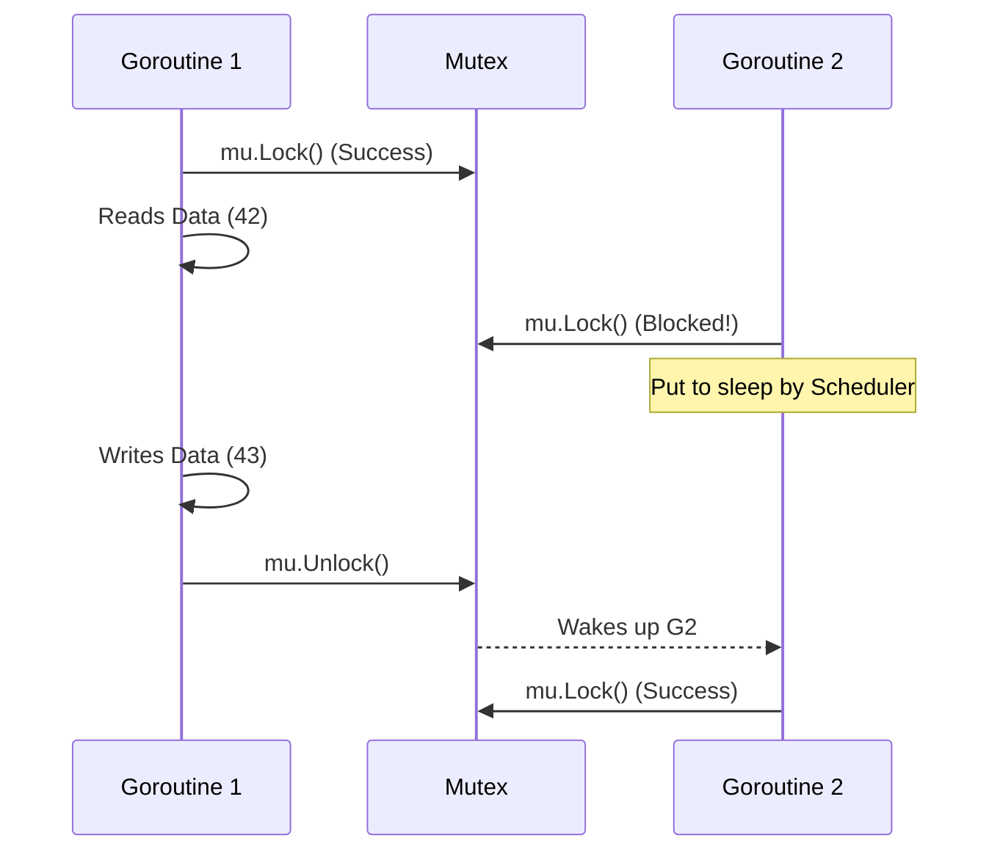

# Mutex

---

# Table of Contents

* Introduction
* Learning Objectives
* Prerequisites
* Why This Topic Exists
* Real-World Analogy
* Core Concepts
* Internal Runtime Explanation
* Memory Layout
* Architecture Diagram
* Step-by-Step Execution
* Syntax
* Beginner Example
* Intermediate Example
* Advanced Example
* Production Use Cases
* Performance Analysis
* Best Practices
* Common Mistakes
* Debugging Guide
* Exercises
* Quiz
* Interview Questions
* Mini Project
* Cheat Sheet
* Summary
* Key Takeaways
* Further Reading
* Next Chapter

---

# Introduction

So far, we have focused on Go's CSP model: *Share memory by communicating (Channels).* 
However, Go is a pragmatic language. Sometimes, communicating via channels is overkill. If you just need 1,000 Goroutines to safely increment a simple counter, setting up a channel pipeline is tedious and slow.

For these situations, Go provides traditional Shared Memory synchronization via the `sync` package. The most fundamental tool in this package is the **Mutex** (Mutual Exclusion lock).

---

# Learning Objectives

After completing this chapter you will be able to:

* Understand when to use a Mutex over a Channel.
* Protect shared state using `sync.Mutex`.
* Prevent Data Races in concurrent systems.
* Avoid the dreaded Deadlock panic.

---

# Prerequisites

Before reading this chapter you should know:

* Structs and Pointers
* WaitGroups (`09-WaitGroup.md`)
* The definition of a Data Race

---

# Why This Topic Exists

If two Goroutines attempt to read and write to the same variable in memory at the exact same millisecond, the CPU will corrupt the data. This is a **Data Race**.

A Mutex solves this by providing a programmatic "lock" around a section of code (a Critical Section). If one Goroutine holds the lock, all other Goroutines are frozen in place until the lock is released.

---

# Real-World Analogy

### The Single Bathroom Key

* **Shared Resource (Variable)**: A single bathroom in a coffee shop.
* **Goroutines**: 10 customers who all need to use the bathroom.
* **The Mutex**: The physical key attached to a giant wooden block.
* **Lock()**: A customer takes the key and enters the bathroom. If anyone else tries to enter, they see the key is gone, and they *wait* outside the door (Blocked).
* **Unlock()**: The customer finishes, walks out, and returns the key. The next person in line grabs the key and enters.

---

# Core Concepts

* **Mutex**: Mutual Exclusion. Only one Goroutine can hold it at a time.
* **Critical Section**: The specific lines of code surrounded by `Lock()` and `Unlock()`.
* **Lock Contention**: When too many Goroutines are waiting in line for the Mutex, slowing down the application.
* **Data Race**: What happens when you forget to use a Mutex.

---

# Internal Runtime Explanation

Internally, `sync.Mutex` is just an integer (32-bit state). 
When `Lock()` is called, Go uses an atomic CPU instruction (like compare-and-swap) to flip a bit in that integer from 0 to 1. 

If the bit is already 1, the Go Scheduler places the Goroutine into a wait queue (a semaphore) and puts it to sleep, releasing the OS Thread. When `Unlock()` is called, the state is flipped back to 0, and the runtime wakes up the next Goroutine in the queue.

---

# Memory Layout

```text
Heap Memory

+-----------------------------+
| Counter Struct              |
|                             |
| mu sync.Mutex [ State: 1 ]  | <--- Locked!
| value: 42                   |
+-----------------------------+
           ^           ^
           |           |
       Goroutine A   Goroutine B
      (Modifying)     (Parked, Waiting for mu)
```

---

# Architecture Diagram



---

# Step-by-Step Execution

1. Declare a `sync.Mutex`.
2. Goroutine A calls `mu.Lock()`. It succeeds.
3. Goroutine A begins modifying a shared map.
4. Goroutine B calls `mu.Lock()`. It fails to acquire it and blocks.
5. Goroutine A calls `mu.Unlock()`.
6. Goroutine B wakes up, acquires the lock, and modifies the map.

---

# Syntax

```go
import "sync"

var mu sync.Mutex

mu.Lock()
// Critical Section (Only 1 Goroutine here at a time)
// Modify variables...
mu.Unlock()
```

---

# Beginner Example

The classic "Counter" Data Race, solved with a Mutex.

```go
package main

import (
	"fmt"
	"sync"
)

type SafeCounter struct {
	mu    sync.Mutex
	count int
}

func (c *SafeCounter) Increment(wg *sync.WaitGroup) {
	defer wg.Done()
	
	// Lock BEFORE touching the shared state
	c.mu.Lock()
	c.count++
	// ALWAYS Unlock when done
	c.mu.Unlock()
}

func main() {
	counter := SafeCounter{}
	var wg sync.WaitGroup

	// 1,000 Goroutines trying to increment at the exact same time
	for i := 0; i < 1000; i++ {
		wg.Add(1)
		go counter.Increment(&wg)
	}

	wg.Wait()
	fmt.Println("Final Count:", counter.count) 
	// Guaranteed to be exactly 1000.
}
```

---

# Intermediate Example

Using `defer mu.Unlock()`. This is a critical best practice to ensure the lock is always released, even if the function panics or returns early.

```go
package main

import (
	"fmt"
	"sync"
)

type SafeMap struct {
	mu   sync.Mutex
	data map[string]string
}

func (m *SafeMap) ReadOrSet(key, val string) string {
	m.mu.Lock()
	// Using defer ensures Unlock is called no matter which return branch is taken!
	defer m.mu.Unlock()

	if existing, ok := m.data[key]; ok {
		return existing
	}

	m.data[key] = val
	return val
}

func main() {
	cache := SafeMap{data: make(map[string]string)}
	fmt.Println(cache.ReadOrSet("name", "GoVerse"))
}
```

---

# Advanced Example

Deadlocks! If you try to lock a Mutex that you *already hold*, or if you forget to unlock it, your program will freeze.

```go
package main

import "sync"

func main() {
	var mu sync.Mutex

	mu.Lock()
	// We hold the lock.
	
	// MISTAKE: We forgot to Unlock(), or we accidentally called Lock() twice.
	mu.Lock() 
	
	// The runtime sees we are waiting for a lock, but no other 
	// Goroutine is running to unlock it.
	// FATAL: all goroutines are asleep - deadlock!
}
```

---

# Production Use Cases

### 1. In-Memory Caches
If you are building a custom Redis-like cache in Go, the underlying data structure is simply a `map[string]interface{}`. Because Maps in Go are *not* thread-safe, you must wrap every `Get` and `Set` operation in a `sync.Mutex` lock to prevent the application from crashing under concurrent traffic.

### 2. State Machines
When managing the state of a complex object (e.g., a Video Encoding Job), changing its state from "Pending" to "Processing" to "Completed" must be atomic. A Mutex ensures that two background workers don't accidentally pick up the same "Pending" job simultaneously.

---

# Performance Analysis

* **Cost of a Lock**: An uncontended lock (no one else is waiting) takes about ~15 nanoseconds. It is incredibly fast.
* **Contention Bottleneck**: If 10,000 Goroutines are fighting for the exact same lock simultaneously, the CPU will spend more time context-switching parked Goroutines than doing actual work. This is called Lock Contention. If this happens, you should use Channels or a `sync.RWMutex` (Chapter 22).

---

# Best Practices

* **Keep Critical Sections Small**: Do not hold a lock while making an HTTP request or a Database query! Only hold the lock while manipulating the in-memory variables, then unlock it immediately.
* **Use `defer`**: `defer mu.Unlock()` is the safest way to prevent accidental deadlocks from early `return` statements.
* **Embed the Mutex**: It is idiomatic in Go to put the Mutex directly above the fields it protects inside a struct.

---

# Common Mistakes

### Copying a Mutex by Value
```go
// BAD: Passing the Mutex by value creates a COPY of the lock!
// The copy starts unlocked, meaning the Mutex does absolutely nothing!
func doWork(mu sync.Mutex) {
    mu.Lock() // Locks the copy, not the original!
    defer mu.Unlock()
}
```
*Fix*: Always pass a Mutex by pointer (`*sync.Mutex`), or better yet, make it a method on a struct with a pointer receiver.

---

# Debugging Guide

* **The Race Detector**: To prove you need a Mutex, run your code with `go run -race main.go`. The Go compiler will instrument your code and aggressively warn you if two Goroutines touch the same memory without a lock.

---

# Exercises

## Beginner
Create a struct containing an integer `balance` and a `sync.Mutex`. Write a `Deposit(amount)` method. Launch 100 Goroutines that each deposit $10. Print the final balance (should be 1000).

## Intermediate
Intentionally create a Data Race by removing the `Lock()` and `Unlock()` from your Beginner exercise. Run the program multiple times. Does the final balance fluctuate? (Run it with `go run -race` to see the warning!).

---

# Quiz

## Multiple Choice Questions
**1. What happens if a Goroutine calls `mu.Lock()` on a Mutex that is already locked by another Goroutine?**
A) It skips the critical section.
B) It panics.
C) It blocks and goes to sleep until it is unlocked.
*Answer*: C

## True or False
**Maps in Go are thread-safe by default and do not require a Mutex.**
*Answer*: False. Concurrent read/writes to a Go map will cause a fatal runtime panic. You MUST use a Mutex (or `sync.Map`).

---

# Interview Questions

## Beginner
**Q**: What does a Mutex do?
*Answer*: It enforces Mutual Exclusion, ensuring that only one Goroutine can execute a specific block of code (the critical section) at a time, protecting shared variables from data races.

## Intermediate
**Q**: When should you use a Channel vs a Mutex?
*Answer*: Use Channels to pass data and control flow between Goroutines (CSP). Use a Mutex when you simply need to protect a shared piece of state (like a cache map or counter) from concurrent modification.

## Google-Level Questions
**Q**: What is Mutex Starvation, and how does Go 1.9+ handle it?
*Answer*: Starvation occurs when a new Goroutine constantly steals the lock from an older Goroutine that just woke up, preventing the older Goroutine from ever acquiring it. Go solves this by switching the Mutex to "Starvation Mode" if a Goroutine waits for more than 1ms. In this mode, the lock is handed off directly from the unlocker to the waiter at the front of the queue, bypassing any new Goroutines trying to acquire it.

---

# Mini Project

**Requirement**: The Concurrent Bank
Create a `BankAccount` struct with a `balance` and a `sync.Mutex`.
Write three methods: `Deposit(amount)`, `Withdraw(amount)`, and `Balance()`. 
In `main`, use a WaitGroup to launch 50 `Deposit` Goroutines and 50 `Withdraw` Goroutines randomly. Ensure the balance never drops below zero (if a withdrawal is too large, it should fail gracefully).

---

# Cheat Sheet

* **Lock**: `mu.Lock()`
* **Unlock safely**: `defer mu.Unlock()`
* **Detect Races**: `go run -race`
* **Rule**: Keep critical sections as short as possible.

---

# Summary

The Mutex is the most fundamental synchronization primitive in computer science. While Go pushes developers toward Channels, the `sync.Mutex` remains the absolute best tool for protecting simple, shared in-memory state.

---

# Key Takeaways

* ✔ Mutex prevents Data Races.
* ✔ Always use `defer mu.Unlock()`.
* ✔ Pass Mutexes by pointer, never by value.
* ✔ Keep critical sections fast (no network I/O!).

---

# Further Reading
* [sync.Mutex Source Code](https://cs.opensource.google/go/go/+/refs/tags/go1.21.1:src/sync/mutex.go)

---

# Next Chapter
➡️ **Next:** `22-RWMutex.md`
