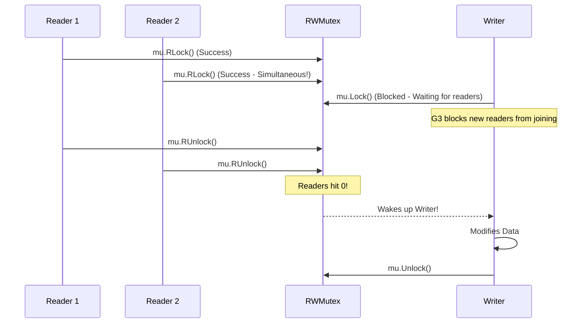

# RWMutex

---

# Table of Contents

* Introduction
* Learning Objectives
* Prerequisites
* Why This Topic Exists
* Real-World Analogy
* Core Concepts
* Internal Runtime Explanation
* Memory Layout
* Architecture Diagram
* Step-by-Step Execution
* Syntax
* Beginner Example
* Intermediate Example
* Advanced Example
* Production Use Cases
* Performance Analysis
* Best Practices
* Common Mistakes
* Debugging Guide
* Exercises
* Quiz
* Interview Questions
* Mini Project
* Cheat Sheet
* Summary
* Key Takeaways
* Further Reading
* Next Chapter

---

# Introduction

In the previous chapter, we learned that a standard `sync.Mutex` completely locks a variable. If Goroutine A is reading the variable, Goroutine B must wait to read it, even though neither of them is actually changing the data!

The **RWMutex (Read/Write Mutex)** is an optimized lock. It allows multiple Goroutines to *read* a variable at the exact same time, but mandates that only one Goroutine can *write* to it.

---

# Learning Objectives

After completing this chapter you will be able to:

* Explain the difference between `Lock()` and `RLock()`.
* Identify read-heavy workloads where RWMutex outperforms Mutex.
* Prevent accidental deadlocks caused by upgrading locks.

---

# Prerequisites

Before reading this chapter you should know:

* `sync.Mutex` (`21-Mutex.md`)

---

# Why This Topic Exists

If you are building an in-memory configuration cache, 99.9% of your traffic will be reading the configuration, and only 0.1% will be updating it. 

If you use a standard `Mutex`, every single reader blocks every other reader, causing massive Lock Contention and artificially slowing down your API. An `RWMutex` solves this by recognizing that concurrent reads are perfectly safe, removing the bottleneck.

---

# Real-World Analogy

### The Museum Display Case

* **RLock (Read Lock)**: Looking at a diamond in a museum display case. Any number of tourists can stand around the glass case and look at the diamond simultaneously without interfering with each other. 
* **Lock (Write Lock)**: The curator needs to clean the diamond. They lock the doors to the room, forcing all tourists out. Only the curator is in the room. Once they are done, they unlock the doors, and the tourists can flood back in to read (look) again.

---

# Core Concepts

* **`RLock()`**: Acquires a Read lock. Multiple Goroutines can hold a Read lock simultaneously.
* **`RUnlock()`**: Releases a Read lock.
* **`Lock()`**: Acquires a Write lock. Blocks *all* other readers and writers until released.
* **`Unlock()`**: Releases a Write lock.

---

# Internal Runtime Explanation

Internally, an `RWMutex` uses two counters and a semaphore. 
When `RLock()` is called, it increments a `readerCount`. As long as no writer is waiting, it succeeds instantly.

When a writer calls `Lock()`, it does a neat trick: it flips the `readerCount` to a massive negative number (to prevent new readers from acquiring the lock), and then goes to sleep waiting for the existing active readers to call `RUnlock()`. Once the active readers hit 0, the writer wakes up, modifies the data, and then wakes up all the readers who queued up while it was writing.

---

# Memory Layout

```text
Heap Memory

+-----------------------------+
| Config Struct               |
|                             |
| mu sync.RWMutex             |
| [ readers: 3, writers: 0 ]  | <--- 3 Goroutines RLocked!
| data: "API_URL"             |
+-----------------------------+
```

---

# Architecture Diagram



---

# Step-by-Step Execution

1. Reader A calls `RLock()`. It succeeds.
2. Reader B calls `RLock()`. It succeeds. Both are reading.
3. Writer C calls `Lock()`. It blocks, waiting for A and B.
4. Reader D calls `RLock()`. It blocks! (Go prioritizes the waiting writer to prevent starvation).
5. A and B call `RUnlock()`.
6. Writer C acquires the lock, writes, and calls `Unlock()`.
7. Reader D finally acquires the lock and reads.

---

# Syntax

```go
import "sync"

var mu sync.RWMutex

// For Readers
mu.RLock()
defer mu.RUnlock()

// For Writers
mu.Lock()
defer mu.Unlock()
```

---

# Beginner Example

Building a concurrent-safe Map that is optimized for reads.

```go
package main

import (
	"fmt"
	"sync"
	"time"
)

type SafeDictionary struct {
	mu   sync.RWMutex
	data map[string]string
}

// Optimized for Multiple Readers
func (s *SafeDictionary) Read(key string) string {
	s.mu.RLock()
	defer s.mu.RUnlock()
	return s.data[key]
}

// Strictly locks for a single Writer
func (s *SafeDictionary) Write(key, val string) {
	s.mu.Lock()
	defer s.mu.Unlock()
	s.data[key] = val
}

func main() {
	dict := SafeDictionary{data: make(map[string]string)}
	dict.Write("color", "blue")

	var wg sync.WaitGroup

	// 10 Goroutines reading simultaneously without blocking each other!
	for i := 0; i < 10; i++ {
		wg.Add(1)
		go func() {
			defer wg.Done()
			fmt.Println("Read:", dict.Read("color"))
			time.Sleep(100 * time.Millisecond)
		}()
	}

	wg.Wait()
}
```

---

# Intermediate Example

Proving that Writers block Readers.

```go
package main

import (
	"fmt"
	"sync"
	"time"
)

func main() {
	var mu sync.RWMutex

	fmt.Println("Acquiring Write Lock...")
	mu.Lock()

	go func() {
		fmt.Println("Goroutine: Attempting to Read...")
		mu.RLock() // This will BLOCK until the main thread Unlocks!
		fmt.Println("Goroutine: Read Successful!")
		mu.RUnlock()
	}()

	time.Sleep(2 * time.Second)
	fmt.Println("Releasing Write Lock...")
	mu.Unlock()

	time.Sleep(500 * time.Millisecond) // Give goroutine time to finish
}
// OUTPUT:
// Acquiring Write Lock...
// Goroutine: Attempting to Read...
// Releasing Write Lock...
// Goroutine: Read Successful!
```

---

# Advanced Example

The Lock Upgrade Deadlock. A common mistake is trying to upgrade a Read lock to a Write lock without releasing it first.

```go
package main

import "sync"

func main() {
	var mu sync.RWMutex

	mu.RLock()
	
	// MISTAKE: You cannot call Lock() while holding an RLock().
	// The Lock() will wait for all readers (including YOU) to release the RLock.
	// But you are blocked waiting for the Lock! 
	// This is an instant Deadlock.
	mu.Lock() 
	
	mu.Unlock()
	mu.RUnlock()
}
// OUTPUT: fatal error: all goroutines are asleep - deadlock!
```
*Fix*: You must call `mu.RUnlock()` *before* calling `mu.Lock()`.

---

# Production Use Cases

### 1. Configuration Managers
A backend server loads a `config.json` file into memory. Thousands of HTTP requests read this config struct using `RLock()`. Every 5 minutes, a cron job checks the disk for updates. If the file changed, it calls `Lock()`, updates the struct, and `Unlock()`.

### 2. Feature Flags
Checking if a feature flag is enabled (`if flags.UseNewUI`) happens millions of times a second (Reads). Updating the flag from the admin dashboard happens once a month (Writes). This is the perfect use case for `sync.RWMutex`.

---

# Performance Analysis

* **Read-Heavy**: If your read-to-write ratio is 99:1, `RWMutex` is vastly faster than a standard `Mutex` because readers do not context-switch each other.
* **Write-Heavy**: If your read-to-write ratio is 50:50, `RWMutex` can actually be *slower* than a standard `Mutex`! Managing the internal reader/writer counters adds slight overhead. If you write constantly, just use a standard `Mutex`.

---

# Best Practices

* **Measure First**: Don't blindly use `RWMutex` thinking it's always faster. It is strictly for read-heavy workloads.
* **Keep Writers Fast**: Because a Writer blocks *all* Readers, your `Lock()` critical sections must be extraordinarily fast to prevent latency spikes in your API.

---

# Common Mistakes

### Using RLock for Writing
```go
func (s *SafeStore) BadWrite() {
    // MISTAKE: Using RLock to protect a map mutation!
    s.mu.RLock() 
    s.data["key"] = "value" // FATAL: Concurrent map write panic!
    s.mu.RUnlock()
}
```

---

# Debugging Guide

* **Go Race Detector**: The race detector (`go run -race`) fully understands `RWMutex`. If you accidentally write data while holding an `RLock`, the compiler will throw a race warning.

---

# Exercises

## Beginner
Create a struct with a string `message` and an `RWMutex`. Write a `ReadMsg()` and `WriteMsg()` function. Launch 5 readers and 1 writer simultaneously.

## Intermediate
Prove the "Lock Upgrade Deadlock" locally. Write a function that acquires `RLock`, reads a value, decides it needs to be updated, and attempts to acquire `Lock`. Watch it crash. Fix it by adding `RUnlock` before the upgrade.

---

# Quiz

## Multiple Choice Questions
**1. What happens if 5 Goroutines call `RLock()` simultaneously?**
A) 1 gets the lock, 4 block.
B) All 5 get the lock and continue executing concurrently.
C) It triggers a panic.
*Answer*: B

## True or False
**An RWMutex is always faster than a standard Mutex.**
*Answer*: False. It is only faster in read-heavy scenarios. In write-heavy scenarios, the internal bookkeeping makes it slightly slower.

---

# Interview Questions

## Beginner
**Q**: What is the difference between `Lock()` and `RLock()`?
*Answer*: `Lock()` acquires an exclusive write lock, blocking everyone. `RLock()` acquires a shared read lock, allowing other readers to join, but blocking writers.

## Intermediate
**Q**: How does Go prevent "Writer Starvation" in an RWMutex?
*Answer*: If there is a constant stream of Readers, a Writer might never get the lock. To prevent this, when a Writer calls `Lock()`, the Go runtime immediately prevents any *new* Readers from acquiring `RLock()`. The Writer only waits for the *existing* active Readers to finish before taking control.

## Google-Level Questions
**Q**: Can you recursively acquire an `RLock()`? (i.e., calling `RLock` from a function that already holds an `RLock` on the same Mutex).
*Answer*: Yes, but it is extremely dangerous in Go. Because Go implements Writer priority, if a Writer is waiting in the queue between your first `RLock` and your second recursive `RLock`, your second `RLock` will block (yielding to the Writer). But the Writer is blocked waiting for your first `RLock` to unlock! This results in an immediate deadlock.

---

# Mini Project

**Requirement**: The Thread-Safe Cache
Build a generic caching system.
1. Create a `type Cache struct { data map[string]interface{}, mu sync.RWMutex }`.
2. Implement `Get(key) (val, bool)` using `RLock`.
3. Implement `Set(key, val)` using `Lock`.
4. In `main`, launch 100 reader Goroutines that constantly `Get` a key in an infinite loop. Launch 1 writer Goroutine that updates the key every 1 second. Ensure no panics occur.

---

# Cheat Sheet

* **Read Lock**: `mu.RLock()` / `defer mu.RUnlock()`
* **Write Lock**: `mu.Lock()` / `defer mu.Unlock()`
* **Rule**: Use for 90%+ Read workloads.

---

# Summary

The `sync.RWMutex` is a precision instrument. By differentiating between Read and Write operations, it eliminates unnecessary bottlenecks, allowing in-memory caches and configuration stores to scale to millions of concurrent reads per second.

---

# Key Takeaways

* ✔ RLock allows concurrent readers.
* ✔ Lock is strictly exclusive.
* ✔ Writers block new readers to prevent starvation.
* ✔ Do not upgrade an RLock to a Lock without unlocking first.

---

# Further Reading
* [sync.RWMutex Source Code](https://cs.opensource.google/go/go/+/refs/tags/go1.21.1:src/sync/rwmutex.go)

---

# Next Chapter
➡️ **Next:** `23-Atomic.md`
