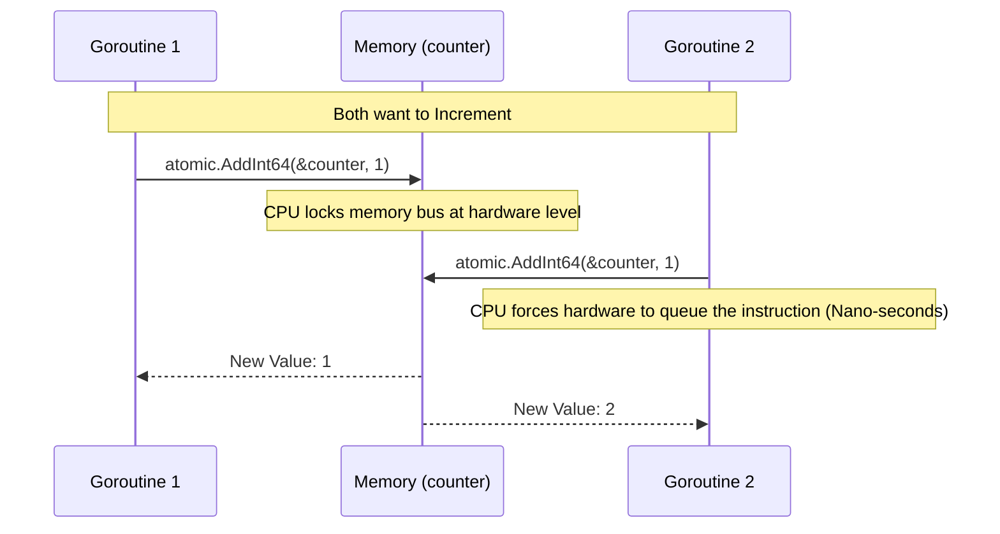

# Atomic Operations

---

# Table of Contents

* Introduction
* Learning Objectives
* Prerequisites
* Why This Topic Exists
* Real-World Analogy
* Core Concepts
* Internal Runtime Explanation
* Memory Layout
* Architecture Diagram
* Step-by-Step Execution
* Syntax
* Beginner Example
* Intermediate Example
* Advanced Example
* Production Use Cases
* Performance Analysis
* Best Practices
* Common Mistakes
* Debugging Guide
* Exercises
* Quiz
* Interview Questions
* Mini Project
* Cheat Sheet
* Summary
* Key Takeaways
* Further Reading
* Next Chapter

---

# Introduction

We've learned how to use a `sync.Mutex` to protect variables from Data Races. However, using a Mutex to increment a simple integer counter (e.g., tracking the number of HTTP requests) is like using a vault door to protect a single penny. It works, but it's massive overkill.

The `sync/atomic` package provides low-level, lock-free memory primitives. It allows you to safely manipulate basic data types (integers, pointers, booleans) across multiple Goroutines at blazing fast speeds, bypassing the Go Scheduler entirely and relying directly on the CPU hardware.

---

# Learning Objectives

After completing this chapter you will be able to:

* Explain what "Lock-Free" concurrency means.
* Use `atomic.AddInt64` and `atomic.LoadInt64`.
* Compare and Swap (CAS) values safely.
* Understand the performance difference between Atomics and Mutexes.

---

# Prerequisites

Before reading this chapter you should know:

* Data Races (`21-Mutex.md`)
* Pointers

---

# Why This Topic Exists

When you write `counter++` in Go, the CPU actually performs three separate instructions:
1. **Read** the value from RAM into the CPU Register.
2. **Add** 1 to the value in the Register.
3. **Write** the new value back to RAM.

If two Goroutines do this simultaneously, they might both read `5`, both add `1`, and both write `6`. You lose a count! 

A Mutex solves this by putting the Goroutines to sleep. The `atomic` package solves this by forcing the hardware CPU to do the Read-Add-Write in one, single, uninterrupted, un-splittable (Atomic) hardware instruction.

---

# Real-World Analogy

### The Shared Bank Ledger

* **Mutex (The Vault)**: To write in the ledger, you must ask the security guard for the vault key. If someone else is in the vault, you sit in a chair and go to sleep. When they leave, the guard wakes you up. (Slow, high overhead).
* **Atomic (The Rubber Stamp)**: The ledger is sitting on a table in the lobby. You have a special mechanical rubber stamp. You slam the stamp onto the book. It reads the current number, increments it, and prints the new number in a fraction of a second. Even if 10 people try to stamp it at the exact same time, the physical mechanics of the stamp guarantee no two stamps overlap. (Fast, no sleeping).

---

# Core Concepts

* **Atomic**: An operation that appears to the rest of the system to occur instantaneously. It cannot be interrupted mid-execution.
* **Lock-Free**: Operations that do not use Mutexes, Semaphores, or OS-level locks. They never put a Goroutine to sleep.
* **Compare And Swap (CAS)**: A specialized operation that updates a value *only if* it currently matches an expected previous value.

---

# Internal Runtime Explanation

The `sync/atomic` package is actually written mostly in Assembly language, not Go! 
When you call `atomic.AddInt64`, the Go compiler replaces it with a specific hardware instruction depending on your CPU architecture (e.g., `LOCK XADD` on x86, or `LDREX`/`STREX` on ARM). 

Because it operates at the hardware CPU cache-coherency level, the Go Scheduler is entirely unaware of it. No Goroutines are parked, no context switches occur.

---

# Memory Layout

```text
CPU Cache Coherency (Hardware Level)

Core 1 (Goroutine A)         Core 2 (Goroutine B)
[ LOCK XADD ]                [ LOCK XADD ]
       \                          /
        \                        /
         \                      /
       +--------------------------+
       | RAM: counter (64-bit)    |
       | Current Value: 42        |
       +--------------------------+
```
*The CPU hardware guarantees one `XADD` finishes before the other begins.*

---

# Architecture Diagram



---

# Step-by-Step Execution

1. Declare `var ops atomic.Int64` (Go 1.19+ syntax).
2. Goroutine A calls `ops.Add(1)`.
3. The CPU executes a hardware-level atomic addition.
4. If Goroutine B calls `ops.Load()`, the CPU guarantees it reads the fully updated value, not a partially written byte.

---

# Syntax

Go 1.19 introduced generic atomic types, which are much safer and easier to use than the old pointer-based functions.

```go
import "sync/atomic"

// 1. Declare
var counter atomic.Int64

// 2. Add
counter.Add(1)

// 3. Read safely
val := counter.Load()

// 4. Set directly
counter.Store(100)
```

---

# Beginner Example

The standard Data Race counter, solved with `atomic` instead of `Mutex`.

```go
package main

import (
	"fmt"
	"sync"
	"sync/atomic"
)

func main() {
	// Using the modern Go 1.19+ atomic types
	var ops atomic.Int64
	var wg sync.WaitGroup

	// Launch 50 Goroutines
	for i := 0; i < 50; i++ {
		wg.Add(1)
		go func() {
			defer wg.Done()
			for c := 0; c < 1000; c++ {
				// Atomically increment the counter. No Mutex needed!
				ops.Add(1)
			}
		}()
	}

	wg.Wait()
	
	// Atomically read the final value
	fmt.Println("Total operations:", ops.Load()) 
	// Guaranteed to be exactly 50,000
}
```

---

# Intermediate Example

Compare And Swap (CAS). This is the foundation of all advanced lock-free data structures. It says: "Change the value to `new`, but ONLY if the current value is exactly `old`."

```go
package main

import (
	"fmt"
	"sync/atomic"
)

func main() {
	var state atomic.Int32
	state.Store(1) // Set current state to 1

	// Try to change it to 2, but ONLY if it is currently 1.
	success := state.CompareAndSwap(1, 2)
	fmt.Println("CAS (1->2) Success:", success) // true
	fmt.Println("Current State:", state.Load()) // 2

	// Try to change it to 3, but ONLY if it is currently 1.
	success = state.CompareAndSwap(1, 3)
	fmt.Println("CAS (1->3) Success:", success) // false! It's currently 2!
	fmt.Println("Current State:", state.Load()) // 2
}
```

---

# Advanced Example

Using `atomic.Value` to store and load a completely custom struct lock-free. This is often used for hot-swapping configuration data without blocking readers.

```go
package main

import (
	"fmt"
	"sync/atomic"
	"time"
)

type Config struct {
	DBHost string
	APIKey string
}

func main() {
	var config atomic.Value

	// Initial configuration
	config.Store(Config{DBHost: "localhost", APIKey: "secret"})

	// Background routine simulating thousands of readers
	go func() {
		for {
			// Lock-free read! 
			c := config.Load().(Config)
			_ = c.APIKey
			time.Sleep(10 * time.Millisecond)
		}
	}()

	time.Sleep(1 * time.Second)
	
	// Hot-swap the configuration while readers are reading!
	fmt.Println("Hot-swapping config...")
	config.Store(Config{DBHost: "remote-db.aws.com", APIKey: "new-secret"})
	
	c := config.Load().(Config)
	fmt.Println("New Config active:", c.DBHost)
}
```

---

# Production Use Cases

### 1. Prometheus Metrics
If you use the Prometheus Go client to track the number of HTTP requests processed (`requests_total`), it uses `atomic.AddUint64` under the hood. A Mutex would slow down the web server too much.

### 2. Lock-Free Queues
High-frequency trading platforms built in Go often write custom ring-buffers using `CompareAndSwap` to create queues that can process millions of messages per second without ever touching a Mutex.

---

# Performance Analysis

* **Speed**: An atomic add takes ~2 nanoseconds. A Mutex lock/unlock takes ~15-20 nanoseconds (uncontended). Atomics are nearly 10x faster.
* **Contention**: Under extreme contention (e.g., 100 CPU cores hammering the exact same atomic variable), the hardware memory bus gets saturated, and atomics will actually bottleneck the CPU. In these rare cases, techniques like "sharding" the counter are required.

---

# Best Practices

* **Use Go 1.19+ Types**: Prefer `atomic.Int64`, `atomic.Bool`, etc., over the older functions like `atomic.AddInt64(&val, 1)`. The newer types hide the pointers, making it impossible to accidentally read the variable normally and cause a data race.
* **Don't Overuse Atomics**: Atomics are hard to reason about. If you are protecting a complex struct with multiple fields, just use a `sync.Mutex`. Use atomics only for simple counters or boolean flags.

---

# Common Mistakes

### Mixing Atomic and Non-Atomic Access
```go
var counter int64

func badWorker() {
    // GOOD: Atomic write
    atomic.AddInt64(&counter, 1)
    
    // BAD: Non-atomic read! This is a Data Race!
    if counter > 10 {
        fmt.Println("Done")
    }
}
```
*Fix*: Always use `atomic.LoadInt64(&counter)` when reading it! (Or use the new `atomic.Int64` type to prevent this entirely).

---

# Debugging Guide

* **Race Detector**: `go run -race` is fully aware of atomic operations. If you read a variable atomically, but write to it non-atomically elsewhere, the race detector will catch it immediately.

---

# Exercises

## Beginner
Use `atomic.Bool`. Set it to `false`. Launch a Goroutine that sets it to `true` after 1 second. In the main thread, write a `for` loop that calls `Load()` every 100ms. When it reads `true`, exit the loop and print "Detected!".

## Intermediate
Implement a spin-lock using Compare-And-Swap. Create an `atomic.Int32` initialized to 0. Write an infinite `for` loop that attempts `CompareAndSwap(0, 1)`. If it returns `false`, `time.Sleep` for 1ms and try again. If it returns `true`, print "Lock Acquired!" and break the loop.

---

# Quiz

## Multiple Choice Questions
**1. How does `sync/atomic` achieve lock-free synchronization?**
A) By using Go channels internally.
B) By leveraging hardware-level CPU instructions.
C) By disabling the Garbage Collector.
*Answer*: B

## True or False
**You can safely mix `atomic.AddInt64` and standard `==` equality checks on the same variable without causing a data race.**
*Answer*: False. If a variable is modified atomically, it MUST be read atomically using `atomic.LoadInt64`.

---

# Interview Questions

## Beginner
**Q**: Why would you use `sync/atomic` instead of `sync.Mutex`?
*Answer*: Atomics are used for simple, low-level memory operations (like incrementing a counter or toggling a boolean flag). They are lock-free and much faster than a Mutex, which involves the Go scheduler overhead.

## Intermediate
**Q**: Explain what Compare And Swap (CAS) is.
*Answer*: CAS is an atomic operation that compares the contents of a memory location to a given expected value. If they are the same, it modifies the memory location to a new given value. If they are not the same, it does nothing and returns false. It is the building block of lock-free data structures.

## Google-Level Questions
**Q**: What is the ABA problem in the context of lock-free programming using Compare And Swap?
*Answer*: The ABA problem occurs when a Goroutine reads a value A from shared memory. Before it can CAS it to C, another Goroutine changes the memory from A to B, and then a third Goroutine changes it back from B to A. When the first Goroutine executes its CAS(A, C), it succeeds because the value is currently A, even though the state of the system actually changed in the interim. This can corrupt complex lock-free data structures like linked lists.

---

# Mini Project

**Requirement**: The High-Speed Rate Limiter
Use an `atomic.Int64` to track requests. Write an HTTP server with a single route. When hit, atomically increment the counter. If the counter is > 100, return a 429 Too Many Requests. 
Write a background Goroutine that runs a `time.Ticker` every 1 second, atomically setting the counter back to 0. (You just built a lock-free windowed rate limiter!).

---

# Cheat Sheet

* **Modern Types**: `var c atomic.Int64`, `var b atomic.Bool`
* **Add**: `c.Add(1)`
* **Read**: `c.Load()`
* **Write**: `c.Store(val)`
* **CAS**: `c.CompareAndSwap(old, new)`

---

# Summary

The `sync/atomic` package exposes the raw power of the CPU hardware to Go developers. While Channels and Mutexes are the bread and butter of concurrent design, atomics provide the ultimate lock-free performance optimization for hot-path metrics and flags.

---

# Key Takeaways

* ✔ Atomics are lock-free hardware instructions.
* ✔ Never mix atomic and non-atomic access.
* ✔ Use Go 1.19 generic atomic types (`atomic.Int64`).
* ✔ Use CAS for advanced lock-free algorithms.

---

# Further Reading
* [Go 1.19 Release Notes: atomic types](https://go.dev/doc/go1.19#atomic_types)

---

# Next Chapter
➡️ **Next:** `24-sync.Once.md`
