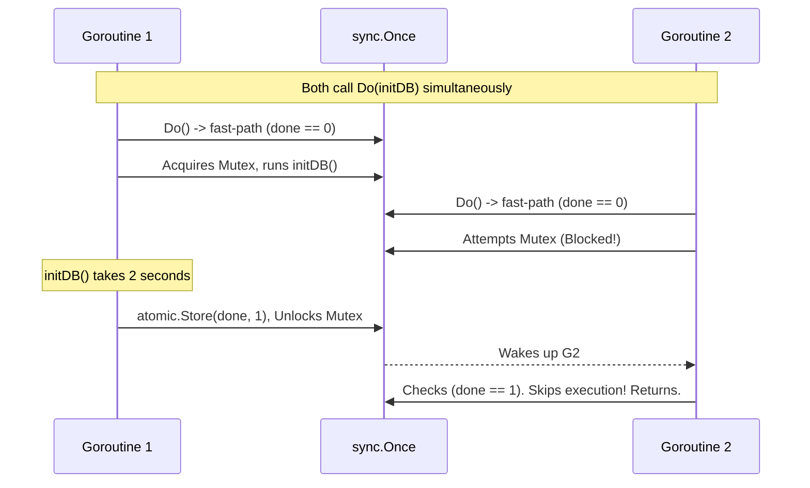

# sync.Once

---

# Table of Contents

* Introduction
* Learning Objectives
* Prerequisites
* Why This Topic Exists
* Real-World Analogy
* Core Concepts
* Internal Runtime Explanation
* Memory Layout
* Architecture Diagram
* Step-by-Step Execution
* Syntax
* Beginner Example
* Intermediate Example
* Advanced Example
* Production Use Cases
* Performance Analysis
* Best Practices
* Common Mistakes
* Debugging Guide
* Exercises
* Quiz
* Interview Questions
* Mini Project
* Cheat Sheet
* Summary
* Key Takeaways
* Further Reading
* Next Chapter

---

# Introduction

In concurrent applications, you often have a piece of code that must run exactly *once*, no matter how many Goroutines attempt to execute it simultaneously. A classic example is establishing a database connection or loading a configuration file on startup.

The `sync.Once` primitive guarantees that a function passed to it will be executed only one time. All subsequent calls will be safely ignored, and concurrent callers will block until the first execution completes.

---

# Learning Objectives

After completing this chapter you will be able to:

* Implement the Singleton pattern safely in Go.
* Guarantee one-time initialization of complex structs.
* Understand the internal `atomic` + `Mutex` implementation of `sync.Once`.
* Use `sync.OnceValue` and `sync.OnceValues` (introduced in Go 1.21).

---

# Prerequisites

Before reading this chapter you should know:

* `sync.Mutex` (`21-Mutex.md`)
* `sync/atomic` (`23-Atomic.md`)

---

# Why This Topic Exists

If you have 10 Goroutines starting up, and they all need the database connection, you might write `if db == nil { initializeDB() }`. 
However, this is a Data Race. Multiple Goroutines might evaluate `db == nil` as true at the exact same millisecond, causing your application to open 10 separate connection pools to the database!

While you could wrap the initialization in a standard `sync.Mutex`, you would take a lock performance hit on *every single read* forever. `sync.Once` is a highly optimized structure designed specifically to solve the "initialize exactly once" problem.

---

# Real-World Analogy

### The Fireworks Technician

* **The Goal**: Launch a giant firework display at midnight.
* **The Goroutines**: 10 technicians all have their finger on a launch button. At midnight, they all mash the button simultaneously.
* **`sync.Once`**: The wiring system. The very first electrical signal to reach the wire ignites the fuse. The wire immediately burns away. The other 9 signals travel down the wire a millisecond later, but because the wire is gone, they do nothing. The firework only launches once.

---

# Core Concepts

* **`Do(func())`**: The method that executes the function. If `Do` has been called before on this instance, it returns immediately.
* **Blocking**: If Goroutine A is currently executing the function inside `Do()`, and Goroutine B calls `Do()`, Goroutine B will block and wait until Goroutine A completely finishes before returning.
* **Go 1.21 Helpers**: `sync.OnceValue` and `sync.OnceValues` allow returning data directly from the one-time function.

---

# Internal Runtime Explanation

How does `sync.Once` avoid slowing down your app with Mutex locks after initialization? 
It uses a clever combination of an `atomic` counter and a `Mutex`.

1. **Fast Path**: It does an `atomic.LoadUint32(&done)`. If it is `1`, it returns instantly (no Mutex required!). This takes ~1 nanosecond.
2. **Slow Path**: If `done` is `0`, it acquires a `sync.Mutex`. 
3. **Double Check**: Inside the Mutex, it checks `done` again (in case another Goroutine just finished). If still `0`, it executes the function.
4. **Completion**: It calls `atomic.StoreUint32(&done, 1)` and releases the Mutex.

---

# Memory Layout

```text
Heap Memory

+-----------------------------+
| sync.Once Struct            |
|                             |
| done: 1 (Atomic uint32)     | <--- Checked on every call (Lock-Free)
| m: sync.Mutex               | <--- Only used during initialization
+-----------------------------+
```

---

# Architecture Diagram



---

# Step-by-Step Execution

1. Declare `var once sync.Once`.
2. Multiple Goroutines execute `once.Do(setupFunction)`.
3. The first one to reach the `Do` block acquires the internal mutex and runs `setupFunction`.
4. The others wait outside the internal mutex.
5. When `setupFunction` completes, the internal atomic flag is set to 1.
6. The waiting Goroutines wake up, see the flag is 1, and return instantly without running the function.

---

# Syntax

```go
import "sync"

var once sync.Once

func main() {
    // Pass an anonymous function to Do()
    once.Do(func() {
        fmt.Println("This prints exactly once.")
    })
}
```

---

# Beginner Example

The basic usage, proving it only executes one time despite 10 Goroutines calling it.

```go
package main

import (
	"fmt"
	"sync"
)

func main() {
	var once sync.Once
	var wg sync.WaitGroup

	initTask := func() {
		fmt.Println("Initializing Database Connection...")
	}

	for i := 0; i < 10; i++ {
		wg.Add(1)
		go func(id int) {
			defer wg.Done()
			fmt.Printf("Goroutine %d trying to initialize...\n", id)
			
			// Only ONE of the 10 Goroutines will actually run initTask
			once.Do(initTask)
			
			fmt.Printf("Goroutine %d proceeding...\n", id)
		}(i)
	}

	wg.Wait()
}
```

---

# Intermediate Example

The classic **Singleton Pattern** in Go. (Lazy Initialization).

```go
package main

import (
	"fmt"
	"sync"
)

type Config struct {
	APIKey string
}

var (
	instance *Config
	once     sync.Once
)

// GetConfig returns the singleton instance of Config.
// It is 100% thread-safe.
func GetConfig() *Config {
	once.Do(func() {
		fmt.Println("Loading config from disk (heavy operation)...")
		instance = &Config{APIKey: "secret-123"}
	})
	return instance
}

func main() {
	var wg sync.WaitGroup

	// 5 Goroutines request the config simultaneously
	for i := 0; i < 5; i++ {
		wg.Add(1)
		go func() {
			defer wg.Done()
			cfg := GetConfig()
			fmt.Println("Got key:", cfg.APIKey)
		}()
	}
	wg.Wait()
}
```

---

# Advanced Example

Using the modern Go 1.21 `sync.OnceValue`. This removes the need for global variables and makes the code vastly cleaner.

```go
package main

import (
	"fmt"
	"sync"
)

type Database struct {
	ConnString string
}

func loadDatabase() *Database {
	fmt.Println("Executing heavy database dial...")
	return &Database{ConnString: "postgres://localhost"}
}

func main() {
	// Go 1.21 Feature! 
	// Returns a function that returns *Database. 
	// It will only call loadDatabase ONCE, and cache the result forever.
	getDB := sync.OnceValue(loadDatabase)

	var wg sync.WaitGroup
	for i := 0; i < 3; i++ {
		wg.Add(1)
		go func() {
			defer wg.Done()
			// Calling the returned function
			db := getDB() 
			fmt.Println("Connected to:", db.ConnString)
		}()
	}
	wg.Wait()
}
```

---

# Production Use Cases

### 1. Lazy Initialization of Cloud Clients
If your application has a background job that occasionally needs to upload a file to AWS S3, you don't want to initialize the bulky AWS SDK on server startup if it might never be used. You use `sync.Once` inside `GetS3Client()` to initialize the connection pool *only* on the very first upload attempt.

### 2. Closing Channels Safely
Because closing a channel twice panics (Chapter 14), you can wrap the `close(ch)` call inside a `sync.Once.Do(func() { close(ch) })`. If multiple Goroutines try to shut down the system simultaneously, the channel is safely closed exactly once.

---

# Performance Analysis

* **Zero-Overhead Reads**: After the function has run once, `sync.Once.Do()` compiles down to a single atomic integer read. It takes less than 1 nanosecond. It is significantly faster than using an `RWMutex` for lazy initialization.

---

# Best Practices

* **Don't use `init()` functions for everything**: While Go has a built-in `func init()` that runs once on startup, it slows down application boot time. Use `sync.Once` for **Lazy Initialization** (waiting until the resource is actually requested).
* **Upgrade to Go 1.21**: Prefer `sync.OnceValue` and `sync.OnceValues` (which handles errors) over the raw `sync.Once` struct to avoid polluting your package with global variables.

---

# Common Mistakes

### Deadlocking `sync.Once`
```go
var once sync.Once

func setup() {
    // FATAL MISTAKE: Calling once.Do INSIDE the function passed to once.Do
    // It will block forever waiting for the first Do to finish!
    once.Do(setup) 
}

func main() {
    once.Do(setup) // Deadlock panic!
}
```

---

# Debugging Guide

* If your application hangs indefinitely during startup or lazy initialization, check if the function passed into `once.Do()` is waiting on a channel, or if it accidentally calls `once.Do()` again recursively.

---

# Exercises

## Beginner
Use `sync.Once` to print "Hello World" exactly once, even though you place it inside a `for i := 0; i < 50; i++` loop.

## Intermediate
Implement a function `CloseChannelOnce(ch chan int, once *sync.Once)`. Launch 5 Goroutines that all attempt to call this function on a shared channel and WaitGroup. Verify it does not panic.

---

# Quiz

## Multiple Choice Questions
**1. What happens if a Goroutine calls `once.Do(myFunc)` while another Goroutine is currently halfway through executing `myFunc` inside a previous call?**
A) It returns immediately.
B) It executes `myFunc` again.
C) It blocks and waits for the first Goroutine to finish before returning.
D) It panics.
*Answer*: C

## True or False
**`sync.Once` uses a Mutex for every single call to ensure safety.**
*Answer*: False. It uses an atomic read (the fast-path) for every call *after* initialization, making it lock-free and extremely fast for 99.9% of its lifecycle.

---

# Interview Questions

## Beginner
**Q**: What is the primary use case for `sync.Once`?
*Answer*: Implementing thread-safe Singleton patterns and lazy initialization, ensuring a block of code executes exactly one time regardless of concurrency.

## Intermediate
**Q**: Why not just use `func init()` instead of `sync.Once`?
*Answer*: `init()` functions run synchronously at application startup. If you have heavy setups (like connecting to 5 different databases), it drastically increases boot time. `sync.Once` allows lazy initialization, meaning the connection is only established at the exact moment a user requests it.

## Google-Level Questions
**Q**: Explain why `sync.Once` is implemented using an atomic counter rather than just checking a boolean flag inside a Mutex.
*Answer*: Performance. Checking a boolean inside a Mutex requires acquiring a lock on *every single read*, which causes severe lock contention under high concurrency. By using an atomic integer as a fast-path, `sync.Once` avoids the Mutex entirely after the first successful execution, dropping the overhead from ~20ns to ~1ns.

---

# Mini Project

**Requirement**: The Thread-Safe Logger
Create a custom Logger package. The logger needs to open a file handle to `app.log`. 
Create an exported function `GetLogger() *log.Logger`. Use `sync.OnceValue` to lazily open the file and initialize the `log.Logger` struct. 
In `main`, spawn 100 Goroutines that all call `GetLogger()` and log a message. Verify `app.log` is created and populated, and that the file was only opened once.

---

# Cheat Sheet

* **Struct**: `var once sync.Once`
* **Execute**: `once.Do(func() { ... })`
* **Go 1.21 Return Value**: `get := sync.OnceValue(initFunc)`
* **Go 1.21 Return Error**: `get := sync.OnceValues(initFuncWithError)`

---

# Summary

`sync.Once` is a masterclass in Go standard library design. By wrapping a Mutex in an atomic fast-path, it provides developers with a mathematically perfect, zero-overhead Singleton pattern that is immune to data races.

---

# Key Takeaways

* ✔ Executes a function exactly one time.
* ✔ Concurrent callers block until initialization is complete.
* ✔ Replaces global `init()` for Lazy Initialization.
* ✔ Go 1.21 `OnceValue` simplifies singletons drastically.

---

# Further Reading
* [Go 1.21 Release Notes: sync.OnceValue](https://go.dev/doc/go1.21#sync)

---

# Next Chapter
➡️ **Next:** `25-sync.Map.md`
