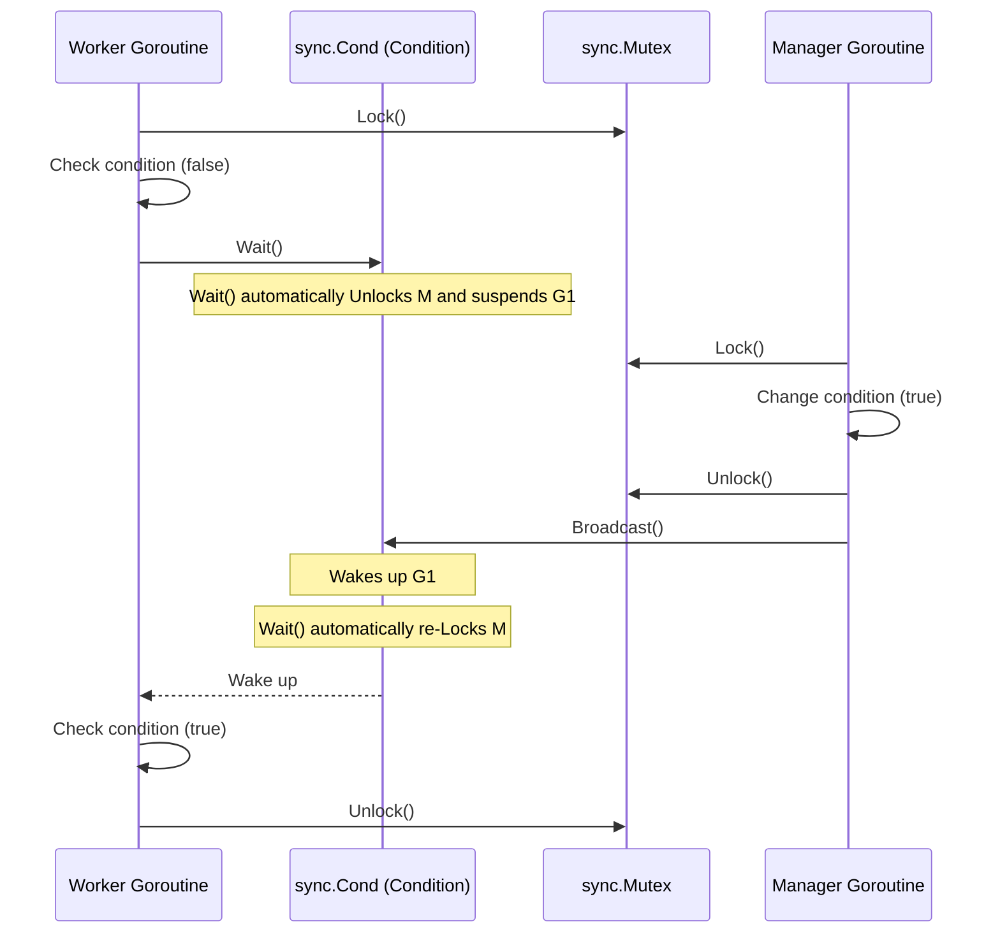

# sync.Cond

---

# Table of Contents

* Introduction
* Learning Objectives
* Prerequisites
* Why This Topic Exists
* Real-World Analogy
* Core Concepts
* Internal Runtime Explanation
* Memory Layout
* Architecture Diagram
* Step-by-Step Execution
* Syntax
* Beginner Example
* Intermediate Example
* Advanced Example
* Production Use Cases
* Performance Analysis
* Best Practices
* Common Mistakes
* Debugging Guide
* Exercises
* Quiz
* Interview Questions
* Mini Project
* Cheat Sheet
* Summary
* Key Takeaways
* Further Reading
* Next Chapter

---

# Introduction

In Go concurrency, you often have Goroutines that need to wait until a specific condition is met before proceeding. While you could use an infinite loop that constantly checks a variable (busy-waiting) or use channels, Go provides a specialized synchronization primitive for this: `sync.Cond` (Condition Variable). 

A `sync.Cond` acts as a rendezvous point for Goroutines waiting for or announcing the occurrence of an event.

---

# Learning Objectives

After completing this chapter you will be able to:

* Understand what a Condition Variable is and when to use it over Channels.
* Initialize and use `sync.Cond` with a Mutex.
* Properly use the `Wait()` method inside a loop.
* Differentiate between `Signal()` and `Broadcast()`.
* Avoid common deadlocks associated with `sync.Cond`.

---

# Prerequisites

Before reading this chapter you should know:

* Goroutines (`08-Goroutines.md`)
* `sync.Mutex` (`21-Mutex.md`)
* Channels (`10-Channels.md`)

---

# Why This Topic Exists

Imagine you have 10 Goroutines waiting for a configuration file to be loaded by an 11th Goroutine. 
If they use a `for` loop to constantly check `if configLoaded == true`, they will consume 100% of the CPU doing nothing (Busy Waiting).
If they use a `time.Sleep()` in the loop, they might wake up too late.
While you can close a channel to broadcast an event, channels are one-off (once closed, they cannot be unclosed). 
`sync.Cond` solves this by allowing Goroutines to go to sleep (0% CPU usage) and be explicitly woken up when a condition changes, and it can be used repeatedly.

---

# Real-World Analogy

### The Airport Boarding Gate

* **The Condition**: The plane is ready for boarding.
* **The Waiters (Goroutines)**: Passengers sitting in the terminal.
* **Wait()**: A passenger checks the gate; if it's not ready, they sit down and sleep. 
* **Signal()**: The gate agent calls the next person in line (wakes up exactly ONE passenger).
* **Broadcast()**: The gate agent announces over the loudspeaker: "Flight 204 is now boarding!" (wakes up ALL sleeping passengers).

---

# Core Concepts

* **Locker**: Every `sync.Cond` must be initialized with a `sync.Locker` (usually a `*sync.Mutex`). This locker protects the condition you are checking.
* **Wait**: Suspends the calling Goroutine and automatically unlocks the associated `Locker`. When the Goroutine is woken up, it automatically re-locks the `Locker` before resuming execution.
* **Signal**: Wakes up exactly one Goroutine waiting on the condition.
* **Broadcast**: Wakes up all Goroutines waiting on the condition.

---

# Internal Runtime Explanation

Internally, `sync.Cond` maintains a linked list (queue) of Goroutines that are currently waiting. 
When `Wait()` is called, the Go runtime parks (suspends) the Goroutine and adds it to this queue. The underlying thread is freed up to run other Goroutines.
When `Signal()` is called, the runtime pops the first Goroutine off the queue and schedules it to run.
When `Broadcast()` is called, the runtime takes the entire queue and schedules all of them to run.

---

# Memory Layout

```text
Heap Memory

+-------------------------------------------------+
| sync.Cond                                       |
|                                                 |
| L (sync.Locker) --------> [ sync.Mutex ]        |
|                                                 |
| notifyList (queue) -----> [ G1 ] -> [ G2 ]      | <-- Sleeping Goroutines
+-------------------------------------------------+
```

---

# Architecture Diagram



---

# Step-by-Step Execution

1. `cond := sync.NewCond(&sync.Mutex{})` creates the condition variable.
2. Worker acquires the lock: `cond.L.Lock()`.
3. Worker checks the condition: `if !ready`.
4. Worker calls `cond.Wait()`. This **unlocks** the mutex and puts the worker to sleep.
5. Manager acquires the lock, changes `ready = true`, unlocks, and calls `cond.Broadcast()`.
6. Worker wakes up, **re-acquires** the lock automatically inside `Wait()`.
7. Worker proceeds, and eventually calls `cond.L.Unlock()`.

---

# Syntax

```go
import "sync"

var mu sync.Mutex
cond := sync.NewCond(&mu)

// Waiting Goroutine
cond.L.Lock()
for !conditionMet {
    cond.Wait()
}
// Do work
cond.L.Unlock()

// Waking Goroutines
cond.Signal()    // Wake 1
cond.Broadcast() // Wake All
```

---

# Beginner Example

Waiting for a single event using `Broadcast()`.

```go
package main

import (
	"fmt"
	"sync"
	"time"
)

func main() {
	var mu sync.Mutex
	cond := sync.NewCond(&mu)
	ready := false

	// Worker Goroutine
	go func() {
		cond.L.Lock()
		// ALWAYS use a for loop with Wait()
		for !ready {
			fmt.Println("Worker: Waiting for initialization...")
			cond.Wait() 
		}
		fmt.Println("Worker: Initialization complete, starting work!")
		cond.L.Unlock()
	}()

	fmt.Println("Main: Doing some setup...")
	time.Sleep(2 * time.Second)

	// Update the condition
	cond.L.Lock()
	ready = true
	cond.L.Unlock()

	// Notify waiting Goroutines
	fmt.Println("Main: Setup complete, broadcasting...")
	cond.Broadcast()

	time.Sleep(1 * time.Second) // Wait for worker to finish
}
```

---

# Intermediate Example

Using `Signal()` to process items in a queue one by one.

```go
package main

import (
	"fmt"
	"sync"
	"time"
)

func main() {
	var mu sync.Mutex
	cond := sync.NewCond(&mu)
	queue := make([]int, 0)

	// Consumer
	go func() {
		for i := 0; i < 3; i++ {
			cond.L.Lock()
			for len(queue) == 0 {
				cond.Wait()
			}
			item := queue[0]
			queue = queue[1:]
			fmt.Printf("Consumer: Processed item %d\n", item)
			cond.L.Unlock()
		}
	}()

	// Producer
	for i := 1; i <= 3; i++ {
		time.Sleep(1 * time.Second)
		cond.L.Lock()
		queue = append(queue, i)
		fmt.Printf("Producer: Added item %d\n", i)
		cond.L.Unlock()
		
		// Wake up exactly one consumer
		cond.Signal() 
	}
	
	time.Sleep(1 * time.Second)
}
```

---

# Advanced Example

A capacity-limited buffer using two condition variables.

```go
package main

import (
	"fmt"
	"sync"
	"time"
)

func main() {
	var mu sync.Mutex
	notEmpty := sync.NewCond(&mu)
	notFull := sync.NewCond(&mu)
	
	buffer := make([]int, 0)
	capacity := 2

	// Producer
	go func() {
		for i := 1; i <= 5; i++ {
			mu.Lock()
			for len(buffer) == capacity {
				fmt.Println("Producer: Buffer full, waiting...")
				notFull.Wait()
			}
			buffer = append(buffer, i)
			fmt.Printf("Producer: Added %d. Buffer: %v\n", i, buffer)
			mu.Unlock()
			notEmpty.Signal() // Tell consumer it's not empty
			time.Sleep(500 * time.Millisecond)
		}
	}()

	// Consumer
	go func() {
		for i := 1; i <= 5; i++ {
			mu.Lock()
			for len(buffer) == 0 {
				fmt.Println("Consumer: Buffer empty, waiting...")
				notEmpty.Wait()
			}
			item := buffer[0]
			buffer = buffer[1:]
			fmt.Printf("Consumer: Removed %d. Buffer: %v\n", item, buffer)
			mu.Unlock()
			notFull.Signal() // Tell producer it's not full
			time.Sleep(1 * time.Second)
		}
	}()

	time.Sleep(6 * time.Second)
}
```

---

# Production Use Cases

### 1. Resource Pools
When managing a pool of database connections, if a Goroutine requests a connection and none are available, it uses `cond.Wait()`. When another Goroutine returns a connection to the pool, it calls `cond.Signal()` to wake up exactly one waiting Goroutine.

### 2. Multi-Stage Pipeline Initialization
When a complex application starts, several components might need to wait for a central configuration manager to finish fetching secrets from AWS KMS. A `Broadcast()` can wake all components simultaneously once the secrets are ready.

---

# Performance Analysis

* `sync.Cond` is highly efficient because it relies on OS-level thread parking via the Go runtime. Waiting Goroutines consume virtually zero CPU.
* **Channels vs. Cond**: Channels are generally preferred in Go for passing data and simple signaling. However, if you need to broadcast to an arbitrary number of Goroutines *multiple times* (which you can't do by closing a channel, as it can only be closed once), `sync.Cond` is the correct, performant choice.

---

# Best Practices

* **Always use a `for` loop**: NEVER use `if !condition { cond.Wait() }`. Always use `for !condition { cond.Wait() }`. Goroutines can occasionally experience "spurious wakeups" (waking up without a signal) or the condition might have changed between the time the signal was sent and the time the Goroutine actually re-acquired the lock.
* **Hold the lock during Wait**: You must hold `cond.L` before calling `Wait()`. If you don't, it will panic.
* **You don't need the lock for Signal/Broadcast**: While you can hold the lock while calling `Signal()` or `Broadcast()`, it is not strictly required and sometimes releasing the lock first is slightly more efficient.

---

# Common Mistakes

### The Lost Wakeup Problem
If you call `Signal()` or `Broadcast()` *before* the other Goroutine has actually started `Wait()`ing, the signal is lost. `sync.Cond` does not remember past signals.

### Not Using a For Loop
```go
// BAD: Spurious wakeups can cause panic or logic errors
cond.L.Lock()
if !ready {
    cond.Wait() 
}
// Work
cond.L.Unlock()

// GOOD:
cond.L.Lock()
for !ready {
    cond.Wait() 
}
// Work
cond.L.Unlock()
```

---

# Debugging Guide

* **Panic: sync: Wait condition bypassed**: You called `Wait()` without holding the associated Mutex lock first.
* **Deadlocks**: The most common deadlock with `Cond` is the "Lost Wakeup". Ensure the signaling Goroutine definitively executes *after* the waiting Goroutines have reached their `Wait()` statements, or ensure the condition is checked securely.

---

# Exercises

## Beginner
Create a program with one Mutex and one Cond. Have a Goroutine wait for a `started` boolean to be true. In main, sleep for 1 second, set `started = true`, and broadcast.

## Intermediate
Implement a simple Thread-Safe Queue struct that has `Push(item any)` and `Pop() any`. If `Pop()` is called and the queue is empty, it should block using `sync.Cond` until `Push()` is called.

---

# Quiz

## Multiple Choice Questions
**1. What does `cond.Wait()` do internally to the Mutex?**
A) It locks it.
B) It unlocks it while sleeping, and re-locks it upon waking.
C) It keeps it locked the entire time.
*Answer*: B

## True or False
**You can call `Broadcast()` safely without holding the Cond's Mutex.**
*Answer*: True. It is generally safe to call `Signal()` or `Broadcast()` outside of the lock, though it's often done inside the lock for logical grouping.

---

# Interview Questions

## Beginner
**Q**: Why is `sync.Cond` initialized with a `Locker`?
*Answer*: Because the condition being waited on (like a boolean flag) is shared state. The locker ensures that checking the condition and deciding to sleep is an atomic operation, preventing race conditions between checking state and parking the Goroutine.

## Intermediate
**Q**: Explain why `Wait()` must be used inside a `for` loop instead of an `if` statement.
*Answer*: Two reasons. First, spurious wakeups: a Goroutine might be woken up by the OS even without a signal. Second, by the time the woken Goroutine re-acquires the lock, another Goroutine might have already changed the condition back to false. The `for` loop ensures the condition is re-verified after waking up.

## Advanced
**Q**: When would you use `sync.Cond` over closing a channel to broadcast an event?
*Answer*: Closing a channel is a one-time broadcast. Once a channel is closed, it cannot be closed again. If you need to repeatedly broadcast events (e.g., "batch of data ready", "batch of data ready"), `sync.Cond` allows you to broadcast multiple times over the lifecycle of the application.

---

# Mini Project

**Requirement**: The Event Bus
Build a simple publish-subscribe system.
1. Create an `EventBus` struct that holds a `map[string]*sync.Cond` (topics to conditions).
2. Implement `Subscribe(topic string)`. It should wait on the condition for that topic.
3. Implement `Publish(topic string)`. It should broadcast to that topic's condition.
4. Test it by having 3 Goroutines subscribe to "news" and 1 Goroutine publish to "news", waking them all up.

---

# Cheat Sheet

* **Init**: `cond := sync.NewCond(&sync.Mutex{})`
* **Wait**: `cond.L.Lock(); for !cond { cond.Wait() }; cond.L.Unlock()`
* **Signal (1)**: `cond.Signal()`
* **Broadcast (All)**: `cond.Broadcast()`

---

# Summary

`sync.Cond` is a powerful primitive for choreographing Goroutines based on state changes rather than just data flow. While channels are preferred for general use, Condition Variables shine in complex synchronization scenarios like object pools, custom thread-safe data structures, and repeating broadcasts.

---

# Key Takeaways

* ✔ `sync.Cond` acts as a rendezvous point for waiting Goroutines.
* ✔ `Wait()` automatically unlocks and re-locks the Mutex.
* ✔ ALWAYS use `Wait()` inside a `for` loop to prevent spurious wakeups.
* ✔ `Broadcast()` is reusable, unlike closing a channel.

---

# Further Reading
* [Go documentation for sync.Cond](https://pkg.go.dev/sync#Cond)

---

# Next Chapter
➡️ **Next:** `27-errgroup.md`
