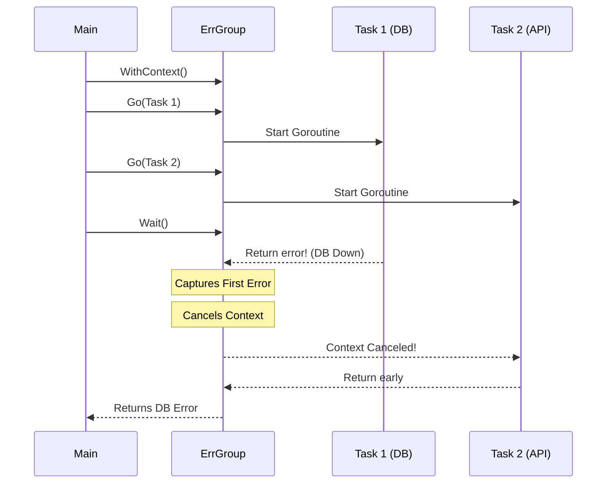

# errgroup

---

# Table of Contents

* Introduction
* Learning Objectives
* Prerequisites
* Why This Topic Exists
* Real-World Analogy
* Core Concepts
* Internal Runtime Explanation
* Memory Layout
* Architecture Diagram
* Step-by-Step Execution
* Syntax
* Beginner Example
* Intermediate Example
* Advanced Example
* Production Use Cases
* Performance Analysis
* Best Practices
* Common Mistakes
* Debugging Guide
* Exercises
* Quiz
* Interview Questions
* Mini Project
* Cheat Sheet
* Summary
* Key Takeaways
* Further Reading
* Next Chapter

---

# Introduction

While `sync.WaitGroup` is fantastic for waiting for multiple Goroutines to finish, it lacks built-in mechanisms for two critical things: **error handling** and **cancellation**. If one Goroutine in a WaitGroup fails, there is no automatic way to return that error to the main thread or cancel the remaining Goroutines.

Enter `errgroup` (from the `golang.org/x/sync/errgroup` package). It is a wrapper around `sync.WaitGroup` and `context.Context` that provides a clean, elegant way to handle groups of subtasks where you care about the first error that occurs, or want to cancel the group if one fails.

---

# Learning Objectives

After completing this chapter you will be able to:

* Install and import the `golang.org/x/sync/errgroup` package.
* Use `errgroup.Group` as a drop-in replacement for `sync.WaitGroup` when errors matter.
* Understand how `errgroup.WithContext` automatically cancels siblings on failure.
* Limit the concurrency of an errgroup using `SetLimit`.

---

# Prerequisites

Before reading this chapter you should know:

* `sync.WaitGroup` (`09-WaitGroup.md`)
* `context.Context` (`19-Context.md`)
* Context Cancellation (`20-Cancellation.md`)

---

# Why This Topic Exists

In a microservices architecture, a single API request might require fetching data from a Database, a Redis cache, and an external gRPC service simultaneously. 
If you use `sync.WaitGroup`, and the Database query fails immediately, the other two Goroutines will still continue running, wasting resources, and you have to manually wire up channels and mutexes to capture the database error.
`errgroup` was created to standardize the "scatter-gather" pattern: launch multiple tasks concurrently, return the first error that happens, and optionally cancel all other running tasks immediately.

---

# Real-World Analogy

### The Restaurant Kitchen Order

* **WaitGroup**: A chef tells 3 cooks to prepare a steak, a salad, and soup. The chef waits for all 3 to finish. If the cook drops the steak on the floor (error), the chef still waits for the salad and soup to finish before reporting the failure to the customer.
* **ErrGroup with Context**: The chef tells 3 cooks to prepare the food. If the cook drops the steak (returns an error), the chef immediately shouts "STOP" (cancels the context). The cooks making the salad and soup throw their food away instantly, saving time and ingredients, and the chef immediately tells the customer there was an error.

---

# Core Concepts

* **Group**: A collection of Goroutines working on subtasks of a common task.
* **Go() method**: You pass a function returning an `error` to the `.Go()` method. The errgroup automatically manages the underlying WaitGroup's `Add(1)` and `Done()`.
* **Wait() method**: Blocks until all function calls from the `.Go()` method have returned, then returns the **first non-nil error** (if any) from them.
* **WithContext**: Creates an ErrGroup that shares a Context. If any Goroutine returns an error, the Context is automatically canceled.

---

# Internal Runtime Explanation

Under the hood, `errgroup.Group` contains:
1. A `sync.WaitGroup`.
2. A `sync.Once` to capture only the *first* error.
3. An `error` variable.
4. An optional `cancel` function (from context).

When you call `group.Go(fn)`, it increments the WaitGroup, and spins up a Goroutine that executes `fn()`. If `fn()` returns an error, the `sync.Once` ensures it is stored as the group's error, and if a cancel function exists, it is called immediately to notify all other Goroutines sharing the context.

---

# Architecture Diagram



---

# Step-by-Step Execution

1. Import `golang.org/x/sync/errgroup`.
2. Create a group: `g, ctx := errgroup.WithContext(context.Background())`.
3. Launch tasks: `g.Go(func() error { ... })`. Pass the `ctx` into long-running operations.
4. Wait for results: `err := g.Wait()`.
5. If `err != nil`, at least one task failed, and the others were canceled (if they were listening to `ctx.Done()`).

---

# Syntax

```go
import "golang.org/x/sync/errgroup"

// Create the group
g, ctx := errgroup.WithContext(context.Background())

// Launch a Goroutine
g.Go(func() error {
    // Do work, listen to ctx.Done()
    return nil 
})

// Wait for all to finish, get the first error
if err := g.Wait(); err != nil {
    fmt.Println("An error occurred:", err)
}
```

---

# Beginner Example

Basic usage of `errgroup` just to aggregate errors, without context cancellation.

```go
package main

import (
	"errors"
	"fmt"
	"golang.org/x/sync/errgroup"
	"time"
)

func main() {
	var g errgroup.Group

	// Task 1: Succeeds
	g.Go(func() error {
		time.Sleep(1 * time.Second)
		fmt.Println("Task 1 finished successfully")
		return nil
	})

	// Task 2: Fails
	g.Go(func() error {
		time.Sleep(500 * time.Millisecond)
		fmt.Println("Task 2 failed!")
		return errors.New("database connection lost")
	})

	// Task 3: Fails later (error will be ignored by Wait)
	g.Go(func() error {
		time.Sleep(2 * time.Second)
		fmt.Println("Task 3 failed!")
		return errors.New("timeout")
	})

	// Wait returns the FIRST error
	if err := g.Wait(); err != nil {
		fmt.Printf("Group finished with error: %v\n", err)
	}
}
```

---

# Intermediate Example

Using `WithContext` to cancel siblings when one fails. This is the most common and powerful way to use `errgroup`.

```go
package main

import (
	"context"
	"errors"
	"fmt"
	"golang.org/x/sync/errgroup"
	"time"
)

func main() {
	// Create a group that will cancel its context if any function returns an error
	g, ctx := errgroup.WithContext(context.Background())

	urls := []string{"http://google.com", "http://bad-url", "http://github.com"}

	for _, url := range urls {
		u := url // capture loop variable (not needed in Go 1.22+, but good practice)
		
		g.Go(func() error {
			// Simulate a network request that listens to context
			select {
			case <-time.After(2 * time.Second):
				if u == "http://bad-url" {
					fmt.Printf("Error fetching %s\n", u)
					return errors.New("failed to fetch " + u)
				}
				fmt.Printf("Successfully fetched %s\n", u)
				return nil
				
			case <-ctx.Done(): // If another Goroutine failed, this triggers!
				fmt.Printf("Canceled fetching %s because another task failed\n", u)
				return ctx.Err()
			}
		})
	}

	if err := g.Wait(); err != nil {
		fmt.Println("Process ended with error:", err)
	}
}
```

---

# Advanced Example

Using `SetLimit` (introduced in Go 1.20 `errgroup`). Sometimes you have 10,000 tasks but only want to run 10 at a time to avoid overwhelming an API or database. `SetLimit` handles this automatically without needing to manually build a Worker Pool!

```go
package main

import (
	"fmt"
	"golang.org/x/sync/errgroup"
	"time"
)

func main() {
	var g errgroup.Group
	
	// Limit concurrency to 3 Goroutines at a time
	g.SetLimit(3)

	for i := 1; i <= 10; i++ {
		jobID := i
		// g.Go() will block if there are already 3 running!
		g.Go(func() error {
			fmt.Printf("Processing job %d\n", jobID)
			time.Sleep(1 * time.Second)
			return nil
		})
	}

	g.Wait()
	fmt.Println("All jobs complete.")
}
```

---

# Production Use Cases

### 1. Parallel API Fetching
A frontend requests a user profile. The backend uses `errgroup.WithContext` to concurrently fetch the user's details from the PostgreSQL DB, their billing info from Stripe, and their avatar from AWS S3. If Stripe returns a 500 error, the DB and S3 requests are instantly canceled via the Context, and a 500 error is immediately returned to the frontend.

### 2. Batch Processing with Limits
Parsing a 50GB CSV file with 5 million lines. Using `SetLimit(100)`, the errgroup reads the file and spawns up to 100 concurrent Goroutines to process lines and insert them into a database. If the DB goes down and a line fails, the group terminates and stops reading the file.

---

# Performance Analysis

* `errgroup` is incredibly lightweight. The overhead over a raw `sync.WaitGroup` is negligible (just an atomic check and a sync.Once).
* The ability to cancel sibling Goroutines saves massive amounts of CPU, memory, and network I/O during failure states, making it a critical tool for building resilient, high-performance distributed systems.

---

# Best Practices

* **Always pass the Context**: If you use `errgroup.WithContext(ctx)`, ensure you pass the returned `ctx` down to all your DB, HTTP, and gRPC calls inside the `g.Go()` functions. If you don't pass the context down, the cancellation signal will be ignored!
* **Loop Variable Capture**: Prior to Go 1.22, always shadow loop variables (`v := v`) before using them inside `g.Go(func() { ... })`. (In Go 1.22+, loop variables are per-iteration, so this is no longer strictly necessary, but still commonly seen in older codebases).
* **Return exactly what failed**: Ensure your `g.Go()` functions return descriptive errors (using `fmt.Errorf`) so `g.Wait()` tells you exactly which subtask caused the failure.

---

# Common Mistakes

### Ignoring the returned Context
```go
g, ctx := errgroup.WithContext(context.Background())

g.Go(func() error {
    // BAD: Using context.Background() instead of 'ctx'.
    // If a sibling fails, this request will NOT be canceled!
    req, _ := http.NewRequestWithContext(context.Background(), "GET", url, nil)
    // ...
})
```

### Forgetting to handle the error from Wait
```go
g.Wait() // BAD: You used an errgroup but threw away the error!
// ALWAYS do:
if err := g.Wait(); err != nil { ... }
```

---

# Debugging Guide

* **Tasks keep running after an error**: You forgot to wire up the context. Check that every blocking operation inside `g.Go()` is using the `ctx` returned by `WithContext`.
* **"go: golang.org/x/sync@vX.X.X: missing go.sum entry"**: `errgroup` is not in the standard library. You must run `go get golang.org/x/sync/errgroup` to install it.

---

# Exercises

## Beginner
Write an `errgroup` that launches 3 Goroutines. Two return `nil`, one returns `errors.New("intentional failure")`. Print the result of `Wait()`.

## Intermediate
Create a function `FetchAll(urls []string) error` that uses `errgroup.WithContext`. Use `http.NewRequestWithContext` passing the errgroup's context to make concurrent GET requests to the URLs. Pass in one valid URL and one invalid URL, and verify the valid one is canceled if the invalid one fails quickly.

---

# Quiz

## Multiple Choice Questions
**1. Which error does `g.Wait()` return?**
A) The last error that occurred.
B) All errors concatenated together.
C) The very first non-nil error that was returned by any of the functions.
*Answer*: C

## True or False
**`errgroup` is part of the standard library (`sync` package).**
*Answer*: False. It is part of the extended standard library at `golang.org/x/sync/errgroup`.

---

# Interview Questions

## Beginner
**Q**: Why use `errgroup` instead of a `sync.WaitGroup`?
*Answer*: Because `sync.WaitGroup` has no built-in way to collect errors from Goroutines or cancel other running Goroutines if one fails. `errgroup` solves both problems.

## Intermediate
**Q**: What happens to the context returned by `errgroup.WithContext` when `g.Wait()` returns?
*Answer*: As soon as the first `g.Go` function returns an error, OR when `g.Wait()` completes (all functions finished), the context is automatically canceled to clean up resources.

## Advanced
**Q**: Can `errgroup` collect *all* errors, not just the first one?
*Answer*: Out of the box, `errgroup` only returns the *first* error. If you need to collect all errors, you must use a custom approach (like `errors.Join` in Go 1.20 with a Mutex, or a separate error channel) inside your `g.Go()` functions.

---

# Mini Project

**Requirement**: The Parallel Downloader
1. Create a slice of 5 fake file URLs.
2. Use an `errgroup` with `SetLimit(2)` to download them concurrently (only 2 at a time).
3. Inside the `g.Go` function, print "Downloading {URL}", sleep for 1 second, and if the URL contains the number "3", return an error "file not found".
4. Ensure the `errgroup.Wait()` catches the error and the program exits gracefully.

---

# Cheat Sheet

* **Import**: `golang.org/x/sync/errgroup`
* **Basic Group**: `var g errgroup.Group`
* **Context Group**: `g, ctx := errgroup.WithContext(context.Background())`
* **Launch**: `g.Go(func() error { return nil })`
* **Wait**: `err := g.Wait()`
* **Limit**: `g.SetLimit(10)`

---

# Summary

`errgroup` takes the raw power of `sync.WaitGroup` and pairs it with the context cancellation patterns of modern Go. It is the gold standard for "scatter-gather" concurrent tasks, ensuring that your application handles failures gracefully without leaking Goroutines or wasting compute time.

---

# Key Takeaways

* ✔ Replaces `sync.WaitGroup` when errors matter.
* ✔ `WithContext` cancels all tasks if one fails.
* ✔ Returns the FIRST non-nil error.
* ✔ `SetLimit` easily restricts concurrency without complex worker pools.

---

# Further Reading
* [Go documentation for errgroup](https://pkg.go.dev/golang.org/x/sync/errgroup)

---

# Next Chapter
➡️ **Next:** `28-Race-Conditions.md`
