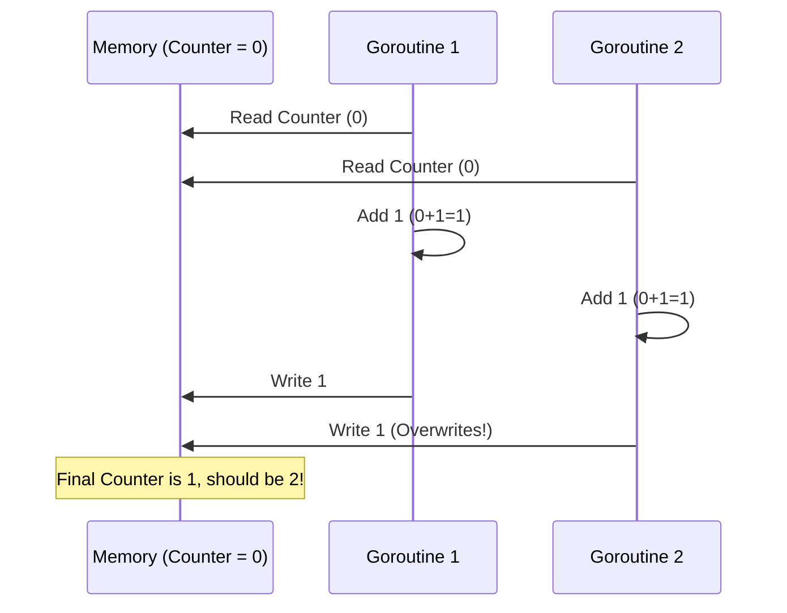

# Race Conditions

---

# Table of Contents

* Introduction
* Learning Objectives
* Prerequisites
* Why This Topic Exists
* Real-World Analogy
* Core Concepts
* Internal Runtime Explanation
* Memory Layout
* Architecture Diagram
* Step-by-Step Execution
* Syntax
* Beginner Example
* Intermediate Example
* Advanced Example
* Production Use Cases
* Performance Analysis
* Best Practices
* Common Mistakes
* Debugging Guide
* Exercises
* Quiz
* Interview Questions
* Mini Project
* Cheat Sheet
* Summary
* Key Takeaways
* Further Reading
* Next Chapter

---

# Introduction

A **Race Condition** is one of the most notoriously difficult bugs to track down in concurrent programming. It occurs when two or more Goroutines access the same shared memory simultaneously, and at least one of them is modifying (writing to) that memory. 

Because the Go scheduler can pause a Goroutine at any microsecond, the final state of the shared memory becomes unpredictable, depending entirely on the "race" of which Goroutine reaches the memory first.

---

# Learning Objectives

After completing this chapter you will be able to:

* Identify code that is susceptible to race conditions.
* Understand the concept of "Read-Modify-Write" atomicity.
* Use the Go Race Detector (`-race` flag) to find hidden bugs.
* Fix race conditions using Mutexes or Channels.

---

# Prerequisites

Before reading this chapter you should know:

* Goroutines (`08-Goroutines.md`)
* WaitGroup (`09-WaitGroup.md`)
* Shared Memory concepts

---

# Why This Topic Exists

Imagine a banking application where two simultaneous requests try to withdraw $100 from an account that only has $100. If the timing is perfectly aligned (a race condition), both requests might see the balance as $100, approve the withdrawal, and leave the bank with a negative balance of -$100. 

Go forces us to think deeply about shared state because Goroutines make concurrency so easy that race conditions happen frequently if you aren't careful.

---

# Real-World Analogy

### The Shared Bank Account

Two people, Alice and Bob, share a bank account with $1,000. They both go to different ATMs at the exact same time to withdraw $500.

1. **Alice's ATM** reads the balance: $1,000.
2. **Bob's ATM** reads the balance: $1,000.
3. **Alice's ATM** calculates new balance ($1,000 - $500 = $500) and writes $500.
4. **Bob's ATM** calculates new balance ($1,000 - $500 = $500) and writes $500.

The total withdrawn is $1,000, but the bank account says $500 is left! The bank lost $500 because the "read-modify-write" operation wasn't protected.

---

# Core Concepts

* **Data Race**: When two Goroutines access the same variable concurrently, and at least one is a write.
* **Read-Modify-Write**: Operations like `count++` are NOT one step. They are three steps: Read the current value, add 1 to it, write the new value back. If interrupted in the middle, a race condition occurs.
* **Race Detector**: A built-in tool in the Go compiler (`go run -race` or `go test -race`) that instruments your code to mathematically prove if a data race occurred during runtime.

---

# Internal Runtime Explanation

At the CPU level, a variable like `count` is stored in RAM. To do `count++`, the CPU must load the value from RAM into a CPU Register, increment the register, and store the register back into RAM.

If Goroutine A is scheduled on CPU Core 1, and Goroutine B is scheduled on CPU Core 2, they might both load the same value from RAM simultaneously into their respective registers. They both increment to 1, and both write 1 back to RAM. Two increments happened, but the value only increased by 1.

---

# Memory Layout

```text
RAM
+------------------------+
| int count = 0          |
+------------------------+
      ^            ^
      |            | (simultaneous read)
      v            v
+----------+  +----------+
| Core 1   |  | Core 2   |
| Reg: 0   |  | Reg: 0   |
| Reg+1: 1 |  | Reg+1: 1 |
| Write: 1 |  | Write: 1 |
+----------+  +----------+
```
Result: `count` is 1, not 2.

---

# Architecture Diagram



---

# Step-by-Step Execution

1. Declare a shared variable `var counter int`.
2. Launch 1000 Goroutines doing `counter++`.
3. Some Goroutines will read the same value at the exact same microsecond.
4. They both write back the same incremented value, causing an increment to be lost.
5. The final counter is less than 1000 (unpredictable).

---

# Syntax

To detect a race condition, run your Go program with the `-race` flag:

```bash
go run -race main.go
go build -race main.go
go test -race ./...
```

*Note: The race detector slows down execution by ~10x and consumes ~5x more memory. Do not run it in production!*

---

# Beginner Example

A classic race condition where increments are lost.

```go
package main

import (
	"fmt"
	"sync"
)

func main() {
	var wg sync.WaitGroup
	counter := 0 // Shared variable

	// Launch 1000 Goroutines
	for i := 0; i < 1000; i++ {
		wg.Add(1)
		go func() {
			defer wg.Done()
			// DATA RACE: Read, Modify, Write is not protected
			counter++ 
		}()
	}

	wg.Wait()
	// You expect 1000, but you will often get 950, 980, etc.
	fmt.Println("Final Counter:", counter) 
}
```

If you run this with `go run -race main.go`, Go will panic with `WARNING: DATA RACE`.

---

# Intermediate Example

Fixing the race condition using a `sync.Mutex`.

```go
package main

import (
	"fmt"
	"sync"
)

func main() {
	var wg sync.WaitGroup
	var mu sync.Mutex
	counter := 0

	for i := 0; i < 1000; i++ {
		wg.Add(1)
		go func() {
			defer wg.Done()
			
			mu.Lock() // Acquire lock
			counter++ // Safe from Data Races!
			mu.Unlock() // Release lock
			
		}()
	}

	wg.Wait()
	fmt.Println("Final Counter:", counter) // ALWAYS 1000
}
```

---

# Advanced Example

Fixing a race condition using Channels (the "Share memory by communicating" approach).

```go
package main

import (
	"fmt"
	"sync"
)

func main() {
	var wg sync.WaitGroup
	
	// A channel that acts as a queue for increments
	increments := make(chan int, 1000)

	// Launch 1000 Goroutines that just send a signal to the channel
	for i := 0; i < 1000; i++ {
		wg.Add(1)
		go func() {
			defer wg.Done()
			increments <- 1 // No shared memory mutation here!
		}()
	}

	// Wait for all to finish, then close the channel
	go func() {
		wg.Wait()
		close(increments)
	}()

	// Single Goroutine reads from the channel and increments
	// Since only ONE Goroutine is mutating 'counter', there is NO race!
	counter := 0
	for val := range increments {
		counter += val
	}

	fmt.Println("Final Counter:", counter) // ALWAYS 1000
}
```

---

# Production Use Cases

### 1. In-Memory Caching
When caching database queries in a `map[string]string`, multiple HTTP requests (which run in separate Goroutines) might try to write to the map at the same time. This is a fatal race condition in Go and will instantly crash the server (`fatal error: concurrent map writes`). You must use a Mutex.

### 2. Configuration Reloading
If an admin changes the server configuration while the server is running, one Goroutine updates the config struct, while 100 other Goroutines are currently reading it to serve traffic. A race condition here can lead to a Corrupted Config State. You must use `sync.RWMutex` or `atomic.Value` to swap configs safely.

---

# Performance Analysis

* **Unprotected (Racey)**: Fastest, but completely wrong and dangerous.
* **Mutex**: Protects the state but causes Goroutines to block (wait in line). High contention slows down the app.
* **Atomic**: The absolute fastest way to fix a simple counter race condition, bypassing the OS and using CPU hardware locks (covered in `23-Atomic.md`).
* **Channels**: Slower than Mutexes for simple counters, but scales better logically for complex workflows without deadlocks.

---

# Best Practices

* **Always test with `-race`**: Your CI/CD pipeline should absolutely have `go test -race ./...` as a mandatory step.
* **Minimize Shared State**: The best way to prevent race conditions is to not share variables at all. Give each Goroutine its own local copy of the data, and combine the results at the end.
* **Do not use time.Sleep to fix races**: If your code works when you add a `time.Sleep(10 * time.Millisecond)`, you haven't fixed the problem, you've just made the race condition statistically less likely to occur on your specific laptop.

---

# Common Mistakes

### The Loop Variable Closure Trap (Pre-Go 1.22)
```go
// In Go 1.21 and earlier, this creates a race condition on 'i'
for i := 0; i < 10; i++ {
    go func() {
        fmt.Println(i) // Might print 10 ten times!
    }()
}
```
*(Note: Go 1.22 fixed this by making `i` scoped to the loop iteration, but it remains one of the most famous race conditions in Go history).*

---

# Debugging Guide

* **How to read `-race` output**:
  When the race detector triggers, it prints two stack traces.
  1. `Write at 0x... by goroutine 7:` (Shows where the memory was mutated)
  2. `Previous read at 0x... by goroutine 6:` (Shows who was reading it at the same time)
  Look at the line numbers provided to see exactly which variable is shared unprotected.

---

# Exercises

## Beginner
Write a program with a map `m = make(map[int]int)`. Launch two Goroutines: one that writes `m[1] = 10` in a loop, and one that writes `m[1] = 20` in a loop. Run it WITHOUT the race detector. Watch it crash with `fatal error: concurrent map writes`.

## Intermediate
Fix the beginner exercise by wrapping the map in a struct containing a `sync.Mutex`, creating a `Set(k, v)` method.

---

# Quiz

## Multiple Choice Questions
**1. What is the command to check for race conditions in Go?**
A) `go run --check-race main.go`
B) `go run -race main.go`
C) `go detect main.go`
*Answer*: B

## True or False
**Running with `-race` is completely free and should be used in production.**
*Answer*: False. It significantly slows down the application and uses much more memory. It is only for development and testing.

---

# Interview Questions

## Beginner
**Q**: What is a Data Race?
*Answer*: A data race occurs when two or more Goroutines access the same memory location concurrently, and at least one of the accesses is a write operation.

## Intermediate
**Q**: Why does `count++` cause a race condition? Isn't it just one operation?
*Answer*: No, `count++` is syntactic sugar for `count = count + 1`. It requires three CPU operations: Read the current value, increment it, and write it back. It is not an atomic operation.

## Advanced
**Q**: If I have a race condition on an integer, but I don't care if I occasionally lose an increment (e.g., a "likes" counter on a non-critical post), is it okay to leave the data race in Go?
*Answer*: Absolutely NOT. In C/C++, this is called "Undefined Behavior". In Go, data races can cause tearing, where half the bytes of a variable are updated and the other half are not, resulting in completely corrupted memory that can crash the runtime or lead to security vulnerabilities. Data races are NEVER acceptable in Go.

---

# Mini Project

**Requirement**: The Thread-Safe Bank
1. Create an `Account` struct with a `Balance` integer and a Mutex.
2. Create a `Deposit(amount int)` method and a `Withdraw(amount int) error` method.
3. In main, launch 100 Goroutines depositing $10, and 100 Goroutines withdrawing $5.
4. Run with `go run -race` to prove it is safe.
5. Print the final balance (should be $500 if starting from $0).

---

# Cheat Sheet

* **Detect**: `go run -race main.go`
* **Fix 1 (Mutex)**: Wrap the shared state with `mu.Lock()` and `mu.Unlock()`.
* **Fix 2 (Atomic)**: Use `atomic.AddInt64(&counter, 1)`.
* **Fix 3 (Channels)**: Have Goroutines send data to a channel instead of modifying a shared variable.

---

# Summary

Race conditions are the silent killers of concurrent programs. Go's philosophy is "Don't communicate by sharing memory; share memory by communicating." By understanding how data races happen and rigorously using the built-in Race Detector, you can ensure your backend systems are bulletproof.

---

# Key Takeaways

* ✔ Occurs when shared memory is concurrently read and written.
* ✔ `count++` is not atomic (Read-Modify-Write).
* ✔ ALWAYS use the `-race` flag during testing.
* ✔ Fix races using Mutexes, Atomics, or Channels.

---

# Further Reading
* [The Go Blog: Introducing the Go Race Detector](https://go.dev/blog/race-detector)

---

# Next Chapter
➡️ **Next:** `29-Deadlocks.md`
