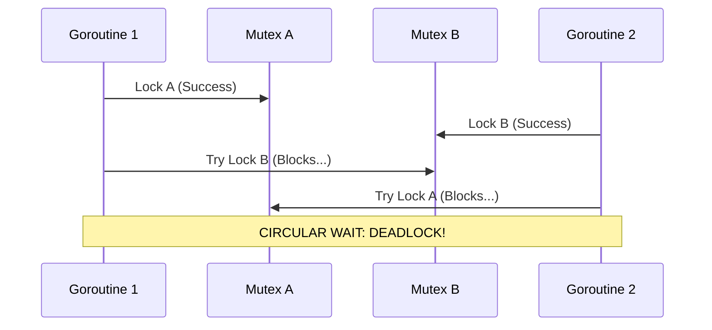

# Deadlocks

---

# Table of Contents

* Introduction
* Learning Objectives
* Prerequisites
* Why This Topic Exists
* Real-World Analogy
* Core Concepts
* Internal Runtime Explanation
* Memory Layout
* Architecture Diagram
* Step-by-Step Execution
* Syntax
* Beginner Example
* Intermediate Example
* Advanced Example
* Production Use Cases
* Performance Analysis
* Best Practices
* Common Mistakes
* Debugging Guide
* Exercises
* Quiz
* Interview Questions
* Mini Project
* Cheat Sheet
* Summary
* Key Takeaways
* Further Reading
* Next Chapter

---

# Introduction

While Race Conditions occur when synchronization is missing, **Deadlocks** occur when synchronization is done incorrectly. A deadlock is a state where two or more Goroutines are waiting for each other to release resources, resulting in a permanent freeze. Because they are all blocked, none of them can proceed, and the application halts.

Go has a built-in deadlock detector at runtime, but it only catches global deadlocks (where *every* Goroutine is asleep). Partial deadlocks, where only a few Goroutines freeze but the main web server keeps running, will leak resources until the server crashes.

---

# Learning Objectives

After completing this chapter you will be able to:

* Identify the four Coffman conditions that cause deadlocks.
* Spot common deadlock patterns involving Mutexes and Channels.
* Understand how the Go runtime detects global deadlocks.
* Refactor code to prevent deadlocks using lock ordering and timeouts.

---

# Prerequisites

Before reading this chapter you should know:

* `sync.Mutex` (`21-Mutex.md`)
* Channels (`10-Channels.md`)
* WaitGroup (`09-WaitGroup.md`)

---

# Why This Topic Exists

Deadlocks are devastating in production. Imagine a payment processing microservice. Goroutine A locks the User Database to update the balance, then tries to lock the Transaction Log. Goroutine B locks the Transaction Log first, then tries to lock the User Database. Both Goroutines freeze forever. Over the next hour, thousands of payment requests freeze in the same way, eventually consuming all memory and crashing the server.

Understanding how deadlocks form is the only way to architect systems that prevent them.

---

# Real-World Analogy

### The Narrow Bridge

Imagine a narrow bridge that only fits one car at a time.
* **Car A** enters the bridge from the North.
* **Car B** enters the bridge from the South at the exact same time.
* They meet in the middle.
* Car A cannot move forward because Car B is in the way.
* Car B cannot move forward because Car A is in the way.
* Neither car is willing to put their car in reverse (no preemptive yielding).
Both drivers will sit there forever. This is a deadlock.

---

# Core Concepts

Computer Science defines four necessary conditions for a deadlock to occur (the Coffman conditions):
1. **Mutual Exclusion**: At least one resource must be non-shareable (e.g., a Mutex).
2. **Hold and Wait**: A Goroutine holds one resource while waiting to acquire another.
3. **No Preemption**: A resource cannot be forcibly taken away from a Goroutine.
4. **Circular Wait**: Goroutine 1 waits for Goroutine 2, which is waiting for Goroutine 1.

*To fix a deadlock, you only need to break ONE of these four conditions!*

---

# Internal Runtime Explanation

The Go runtime has a background thread called the `sysmon` (System Monitor). Among other things, the Go scheduler keeps track of all Goroutines. 
If the scheduler notices that the `main` Goroutine is blocked, and there are NO other Goroutines running (every single Goroutine is parked in a `waiting` state), it instantly crashes the program with:
`fatal error: all goroutines are asleep - deadlock!`

However, if even *one* Goroutine is still running (like a background ticker), the Go runtime will NOT crash, and your deadlocked Goroutines will just hang forever (a Goroutine leak).

---

# Architecture Diagram



---

# Step-by-Step Execution (Circular Wait)

1. G1 locks Resource A.
2. G2 locks Resource B.
3. G1 attempts to lock Resource B. It is held by G2, so G1 goes to sleep.
4. G2 attempts to lock Resource A. It is held by G1, so G2 goes to sleep.
5. Both are sleeping, waiting for the other to wake up and release the lock. Neither ever will.

---

# Syntax

There is no special syntax for deadlocks; they are a logical error.

```go
mu.Lock()
mu.Lock() // DEADLOCK! Trying to lock a mutex you already locked.
```

---

# Beginner Example

The simplest deadlock in Go: A single channel waiting on itself.

```go
package main

import "fmt"

func main() {
	ch := make(chan int)

	// main Goroutine blocks here waiting to send, 
	// but there is no other Goroutine to receive it!
	ch <- 1 

	fmt.Println("This will never print")
}
```
**Output**: `fatal error: all goroutines are asleep - deadlock!`

---

# Intermediate Example

The classic "Lock Ordering" deadlock between two Mutexes.

```go
package main

import (
	"fmt"
	"sync"
	"time"
)

func main() {
	var muA, muB sync.Mutex
	var wg sync.WaitGroup
	wg.Add(2)

	// Goroutine 1: Locks A, then B
	go func() {
		defer wg.Done()
		muA.Lock()
		fmt.Println("G1: Locked A")
		time.Sleep(10 * time.Millisecond) // Simulate work
		
		fmt.Println("G1: Waiting to lock B...")
		muB.Lock()
		fmt.Println("G1: Locked B")
		muB.Unlock()
		muA.Unlock()
	}()

	// Goroutine 2: Locks B, then A
	go func() {
		defer wg.Done()
		muB.Lock()
		fmt.Println("G2: Locked B")
		time.Sleep(10 * time.Millisecond)
		
		fmt.Println("G2: Waiting to lock A...")
		muA.Lock() // DEADLOCK HAPPENS HERE
		fmt.Println("G2: Locked A")
		muA.Unlock()
		muB.Unlock()
	}()

	wg.Wait() // Will wait forever
}
```

---

# Advanced Example

Deadlock via missing `Done()` in `WaitGroup`, hidden by panic.

```go
package main

import (
	"fmt"
	"sync"
)

func doWork(wg *sync.WaitGroup, id int) {
	// DANGER: If we panic before wg.Done(), the main thread deadlocks!
	// Fix: defer wg.Done()
	
	if id == 2 {
		panic("Something went wrong!")
	}
	
	fmt.Printf("Worker %d finished\n", id)
	wg.Done() 
}

func main() {
	var wg sync.WaitGroup
	
	for i := 1; i <= 2; i++ {
		wg.Add(1)
		go func(id int) {
			// Catch panic so the whole app doesn't crash, 
			// BUT we forgot to call wg.Done() inside the recover!
			defer func() {
				if r := recover(); r != nil {
					fmt.Printf("Recovered worker %d\n", id)
				}
			}()
			doWork(&wg, id)
		}(i)
	}

	fmt.Println("Main: Waiting for workers...")
	wg.Wait() // DEADLOCK! wg count is stuck at 1
	fmt.Println("Main: Complete")
}
```

---

# Production Use Cases

Deadlocks are bugs, not features. However, understanding them is critical for:
### 1. Database Transactions
If Service A updates `Users` then `Orders`, and Service B updates `Orders` then `Users`, the SQL database engine itself might deadlock. Modern databases detect this and force-abort one of the transactions, returning a "deadlock detected" error to your Go application.

### 2. Complex Event Pipelines
In a pipeline where Goroutine A sends to B, B sends to C, and C sends back to A (a feedback loop), if the channels are unbuffered and all three Goroutines try to send at the exact same time, the entire pipeline deadlocks.

---

# Performance Analysis

A deadlock reduces performance to 0. It is a fatal application failure. "Partial deadlocks" (Goroutine leaks) degrade performance over time as memory and CPU are tied up by permanently parked Goroutines, eventually leading to an Out-Of-Memory (OOM) kill by the OS.

---

# Best Practices

* **Enforce Lock Ordering**: If multiple Mutexes must be held simultaneously, ALWAYS acquire them in the exact same order across your entire codebase (e.g., always lock A before B). This breaks the "Circular Wait" condition.
* **Avoid Nested Locks**: Try extremely hard not to hold one Mutex while attempting to acquire another.
* **Defer Unlock Immediately**: Always write `defer mu.Unlock()` on the very next line after `mu.Lock()`.
* **Use Timeouts**: When doing channel operations or network calls, use `select` with `time.After` or `context.WithTimeout` so that if a deadlock occurs, the operation times out and fails gracefully rather than hanging forever.

---

# Common Mistakes

### Forgetting to Unlock on an Error Path
```go
mu.Lock()
if err != nil {
    return err // DEADLOCK: The mutex is left permanently locked!
}
mu.Unlock()

// FIX: Always use defer!
mu.Lock()
defer mu.Unlock()
if err != nil {
    return err 
}
```

---

# Debugging Guide

* **pprof**: Use Go's built-in profiler (`net/http/pprof`). By visiting `/debug/pprof/goroutine?debug=2`, you can see a stack trace of every single Goroutine and exactly what line of code they are blocked on.
* **Panic Output**: If Go detects a global deadlock, it prints the stack trace for all Goroutines. Look for lines that say `semacquire` (Mutex wait) or `chan receive`/`chan send`.

---

# Exercises

## Beginner
Create a Goroutine that locks a Mutex, and then immediately tries to lock the exact same Mutex again. Run it and observe the deadlock panic.

## Intermediate
Take the Advanced Example (missing `Done()` on panic) and fix it by using `defer wg.Done()` in the correct place so that `wg.Wait()` completes even if a panic occurs.

---

# Quiz

## Multiple Choice Questions
**1. Which of the following is NOT one of the 4 Coffman conditions for a deadlock?**
A) Circular Wait
B) Preemption
C) Hold and Wait
D) Mutual Exclusion
*Answer*: B. (The condition is *No* Preemption. If resources can be preempted, deadlocks cannot form).

## True or False
**Go's runtime will always detect and crash if your application has a deadlock.**
*Answer*: False. It only detects *global* deadlocks where 100% of Goroutines are asleep. If you have an HTTP server listening on a port, it will never trigger the global deadlock detector, resulting in a silent Goroutine leak.

---

# Interview Questions

## Beginner
**Q**: What is the difference between a Race Condition and a Deadlock?
*Answer*: A race condition is an error in *timing* where shared data is modified concurrently without protection, leading to corrupted state. A deadlock is an error in *logic* where Goroutines wait on each other forever, causing the program to freeze.

## Intermediate
**Q**: How do you prevent a Lock Ordering deadlock?
*Answer*: By ensuring that every part of the program always requests locks in the exact same hierarchical order. If everyone always locks Mutex A before locking Mutex B, a circular wait is impossible.

## Advanced
**Q**: Explain how an unbuffered channel can cause a deadlock.
*Answer*: An unbuffered channel requires both the sender and receiver to be ready at exactly the same time. If a single Goroutine tries to send to an unbuffered channel without another Goroutine ready to receive, it will block forever.

---

# Mini Project

**Requirement**: The Philospher's Dining Table
Implement the classic "Dining Philosophers" problem.
1. 5 Philosophers (Goroutines) sit at a table.
2. 5 Forks (Mutexes) sit between them.
3. A philosopher needs BOTH forks to eat.
4. If they all grab the left fork at the same time, they deadlock!
5. **Fix it**: Make the 5th philosopher pick up the RIGHT fork first instead of the left. This breaks the Circular Wait condition and prevents the deadlock.

---

# Cheat Sheet

* **Global Deadlock Error**: `fatal error: all goroutines are asleep - deadlock!`
* **Fixing Lock Ordering**: Ensure `mu1.Lock() -> mu2.Lock()` is consistent everywhere.
* **Fixing Panics**: ALWAYS use `defer mu.Unlock()` and `defer wg.Done()`.
* **Timeout Escape**: 
```go
select {
    case ch <- data:
    case <-time.After(5 * time.Second): // Break out of potential deadlock
}
```

---

# Summary

Deadlocks are catastrophic logic errors that completely halt application progress. By understanding the Coffman conditions—specifically Circular Wait—and adhering strictly to lock ordering and `defer` patterns, you can engineer systems that are immune to freezing.

---

# Key Takeaways

* ✔ Deadlocks freeze Goroutines permanently.
* ✔ Circular Wait is the most common cause (Lock A->B vs Lock B->A).
* ✔ Go only detects global deadlocks, not partial ones.
* ✔ Always use `defer` to unlock resources.

---

# Further Reading
* [Wikipedia: Coffman conditions](https://en.wikipedia.org/wiki/Deadlock#Necessary_conditions)

---

# Next Chapter
➡️ **Next:** `30-Starvation.md`
