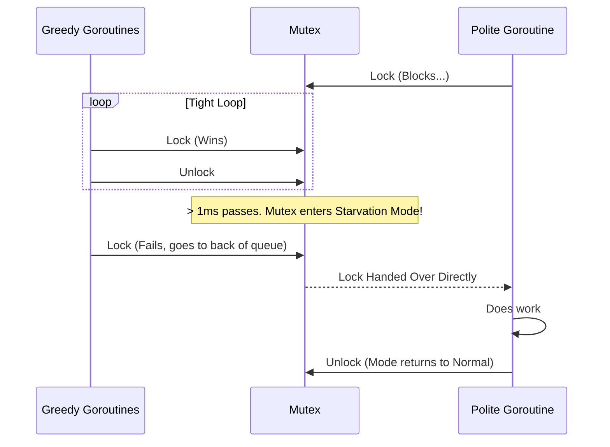

# Starvation

---

# Table of Contents

* Introduction
* Learning Objectives
* Prerequisites
* Why This Topic Exists
* Real-World Analogy
* Core Concepts
* Internal Runtime Explanation
* Memory Layout
* Architecture Diagram
* Step-by-Step Execution
* Syntax
* Beginner Example
* Intermediate Example
* Advanced Example
* Production Use Cases
* Performance Analysis
* Best Practices
* Common Mistakes
* Debugging Guide
* Exercises
* Quiz
* Interview Questions
* Mini Project
* Cheat Sheet
* Summary
* Key Takeaways
* Further Reading
* Next Chapter

---

# Introduction

In concurrent programming, **Starvation** occurs when a Goroutine is perpetually denied the resources it needs to do its work. While a deadlock freezes the entire system, starvation means the system is still running, but one or more Goroutines are left "starving" in the background, never getting a turn to execute.

This usually happens because "greedy" Goroutines with high throughput continuously acquire locks or consume CPU cycles before the starved Goroutine has a chance to wake up and claim them.

---

# Learning Objectives

After completing this chapter you will be able to:

* Differentiate between Deadlock, Livelock, and Starvation.
* Identify "Greedy" Goroutines that monopolize resources.
* Understand how Go's Mutex fairness (Starvation Mode) mitigates this issue.
* Design systems that ensure fair resource distribution.

---

# Prerequisites

Before reading this chapter you should know:

* `sync.Mutex` (`21-Mutex.md`)
* Go Scheduler (`06-Go-Scheduler.md`)
* Deadlocks (`29-Deadlocks.md`)

---

# Why This Topic Exists

Imagine a logging Goroutine that needs to acquire a Mutex to write a log entry to disk. Meanwhile, 100 high-speed web request Goroutines are constantly acquiring and releasing that exact same Mutex. 

Because the web Goroutines are already running on the CPU, they are much faster at re-acquiring the Mutex than the sleeping logging Goroutine is at waking up. The logging Goroutine might wait seconds, or even minutes, to get the lock. During this time, the logs are delayed, which makes debugging production issues impossible.

---

# Real-World Analogy

### The Buffet Line

Imagine a buffet where 10 starving marathon runners and 1 polite gentleman are waiting for pizza. 
The rule is: When the chef brings out a new pizza, anyone can grab a slice.
The marathon runners eat a slice in 2 seconds, immediately run back to the line, and are ready for the next pizza before the polite gentleman even realizes the chef has returned.
The system isn't deadlocked (pizza is successfully being eaten), but the polite gentleman is **starved**. He never gets a slice because the greedy runners always beat him to it.

---

# Core Concepts

* **Fairness**: A scheduling concept where every process is guaranteed to get a turn to execute within a reasonable timeframe.
* **Greedy Goroutine**: A Goroutine that rapidly acquires and releases a lock in a tight loop, outcompeting other Goroutines.
* **Mutex Starvation Mode**: A built-in feature of `sync.Mutex` in Go 1.9+ that detects if a Goroutine has been waiting too long (>1ms) and switches the Mutex to a strict First-In-First-Out (FIFO) queue.

---

# Internal Runtime Explanation

Prior to Go 1.9, `sync.Mutex` was heavily biased towards performance, not fairness. When a Mutex was unlocked, the Goroutine that had just been running on the CPU had a massive advantage to re-acquire the lock compared to a Goroutine that was asleep and needed to be scheduled by the OS.

To fix this, Go 1.9 introduced **Starvation Mode**:
1. **Normal Mode**: Waiters are in a queue, but new arriving Goroutines compete with the woken-up Goroutine. Since new Goroutines are already on the CPU, they usually win.
2. **Starvation Mode**: If a Goroutine waits for a Mutex for more than 1 millisecond, the Mutex enters Starvation Mode. The lock is handed *directly* from the unlocking Goroutine to the waiter at the front of the queue. New arriving Goroutines don't even try to acquire the lock; they immediately put themselves at the back of the queue.

---

# Architecture Diagram



---

# Step-by-Step Execution (Without Starvation Mode)

1. Polite Goroutine calls `Lock()` and goes to sleep because it's held by Greedy 1.
2. Greedy 1 calls `Unlock()`, waking up Polite.
3. Before Polite can physically start running on the CPU, Greedy 2 calls `Lock()`.
4. Greedy 2 gets the lock because it is already active on the CPU.
5. Polite finally gets CPU time, checks the lock, sees it's locked by Greedy 2, and goes back to sleep.
6. The cycle repeats indefinitely.

---

# Syntax

Starvation is a logical bug, usually caused by tight loops wrapping Mutex locks.

```go
// DANGER: High risk of starving other Goroutines
for {
    mu.Lock()
    // Do tiny amount of work
    mu.Unlock()
}
```

---

# Beginner Example

Simulating a starvation scenario. (Note: Go's Mutex Starvation mode prevents this from hanging forever, but you can still observe the massive imbalance).

```go
package main

import (
	"fmt"
	"sync"
	"time"
)

func main() {
	var mu sync.Mutex
	var wg sync.WaitGroup
	wg.Add(2)

	// Polite Goroutine
	go func() {
		defer wg.Done()
		
		time.Sleep(1 * time.Millisecond) // Let greedy start first
		
		mu.Lock()
		fmt.Println("Polite: Finally got the lock!")
		mu.Unlock()
	}()

	// Greedy Goroutine
	go func() {
		defer wg.Done()
		
		count := 0
		start := time.Now()
		
		// Run a tight loop for 5 milliseconds
		for time.Since(start) < 5*time.Millisecond {
			mu.Lock()
			count++
			mu.Unlock()
		}
		fmt.Printf("Greedy: I got the lock %d times!\n", count)
	}()

	wg.Wait()
}
```

---

# Intermediate Example

Fixing starvation by adding a slight yield (`time.Sleep` or `runtime.Gosched()`) to the greedy Goroutine, allowing the polite one to wake up and claim the lock.

```go
package main

import (
	"fmt"
	"runtime"
	"sync"
	"time"
)

func main() {
	var mu sync.Mutex
	var wg sync.WaitGroup
	wg.Add(2)

	// Polite Goroutine
	go func() {
		defer wg.Done()
		time.Sleep(1 * time.Millisecond)
		
		mu.Lock()
		fmt.Println("Polite: I got the lock quickly!")
		mu.Unlock()
	}()

	// Cooperative (formerly Greedy) Goroutine
	go func() {
		defer wg.Done()
		
		count := 0
		start := time.Now()
		
		for time.Since(start) < 5*time.Millisecond {
			mu.Lock()
			count++
			mu.Unlock()
			
			// FIX: Explicitly yield the CPU to allow the Polite Goroutine to run
			runtime.Gosched() 
		}
		fmt.Printf("Cooperative: I got the lock %d times.\n", count)
	}()

	wg.Wait()
}
```

---

# Advanced Example

Worker pool starvation. If you have 1000 tasks and 5 workers, but Task #1 takes 10 minutes and Task #2-#1000 take 1 second, the long task is "starving" the worker pool. 

To fix this, large tasks must be broken down, or separate pools must be created for different task sizes (the "Bulkhead Pattern").

```go
package main

import (
	"fmt"
	"sync"
	"time"
)

func main() {
	tasks := make(chan string, 5)
	var wg sync.WaitGroup

	// Only 2 Workers
	for i := 1; i <= 2; i++ {
		wg.Add(1)
		go func(id int) {
			defer wg.Done()
			for task := range tasks {
				fmt.Printf("Worker %d starting %s\n", id, task)
				if task == "MASSIVE TASK" {
					time.Sleep(5 * time.Second) // Starves the pool
				} else {
					time.Sleep(100 * time.Millisecond)
				}
				fmt.Printf("Worker %d finished %s\n", id, task)
			}
		}(i)
	}

	// Send tasks
	tasks <- "MASSIVE TASK 1"
	tasks <- "MASSIVE TASK 2"
	
	// These tiny tasks are STARVED. They have to wait 5 seconds!
	tasks <- "tiny task a" 
	tasks <- "tiny task b"
	
	close(tasks)
	wg.Wait()
}
```

---

# Production Use Cases

### 1. The Bulkhead Pattern
In microservices, if you have a single thread pool handling both health checks (fast) and report generation (slow), the report generators can starve the health checks, causing Kubernetes to assume the pod is dead and kill it. You prevent this by creating isolated thread pools (Bulkheads).

### 2. Fair Batch Processing
When consuming from Kafka, if one partition has massive, complex messages and another has tiny ones, processing them in a single unbuffered loop can starve the tiny messages. Decoupling them into separate channels ensures fair processing.

---

# Performance Analysis

* **Fairness vs Throughput**: There is a fundamental trade-off in computer science between fairness (everyone gets a turn) and throughput (maximum total work done).
* Go's Mutex "Normal Mode" favors throughput. The CPU spends less time context-switching.
* Go's Mutex "Starvation Mode" favors fairness. Throughput drops because the CPU is forced to wake up a sleeping Goroutine and context-switch, but it guarantees the polite Goroutine doesn't hang forever.

---

# Best Practices

* **Keep Critical Sections Small**: Do not hold a Mutex while doing slow I/O (network requests, disk writes). The longer you hold it, the more you starve others.
* **Yield if necessary**: If you have a Goroutine in a tight `for` loop holding a lock, consider calling `runtime.Gosched()` outside the lock to let other Goroutines breathe.
* **Use Worker Pools Wisely**: Segregate long-running, CPU-heavy tasks into a separate worker pool from fast, latency-sensitive tasks.

---

# Common Mistakes

### The Giant Lock
```go
mu.Lock()
// BAD: Starves all other Goroutines needing this Mutex for 5 seconds
http.Get("https://api.slow.com/data") 
mu.Unlock()

// GOOD: Lock only around the shared memory mutation
data := http.Get(...)
mu.Lock()
cache["api"] = data
mu.Unlock()
```

---

# Debugging Guide

* **Symptoms**: High overall CPU usage, high throughput for *some* endpoints, but extreme latency (timeouts) for *other* endpoints that need the same Mutex.
* **Profiling**: Use Go's `net/http/pprof` specifically checking the `mutex` profile. It will show you exactly which Mutex is highly contended and causing long wait times.

---

# Exercises

## Beginner
Write a loop that locks and unlocks a Mutex 1 million times without doing any work. Launch a second Goroutine that tries to lock it once and prints a timestamp of how long it took to acquire it.

## Intermediate
Implement the "Bulkhead Pattern". Create two channels: `fastTasks` and `slowTasks`. Create 5 workers for `fastTasks` and 2 workers for `slowTasks`. Prove that sending a 10-second slow task does not starve the fast tasks.

---

# Quiz

## Multiple Choice Questions
**1. How long does a Goroutine have to wait for a Mutex before Go switches it to Starvation Mode?**
A) 1 nanosecond
B) 1 millisecond
C) 1 second
D) It never switches
*Answer*: B

## True or False
**Starvation means the entire application has stopped processing and is frozen.**
*Answer*: False. That is a Deadlock. In Starvation, the application is still doing lots of work, but certain Goroutines are being unfairly ignored.

---

# Interview Questions

## Beginner
**Q**: What is Goroutine starvation?
*Answer*: It is a situation where one or more Goroutines are continuously denied access to a shared resource (like a Mutex or CPU time) because other "greedy" Goroutines keep acquiring it first.

## Intermediate
**Q**: Explain the trade-off between Fairness and Throughput in Mutex design.
*Answer*: Throughput is highest when the lock is given to a Goroutine that is already running on the CPU, avoiding a costly context switch. However, this is unfair to Goroutines that are asleep in the queue. Fairness requires forcing a context switch to the sleeping Goroutine, which lowers total throughput but guarantees execution.

## Advanced
**Q**: How does Go 1.9+ solve Mutex starvation internally?
*Answer*: By implementing a dual-mode Mutex. It starts in Normal Mode (favoring throughput). If a Goroutine is stuck in the wait queue for more than 1 millisecond, the Mutex flips to Starvation Mode. In this mode, the lock is handed off directly in a strict FIFO order, and new arriving Goroutines are placed at the back of the queue without competing. Once the queue is empty, it reverts to Normal Mode.

---

# Mini Project

**Requirement**: The CPU Hog
1. Create a variable `counter int` and a Mutex.
2. Launch 3 "Hog" Goroutines that loop indefinitely: Lock, `counter++`, Unlock. (Don't sleep).
3. Launch 1 "Observer" Goroutine that loops once a second: Lock, read counter, Unlock, print counter, sleep 1 sec.
4. Without `runtime.Gosched()`, observe if the Observer struggles to print exactly on time (it might take slightly longer than 1 second due to waiting for the lock).

---

# Cheat Sheet

* **Starvation**: System is running, but someone is left behind.
* **Deadlock**: System is frozen, nobody is running.
* **Livelock**: System is running, but nobody is making progress.
* **Fix**: Keep critical sections tiny. `runtime.Gosched()` to yield CPU.

---

# Summary

Starvation is a subtle performance bug that can cause erratic, massive latency spikes in production. Thanks to the brilliant engineering of the Go runtime team (introducing Mutex Starvation Mode), extreme starvation is handled for you, but architectural starvation (like unsegregated worker pools) is still up to you to prevent.

---

# Key Takeaways

* ✔ Caused by greedy Goroutines outcompeting sleeping ones.
* ✔ Go Mutexes automatically switch to strict FIFO after 1ms of waiting.
* ✔ Keep Mutex `Lock()` and `Unlock()` blocks as short as possible.
* ✔ Do not put slow I/O inside a Mutex lock.

---

# Further Reading
* [Go 1.9 Release Notes (Mutex Starvation)](https://go.dev/doc/go1.9#sync)

---

# Next Chapter
➡️ **Next:** `31-Livelock.md`
