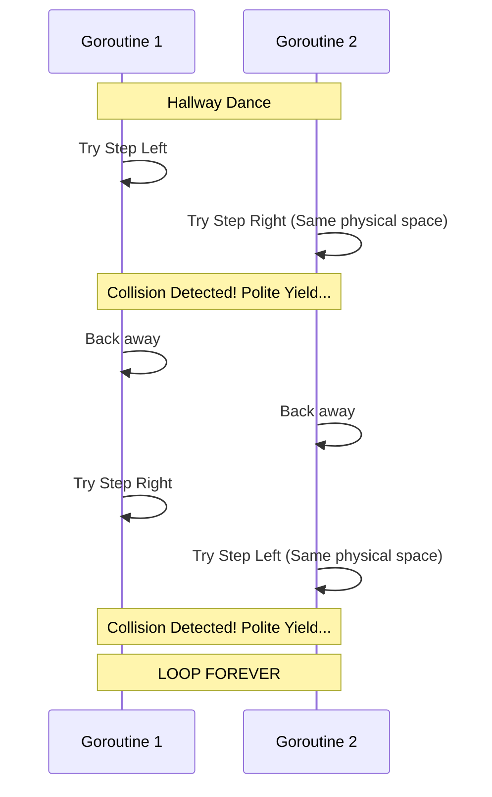

# Livelock

---

# Table of Contents

* Introduction
* Learning Objectives
* Prerequisites
* Why This Topic Exists
* Real-World Analogy
* Core Concepts
* Internal Runtime Explanation
* Architecture Diagram
* Step-by-Step Execution
* Syntax
* Beginner Example
* Intermediate Example
* Advanced Example
* Production Use Cases
* Performance Analysis
* Best Practices
* Common Mistakes
* Debugging Guide
* Exercises
* Quiz
* Interview Questions
* Mini Project
* Cheat Sheet
* Summary
* Key Takeaways
* Further Reading
* Next Chapter

---

# Introduction

We have learned that a **Deadlock** is when Goroutines freeze and do absolutely nothing.
A **Livelock**, on the other hand, is when Goroutines are actively running, consuming 100% of the CPU, but they are stuck in an infinite loop of reacting to each other's state changes, meaning they make **zero actual progress**.

In a livelock, the program is technically not dead (it's "live"), but from the user's perspective, it is completely broken.

---

# Learning Objectives

After completing this chapter you will be able to:

* Distinguish Livelock from Deadlock and Starvation.
* Identify the "Polite Yielding" pattern that causes livelocks.
* Understand why Livelocks are harder to debug than Deadlocks.
* Fix livelocks by introducing random backoffs (jitter).

---

# Prerequisites

Before reading this chapter you should know:

* Deadlocks (`29-Deadlocks.md`)
* Starvation (`30-Starvation.md`)
* Mutexes (`21-Mutex.md`)

---

# Why This Topic Exists

Livelocks usually happen when developers try to be *too clever* about fixing deadlocks. 
If a developer thinks, "Ah, to prevent a deadlock, if I can't get Lock B, I will release Lock A and try again," they have just created the perfect recipe for a livelock. If two Goroutines try this exact same "polite" strategy at the exact same time, they will infinitely yield to each other, maxing out the server's CPU while never actually finishing the transaction.

---

# Real-World Analogy

### The Hallway Dance

You are walking down a narrow hallway. Someone else is walking towards you.
1. You both step to your left to get out of each other's way.
2. You are now blocking each other again.
3. You both step to your right to get out of the way.
4. You are blocking each other again.
5. You repeat this left-right-left-right dance at the speed of light, sweating profusely (burning CPU), but neither of you ever gets down the hallway (making progress).

This is a livelock. You are not deadlocked (you are moving!), but you are not progressing.

---

# Core Concepts

* **State Change Loop**: A loop where a Goroutine checks a condition, fails, modifies its state to "yield", and tries again.
* **Symmetry**: Livelocks almost always occur in perfectly symmetric algorithms where two actors follow the exact same logic at the exact same time.
* **Jitter (Random Backoff)**: The cure for livelocks. By forcing actors to sleep for a *random* amount of time before trying again, you break the symmetry.

---

# Internal Runtime Explanation

Unlike Deadlocks, the Go runtime **cannot detect a livelock**. 
To the Go scheduler, your Goroutines are just running valid `for` loops and doing math. The scheduler has no concept of "meaningful progress." Therefore, your program will not crash with a fatal error; it will just spin your CPU fans to 100% until the server is rebooted or the OS kills the process.

---

# Architecture Diagram



---

# Step-by-Step Execution

1. Goroutine A locks Mutex 1.
2. Goroutine B locks Mutex 2.
3. Goroutine A tries to lock Mutex 2. It fails (uses `TryLock` or similar logic).
4. Goroutine A says "I'll be polite", unlocks Mutex 1, and loops back to try again.
5. Goroutine B tries to lock Mutex 1. It fails.
6. Goroutine B says "I'll be polite", unlocks Mutex 2, and loops back to try again.
7. They both restart the loop at the exact same nanosecond. Infinite loop.

---

# Syntax

There is no special syntax. Livelocks are created by combining loops and conditional locks. 
*Note: Go 1.18 introduced `mu.TryLock()`, which makes it very easy to accidentally write livelocks if used improperly in a `for` loop.*

---

# Beginner Example

A simulation of two people trying to pass each other in a hallway.

```go
package main

import (
	"fmt"
	"sync"
	"time"
)

func main() {
	var stepLeft, stepRight sync.Mutex
	var wg sync.WaitGroup
	wg.Add(2)

	// Person 1
	go func() {
		defer wg.Done()
		for { // Infinite Loop
			stepLeft.Lock()
			time.Sleep(1 * time.Millisecond) // perfectly synchronized
			
			// Trying to step right, but person 2 is there
			if !stepRight.TryLock() {
				fmt.Println("Person 1: Oops, you're in my way, I'll step back.")
				stepLeft.Unlock() // Yielding
				continue // Restart dance
			}
			
			fmt.Println("Person 1 passed!")
			stepRight.Unlock()
			stepLeft.Unlock()
			return
		}
	}()

	// Person 2
	go func() {
		defer wg.Done()
		for {
			stepRight.Lock()
			time.Sleep(1 * time.Millisecond) // perfectly synchronized
			
			if !stepLeft.TryLock() {
				fmt.Println("Person 2: Oops, you're in my way, I'll step back.")
				stepRight.Unlock() // Yielding
				continue // Restart dance
			}
			
			fmt.Println("Person 2 passed!")
			stepLeft.Unlock()
			stepRight.Unlock()
			return
		}
	}()

	wg.Wait()
}
```
*If you run this, it will print "Oops..." thousands of times a second forever.*

---

# Intermediate Example

Fixing the hallway dance by introducing **Random Jitter**. By making one person wait a random amount of time, they stop moving in perfect synchronization, and the livelock is broken.

```go
package main

import (
	"fmt"
	"math/rand"
	"sync"
	"time"
)

func main() {
	var stepLeft, stepRight sync.Mutex
	var wg sync.WaitGroup
	wg.Add(2)

	// Function representing a person trying to pass
	pass := func(name string, firstLock, secondLock *sync.Mutex) {
		defer wg.Done()
		for {
			firstLock.Lock()
			time.Sleep(1 * time.Millisecond) 
			
			if !secondLock.TryLock() {
				fmt.Printf("%s: Oops, yielding...\n", name)
				firstLock.Unlock()
				
				// FIX: RANDOM JITTER (0 to 10 milliseconds)
				// This breaks the perfect symmetry!
				jitter := time.Duration(rand.Intn(10)) * time.Millisecond
				time.Sleep(jitter)
				continue
			}
			
			fmt.Printf("%s passed successfully!\n", name)
			secondLock.Unlock()
			firstLock.Unlock()
			return
		}
	}

	go pass("Person 1", &stepLeft, &stepRight)
	go pass("Person 2", &stepRight, &stepLeft)

	wg.Wait()
}
```
*Output: They might bump into each other once or twice, but the random sleep ensures one gets out of the way long enough for the other to pass.*

---

# Advanced Example

Livelock in a message processing system (without Mutexes). 
If a message fails to process, a worker might immediately put it back on the queue. If the queue only has that one message, the worker will pull it off, fail, put it back, pull it off, fail... at millions of times per second.

```go
package main

import (
	"fmt"
	"time"
)

func main() {
	queue := make(chan int, 10)
	queue <- 1 // A "poison pill" message that always fails

	go func() {
		for msg := range queue {
			// Try to process
			if msg == 1 {
				// Failed! Put it back on the queue to retry
				fmt.Println("Failed to process msg 1, retrying...")
				
				// LIVELOCK: Immediately putting it back without a delay
				// consumes 100% CPU spinning in this loop.
				queue <- msg 
			} else {
				fmt.Println("Processed", msg)
			}
		}
	}()

	time.Sleep(2 * time.Millisecond) // Let it spin for a moment
}
```
*Fix: Implement a "Dead Letter Queue" for failed messages, or use Exponential Backoff before re-queueing.*

---

# Production Use Cases

### 1. Network Retries (Thundering Herd)
If 100 microservices all lose connection to a database at the exact same time, and they all have logic to "reconnect immediately", they will hit the database with 100 simultaneous requests. The DB gets overwhelmed and drops them. They all instantly retry again. The DB drops them again. This is a network-level livelock. The industry standard fix is "Exponential Backoff with Jitter".

### 2. Distributed Locking (Redis)
When multiple servers try to acquire a distributed lock in Redis using a loop, if they don't use random sleep intervals between retries, they can livelock each other.

---

# Performance Analysis

Livelocks are far worse than deadlocks for system health. 
A deadlocked Goroutine consumes 0% CPU (it is parked). A livelocked Goroutine consumes 100% of a CPU core. If you have 8 livelocked Goroutines on an 8-core server, your server will completely stop responding to any external requests (like SSH or HTTP) because the CPU is entirely saturated doing useless work.

---

# Best Practices

* **Avoid `TryLock`**: The Go authors were very hesitant to add `TryLock()` to Mutexes because it is almost exclusively used to create livelocks. Use standard blocking `Lock()` and architect your locking order correctly to prevent deadlocks, rather than trying to "polite yield" out of them.
* **Always use Jitter**: If you *must* have a retry loop, never use a fixed sleep time (e.g., `time.Sleep(1 * time.Second)`). Always add randomness (`time.Sleep(1 * time.Second + jitter)`).
* **Limit Retries**: A `for` loop that retries an operation should always have a maximum attempt counter (e.g., `if attempts > 5 { return error }`).

---

# Common Mistakes

### The Perfect Backoff
```go
// BAD: Two Goroutines hitting this will still be perfectly synchronized!
for failed {
    time.Sleep(5 * time.Second)
    failed = tryAgain()
}

// GOOD: Add randomness
for failed {
    base := 5 * time.Second
    jitter := time.Duration(rand.Intn(1000)) * time.Millisecond
    time.Sleep(base + jitter)
    failed = tryAgain()
}
```

---

# Debugging Guide

* **Symptoms**: CPU usage spikes to 100% on one or more cores, but the application logs show no meaningful progress or just a flood of "retrying" messages.
* **pprof**: Using Go's profiler (`/debug/pprof/profile`), a livelock will show massive amounts of CPU time spent inside your `for` loop logic or `Mutex.TryLock` functions, unlike a deadlock which shows up in `goroutine` blocking profiles.

---

# Exercises

## Beginner
Write a `for` loop that infinitely checks a boolean flag and prints "Checking...". Run it and watch your OS task manager to see the CPU core max out.

## Intermediate
Implement an "Exponential Backoff with Jitter" function. It should take an attempt number `n`, and return a `time.Duration` representing $2^n$ seconds plus a random jitter between 0 and 1000 milliseconds.

---

# Quiz

## Multiple Choice Questions
**1. Why does the Go runtime NOT crash with a fatal error when a livelock occurs?**
A) Because it doesn't know how to track Goroutines.
B) Because the Goroutines are still executing instructions, so the scheduler thinks they are doing valid work.
C) Because livelocks only happen on a single CPU core.
*Answer*: B

## True or False
**A livelock consumes less CPU than a deadlock.**
*Answer*: False. A deadlock consumes 0 CPU. A livelock consumes 100% of available CPU.

---

# Interview Questions

## Beginner
**Q**: Compare Deadlock, Starvation, and Livelock.
*Answer*: 
- **Deadlock**: Everyone is frozen. No CPU used.
- **Starvation**: The system runs, but some Goroutines never get a turn.
- **Livelock**: Goroutines are actively running and burning CPU, but are stuck in a loop and making zero progress.

## Intermediate
**Q**: What is "Jitter" and why is it used?
*Answer*: Jitter is a random amount of time added to a wait or retry interval. It is used to break the perfect symmetry of two or more processes that are livelocked or creating a "thundering herd", ensuring they retry at slightly different times.

## Advanced
**Q**: In distributed systems, if service A and B are polling a database table to claim a job using `UPDATE jobs SET status='claimed' WHERE id=1 AND status='pending'`, can they livelock?
*Answer*: At the database level, no, because the DB guarantees atomic row updates (one will succeed, one will return 0 rows affected). However, if both services see 0 rows affected and immediately retry on `id=2` at the exact same time, they can livelock at the application level. Jitter is required on the polling interval.

---

# Mini Project

**Requirement**: The Thundering Herd
1. Create a `FakeDatabase` struct with a `Connect()` method.
2. `Connect()` should maintain a count of current connections. If connections > 3, it returns an error.
3. Launch 10 Goroutines that call `Connect()` in an infinite loop if it fails.
4. Observe the massive CPU usage and constant failing (Livelock).
5. Fix the Goroutines by adding Exponential Backoff with Jitter to their retry loop, allowing the database to breathe and eventually serve all requests.

---

# Cheat Sheet

* **Deadlock**: Parked forever.
* **Livelock**: Running forever, doing nothing.
* **The Cure**: Randomness (Jitter).
* **Formula**: `WaitTime = BaseTime + rand.Intn(MaxJitter)`

---

# Summary

Livelocks are the frustrating result of perfectly symmetrical systems trying to be polite. By understanding that "perfect timing" is the enemy of concurrency recovery, and embracing random jitter, you can build self-healing systems that smoothly resolve contentions without burning up your server's CPU.

---

# Key Takeaways

* ✔ Livelocks burn CPU without making progress.
* ✔ Often caused by `TryLock` or infinite retry loops.
* ✔ The Go runtime cannot detect livelocks.
* ✔ Always use Random Jitter to break symmetry.

---

# Further Reading
* [AWS Architecture Blog: Exponential Backoff And Jitter](https://aws.amazon.com/blogs/architecture/exponential-backoff-and-jitter/)

---

# Next Chapter
➡️ **Next:** `32-Worker-Pool.md`
