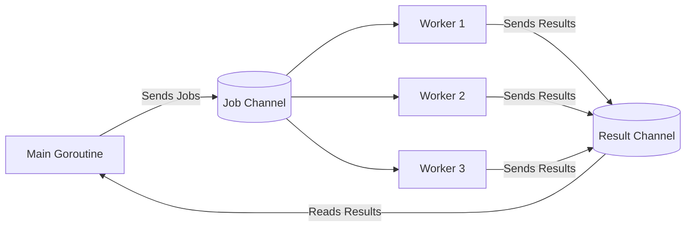

# Worker Pool

---

# Table of Contents

* Introduction
* Learning Objectives
* Prerequisites
* Why This Topic Exists
* Real-World Analogy
* Core Concepts
* Architecture Diagram
* Step-by-Step Implementation
* Syntax
* Beginner Example
* Intermediate Example
* Advanced Example
* Production Use Cases
* Performance Analysis
* Best Practices
* Common Mistakes
* Debugging Guide
* Exercises
* Quiz
* Interview Questions
* Mini Project
* Cheat Sheet
* Summary
* Key Takeaways
* Further Reading
* Next Chapter

---

# Introduction

In Go, it's cheap to spawn a Goroutine. However, if you are processing 1 million images, spawning 1 million Goroutines simultaneously will crash your application by running out of memory, or overwhelming the database/filesystem with too many concurrent connections.

A **Worker Pool** is a concurrency pattern where a fixed number of Goroutines (the "workers") are pre-spawned. They sit in a loop, continuously pulling tasks off a shared channel, processing them, and then waiting for the next task. This controls concurrency limits perfectly.

---

# Learning Objectives

After completing this chapter you will be able to:

* Explain why unbounded concurrency is dangerous in production.
* Implement a robust Worker Pool pattern using Goroutines and Channels.
* Understand the difference between pushing tasks to a buffered vs unbuffered channel.
* Gracefully shut down a Worker Pool using `sync.WaitGroup` and `close()`.

---

# Prerequisites

Before reading this chapter you should know:

* Goroutines (`08-Goroutines.md`)
* Channels (`10-Channels.md`)
* WaitGroup (`09-WaitGroup.md`)

---

# Why This Topic Exists

Without a worker pool, you might write code like this:
```go
for _, job := range 10_000_000_jobs {
    go process(job) // FATAL ERROR: out of memory
}
```
A Worker Pool allows you to process those 10 million jobs using exactly 10 Goroutines, ensuring predictable memory usage, stable CPU load, and a protected downstream database.

---

# Real-World Analogy

### The Post Office

* **The Jobs**: 10,000 packages that need to be stamped.
* **The Unbounded Approach**: The manager hires 10,000 temporary employees to each stamp one package. They all rush into the room, bump into each other, consume all the air, and cause a riot.
* **The Worker Pool Approach**: The manager hires 5 professional postal workers (Goroutines). They stand at a conveyor belt (Channel). As packages come down the belt, whichever worker is free grabs it, stamps it, and waits for the next one. The 10,000 packages take a little longer to process, but the room stays organized and calm.

---

# Core Concepts

* **Worker**: A Goroutine that runs in an infinite `for msg := range jobs` loop.
* **Job Channel**: A channel (usually buffered) where the main Goroutine sends work to be done.
* **Result Channel** (Optional): A channel where workers send the completed output.
* **Concurrency Limit**: The number of workers you spawn dictating the maximum number of tasks processed simultaneously.

---

# Architecture Diagram



---

# Step-by-Step Implementation

1. Create a `jobs` channel and a `results` channel.
2. Decide on a worker count `N`.
3. Launch `N` Goroutines (the workers). Inside each, `range` over the `jobs` channel.
4. From the main thread, `for` loop over your data and send it into the `jobs` channel.
5. Close the `jobs` channel when you are done sending data.
6. The workers will automatically exit their `range` loops when the channel is closed and empty.
7. Use a `sync.WaitGroup` to wait for all workers to exit, then close the `results` channel.

---

# Syntax

There is no special syntax, but there is a standard idiomatic pattern:

```go
// The standard worker function signature
func worker(id int, jobs <-chan int, results chan<- int) {
    for j := range jobs {
        // Do work on j
        results <- j * 2
    }
}
```

---

# Beginner Example

A simple pool of 3 workers processing 5 jobs.

```go
package main

import (
	"fmt"
	"time"
)

// worker takes a read-only jobs channel and a write-only results channel
func worker(id int, jobs <-chan int, results chan<- int) {
	for j := range jobs {
		fmt.Printf("Worker %d started job %d\n", id, j)
		time.Sleep(1 * time.Second) // Simulate expensive work
		fmt.Printf("Worker %d finished job %d\n", id, j)
		results <- j * 2
	}
}

func main() {
	const numJobs = 5
	jobs := make(chan int, numJobs)
	results := make(chan int, numJobs)

	// 1. Start 3 workers
	for w := 1; w <= 3; w++ {
		go worker(w, jobs, results)
	}

	// 2. Send 5 jobs to the channel
	for j := 1; j <= numJobs; j++ {
		jobs <- j
	}
	
	// 3. Close jobs to signal no more work will be sent
	close(jobs)

	// 4. Read the results (we know exactly how many to expect)
	for a := 1; a <= numJobs; a++ {
		<-results
	}
	fmt.Println("All jobs completed.")
}
```

---

# Intermediate Example

Using a `WaitGroup` to close the results channel cleanly. In the real world, you rarely know exactly how many results you will get (some jobs might fail or produce multiple results). You use a WaitGroup to know when all workers are truly done.

```go
package main

import (
	"fmt"
	"sync"
	"time"
)

func worker(id int, wg *sync.WaitGroup, jobs <-chan int, results chan<- string) {
	defer wg.Done() // Signal that this worker has exited
	for j := range jobs {
		time.Sleep(500 * time.Millisecond)
		results <- fmt.Sprintf("Result from job %d by worker %d", j, id)
	}
}

func main() {
	jobs := make(chan int, 100)
	results := make(chan string, 100)
	var wg sync.WaitGroup

	// Start 3 workers
	for w := 1; w <= 3; w++ {
		wg.Add(1)
		go worker(w, &wg, jobs, results)
	}

	// Send jobs
	for j := 1; j <= 5; j++ {
		jobs <- j
	}
	close(jobs) // Workers will exit after processing these 5

	// Wait for all workers to exit in the background, then close results
	go func() {
		wg.Wait()
		close(results)
	}()

	// Range over results until it is closed
	for res := range results {
		fmt.Println(res)
	}
}
```

---

# Advanced Example

A Dynamic Worker Pool with Context Cancellation. If one job fails critically, we want to cancel the entire pool immediately rather than finishing the remaining jobs.

```go
package main

import (
	"context"
	"errors"
	"fmt"
	"sync"
	"time"
)

func worker(ctx context.Context, id int, jobs <-chan int, errCh chan<- error) {
	for {
		select {
		case <-ctx.Done(): // Cancellation signal received
			fmt.Printf("Worker %d shutting down\n", id)
			return
			
		case j, ok := <-jobs:
			if !ok {
				return // Channel closed, no more jobs
			}
			fmt.Printf("Worker %d processing %d\n", id, j)
			time.Sleep(500 * time.Millisecond)
			
			// Simulate a critical failure on job 3
			if j == 3 {
				errCh <- errors.New("database connection lost on job 3")
				return
			}
		}
	}
}

func main() {
	ctx, cancel := context.WithCancel(context.Background())
	defer cancel() // Ensure cleanup

	jobs := make(chan int, 10)
	errCh := make(chan error, 1) // Buffered to 1 to prevent blocking
	var wg sync.WaitGroup

	for w := 1; w <= 3; w++ {
		wg.Add(1)
		go func(id int) {
			defer wg.Done()
			worker(ctx, id, jobs, errCh)
		}(w)
	}

	// Send jobs
	go func() {
		for j := 1; j <= 5; j++ {
			jobs <- j
		}
		close(jobs)
	}()

	// Monitor for errors or completion
	go func() {
		wg.Wait()
		close(errCh)
	}()

	// Main loop: wait for either a critical error or natural completion
	if err := <-errCh; err != nil {
		fmt.Println("CRITICAL ERROR:", err)
		cancel() // This tells all workers to shut down instantly!
		
		// Give workers a moment to print their shutdown messages
		time.Sleep(100 * time.Millisecond) 
	} else {
		fmt.Println("All jobs completed successfully.")
	}
}
```
*(Note: In Go 1.20+, the `errgroup` package handles this exact pattern automatically, which we covered in `27-errgroup.md`).*

---

# Production Use Cases

### 1. Database Migrations
If you need to query 1 million user records, format them, and write them to a new database, spawning 1 million Goroutines will exhaust the database connection pool (which is usually capped at ~100 connections). A worker pool of 50 Goroutines ensures maximum throughput without DDoSing your own database.

### 2. Image Processing APIs
When a user uploads a ZIP file containing 1,000 photos to be resized, the server unpacks them and feeds them to a worker pool of `runtime.NumCPU()` (e.g., 8 workers). Because image resizing is heavily CPU-bound, 8 workers will resize them as fast as the hardware physically allows; adding more workers would only slow it down due to context switching.

---

# Performance Analysis

* **CPU-Bound Tasks** (Math, Hashing, Image Resizing): The optimal number of workers is exactly equal to your CPU cores (`runtime.NumCPU()`).
* **I/O-Bound Tasks** (Network requests, Database calls): The optimal number of workers is much higher (often 50-500). Because these Goroutines spend 99% of their time asleep waiting for the network, you can run many of them concurrently on a single CPU core.
* **Buffered Channels**: The `jobs` channel should usually be buffered. If it's unbuffered, the sender must wait for a worker to be instantly ready, adding unnecessary latency to the sender.

---

# Best Practices

* **Always close the jobs channel**: This is the universal signal for workers to `range` out and terminate.
* **Use WaitGroups for shutdown**: Never trust that closing a channel means the work is done. It only means *sending* is done. You must wait on a WaitGroup to ensure the *processing* is done.
* **Don't leak Goroutines**: If you use a `select` with a `context` to cancel early, make sure the workers actually read the context and `return` to free up memory.

---

# Common Mistakes

### Closing the Results Channel Too Early
```go
// BAD: Main thread closes the jobs, and immediately closes results!
close(jobs)
close(results) // Panic: workers are still processing the last few jobs!

// GOOD: Use a Goroutine to wait for workers to finish
close(jobs)
go func() {
    wg.Wait()
    close(results)
}()
```

---

# Debugging Guide

* **Program hangs (Deadlock)**: You probably forgot to `close(jobs)`. The workers are sitting at `for j := range jobs` waiting forever, and your main thread is waiting for the `wg.Wait()` forever.
* **Panic: send on closed channel**: You closed the `results` channel before all workers finished their jobs. Ensure `wg.Wait()` fully completes before `close(results)`.

---

# Exercises

## Beginner
Create a worker pool with 2 workers. Feed them 10 URLs (just strings). Have the worker print "Fetching {URL}" and sleep for 1 second. Verify it takes exactly 5 seconds to run.

## Intermediate
Modify the Beginner exercise to add a WaitGroup and a `results` channel. The worker should return the length of the URL string. Print all results in `main()`.

---

# Quiz

## Multiple Choice Questions
**1. How do you gracefully tell a worker pool to shut down after all current jobs in the queue are finished?**
A) Send a "quit" struct to the channel.
B) Call `context.Cancel()`.
C) Close the jobs channel.
*Answer*: C. (Closing the channel lets them finish the buffered items, then the `range` loop exits naturally).

## True or False
**For I/O bound tasks like making HTTP requests, the number of workers should perfectly match the number of CPU cores.**
*Answer*: False. That is for CPU-bound tasks. For I/O bound tasks, you want many more workers (e.g., 100) because they spend most of their time asleep waiting for the network, utilizing very little CPU.

---

# Interview Questions

## Beginner
**Q**: Why use a Worker Pool instead of just spawning a Goroutine for every task?
*Answer*: Unbounded concurrency will eventually exhaust system resources (RAM, File Descriptors, Database Connections). A worker pool caps concurrency at a safe limit while still achieving high throughput.

## Intermediate
**Q**: Explain the pattern for safely closing a `results` channel in a worker pool.
*Answer*: You pass a `*sync.WaitGroup` to every worker. In `main`, after closing the `jobs` channel, you launch a single anonymous Goroutine that does `wg.Wait()` followed by `close(results)`. This guarantees `results` is only closed exactly when the last worker finishes writing to it.

## Advanced
**Q**: How would you implement a Worker Pool that scales up or down dynamically based on load?
*Answer*: You can monitor the `len(jobs)` channel. If the queue is consistently full, you can spin up additional Goroutines (up to a max cap) that read from the same channel. If the queue is empty for a timeout period (using `select` with `time.After`), the extra Goroutines can optionally return and terminate themselves, shrinking the pool.

---

# Mini Project

**Requirement**: The concurrent MD5 hasher.
1. Generate a slice of 100 random strings.
2. Create a worker pool of 4 workers.
3. The workers should take a string, compute its MD5 hash (`crypto/md5`), and return a struct containing `{OriginalString, Hash}`.
4. The main thread should wait for all results and print them.
5. Guarantee the program exits cleanly with no deadlocks.

---

# Cheat Sheet

* **Standard Worker Signature**: `func worker(jobs <-chan int, results chan<- int)`
* **Job Loop**: `for j := range jobs { ... }`
* **Shutdown Pattern**:
```go
close(jobs)
go func() {
    wg.Wait()
    close(results)
}()
```

---

# Summary

The Worker Pool is the most practical, frequently used concurrency pattern in professional Go development. It strikes the perfect balance between massive concurrency and responsible resource management. While packages like `errgroup` provide higher-level abstractions, mastering the raw channels-and-waitgroups worker pool is essential for any Go backend engineer.

---

# Key Takeaways

* ✔ Protects systems from OOM errors and connection exhaustion.
* ✔ Uses `for range` on a channel to automatically process tasks.
* ✔ `close(jobs)` tells workers no more work is coming.
* ✔ Number of workers depends on CPU-bound vs I/O-bound workloads.

---

# Further Reading
* [Go by Example: Worker Pools](https://gobyexample.com/worker-pools)

---

# Next Chapter
➡️ **Next:** `33-Fan-In.md`
