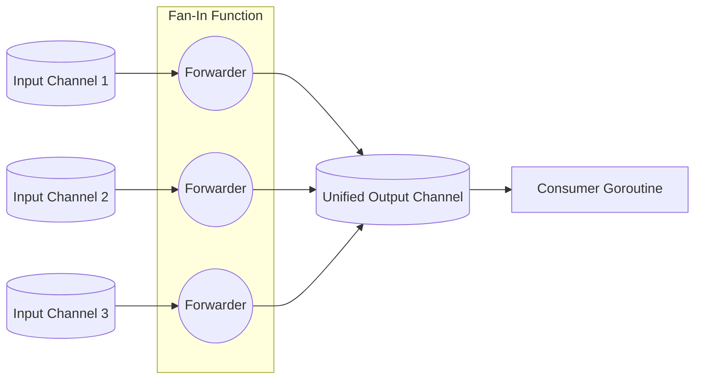

# Fan-In Pattern

---

# Table of Contents

* Introduction
* Learning Objectives
* Prerequisites
* Why This Topic Exists
* Real-World Analogy
* Core Concepts
* Architecture Diagram
* Step-by-Step Implementation
* Syntax
* Beginner Example
* Intermediate Example
* Advanced Example
* Production Use Cases
* Performance Analysis
* Best Practices
* Common Mistakes
* Debugging Guide
* Exercises
* Quiz
* Interview Questions
* Mini Project
* Cheat Sheet
* Summary
* Key Takeaways
* Further Reading
* Next Chapter

---

# Introduction

In highly concurrent Go applications, you often have multiple independent Goroutines producing data simultaneously. For example, you might be scraping 5 different news websites at the same time. The **Fan-In** pattern is a way to take data from multiple input channels and funnel (multiplex) all of that data into a single, unified output channel. 

This allows a single consumer Goroutine to read from one channel, rather than having to juggle reading from many different channels simultaneously.

---

# Learning Objectives

After completing this chapter you will be able to:

* Understand the concept of multiplexing channels.
* Implement a basic Fan-In function using a `sync.WaitGroup`.
* Implement a dynamic Fan-In function that accepts a variadic number of channels (`...<-chan T`).
* Safely close the unified output channel without panicking.

---

# Prerequisites

Before reading this chapter you should know:

* Goroutines (`08-Goroutines.md`)
* Channels (`10-Channels.md`)
* WaitGroup (`09-WaitGroup.md`)

---

# Why This Topic Exists

Imagine an API that returns aggregated flight prices. It queries Delta, United, and American Airlines simultaneously using 3 different Goroutines. Each Goroutine returns its prices on its own channel.
The main thread needs to sort all prices and return them to the user. Instead of the main thread trying to coordinate `select` statements across an unknown number of airline channels, we use a Fan-In function to merge all those channels into one "FlightPrices" channel. The main thread then simply does a single `for price := range FlightPrices` loop.

---

# Real-World Analogy

### The Traffic Funnel

Imagine a toll booth plaza on a highway. 
* 5 different lanes of cars (the input channels) are all moving forward independently.
* After the toll booth, the road narrows.
* All 5 lanes must merge (Fan-In) into a single 1-lane road (the unified output channel).
* A police officer (the consumer Goroutine) stands at the end of the 1-lane road, inspecting cars one by one. The officer doesn't need to look at 5 lanes; they just watch the single merged lane.

---

# Core Concepts

* **Multiplexing**: The technical term for taking multiple separate signals and combining them into one.
* **Variadic Functions**: Functions that accept a variable number of arguments (e.g., `func fanIn(chans ...<-chan int)`).
* **The Forwarding Goroutine**: For each input channel, Fan-In spawns a tiny Goroutine whose only job is to read from the input and send to the output.

---

# Architecture Diagram



---

# Step-by-Step Implementation

1. Create a `fanIn` function that takes multiple channels (e.g., `ch1, ch2 <-chan int`).
2. Inside `fanIn`, create the unified `output` channel.
3. Create a `sync.WaitGroup`. Add 1 for every input channel.
4. Launch a Goroutine for *each* input channel. Inside this Goroutine, `range` over the input channel and send the values to the `output` channel. Call `wg.Done()` when the range loop finishes.
5. Launch one final background Goroutine that calls `wg.Wait()` and then `close(output)`.
6. Return the `output` channel to the caller immediately.

---

# Syntax

```go
func fanIn(ch1, ch2 <-chan int) <-chan int {
    out := make(chan int)
    var wg sync.WaitGroup
    
    // ... setup forwarding goroutines ...
    
    return out
}
```

---

# Beginner Example

A simple Fan-In merging exactly two channels.

```go
package main

import (
	"fmt"
	"sync"
	"time"
)

// generator creates a channel that spits out a string every 500ms
func generator(name string) <-chan string {
	out := make(chan string)
	go func() {
		for i := 1; i <= 3; i++ {
			time.Sleep(500 * time.Millisecond)
			out <- fmt.Sprintf("%s %d", name, i)
		}
		close(out)
	}()
	return out
}

// fanIn merges exactly two channels into one
func fanIn(ch1, ch2 <-chan string) <-chan string {
	out := make(chan string)
	var wg sync.WaitGroup
	wg.Add(2)

	// Forwarder 1
	go func() {
		defer wg.Done()
		for val := range ch1 {
			out <- val
		}
	}()

	// Forwarder 2
	go func() {
		defer wg.Done()
		for val := range ch2 {
			out <- val
		}
	}()

	// Wait and Close
	go func() {
		wg.Wait()
		close(out)
	}()

	return out
}

func main() {
	appleChan := generator("Apple")
	bananaChan := generator("Banana")

	// Merge them!
	merged := fanIn(appleChan, bananaChan)

	// Consume the single merged channel
	for val := range merged {
		fmt.Println(val)
	}
	fmt.Println("Done!")
}
```

---

# Intermediate Example

A dynamic, variadic Fan-In that can accept any number of input channels using `...<-chan T`.

```go
package main

import (
	"fmt"
	"sync"
	"time"
)

func generateNumbers(multiplier int) <-chan int {
	out := make(chan int)
	go func() {
		for i := 1; i <= 3; i++ {
			time.Sleep(100 * time.Millisecond)
			out <- i * multiplier
		}
		close(out)
	}()
	return out
}

// fanIn accepts ANY number of read-only integer channels
func fanIn(channels ...<-chan int) <-chan int {
	out := make(chan int)
	var wg sync.WaitGroup

	// For every channel passed in, launch a forwarder
	for _, ch := range channels {
		wg.Add(1)
		
		// ALWAYS pass loop variables into the closure!
		go func(c <-chan int) {
			defer wg.Done()
			for val := range c {
				out <- val
			}
		}(ch)
	}

	go func() {
		wg.Wait()
		close(out)
	}()

	return out
}

func main() {
	ch1 := generateNumbers(1)  // 1, 2, 3
	ch2 := generateNumbers(10) // 10, 20, 30
	ch3 := generateNumbers(100)// 100, 200, 300

	merged := fanIn(ch1, ch2, ch3)

	for val := range merged {
		fmt.Println("Received:", val)
	}
}
```

---

# Advanced Example

Using `reflect.Select` to Fan-In an unknown slice of channels on a single Goroutine, without spawning multiple forwarder Goroutines. (This is generally slower than the `sync.WaitGroup` approach, but uses less memory and is a powerful tool to understand).

```go
package main

import (
	"fmt"
	"reflect"
	"time"
)

func gen(name string) <-chan string {
	out := make(chan string)
	go func() {
		for i := 0; i < 2; i++ {
			time.Sleep(100 * time.Millisecond)
			out <- fmt.Sprintf("%s %d", name, i)
		}
		close(out)
	}()
	return out
}

func fanInReflect(channels ...<-chan string) <-chan string {
	out := make(chan string)
	go func() {
		defer close(out)
		
		// Build the slice of SelectCases
		var cases []reflect.SelectCase
		for _, ch := range channels {
			cases = append(cases, reflect.SelectCase{
				Dir:  reflect.SelectRecv,
				Chan: reflect.ValueOf(ch),
			})
		}

		// Loop until all channels are closed
		for len(cases) > 0 {
			chosen, value, ok := reflect.Select(cases)
			if !ok {
				// The chosen channel was closed. Remove it from our cases slice.
				cases = append(cases[:chosen], cases[chosen+1:]...)
				continue
			}
			out <- value.String()
		}
	}()
	return out
}

func main() {
	merged := fanInReflect(gen("A"), gen("B"), gen("C"))
	for v := range merged {
		fmt.Println(v)
	}
}
```

---

# Production Use Cases

### 1. Log Aggregation
A microservice has 3 different components: the HTTP server, the Database connector, and the Cache manager. Each produces log strings on their own channels. A Fan-In function merges them into a single `globalLogs` channel, which is then batch-written to an Elasticsearch instance by a single consumer Goroutine.

### 2. Multi-Provider Search
A hotel booking site queries Expedia, Booking.com, and Hotels.com simultaneously. Each API client returns a channel of `HotelOffer` structs. A Fan-In merges them, allowing the frontend handler to pull from one single channel and stream results to the user's browser via WebSockets as they arrive, regardless of which provider found them first.

---

# Performance Analysis

* The WaitGroup/Forwarder pattern is the idiomatic and fastest way to do Fan-In in Go. 
* `reflect.Select` is usually 2x to 5x slower due to the overhead of the `reflect` package, but it saves memory if you are merging 10,000 channels (which would require 10,000 forwarder Goroutines).
* Always make the returned unified channel unbuffered unless you have a specific reason to buffer it.

---

# Best Practices

* **Always close the output channel**: Use the `wg.Wait()` pattern to guarantee the output channel closes. If you don't close it, your `for range` loop on the consumer side will deadlock.
* **Return read-only channels**: Your `fanIn` function signature should return `<-chan T`. This statically prevents the consumer from accidentally trying to send data *into* the unified output.

---

# Common Mistakes

### Forgetting to pass the loop variable
```go
// BAD (Pre Go 1.22): 
for _, ch := range channels {
    go func() {
        // 'ch' is the loop variable. All Goroutines will end up 
        // reading from the VERY LAST channel in the slice!
        for val := range ch { out <- val } 
    }()
}

// GOOD:
for _, ch := range channels {
    go func(c <-chan int) {
        for val := range c { out <- val }
    }(ch) // Pass it in!
}
```

---

# Debugging Guide

* **"send on closed channel" panic**: This happens if you close the output channel before all forwarder Goroutines have finished. Ensure `wg.Wait()` is used correctly.
* **Deadlock**: You forgot to close the output channel. The consumer `for range` loop is waiting forever for more data.

---

# Exercises

## Beginner
Write a program with three channels that send `"red"`, `"green"`, and `"blue"`. Use the intermediate `fanIn` variadic function to merge them and print the output.

## Intermediate
Modify the variadic `fanIn` function to return a *buffered* channel with a capacity of 10. Does the output order change compared to an unbuffered channel? (It might, as Goroutines can dump data into the buffer faster).

---

# Quiz

## Multiple Choice Questions
**1. What is the primary purpose of the Fan-In pattern?**
A) To split one channel into many channels.
B) To merge multiple channels into a single unified channel.
C) To limit the number of active Goroutines.
*Answer*: B

## True or False
**In the standard Fan-In pattern, you must use a `sync.WaitGroup` to know when to close the unified output channel.**
*Answer*: True. Because multiple independent Goroutines are sending to the output, you must wait for ALL of them to finish before it is safe to close the output.

---

# Interview Questions

## Beginner
**Q**: Explain Fan-In vs Fan-Out.
*Answer*: Fan-In multiplexes multiple input channels into a single output channel. Fan-Out takes a single input channel and distributes its data across multiple worker Goroutines.

## Intermediate
**Q**: In a variadic `fanIn(chans ...<-chan int)` function, why do we spawn a new Goroutine for every input channel instead of just using one `for` loop to read from them sequentially?
*Answer*: If we read sequentially (`<-chans[0]`, then `<-chans[1]`), we block waiting for channel 0 to produce data, completely ignoring channel 1 even if it has data ready. By spawning a Goroutine for each, we read from all of them concurrently, merging data into the output as soon as ANY channel is ready.

## Advanced
**Q**: How would you implement Fan-In if you were forbidden from using `sync.WaitGroup`?
*Answer*: You can use a counting mechanism with a secondary `done` channel.
```go
done := make(chan bool)
for _, ch := range channels {
    go func(c <-chan int) {
        for v := range c { out <- v }
        done <- true // Signal this channel is done
    }(ch)
}
go func() {
    for i := 0; i < len(channels); i++ {
        <-done // Wait for exactly N signals
    }
    close(out)
}()
```

---

# Mini Project

**Requirement**: The Multi-Sensor IoT Hub.
1. Create a `Sensor` function that returns a `<-chan string`. It should simulate sending a temperature reading every 200ms, 5 times, then close.
2. In main, spin up 3 sensors: "Living Room", "Kitchen", "Garage".
3. Use a Fan-In function to merge the 3 sensor channels into a `hub` channel.
4. The main thread should `range` over the `hub` channel and print the readings as they arrive in real-time.

---

# Cheat Sheet

* **Fan-In Pattern**:
```go
func fanIn(chans ...<-chan int) <-chan int {
    out := make(chan int)
    var wg sync.WaitGroup
    for _, c := range chans {
        wg.Add(1)
        go func(ch <-chan int) {
            defer wg.Done()
            for v := range ch { out <- v }
        }(c)
    }
    go func() { wg.Wait(); close(out) }()
    return out
}
```

---

# Summary

Fan-In is an elegant and powerful pattern for aggregating data from highly concurrent, distributed sources. By combining Goroutines, Channels, and WaitGroups, you can create a unified data stream that drastically simplifies the logic for the downstream consumer.

---

# Key Takeaways

* ✔ Fan-In merges many channels into one.
* ✔ Uses a forwarder Goroutine for each input channel.
* ✔ Requires a `sync.WaitGroup` to safely `close(output)`.
* ✔ Simplifies consumer logic to a single `for range` loop.

---

# Further Reading
* [Go Concurrency Patterns (Rob Pike's Talk)](https://go.dev/blog/pipelines)

---

# Next Chapter
➡️ **Next:** `34-Fan-Out.md`
