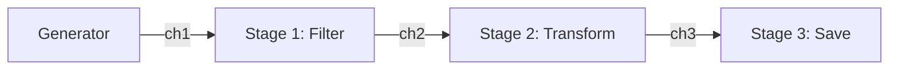

# Pipeline Pattern

---

# Table of Contents

* Introduction
* Learning Objectives
* Prerequisites
* Why This Topic Exists
* Real-World Analogy
* Core Concepts
* Architecture Diagram
* Step-by-Step Implementation
* Syntax
* Beginner Example
* Intermediate Example
* Advanced Example
* Production Use Cases
* Performance Analysis
* Best Practices
* Common Mistakes
* Debugging Guide
* Exercises
* Quiz
* Interview Questions
* Mini Project
* Cheat Sheet
* Summary
* Key Takeaways
* Further Reading
* Next Chapter

---

# Introduction

A **Pipeline** is a series of data processing stages connected by channels. In a pipeline, each stage is a group of Goroutines that perform a specific task, take some input data from an inbound channel, transform it, and pass the output data to an outbound channel for the next stage.

Pipelines are the ultimate culmination of Go's concurrency primitives. By combining Goroutines, Channels, Fan-Out, and Fan-In, you can build massive, highly scalable data processing engines.

---

# Learning Objectives

After completing this chapter you will be able to:

* Architect a multi-stage data processing pipeline.
* Connect stages seamlessly using channels.
* Implement error handling and cancellation across all stages using `context.Context`.
* Understand how pipelines stream data to save memory.

---

# Prerequisites

Before reading this chapter you should know:

* Channels (`10-Channels.md`)
* Context (`19-Context.md`)
* Worker Pool / Fan-Out (`32-Worker-Pool.md`)

---

# Why This Topic Exists

Suppose you need to process a 50GB log file. 
If you read the whole file into memory, you will OOM (Out Of Memory) crash. 
If you process it linearly (Read -> Parse -> Hash -> Save), it will take hours.
By building a Pipeline, you stream the data: Stage 1 reads a line and passes it to Stage 2. While Stage 2 parses line 1, Stage 1 is already reading line 2. The data flows through the system like water through a pipe, keeping memory usage flat (a few megabytes) while maximizing CPU utilization.

---

# Real-World Analogy

### The Car Assembly Line

* **Stage 1 (Chassis)**: A worker builds the metal frame and puts it on a conveyor belt (Channel 1).
* **Stage 2 (Engine)**: A worker takes the frame from Channel 1, installs the engine, and puts it on the next conveyor belt (Channel 2).
* **Stage 3 (Paint)**: A worker takes the car from Channel 2, paints it, and sends it to the showroom.

Because they are connected via conveyor belts, the Chassis worker doesn't have to wait for the car to be painted before starting the next frame. All stages work simultaneously on different cars.

---

# Core Concepts

* **Stage**: A function that takes an input channel, does work, and returns an output channel.
* **Streaming**: Processing data in chunks as it arrives, rather than waiting for the entire batch to load.
* **Backpressure**: If Stage 3 is very slow, Channel 2 fills up. This causes Stage 2 to pause, which causes Channel 1 to fill up, which causes Stage 1 to pause. Channels naturally enforce backpressure so fast stages don't overwhelm slow stages with too much memory.

---

# Architecture Diagram



---

# Step-by-Step Implementation

1. **Write the Generator**: A function that creates the initial data and outputs it to `chan 1`.
2. **Write Stage 1**: A function that takes `chan 1` as an argument, processes the data, and returns a new `chan 2`.
3. **Write Stage 2**: A function that takes `chan 2` as an argument, processes the data, and returns a new `chan 3`.
4. **Wire them up**: In `main()`, chain the functions together: `out := stage2(stage1(generator()))`.
5. **Consume**: Run a `for loop` over the final `out` channel.

---

# Syntax

```go
// A standard pipeline stage signature
func stageName(ctx context.Context, in <-chan int) <-chan int {
    out := make(chan int)
    go func() {
        defer close(out)
        for val := range in {
            out <- val * 2 // Transformation
        }
    }()
    return out
}
```

---

# Beginner Example

A 3-stage pipeline: Generate -> Square -> Print.

```go
package main

import "fmt"

// Stage 1: Generator
func generate(nums ...int) <-chan int {
	out := make(chan int)
	go func() {
		for _, n := range nums {
			out <- n
		}
		close(out)
	}()
	return out
}

// Stage 2: Square
func square(in <-chan int) <-chan int {
	out := make(chan int)
	go func() {
		for n := range in {
			out <- n * n
		}
		close(out) // Always close the outbound channel!
	}()
	return out
}

func main() {
	// Wire the pipeline together
	c := generate(2, 3, 4)
	out := square(c)

	// Consume the final output
	for result := range out {
		fmt.Println(result)
	}
}
```

---

# Intermediate Example

A pipeline with Fan-Out. We have one generator, but the "Hash" stage is very slow, so we Fan-Out the Hash stage to 3 workers, and then Fan-In the results to the final consumer.

```go
package main

import (
	"fmt"
	"sync"
	"time"
)

func gen(nums ...int) <-chan int {
	out := make(chan int)
	go func() {
		for _, n := range nums {
			out <- n
		}
		close(out)
	}()
	return out
}

// Slow Hash Stage (Takes 500ms)
func slowHash(in <-chan int) <-chan int {
	out := make(chan int)
	go func() {
		for n := range in {
			time.Sleep(500 * time.Millisecond) // Slow!
			out <- n * 10
		}
		close(out)
	}()
	return out
}

// Fan-In helper
func merge(cs ...<-chan int) <-chan int {
	var wg sync.WaitGroup
	out := make(chan int)

	output := func(c <-chan int) {
		for n := range c {
			out <- n
		}
		wg.Done()
	}

	wg.Add(len(cs))
	for _, c := range cs {
		go output(c)
	}

	go func() {
		wg.Wait()
		close(out)
	}()
	return out
}

func main() {
	in := gen(1, 2, 3, 4, 5, 6)

	// FAN-OUT: Create 3 instances of the slow stage reading from 'in'
	c1 := slowHash(in)
	c2 := slowHash(in)
	c3 := slowHash(in)

	// FAN-IN: Merge the 3 channels back into one
	out := merge(c1, c2, c3)

	// Consume
	for n := range out {
		fmt.Println(n)
	}
}
```

---

# Advanced Example

A robust pipeline using `context.Context` for cancellation. If the consumer finds what they are looking for, they cancel the context. All upstream stages immediately stop working and close their channels, preventing Goroutine leaks.

```go
package main

import (
	"context"
	"fmt"
	"time"
)

// Generator produces infinite numbers
func generateInfinite(ctx context.Context) <-chan int {
	out := make(chan int)
	go func() {
		defer close(out)
		n := 1
		for {
			select {
			case <-ctx.Done(): // Cancelled!
				return
			case out <- n:
				n++
			}
		}
	}()
	return out
}

// Filter keeps only even numbers
func filterEven(ctx context.Context, in <-chan int) <-chan int {
	out := make(chan int)
	go func() {
		defer close(out)
		for {
			select {
			case <-ctx.Done(): // Cancelled!
				return
			case n, ok := <-in:
				if !ok {
					return
				}
				if n%2 == 0 {
					// We must also select on ctx.Done here in case 
					// consumer cancels while we are trying to send!
					select {
					case <-ctx.Done():
						return
					case out <- n:
					}
				}
			}
		}
	}()
	return out
}

func main() {
	ctx, cancel := context.WithCancel(context.Background())
	defer cancel() // Good practice

	in := generateInfinite(ctx)
	out := filterEven(ctx, in)

	// We only want the first 3 even numbers
	count := 0
	for val := range out {
		fmt.Println("Received:", val)
		count++
		if count >= 3 {
			fmt.Println("Got enough, cancelling pipeline!")
			cancel() // Triggers ctx.Done() in all upstream stages!
			break
		}
	}
	
	time.Sleep(100 * time.Millisecond) // Allow time for cleanup logs (if any)
}
```

---

# Production Use Cases

### 1. ETL (Extract, Transform, Load) Systems
Extract data from an AWS S3 bucket (Stage 1), Transform it by scrubbing PII (Stage 2), and Load it into Snowflake (Stage 3). A pipeline ensures that the S3 download stream feeds directly into the scrubbing stream, keeping memory footprint minimal even for terabyte-sized datasets.

### 2. Video Transcoding
Stage 1 downloads video chunks. Stage 2 decodes H.264 to raw frames. Stage 3 applies a watermark. Stage 4 encodes frames to H.265. Stage 5 uploads to CDN. Using a pipeline, the upload of chunk 1 happens simultaneously with the decoding of chunk 5.

---

# Performance Analysis

* Pipelines introduce overhead. The constant passing of data through channels requires CPU time (locking/unlocking internally). 
* If a stage only does a tiny amount of work (like `n + 1`), the overhead of the channel is slower than just putting it in a standard `for` loop without concurrency.
* **Rule of Thumb**: Only put a boundary (a channel) between stages if the work inside the stage is computationally expensive (I/O, cryptography, heavy math) or if you specifically need to Fan-Out that stage to multiple CPU cores.

---

# Best Practices

* **Always pass Context**: Every single stage of your pipeline should accept a `context.Context` as its first argument and multiplex its channel reads/writes with `<-ctx.Done()`. This is the only way to prevent Goroutine leaks if the pipeline is aborted early.
* **Defer Close**: Always use `defer close(out)` inside the Goroutine of a stage to ensure the downstream stages are notified when this stage terminates.
* **Buffer Channels Wisely**: Adding a small buffer (e.g., 10-100) to the channels between stages can smooth out minor latency spikes (jitter) between fast and slow stages.

---

# Common Mistakes

### Forgetting to handle ctx.Done() during a Send
```go
// BAD: If the context is cancelled, but 'in' hasn't closed yet, 
// this Goroutine blocks forever trying to send to 'out' (which nobody is reading).
case n := <-in:
    out <- n 

// GOOD: Use a select block for the send operation too!
case n := <-in:
    select {
    case out <- n:
    case <-ctx.Done():
        return
    }
```

---

# Debugging Guide

* **Pipeline hangs silently**: This almost always means a downstream stage panicked or returned early without cancelling the context, leaving an upstream stage blocked on `out <- val` forever.
* **Goroutine Leak**: You aborted the pipeline, but didn't use `context.Context`. The upstream stages are still running, waiting to send to channels that are no longer being read. Use `pprof` to view parked Goroutines.

---

# Exercises

## Beginner
Build a 3-stage pipeline: 
1. Generate integers 1-5.
2. Multiply by 10.
3. Convert to string and print.

## Intermediate
Build an infinite pipeline that generates random numbers. The second stage filters out numbers less than 50. The third stage prints them. In `main`, use `context.WithTimeout` to automatically shut down the pipeline after exactly 2 seconds.

---

# Quiz

## Multiple Choice Questions
**1. What happens if Stage 1 is extremely fast, but Stage 2 is extremely slow, and the channel between them is unbuffered?**
A) Stage 1 crashes with an overflow error.
B) Stage 1 naturally pauses (blocks) after every send until Stage 2 is ready (Backpressure).
C) Stage 1 drops the data.
*Answer*: B

## True or False
**Every function in your Go program should be separated into a pipeline stage connected by channels.**
*Answer*: False. Channels have overhead. Only use pipelines when streaming large datasets, chaining I/O boundaries, or fanning-out heavy CPU workloads.

---

# Interview Questions

## Beginner
**Q**: What is a Pipeline in Go?
*Answer*: A series of data processing stages (Goroutines) connected by channels, where the output of one stage is the input to the next, allowing data to stream through the system concurrently.

## Intermediate
**Q**: Why is `context.Context` so critical when building pipelines?
*Answer*: If the final consumer decides it has enough data (or encounters an error) and stops reading, the upstream stages will deadlock trying to send data. A Context allows the consumer to broadcast a cancellation signal, telling all upstream stages to exit their Goroutines cleanly.

## Advanced
**Q**: How does a pipeline help with Memory Management?
*Answer*: It enables streaming processing. Instead of loading an entire 10GB file into a slice (which consumes 10GB of RAM), a pipeline reads the file chunk-by-chunk. As soon as Stage 1 reads a chunk, it passes it down the pipeline, and the memory for that chunk is eventually garbage collected after the final stage. The overall memory footprint remains constantly low.

---

# Mini Project

**Requirement**: The Log Parser
1. **Stage 1 (Reader)**: Accept a slice of raw log strings (e.g., `["INFO: Started", "ERROR: DB Down", "WARN: Slow"]`). Stream them out.
2. **Stage 2 (Filter)**: Only pass through strings that contain the word "ERROR".
3. **Stage 3 (Formatter)**: Prepend the string with `[URGENT] `.
4. **Main**: Wire them up and print the final urgent errors.

---

# Cheat Sheet

* **Pipeline Stage Skeleton**:
```go
func stage(ctx context.Context, in <-chan int) <-chan int {
    out := make(chan int)
    go func() {
        defer close(out)
        for {
            select {
            case <-ctx.Done():
                return
            case val, ok := <-in:
                if !ok { return }
                // Transform val
                select {
                case out <- val:
                case <-ctx.Done():
                    return
                }
            }
        }
    }()
    return out
}
```

---

# Summary

Pipelines are the definitive pattern for processing streams of data in Go. By combining the simplicity of channels with the cancellation power of Context, you can build robust, memory-efficient data processing engines that scale flawlessly across multi-core servers.

---

# Key Takeaways

* ✔ Pipelines process data in streams, preventing memory bloat.
* ✔ Connect stages using channels (`out := stage2(stage1(in))`).
* ✔ Backpressure is handled automatically by channel blocking.
* ✔ ALWAYS use `context.Context` to prevent Goroutine leaks.

---

# Further Reading
* [Go Blog: Go Concurrency Patterns: Pipelines and cancellation](https://go.dev/blog/pipelines)

---

# Next Chapter
➡️ **Next:** `36-Semaphore.md`
